# 管理端 UI/UX 走查与整改方案

- 走查日期：2026-07-07
- 走查地址：http://127.0.0.1:8088/admin/
- 测试账号：admin@example.com
- 目标：把管理后台统一为风格一致、层级清晰、交互流畅、低噪声的专业运营管理后台。
- 截图目录：`docs/audits/admin-ui-ux-2026-07-07/screenshots/`
- 采集数据：`page-audits.json`、`modal-audits.json`

## 结论摘要

当前后台已经有一套较强的暗色科技风外壳，但页面之间缺少稳定的信息架构和组件契约：有的页面是仪表盘卡片，有的页面是表格，有的页面是空状态，有的页面是内联编辑，有的页面是弹窗编辑。视觉上都“像后台”，但还没有形成“同一个后台产品”的一致体验。

优先级最高的问题不是配色，而是结构：全局头部占用过多注意力，页面标题区不稳定，操作入口有时在右上角、有时在卡片里、有时在 Tab 后面；表格、列表、详情、表单、空状态的层级规则没有统一。系统设置页尤其明显：配置内容被合并进一个大页面后，通用配置、安全策略、存储配置三个子任务的交互模型不一致，导致用户不知道自己是在查看、编辑、切换还是保存。

建议设计方向：**Quiet Ops Console / 低噪声运营控制台**。保留暗色专业感，但降低装饰性边框、发光和大卡片数量，把视觉重心交还给数据、状态和可执行动作。后台不是营销页，应该更像高质量 SaaS 运维台：密度适中、布局克制、操作可预期。

## 全局问题

### P0：移动端和窄屏布局不可用

证据：

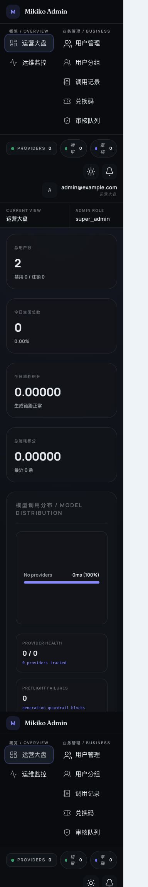

问题：

- 移动端截图中左侧导航、状态条、用户信息与页面内容发生重复堆叠。
- 内容列只占左侧一小段，右侧出现大片空白。
- 后台不一定需要完整移动端体验，但至少应在窄屏下提供可用的折叠侧栏，而不是把桌面侧栏直接堆到内容上。

整改契约：

- 小于 `920px` 时进入 `mobile-shell`：
  - 顶部只保留品牌、当前页标题、菜单按钮、用户菜单。
  - 侧栏变为 Drawer，不参与文档流。
  - 页面内容宽度为 `100%`，不得保留桌面侧栏占位。
  - KPI 卡片使用单列，表格转横向滚动容器。

### P0：页面骨架缺少统一规范

证据：

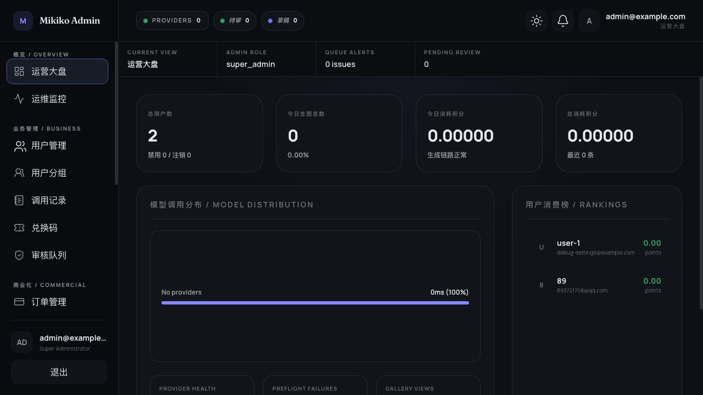

问题：

- 当前每页都继承了侧栏、顶部胶囊状态、二级状态条、页面内容卡片三层结构。
- 页面首屏存在多个竞争焦点：侧栏 active、顶部 providers/to-review/drafts、右上角账号、状态条 Current View、页面内容标题。
- 用户进入页面后，视觉上不能第一时间判断“本页最重要的事情是什么”。

整改契约：

每个页面统一为：

1. `ShellSidebar`：只负责导航。
2. `ShellTopbar`：只负责全局搜索、通知、账号，不重复显示当前页状态。
3. `PageHeader`：页面唯一标题区，包含标题、说明、主操作、次操作。
4. `PageToolbar`：筛选、搜索、批量操作。
5. `PageContent`：数据表格、卡片、表单或空状态。

禁止在每页额外渲染 “CURRENT VIEW / ADMIN ROLE / QUEUE ALERTS / PENDING REVIEW” 这种全局状态条；这些信息应该进入顶部状态菜单或概览页。

### P1：组件语义混乱，按钮层级不稳定

证据：

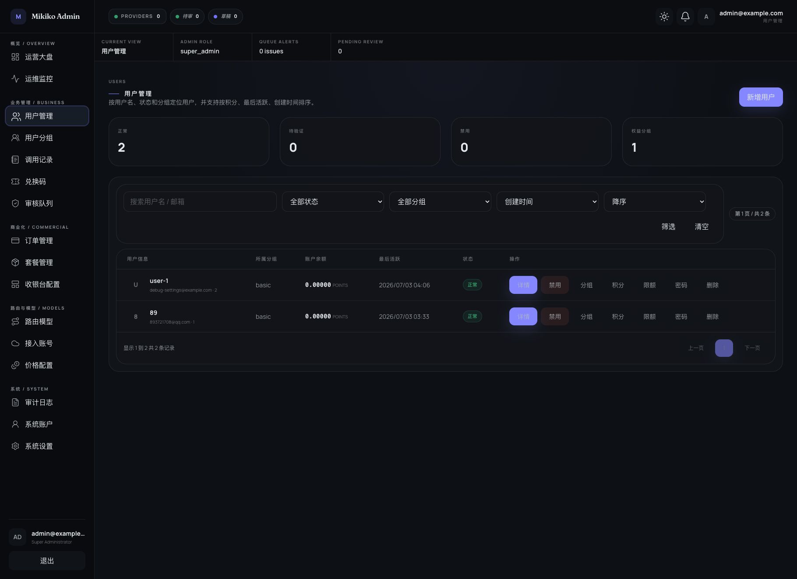

问题：

- 主按钮、危险按钮、普通文本按钮、Tab、胶囊状态在视觉上都较重。
- 表格行内操作过多，`详情 / 禁用 / 分组 / 积分 / 限额 / 密码 / 删除` 同时铺开，造成操作焦虑。
- 同一个操作有时是按钮，有时是卡片，有时是链接式按钮。

整改契约：

- 每页只能有一个 `Primary Action`。
- 行内操作最多常驻 2 个：`详情` + `更多`。
- 危险操作必须进入 `更多` 菜单或二次确认，不在表格行内裸露。
- Tab 只用于同一对象的平级视图切换；不要把“导航、筛选、编辑模式”都做成胶囊按钮。

### P1：卡片过多，信息密度反而下降

证据：

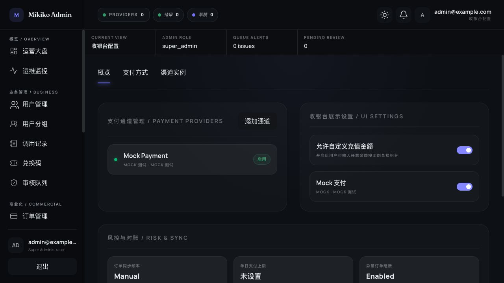

问题：

- 很多页面为了统一视觉，把每个数据点都放进圆角卡片，导致屏幕里边框数量过多。
- 运营后台用户需要快速扫描和比较，过多卡片会打断扫描节奏。
- 暗色背景 + 多层半透明卡片 + 发光按钮，长期使用容易疲劳。

整改契约：

- KPI 使用卡片；列表、表格、表单不要再套大卡片。
- 页面段落使用轻量分割线和标题，不使用“卡片套卡片”。
- 卡片圆角统一为 `8px` 或 `10px`，当前大量 `rounded-2xl/rounded-xl` 过于膨胀。

### P1：表单和弹窗缺少统一布局

证据：

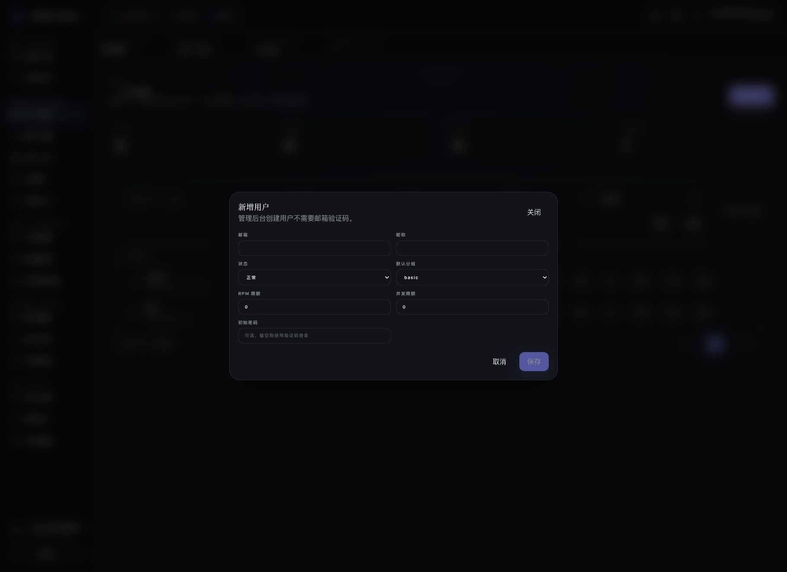

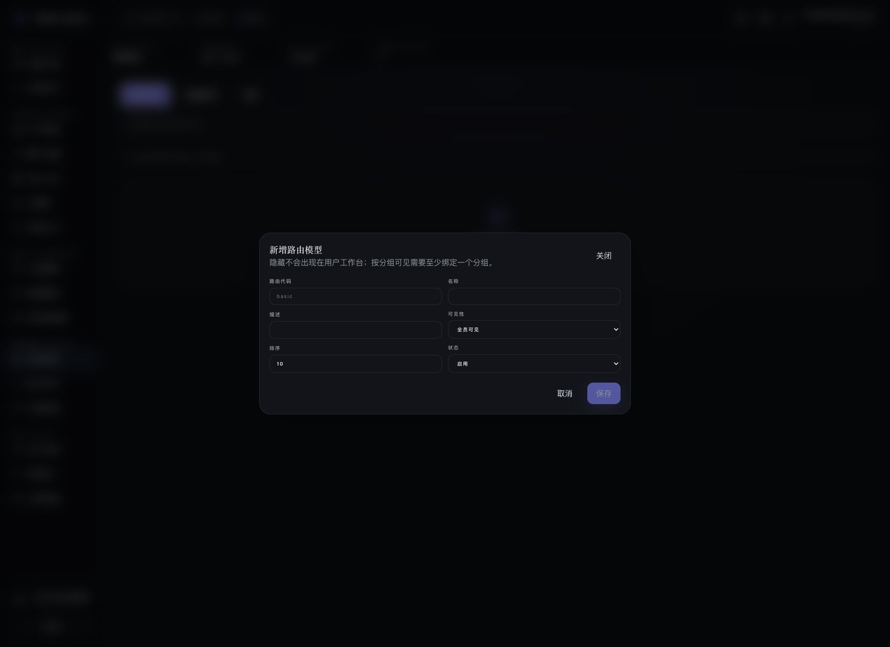

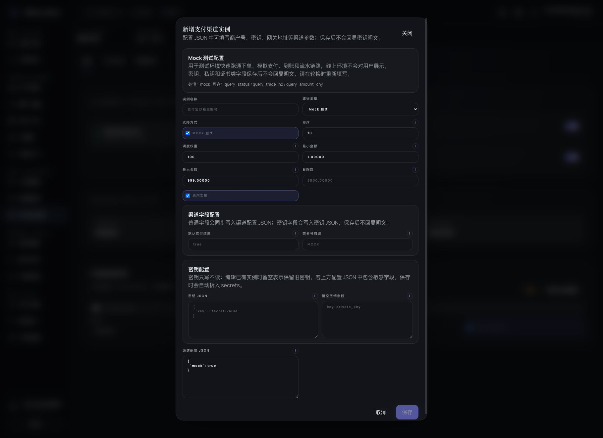

问题：

- 弹窗内表单字段排列、说明文字、输入控件尺寸不统一。
- 长表单仍使用普通弹窗，支付通道配置尤其长，用户需要在弹窗内处理大量复杂字段。
- 弹窗 footer 的保存/取消层级基本一致，但不同页面打开弹窗的位置和上下文提示不一致。

整改契约：

- 短表单小于 6 个字段：Modal。
- 中表单 6-12 个字段：SidePanel。
- 长表单或敏感配置：独立详情/编辑页或分步骤 Drawer。
- 所有表单统一字段结构：`Label`、`Description`、`Control`、`Error`、`Help`。
- Modal 宽度统一：`sm=480`、`md=640`、`lg=840`；不要让内容决定弹窗风格。

### P2：命名和语言混用造成认知负担

问题：

- 同一屏中大量中英文混排：`概览 / OVERVIEW`、`PROVIDERS`、`CURRENT VIEW`、`ADMIN ROLE`、`QUEUE ALERTS`。
- 英文大写作为装饰标签过多，后台用户真正需要的是状态含义，不是视觉标签。
- “接入账号 / Access Accounts”“路由模型 / Routes”“收银台配置 / UI Settings”等概念没有统一解释。

整改契约：

- 主界面以中文为主；英文只保留在代码、协议、字段值中。
- 分组标题不要中英双写，使用中文短标题：`概览`、`业务`、`商业化`、`模型`、`系统`。
- 技术字段旁提供 tooltip 或帮助文本，而不是在标题里塞英文。

## 信息架构整改

### 当前导航问题

导航目前分为：

- 概览 / Overview
- 业务管理 / Business
- 商业化 / Commercial
- 路由与模型 / Models
- 系统 / System

问题：

- “系统设置”承载了通用配置、安全策略、存储配置，但这些任务风险和频率完全不同。
- “运维监控”和“运营大盘”都像概览页，边界不清。
- “接入账号、路由模型、价格配置”之间是强流程关系，但当前只是三个并列菜单。
- 收银台被拆成订单管理、套餐管理、收银台配置，合理，但页面内部 Tab 又继续嵌套，层级有点深。

建议导航重组：

```text
概览
  运营总览
  系统健康

用户与内容
  用户
  用户分组
  审核队列
  兑换码

交易
  订单
  套餐
  支付配置

模型与生成
  接入账号
  路由模型
  价格策略
  调用记录

系统
  管理员
  审计日志
  通用配置
  安全配置
  存储配置
```

关键变化：

- 把 `系统设置` 拆成三个一级页面，减少内部 Tab 嵌套。
- 把 `调用记录` 放入 `模型与生成`，更贴近排障场景。
- 把 `运维监控` 改名为 `系统健康`，与运营总览区分。

## 页面级问题与整改

### 登录页

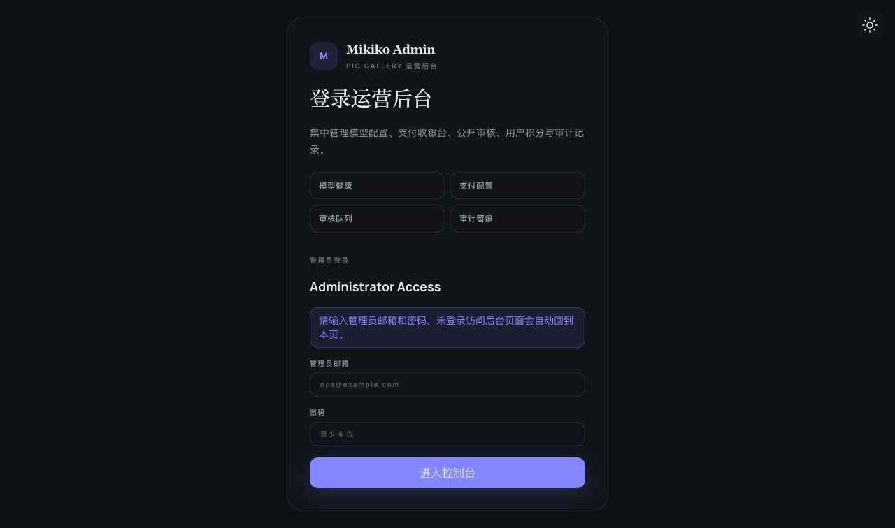

问题：

- 登录页视觉完整，但品牌名、产品名、后台名层级略混。
- “模型健康 / 支付配置 / 审核队列 / 审计留痕”更像营销卖点，不像登录必要信息。

整改：

- 保留安全、低噪声登录表单。
- 辅助信息改为环境、版本、API 状态、最近部署时间。

### 运营大盘


问题：

- 顶部全局状态和页面 KPI 重复。
- Provider Health、Preflight Failures、Gallery Views 在首屏下方被截断，信息层级不完整。
- `No providers` 仍显示一条 100% 紫色条，容易被误读为正常数据。

整改：

- 首屏只保留 4 个核心 KPI + 1 个趋势图 + 1 个待处理列表。
- 空数据图表显示 Empty State，不显示假进度条。
- 把模型健康卡片移动到系统健康页。

### 运维监控

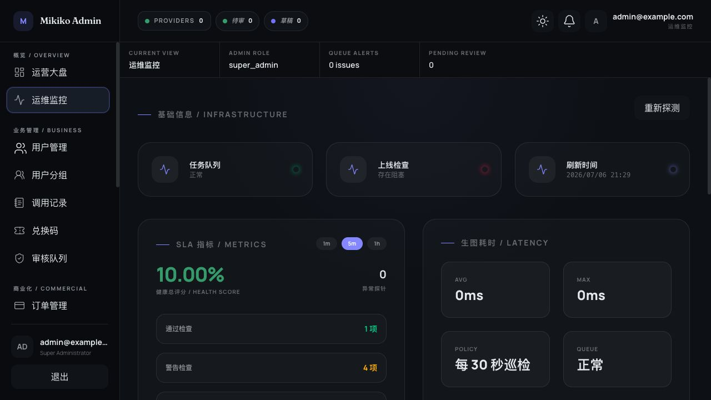

问题：

- 与大盘共用太多视觉结构，缺少“健康检查工作台”的明确任务感。
- 修复动作、阻断项、状态解释不够靠前。

整改：

- 顶部改为健康总览：`可用 / 风险 / 阻断 / 最近检查`。
- 下方按 `阻断项优先` 排序，提供“一键跳转修复”。

### 用户管理


问题：

- 页面整体结构较完整，但表格行内操作过多。
- 搜索筛选区占据巨大卡片，实际只有 5 个控件。
- 用户列表信息密度低：2 条记录撑满大区域。

整改：

- 筛选区压缩为单行 toolbar，可折叠高级筛选。
- 行内只保留 `详情`、`更多`。
- 用户名、邮箱、ID、状态、余额、最近活跃保留，低频操作进入详情页。

### 用户分组


问题：

- 分组和模型可见性之间的关系不够清晰。
- 页面缺少“分组影响范围”的解释。

整改：

- 增加分组详情侧栏：成员数、可见模型、价格策略影响。
- “配置模型可见性”跳转应明确到路由模型页的具体筛选状态。

### 调用记录


问题：

- 调用记录是排障页面，但页面视觉仍像统计仪表盘。
- 过滤条件和详情信息比较分散。

整改：

- 顶部优先提供 `request_id / user / task_id / error_code` 搜索。
- 记录列表使用日志表格样式，详情展开展示 payload、错误、路由快照。
- 统计分布放到右侧或二级 tab，不抢占排障主任务。

### 兑换码


问题：

- 批量生成、状态变更、导出等操作容易混在一起。
- 空状态或少数据状态缺少下一步引导。

整改：

- 主操作：`创建兑换码`。
- 次操作：`批量生成`、`导出` 放入更多菜单。
- 列表增加状态筛选 chips：全部、可用、已用完、过期、禁用。

### 审核队列


问题：

- 审核队列应是高频处理流，但现在更像普通列表页。
- 缺少批量审核、预览、原因模板的明确工作流。

整改：

- 建议做成三栏：队列列表、图片预览、审核动作。
- 支持键盘快捷键，但不要在 UI 中大段说明快捷键。
- 拒绝原因模板以 Popover 形式提供。

### 订单管理

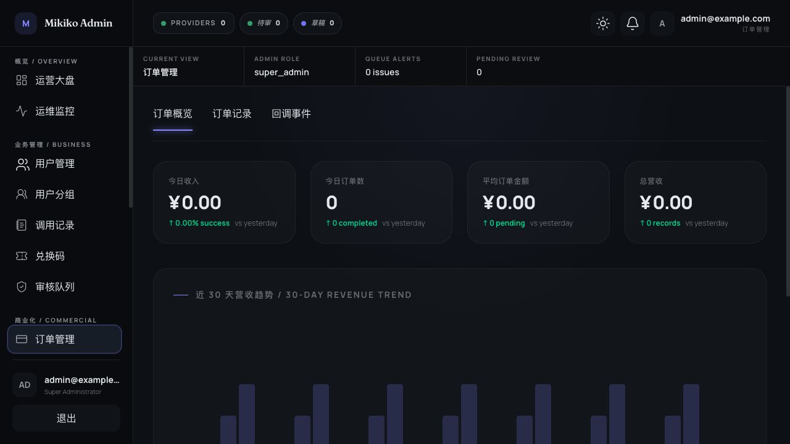

问题：

- 订单页首屏偏图表，实际运营更需要查询订单、处理异常、退款/同步。
- 订单、事件、风险散在收银台大组件中，入口心智不够稳定。

整改：

- 订单管理页默认展示订单表格。
- 图表移为概览 tab。
- 异常订单加固定筛选入口：支付失败、待回调、退款中、同步失败。

### 套餐管理

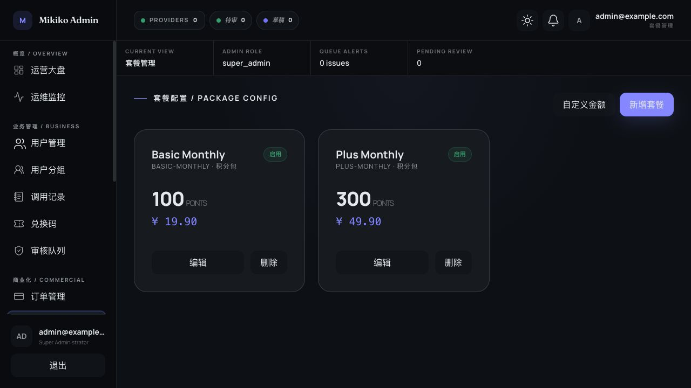

问题：

- 套餐管理和收银台配置共用同一个 `CashierPage`，但信息模型不同。
- 套餐编辑应该强调价格、权益、上下架，而不是继承支付配置页风格。

整改：

- 拆出独立 `PackagesPage`。
- 套餐卡片统一：套餐名、价格、积分、状态、排序、操作。
- 编辑用 SidePanel，展示购买影响和历史订单风险提示。

### 收银台配置


问题：

- 页面内有 Overview、支付方式、渠道实例，再叠加卡片区和长弹窗，层级较深。
- “允许自定义充值金额”和“Mock 支付”都是开关，但保存机制不明显。
- 添加支付通道弹窗字段过长，密钥 JSON 与普通 JSON 混排。

整改：

- 拆成：支付方式、渠道实例、风控设置、体验额度四个清晰区块。
- 开关变更后立即显示保存条或明确自动保存。
- 渠道实例编辑使用分步骤 Drawer：基础信息 -> 金额限制 -> 普通字段 -> 密钥字段 -> 测试连接。

### 路由模型

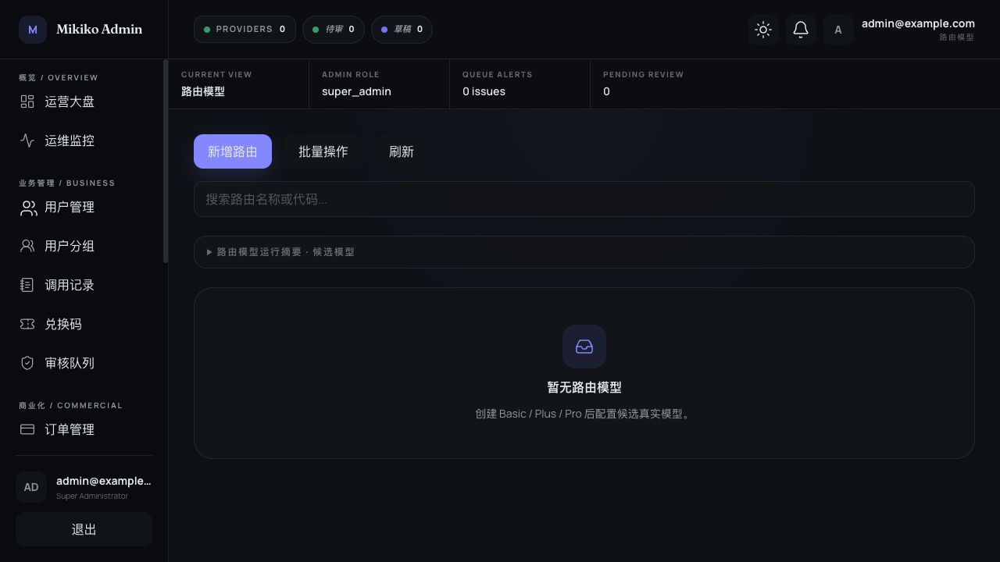

问题：

- 空状态较清楚，但“新增路由 / 批量操作 / 刷新”并列，批量操作在空状态下没有意义。
- 路由模型、候选真实模型、用户分组可见性是一个复杂配置流，但页面没有向导感。

整改：

- 空状态只保留 `新增路由模型`。
- 创建后进入路由详情页或展开详情：基础信息 -> 候选模型 -> 可见范围 -> 价格状态。
- 在路由列表展示“是否可被用户使用”的综合状态，而不是只展示 enabled。

### 接入账号

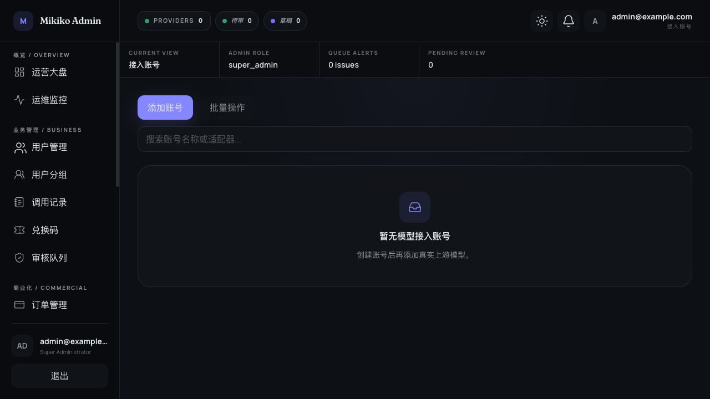

问题：

- 接入账号和底层模型之间的关系需要更强的树形结构。
- API Key、Base URL、Adapter、健康状态需要分组展示。

整改：

- 左侧账号列表，右侧账号详情和模型列表。
- 模型新增应从具体账号上下文发起。
- 健康检查、启停、密钥轮换进入账号详情操作区。

### 价格配置

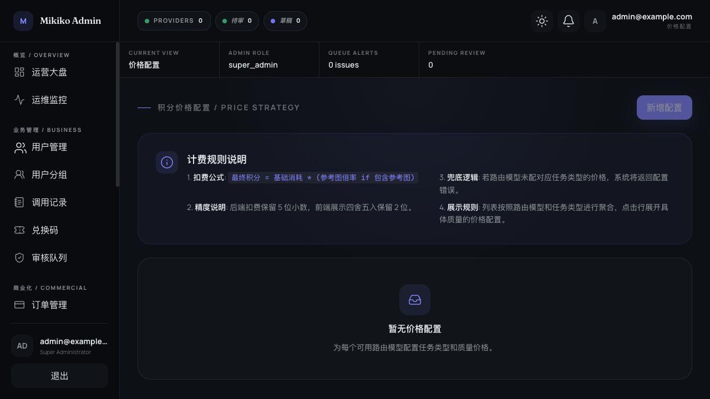

问题：

- 价格配置依赖路由模型，但页面没有显式提示“先创建路由模型”。
- 计费规则说明与配置表混在同一层级。

整改：

- 顶部增加缺失价格风险提示。
- 价格表按路由模型分组，缺失项用 warning 行展示并提供补齐按钮。
- 计费规则说明放入右侧帮助抽屉。

### 审计日志

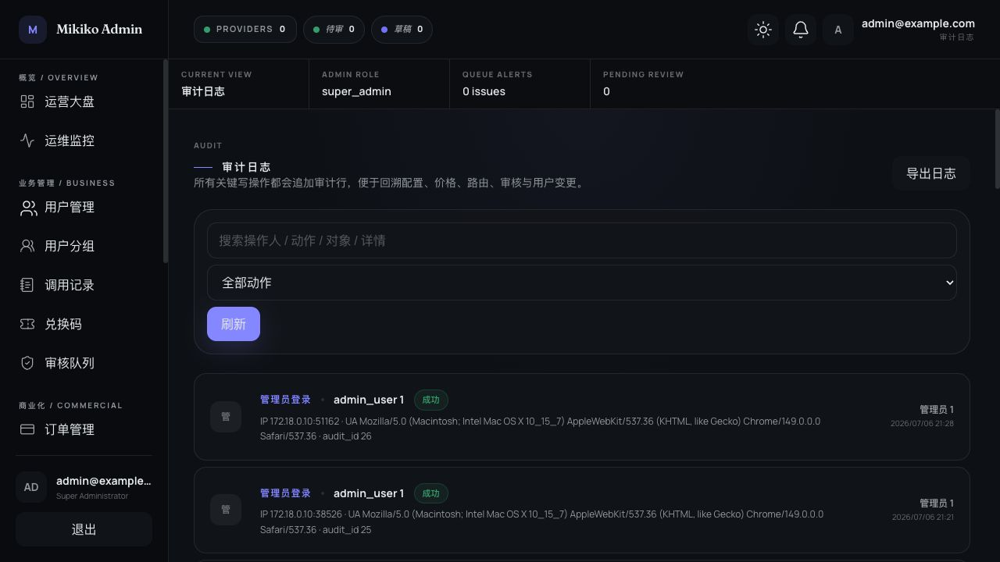

问题：

- 审计日志当前可用，但搜索与导出操作不够突出。
- 操作对象、操作者、时间、动作类型应更适合日志扫描。

整改：

- 使用日志表格密度，减少卡片包裹。
- 增加固定列：时间、操作者、动作、对象、结果。
- 导出入口进入 toolbar 右侧次操作。

### 系统账户

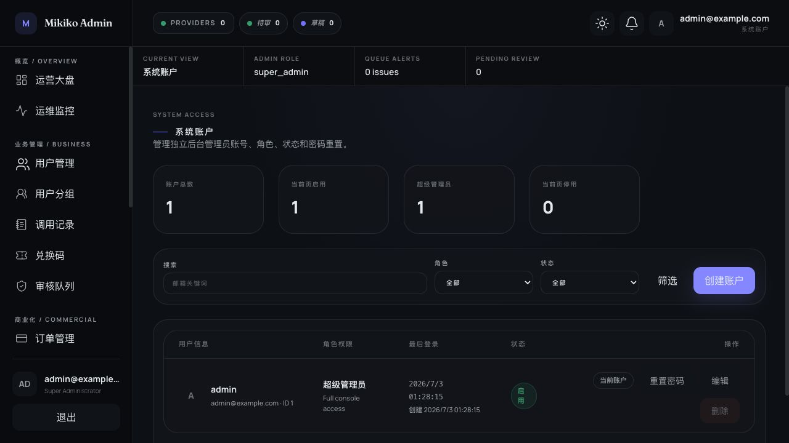

问题：

- 系统账户是敏感操作页，但危险程度、权限范围、最近登录等信息不够突出。
- 与普通用户管理页面的视觉区分不足。

整改：

- 管理员列表强调：角色、权限、MFA/安全状态、最近登录、创建人。
- 危险操作必须在详情页或确认弹窗中完成。

### 系统设置：通用配置

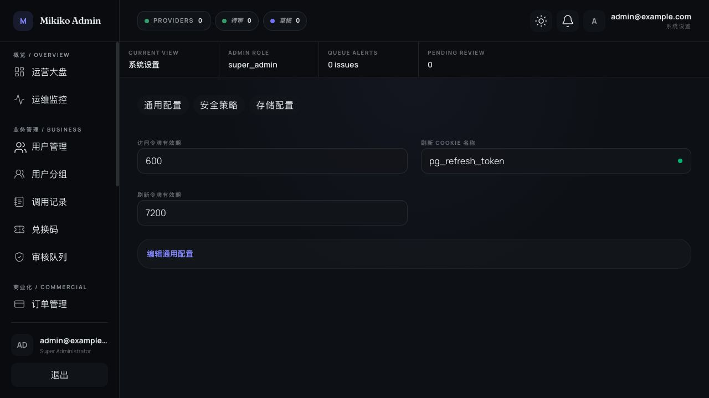

问题：

- 页面内容很少，但仍占用整套复杂外壳。
- `访问令牌有效期`、`刷新 COOKIE 名称`、`刷新令牌有效期` 是安全相关配置，却放在“通用配置”中。

整改：

- 通用配置只保留站点名、文档路径、基础 URL 等低风险信息。
- Token、Cookie、SMTP、审核策略都应归入安全配置。
- 编辑入口改为右上角 `编辑`，点击后进入表单模式，不要用整行大按钮。

### 系统设置：安全策略

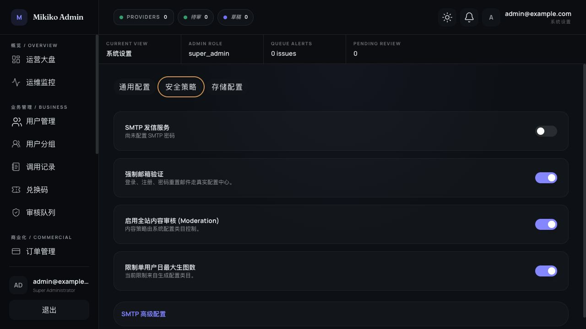

问题：

- 开关项像可直接操作，但并不明确是否即时保存。
- SMTP 高级配置在页面底部，容易被忽略。
- 安全配置、SMTP、内容审核、配额限制混在同一页，范围过宽。

整改：

- 拆成 `认证与会话`、`SMTP 邮件`、`内容安全`、`生成限制` 四组。
- 每组有单独保存状态和最后更新时间。
- 开关旁明确显示：`自动保存` 或 `需保存`。

### 系统设置：存储配置

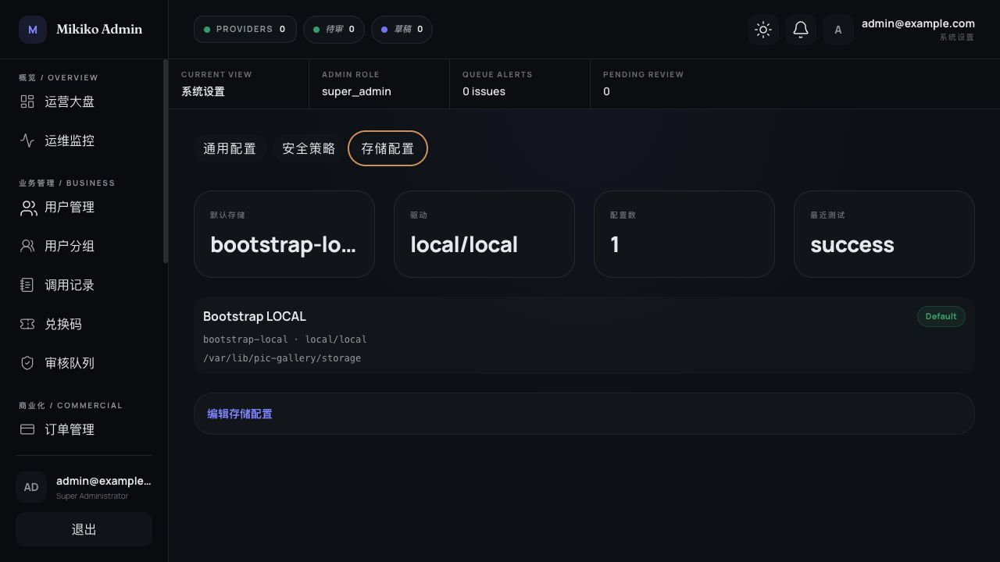

问题：

- 默认存储名被截断为 `bootstrap-lo...`，多实例场景下会降低辨识度。
- 当前只有一个配置时看起来还可以，但新增多个 S3/R2 后，卡片列表、详情和操作会拥挤。
- “测试连接 / 设为只读 / 保存”等操作同层排列，缺少危险程度区分。

整改：

- 存储配置从系统设置拆成独立一级页面。
- 左侧列表展示所有 storage config，右侧详情编辑。
- 默认写入目标、可读、可写、最近探测、历史图片读取能力作为固定字段。
- R2/S3 新建流程使用向导：基础信息 -> Endpoint/Bucket -> Credentials -> Probe -> Save -> Set Default。

## 交互流程整改

### 新增用户


问题：

- 弹窗打开后背景仍然有大量可读信息，焦点不够聚合。
- 初始密码、限额、分组都在同一层级，管理员容易漏填关键字段。

整改：

- 弹窗背景加更强遮罩。
- 字段分组：身份信息、权限/分组、限额、安全。
- 密码字段提供生成按钮，不让管理员手填弱密码。

### 新增路由模型


问题：

- 新增路由只创建基础信息，真正可用还要配置候选模型和价格，但弹窗没有下一步提示。

整改：

- 保存后弹出下一步 CTA：`继续配置候选模型`、`稍后配置`。
- 路由列表中未配置候选/价格的路由显示 `不可用`。

### 新增支付通道


问题：

- 单个弹窗承担了实例名称、渠道类型、金额限制、字段配置、密钥配置、JSON 编辑等大量任务。
- JSON 字段对非开发型运营人员不友好。

整改：

- 改成 Drawer + 分步表单。
- 常见渠道提供结构化字段，不默认暴露 JSON。
- JSON 仅作为高级模式，折叠在最后。

## 建议的组件整改清单

### Layout

- `AdminShell`：固定桌面侧栏 + 顶部栏；移动端 Drawer。
- `PageHeader`：统一标题、说明、主操作、次操作。
- `PageToolbar`：统一搜索、筛选、批量操作。
- `PageSection`：轻量分组，不默认卡片化。
- `ResponsiveDataTable`：统一横向滚动、列宽、空状态、分页。

### Controls

- `Button`：primary、secondary、ghost、danger、text 五类。
- `IconButton`：只放图标，必须有 tooltip。
- `SegmentedControl`：用于 2-5 个互斥视图。
- `SwitchRow`：用于设置项，必须声明保存模式。
- `StatusBadge`：success、warning、danger、neutral、info。
- `ActionMenu`：表格行内更多操作。

### Forms

- `FormField`：label/description/control/error/help。
- `SecretField`：密钥只写不读，带轮换提示。
- `JsonField`：高级折叠，不作为默认输入方式。
- `ConfirmDialog`：危险操作统一确认。
- `DrawerForm`：复杂配置统一使用。

## 分阶段整改路线

### 第一阶段：止血和统一骨架

目标：先让后台看起来像同一个产品。

- 移除每页顶部状态条，改为统一 `PageHeader`。
- 统一按钮层级和表格行内操作。
- 修复移动端/窄屏布局。
- 系统设置拆页：通用配置、安全配置、存储配置。

### 第二阶段：重构高复杂页面

目标：降低操作层级和配置出错率。

- 收银台配置拆分结构，支付通道改 Drawer 分步。
- 路由模型做配置向导。
- 接入账号改账号-模型主从布局。
- 用户管理行内操作收敛到详情和更多菜单。

### 第三阶段：体验精修

目标：让后台长期使用更舒适。

- 降低卡片边框和发光效果。
- 统一空状态、加载态、错误态。
- 为危险配置增加审计提示、最近更新时间、操作人。
- 建立截图回归清单，避免页面风格再次分叉。

## 截图索引

| 页面 | 截图 |
| --- | --- |
| 登录页 |  |
| 运营大盘 |  |
| 运维监控 |  |
| 用户管理 |  |
| 用户分组 |  |
| 调用记录 |  |
| 兑换码 |  |
| 审核队列 |  |
| 订单管理 |  |
| 套餐管理 |  |
| 收银台配置 |  |
| 路由模型 |  |
| 接入账号 |  |
| 价格配置 |  |
| 审计日志 |  |
| 系统账户 |  |
| 系统设置 - 通用配置 |  |
| 系统设置 - 安全策略 |  |
| 系统设置 - 存储配置 |  |
| 移动端大盘 |  |
| 移动端系统设置 | 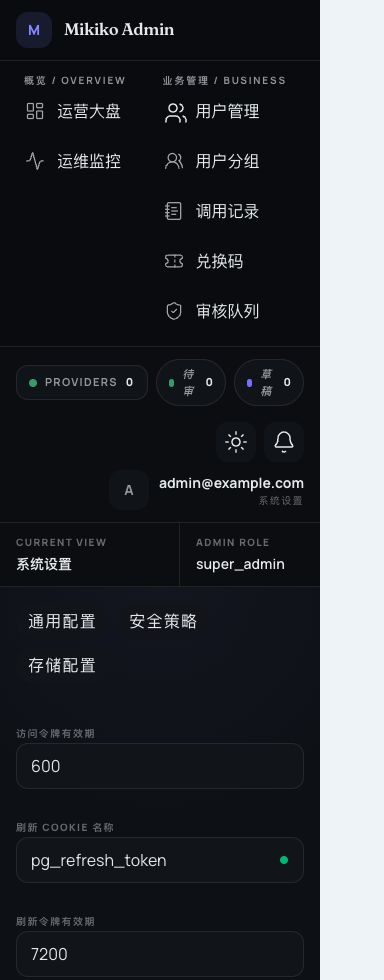 |
| 新增用户弹窗 |  |
| 新增路由弹窗 |  |
| 新增支付通道弹窗 |  |

