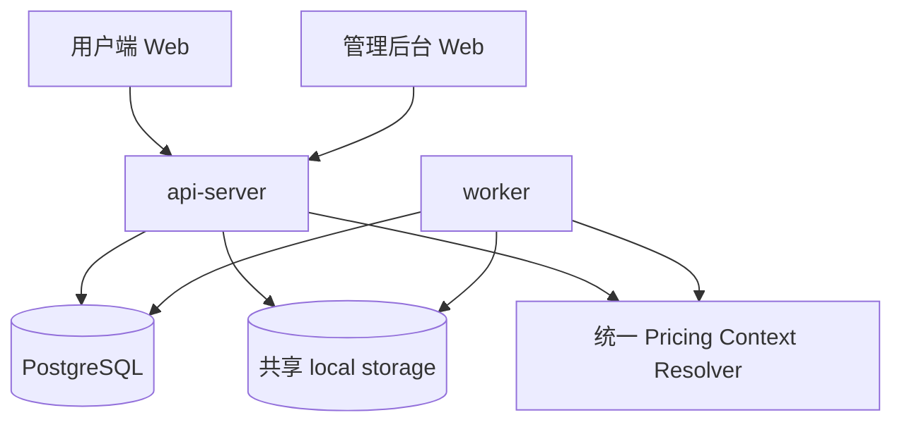
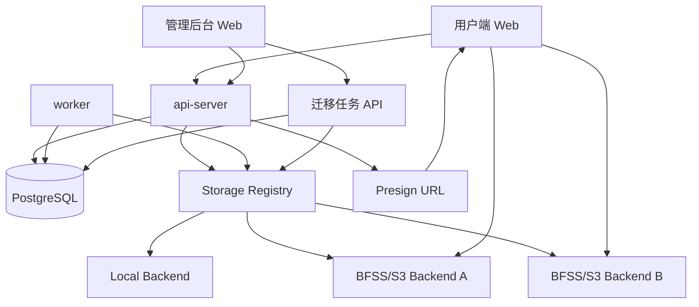
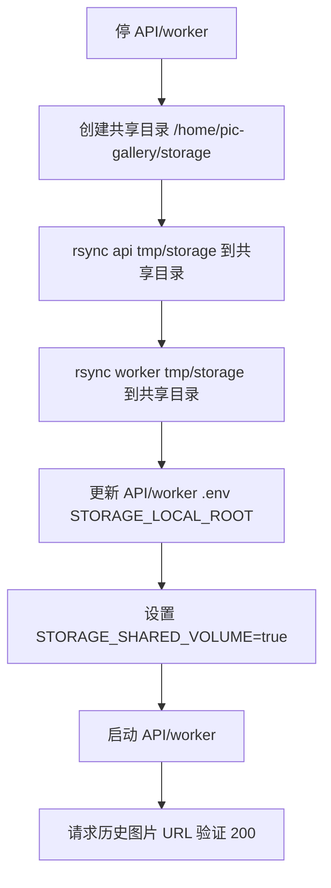
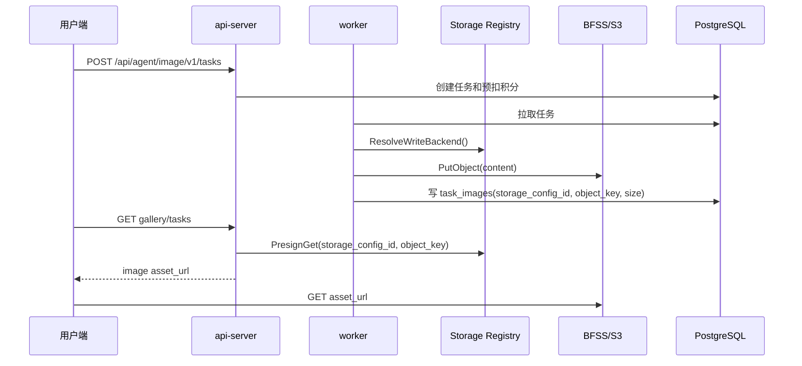
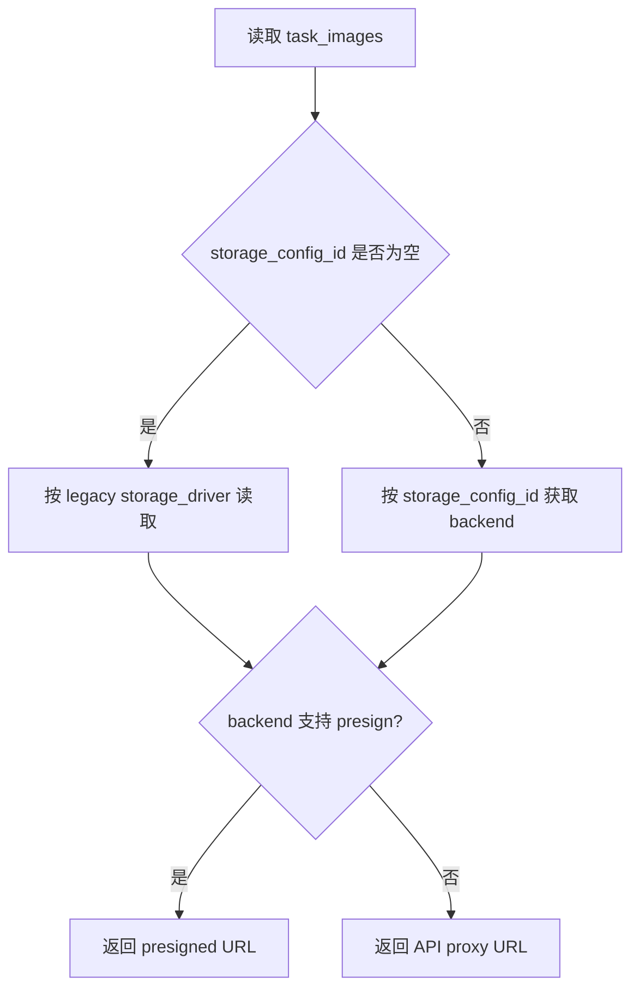

# Pic Gallery 线上问题修复技术方案

日期：2026-06-17

## 一、需求描述

### 1.1 需求背景与预期效果

线上测试暴露出两类问题，重点包括“线上图片 404”和“特殊分组倍率 0.5 不生效”：

1. 直接影响可用性的缺陷：
   - 成功图片加载 404。
   - 用户分组倍率不稳定生效。
   - 生图页切换后输出台状态丢失。
   - provider cost 统计可能长期为 0。
2. 影响管理效率和后续扩展的体验/架构问题：
   - 用户端 landing/login/register 与主应用风格不一致。
   - 管理后台字体小、表单难填。
   - 系统设置缺少清晰 Tab 信息架构。
   - 支付、存储配置仍有 JSON/静态展示。
   - BFSS 多存储、迁移、容量统计缺失。

预期效果：

- 线上历史图片和新生成图片可稳定访问。
- 图片加载流量从 API 中转逐步迁移到对象存储临时 URL。
- 用户分组倍率在 Web、OpenAPI、RouteModel 路径一致生效。
- 后台配置从“技术配置编辑器”升级为“业务配置工作台”。
- 多 BFSS/S3 存储可配置、可迁移、可观测。

参考资料：

- 本仓库 `docs/plans/2026-06-17-production-issue-repair-plan.md`
- 本仓库 `docs/plans/2026-06-16-config-deploy-redesign.md`
- AWS S3 presigned URL 官方文档：`https://docs.aws.amazon.com/AmazonS3/latest/userguide/using-presigned-url.html`
- AWS CLI presign 官方文档：`https://docs.aws.amazon.com/cli/latest/reference/s3/presign.html`

### 1.2 涉及团队与人员

| 角色 | 职责范围 | 负责人 |
|---|---|---|
| 服务端 | 存储、计费、路由、迁移任务、接口契约 | 👤 待人工确认 |
| Web 前端 | 用户端页面、后台配置页、表单体验、图片 URL 消费 | 👤 待人工确认 |
| SRE/运维 | 线上 storage root 修复、BFSS/MinIO 配置、监控告警 | 👤 待人工确认 |
| QA | 回归用例、线上验收、迁移 dry run 验证 | 👤 待人工确认 |
| 产品/运营 | 倍率策略、币种成本口径、后台配置归类 | 👤 待人工确认 |

### 1.3 目标拆解

| 子目标 | 范围说明 | 交付标准 | 优先级 |
|---|---|---|---|
| 图片 404 止血 | 修复 local storage 共享目录和日志 | 历史生成图可访问，下载失败日志可定位 object key | P0 |
| 统一计费倍率 | Web/OpenAPI/RouteModel 使用统一 pricing context | 0.5 特价分组在估价、扣费、任务快照一致 | P0 |
| 输出台状态恢复 | 前端按任务 ID 或任务数据恢复每图槽位 | 切走再回来不退化为纯 Loading | P0 |
| provider cost 修正 | 上游单图成本映射到运行态 OutputCost | 调用记录能记录真实上游成本和币种 | P0 |
| 后台字体与表单 | 统一字号、枚举/可自定义输入、支付结构化配置 | 表单无需手写常见枚举和 JSON | P1 |
| 系统设置重构 | 顶层横向 Tab + 必要子 Tab | 通用/安全/存储/邮箱/支付清晰分区 | P1 |
| 用户端入口重构 | landing/login/register 风格统一 | 未登录入口与主页/工作台视觉一致 | P1 |
| 多 BFSS 存储 | 多配置、预签名 URL、迁移同步、容量统计 | 新旧图片可按 storage_config_id 正常读写 | P2 |

## 二、技术方案详情

### 2.1 整体架构

本方案分两阶段落地。

阶段 A：止血与一致性修复。



阶段 B：对象存储/BFSS 架构升级。



核心原则：

- 可见性、计费倍率、上游候选选择分离。
- 图片对象读写必须记录具体存储位置。
- 前端消费图片优先使用临时 URL；API 字节中转保留兼容。
- 后台配置必须结构化，JSON 只作为高级兜底。

### 2.2 技术选型与方案对比

#### 方案 A：继续 local storage，共享绝对目录

做法：

- API/worker 使用同一个绝对路径。
- 迁移现有 local 文件。
- 保留 API 下载中转。

优点：

- 最快恢复线上图片。
- 改动小，风险低。

缺点：

- API 仍承担图片带宽。
- 多实例部署、扩容、迁移能力弱。
- 无法满足多 BFSS 和容量统计目标。

结论：作为 P0 止血方案。

#### 方案 B：单 BFSS/S3 + 预签名 URL

做法：

- 只配置一个对象存储。
- 图片写入对象存储。
- API 返回 presigned GET URL。

优点：

- API 流量压力明显下降。
- 与 AWS S3/MinIO/BFSS 类对象存储主流实践一致。
- 实现复杂度中等。

缺点：

- 不能完整支持多个 BFSS。
- 历史 local 文件仍需要迁移策略。

结论：可作为 P1.5 过渡，但不满足用户第 9-10 点完整诉求。

#### 方案 C：Storage Registry + 多存储配置 + 预签名 URL + 迁移任务

做法：

- 新增存储配置和迁移任务模型。
- 图片记录具体 `storage_config_id`。
- 写入走当前默认存储，读取按图片记录路由。
- 支持 BFSS 间迁移并更新记录。

优点：

- 满足多 BFSS、迁移同步、容量统计。
- 支持历史对象和新增对象共存。
- 可灰度切换默认写入目标。

缺点：

- 需要 schema migration、服务层重构、后台页面、迁移任务和监控。
- 对测试覆盖要求高。

结论：推荐作为最终方案。

业界依据：

- S3 官方支持以 presigned URL 给私有对象授予有限时访问。
- AWS CLI `presign` 默认 3600 秒，最大 604800 秒；本系统建议私有图片使用 5-15 分钟短 TTL。

### 2.3 业务详细流程

#### 2.3.1 图片 404 P0 止血流程



迁移要求：

- 使用 `rsync -a --ignore-existing` 避免覆盖同 key 对象。
- 迁移前记录文件数量和总容量。
- 迁移后抽样核对 DB `object_key` 对应文件存在。

#### 2.3.2 新图写入流程



#### 2.3.3 历史图片读取流程



#### 2.3.4 异常路径清单

| 场景 | 行为 | 用户感知 | 监控 |
|---|---|---|---|
| 对象不存在 | 返回 `IMAGE_OBJECT_NOT_FOUND`，记录 object key | 图片占位和重试提示 | object_missing_total |
| 存储配置停用 | 历史对象仍允许读，禁止新写 | 历史图可看，新任务不可写入该存储 | storage_disabled_read_total |
| presign 失败 | 降级 API proxy，若 proxy 也失败则报错 | 可能加载变慢 | presign_error_total |
| 对象存储超时 | 不重试 GET URL 生成以外的浏览器直连；服务端 presign 可重试 1 次 | 图片加载失败，可刷新 | storage_latency_ms |
| 迁移中 API 崩溃 | job/item 状态持久化，可恢复 | 后台任务暂停后可继续 | migration_resume_total |
| copy 成功 DB 更新失败 | item 保持 `copied_pending_commit`，下次补偿更新 | 不影响旧对象读取 | migration_commit_retry_total |
| 默认存储切换失败 | 保留旧默认存储 | 管理后台提示测试失败 | storage_config_test_fail_total |

### 2.4 接口设计

#### 2.4.1 图片访问地址刷新

```http
POST /api/agent/image/v1/images/{image_id}/access-url
Authorization: Bearer <access_token>
```

响应：

```json
{
  "data": {
    "image_id": "e03bfa5b-3965-4e56-a47b-67eb698a6613",
    "asset_url": "https://bfss.example.com/bucket/key?...",
    "expires_at": "2026-06-17T04:20:00Z",
    "delivery_mode": "presigned"
  }
}
```

说明：

- 鉴权：用户 token，必须校验图片属于当前用户或图片公开可见。
- 幂等性：只生成访问 URL，不改变业务状态。
- 限流：按用户/IP 做短窗口限流，避免反复 presign。
- 兼容：旧 `download_url` 继续可用，新前端优先使用 `asset_url`。

#### 2.4.2 后台存储配置列表

```http
GET /api/ops/admin/v1/storage/configs
Authorization: Bearer <admin_token>
```

响应：

```json
{
  "data": {
    "items": [
      {
        "id": 1,
        "code": "bfss-primary",
        "name": "BFSS 主存储",
        "driver": "s3",
        "endpoint": "https://bfss.example.com",
        "bucket": "generated-assets",
        "prefix": "prod",
        "status": "active",
        "is_default_write": true,
        "last_test_status": "passed",
        "last_tested_at": "2026-06-17T04:00:00Z",
        "created_at": "2026-06-17T04:00:00Z",
        "updated_at": "2026-06-17T04:00:00Z"
      }
    ]
  }
}
```

#### 2.4.3 新增/更新存储配置

```http
POST /api/ops/admin/v1/storage/configs
PUT /api/ops/admin/v1/storage/configs/{id}
```

请求：

```json
{
  "code": "bfss-primary",
  "name": "BFSS 主存储",
  "driver": "s3",
  "endpoint": "https://bfss.example.com",
  "region": "us-east-1",
  "bucket": "generated-assets",
  "prefix": "prod",
  "force_path_style": true,
  "access_key_id": "write-only",
  "secret_access_key": "write-only",
  "status": "active"
}
```

约束：

- `code` 唯一。
- secret 字段 write-only，列表和详情不回显明文。
- 保存前必须 schema 校验。
- 发布为默认写入目标前必须连接测试通过。

#### 2.4.4 存储连接测试

```http
POST /api/ops/admin/v1/storage/configs/{id}/test
```

行为：

1. Put test object。
2. Head test object。
3. Presign GET。
4. Delete test object。

响应：

```json
{
  "data": {
    "status": "passed",
    "latency_ms": 182,
    "checked_at": "2026-06-17T04:05:00Z"
  }
}
```

#### 2.4.5 设置默认写入存储

```http
POST /api/ops/admin/v1/storage/configs/{id}/set-default
```

行为：

- 事务内取消其它默认项。
- 目标配置必须 `status=active` 且最近一次 test passed。
- 只影响新写入，不迁移历史对象。

#### 2.4.6 创建迁移任务

```http
POST /api/ops/admin/v1/storage/migrations
```

请求：

```json
{
  "source_storage_config_id": 1,
  "target_storage_config_id": 2,
  "scope": {
    "object_roles": ["generated_image"],
    "created_before": "2026-06-17T00:00:00Z"
  },
  "dry_run": true,
  "update_records": true
}
```

响应：

```json
{
  "data": {
    "job_id": "b7d9f154-6fe9-47d9-9f2e-c61a96e09170",
    "status": "pending",
    "dry_run": true
  }
}
```

#### 2.4.7 存储容量统计

```http
GET /api/ops/admin/v1/storage/stats
```

响应：

```json
{
  "data": {
    "items": [
      {
        "storage_config_id": 1,
        "bucket": "generated-assets",
        "image_count": 12000,
        "total_bytes": 38654705664,
        "generated_image_count": 11000,
        "reference_asset_count": 900,
        "avatar_count": 100,
        "last_written_at": "2026-06-17T04:00:00Z"
      }
    ]
  }
}
```

#### 2.4.8 路由模拟接口

```http
POST /api/ops/admin/v1/model-routing/simulate
```

请求：

```json
{
  "user_id": 1,
  "route_model_code": "gpt-image-2-sale",
  "task_type": "text_to_image",
  "requested_quality": "1k",
  "requested_size": "1024x1024",
  "requested_output_image_count": 1
}
```

响应：

```json
{
  "data": {
    "billing_multiplier": "0.50000",
    "visible": true,
    "resolved_quality": "1k",
    "charged_points": "2.00000",
    "candidate_order": [
      {
        "account_model_id": 10,
        "priority": 1,
        "weight": 100,
        "fallback_order": 1,
        "selected_primary": true
      }
    ]
  }
}
```

### 2.5 算法设计

#### 2.5.1 统一计费上下文

```go
type PricingContext struct {
    UserID               int64
    APIKeyID             int64
    PrimaryGroupCode     string
    GroupCodes           []string
    BillingMultiplier    decimal.Decimal
    VisibilityGroupCodes []string
}

func ResolvePricingContext(ctx context.Context, userID int64, apiKeyID int64) (PricingContext, error) {
    user := authStore.GetUser(ctx, userID)
    groups := adminUserStore.ListEffectiveGroups(ctx, userID)

    if apiKeyID > 0 {
        key := apiKeyStore.Get(ctx, apiKeyID)
        groups = MergeUserAndAPIKeyGroups(groups, key.GroupCode)
    }

    activeGroups := Filter(groups, func(g UserGroup) bool {
        return g.Status == "enabled" || g.Status == "active"
    })

    if len(activeGroups) == 0 {
        activeGroups = []UserGroup{DefaultBasicGroup()}
    }

    multiplier := decimal.NewFromInt(1)
    for i, group := range activeGroups {
        parsed := ParseMultiplierOrOne(group.Multiplier)
        if i == 0 || parsed.LessThan(multiplier) {
            multiplier = parsed
        }
    }

    return PricingContext{
        UserID: user.ID,
        APIKeyID: apiKeyID,
        PrimaryGroupCode: user.GroupCode,
        GroupCodes: GroupCodes(activeGroups),
        VisibilityGroupCodes: GroupCodes(activeGroups),
        BillingMultiplier: multiplier,
    }, nil
}
```

RouteModel 估价伪代码：

```go
func EstimateRouteModel(req EstimateRequest, pc PricingContext) (EstimateResult, error) {
    resolved := routeResolver.ResolveContext(ResolveRequest{
        RouteModelCode: req.RouteModelCode,
        TaskType: req.TaskType,
        RequestedQuality: req.RequestedQuality,
        RequestedSize: req.RequestedSize,
        UserGroupCodes: pc.VisibilityGroupCodes,
    })

    price := priceStore.FindEnabled(resolved.RouteModelID, req.TaskType, resolved.Quality)
    if price == nil {
        return error("ROUTE_MODEL_PRICE_MISSING")
    }

    base := Decimal(price.BasePoints)
    taskMul := RuntimeTaskMultiplier(req.TaskType)
    refMul := ResolveReferenceMultiplier(price.ReferenceMultiplier, req.ReferenceImageCount)
    count := Max(req.RequestedOutputImageCount, 1)

    total := base.
        Mul(taskMul).
        Mul(decimal.NewFromInt(1).Add(refMul)).
        Mul(pc.BillingMultiplier).
        Mul(decimal.NewFromInt(int64(count))).
        Round(5)

    return EstimateResult{
        ChargedPoints: total.StringFixed(5),
        UserGroupMultiplier: pc.BillingMultiplier.StringFixed(5),
        PricingSnapshot: Snapshot(...),
    }, nil
}
```

关键契约：

- `VisibilityGroupCodes` 只决定模型能不能看见/使用。
- `BillingMultiplier` 只决定价格倍率。
- public route model 也要使用用户真实 `BillingMultiplier` 计费。

#### 2.5.2 质量字典匹配

```go
func NormalizeQuality(raw string) string {
    q := strings.ToLower(strings.TrimSpace(raw))
    switch q {
    case "", "auto":
        return "auto"
    case "1k", "1K":
        return "1k"
    case "2k", "2K":
        return "2k"
    case "4k", "4K":
        return "4k"
    default:
        return q
    }
}

func ValidateRouteQuality(routeModelID int64, quality string) error {
    q := NormalizeQuality(quality)
    if !qualityDict.Exists(q) {
        return error("QUALITY_NOT_DEFINED")
    }
    if !providerCandidates.AnySupports(routeModelID, q) {
        return warning("QUALITY_HAS_NO_PROVIDER_CANDIDATE")
    }
    return nil
}
```

#### 2.5.3 图片访问 URL 生成

```go
func BuildImageAccess(ctx context.Context, viewer Viewer, imageID uuid.UUID, purpose string) (ImageAccess, error) {
    image := imageStore.Get(ctx, imageID)
    if !CanView(viewer, image) {
        return error("FORBIDDEN")
    }

    loc := ResolveObjectLocation(image)
    backend := storageRegistry.Backend(loc.StorageConfigID, loc.LegacyDriver)

    ttl := AccessTTL(purpose, image.VisibilityStatus)
    if backend.SupportsPresignGet() {
        url, expiresAt, err := backend.PresignGet(ctx, loc.ObjectKey, ttl)
        if err == nil {
            return ImageAccess{URL: url, ExpiresAt: expiresAt, DeliveryMode: "presigned"}, nil
        }
        log.Warn("presign failed", "image_id", imageID, "storage_config_id", loc.StorageConfigID, "object_key", loc.ObjectKey, "err", err)
    }

    return ImageAccess{
        URL: "/api/agent/image/v1/images/" + imageID.String(),
        DeliveryMode: "proxy",
    }, nil
}
```

#### 2.5.4 存储迁移任务

```go
func RunMigrationJob(ctx context.Context, jobID uuid.UUID) error {
    job := migrationStore.LockJob(ctx, jobID)
    source := storageRegistry.Backend(job.SourceStorageConfigID)
    target := storageRegistry.Backend(job.TargetStorageConfigID)

    for {
        items := migrationStore.NextPendingItems(ctx, jobID, 100)
        if len(items) == 0 {
            return migrationStore.MarkCompleted(ctx, jobID)
        }

        for _, item := range items {
            err := migrateOne(ctx, source, target, job, item)
            if err != nil {
                migrationStore.MarkItemFailed(ctx, item.ID, err)
                continue
            }
            migrationStore.MarkItemCompleted(ctx, item.ID)
        }
    }
}

func migrateOne(ctx context.Context, source Backend, target Backend, job MigrationJob, item MigrationItem) error {
    content, meta, err := source.GetWithMeta(ctx, item.SourceObjectKey)
    if err != nil {
        return err
    }

    targetKey := BuildTargetKey(job, item)
    if err := target.Put(ctx, targetKey, meta.ContentType, content); err != nil {
        return err
    }

    if job.DryRun {
        return target.Delete(ctx, targetKey)
    }

    return db.Tx(ctx, func(tx Tx) error {
        current := imageStore.GetForUpdate(tx, item.ObjectID)
        if current.StorageConfigID != item.SourceStorageConfigID || current.ObjectKey != item.SourceObjectKey {
            return error("OBJECT_LOCATION_CHANGED")
        }
        imageStore.UpdateLocation(tx, item.ObjectID, job.TargetStorageConfigID, targetKey, meta.Size)
        migrationStore.MarkCopied(tx, item.ID, targetKey)
        return nil
    })
}
```

一致性契约：

- Copy 成功但 DB 更新失败时，不删除源对象。
- 迁移完成前，读路径仍能读源对象。
- 只有 DB 更新成功后，新读路径才指向目标对象。
- 源对象删除必须作为单独清理任务，默认不随迁移立即删除。

#### 2.5.5 输出台槽位恢复

```ts
type OutputSlot = {
  index: number
  status: 'pending' | 'running' | 'succeeded' | 'failed'
  image?: ImageResult
}

function deriveOutputSlots(task: ImageTask, now: number, phaseByTaskId: Record<string, boolean>): OutputSlot[] {
  const count = Math.max(task.requested_output_image_count ?? task.output_image_count ?? 1, task.results?.length ?? 0)
  const startedAt = Date.parse(task.started_at ?? task.created_at ?? '')
  const elapsedEnough = Number.isFinite(startedAt) && now - startedAt > 10_000
  const shouldShowSlots =
    phaseByTaskId[task.id] ||
    elapsedEnough ||
    (task.results?.length ?? 0) > 0 ||
    task.status === 'succeeded' ||
    task.status === 'partial_failed'

  if (!shouldShowSlots) return []

  return Array.from({ length: count }, (_, index) => {
    const image = task.results?.[index]
    if (image) return { index, status: 'succeeded', image }
    if (task.status === 'failed') return { index, status: 'failed' }
    return { index, status: 'running' }
  })
}
```

契约：

- UI 槽位由任务数据和 `taskID` 状态共同推导。
- 组件卸载不会丢失 `phaseByTaskId`。
- 已有图片结果不允许回退到全局 Loading。

#### 2.5.6 provider cost 映射

```go
func MapAccountModelToCandidate(model ModelAccountModel, account ModelAccount) ProviderCandidate {
    return ProviderCandidate{
        AccountModelID: model.ID,
        ModelAccountID: account.ID,
        Provider: account.AdapterType,
        ModelCode: model.ModelCode,
        SupportedQualities: NormalizeQualities(model.Qualities),
        OutputCost: NormalizeDecimal(model.CostPerImage),
        Currency: NormalizeCurrency(model.Currency),
    }
}

func CalculateProviderCost(candidate ProviderCandidate, successCount int) ProviderCostSnapshot {
    unit := DecimalOrZero(candidate.OutputCost)
    count := Max(successCount, 1)
    return ProviderCostSnapshot{
        Amount: unit.Mul(decimal.NewFromInt(int64(count))).Round(5).StringFixed(5),
        Currency: candidate.Currency,
    }
}
```

### 2.6 数据结构设计

#### 2.6.1 新增表：`storage_configs`

| 字段 | 类型 | 说明 | 索引 |
|---|---|---|---|
| `id` | bigint PK | 存储配置 ID | PK |
| `created_at` | timestamptz | 创建时间 | - |
| `updated_at` | timestamptz | 更新时间 | - |
| `deleted_at` | timestamptz null | 软删 | idx_storage_configs_deleted_at |
| `code` | varchar(64) | 唯一编码 | uk_storage_configs_code |
| `name` | varchar(128) | 展示名称 | - |
| `driver` | varchar(32) | `local/s3/bfss` | idx_storage_configs_driver |
| `endpoint` | varchar(512) | 对象存储 endpoint | - |
| `region` | varchar(64) | region | - |
| `bucket` | varchar(128) | bucket | idx_storage_configs_bucket |
| `prefix` | varchar(255) | 对象 key 前缀 | - |
| `force_path_style` | boolean | S3 path style | - |
| `status` | varchar(32) | `draft/active/disabled/error` | idx_storage_configs_status |
| `is_default_write` | boolean | 是否默认写入 | idx_storage_configs_default_write |
| `public_base_url` | varchar(512) null | CDN/公开前缀 | - |
| `secret_ref` | varchar(128) | secure config 引用 | - |
| `last_test_status` | varchar(32) | `unknown/passed/failed` | - |
| `last_test_error` | text null | 最近测试错误 | - |
| `last_tested_at` | timestamptz null | 最近测试时间 | - |

约束：

- 同一时间只能有一个 `is_default_write=true AND status=active`。
- secret 明文不进入该表，存入 `secure_configs`。

#### 2.6.2 变更表：`task_images`

新增字段：

| 字段 | 类型 | 说明 | 索引 |
|---|---|---|---|
| `storage_config_id` | bigint null | 新存储配置 ID | idx_task_images_storage_config_id |
| `bucket` | varchar(128) null | 实际 bucket 快照 | idx_task_images_bucket |
| `storage_region` | varchar(64) null | region 快照 | - |
| `etag` | varchar(128) null | 对象 ETag | - |

兼容：

- 旧记录 `storage_config_id=null` 时，继续使用 `storage_driver/object_key` legacy 读取。
- 新记录必须写入 `storage_config_id`。

#### 2.6.3 变更表：`reference_assets`

新增同 `task_images` 的 storage location 字段。

原因：

- 参考图、mask、头像等对象也可能存储在 BFSS。
- 生成任务的输入图需要跨 API/worker 共享读取。

#### 2.6.4 新增表：`storage_migration_jobs`

| 字段 | 类型 | 说明 | 索引 |
|---|---|---|---|
| `id` | uuid PK | job ID | PK |
| `created_at` | timestamptz | 创建时间 | - |
| `updated_at` | timestamptz | 更新时间 | - |
| `source_storage_config_id` | bigint | 源存储 | idx_storage_migration_jobs_source |
| `target_storage_config_id` | bigint | 目标存储 | idx_storage_migration_jobs_target |
| `status` | varchar(32) | `pending/running/paused/succeeded/failed/cancelled` | idx_storage_migration_jobs_status |
| `dry_run` | boolean | 是否 dry run | - |
| `update_records` | boolean | 是否更新记录 | - |
| `scope` | jsonb | 迁移范围 | - |
| `total_count` | bigint | 总数 | - |
| `succeeded_count` | bigint | 成功数 | - |
| `failed_count` | bigint | 失败数 | - |
| `total_bytes` | bigint | 总字节数 | - |
| `started_at` | timestamptz null | 开始时间 | - |
| `finished_at` | timestamptz null | 结束时间 | - |
| `created_by` | bigint null | 操作管理员 | - |

#### 2.6.5 新增表：`storage_migration_items`

| 字段 | 类型 | 说明 | 索引 |
|---|---|---|---|
| `id` | uuid PK | item ID | PK |
| `job_id` | uuid | job ID | idx_storage_migration_items_job |
| `object_type` | varchar(32) | `task_image/reference_asset/avatar` | idx_storage_migration_items_type |
| `object_id` | varchar(64) | 业务对象 ID | idx_storage_migration_items_object |
| `source_storage_config_id` | bigint null | 源配置 | - |
| `source_object_key` | varchar(512) | 源 key | - |
| `target_storage_config_id` | bigint | 目标配置 | - |
| `target_object_key` | varchar(512) null | 目标 key | - |
| `file_size_bytes` | bigint | 文件大小 | - |
| `status` | varchar(32) | `pending/copying/copied/succeeded/failed/skipped` | idx_storage_migration_items_status |
| `attempt_count` | int | 尝试次数 | - |
| `last_error` | text null | 最近错误 | - |
| `created_at` | timestamptz | 创建时间 | - |
| `updated_at` | timestamptz | 更新时间 | - |

#### 2.6.6 配置项

| 配置 | 默认值 | 说明 |
|---|---|---|
| `storage.presign.private_preview_ttl_seconds` | `600` | 私有图片预览 URL TTL |
| `storage.presign.download_ttl_seconds` | `300` | 下载 URL TTL |
| `storage.presign.public_ttl_seconds` | `3600` | 公开图 URL TTL |
| `storage.migration.batch_size` | `100` | 单批迁移对象数 |
| `storage.migration.max_retries` | `3` | 单对象最大重试 |
| `storage.proxy_fallback_enabled` | `true` | presign 失败时是否回退 API 中转 |
| `billing.multiple_groups_policy` | `lowest_multiplier` | 多分组倍率策略 |

### 2.7 错误码设计

| 错误码 | HTTP | 含义 | 前端处理 |
|---|---:|---|---|
| `IMAGE_OBJECT_NOT_FOUND` | 404 | DB 有记录但对象不存在 | 显示图片缺失，提示联系管理员 |
| `STORAGE_CONFIG_NOT_FOUND` | 500 | 图片指向的存储配置不存在 | 显示加载失败，后台告警 |
| `STORAGE_PRESIGN_FAILED` | 502 | 生成临时 URL 失败且无法降级 | 显示重试按钮 |
| `STORAGE_CONFIG_TEST_FAILED` | 400 | 存储连接测试失败 | 展示具体字段/网络错误 |
| `STORAGE_MIGRATION_CONFLICT` | 409 | 迁移期间对象位置已变化 | 后台提示重新扫描 |
| `QUALITY_NOT_DEFINED` | 400 | 质量档位未定义 | 表单字段错误 |
| `ROUTE_MODEL_PRICE_MISSING` | 400 | 路由模型缺少价格 | 后台引导补价格 |

### 2.8 灰度设计

#### 阶段 A：local storage 止血

- 范围：测试环境。
- 操作：统一绝对路径并迁移文件。
- 回滚：保留原目录，不删除原文件；如异常恢复 env 到旧路径并重启。
- 成功标准：
  - 两张已知历史图片返回 200。
  - 新生成图片可访问。
  - API/worker 日志无 storage read error。

#### 阶段 B：引入 storage location 字段

- 范围：测试环境新写入对象。
- 操作：写入新字段，旧字段继续写。
- 回滚：新字段可为空，旧读路径不受影响。
- 成功标准：
  - 新对象 `storage_config_id` 非空。
  - 旧对象仍通过 legacy 读取。

#### 阶段 C：启用 presigned URL

- 范围：管理员账号或测试用户灰度。
- 操作：列表接口返回 `asset_url`，前端优先使用。
- 回滚：关闭 `storage.presign.enabled`，回退 `download_url`。
- 成功标准：
  - 图片 API 带宽下降。
  - presign error rate < 0.1%。
  - 图片 p95 首字节时间不高于 API proxy。

#### 阶段 D：多 BFSS 与迁移

- 范围：dry run -> 小批量 -> 全量。
- 操作：迁移历史 local/旧 BFSS 对象。
- 回滚：DB 更新前读源；DB 更新后仍保留源对象，可反向迁移。
- 成功标准：
  - dry run 成功率 100% 或失败均可解释。
  - 小批量迁移后历史图片访问成功率 100%。
  - 迁移任务可暂停/恢复。

### 2.9 安全合规

- access key/secret key 只写入加密配置，后台不回显明文。
- presigned URL 是 bearer token，TTL 必须短，默认不超过 15 分钟。
- 私有图片 presign 前必须重新校验用户对图片的访问权。
- 日志不记录完整 presigned URL，不记录 access token，不记录 secret。
- 迁移任务的管理员操作写 audit log。
- 对象 key 必须防路径穿越，local backend 继续保留 path clean 校验。
- 外部 URL 拉取生成图时继续限制响应大小和图片格式，避免 SSRF 扩大化；后续可增加 allowlist。

## 三、稳定性设计

### 3.1 性能指标评估

前端：

- 后台表单交互响应 p95 < 100ms。
- 资产页 100 张图片首屏渲染 p95 < 2s，图片加载由对象存储承担。

服务端：

- `POST /images/{id}/access-url` p95 < 100ms，不读取图片内容。
- presign 只做签名计算，不走对象下载。
- API proxy 兼容路径保留，但不作为主加载路径。

存储：

- 单图按 3-5MB 估算。
- 10 万张图片约 300-500GB。
- 180 天容量需根据日生成量确认：
  - 👤 若日生成 1 万张，180 天约 5.4-9TB。
  - 👤 若日生成 10 万张，180 天约 54-90TB。

接口 QPS：

- 图片列表 QPS：👤 待线上指标确认。
- presign QPS：约等于图片首屏展示数量和刷新频次。
- 迁移任务对象 copy QPS：默认限制 5-20 objects/s，避免压垮 BFSS。

### 3.2 资源与成本预估

| 规模 | 图片量 | 容量估算 | API 带宽策略 | 存储成本策略 |
|---|---:|---:|---|---|
| 1000 用户 | 10 万张 | 300-500GB | presign 后 API 低带宽 | 单 BFSS/S3 足够 |
| 1 万用户 | 100 万张 | 3-5TB | 必须对象存储直连 | 需要 bucket 统计和生命周期 |
| 10 万用户 | 1000 万张 | 30-50TB | CDN/对象存储直连 | 需要冷热分层和清理策略 |

成本控制：

- 公开图可接 CDN。
- 私有图短 TTL，不长时间暴露。
- 迁移任务限速。
- 后台统计大对象、失败对象和长尾 bucket。

### 3.3 兼容性设计

1. 发布过程中新老版本服务端并存：
   - 新字段均可空。
   - 新版写 `storage_config_id`，旧版仍可读 `storage_driver/object_key`。
2. 数据库变更兼容：
   - 先加字段和表，不删除旧字段。
   - 回填任务独立执行。
3. 新版服务端兼容老版本客户端：
   - 保留 `url/download_url`。
   - 新增 `asset_url/expires_at/delivery_mode` 不影响老客户端。
4. 新版客户端兼容老版本服务端：
   - 若无 `asset_url`，继续使用 `download_url/url`。
5. 新版客户端兼容老版客户端本地持久化：
   - 输出台新增 `phaseByTaskId` 可缺省为空。
6. 策略/配置向前兼容：
   - 未配置 presign TTL 时使用默认值。
   - 未配置 storage config 时使用 legacy backend。
7. 定制化需求兼容：
   - BFSS 只要兼容 S3 签名即可走 S3 backend。
   - 非 S3 BFSS 通过 `driver=bfss` 独立 backend 适配。

### 3.4 监控与容灾设计

指标：

| 指标 | 阈值 | 级别 | 说明 |
|---|---:|---|---|
| `image_download_not_found_total` | 5min > 5 | P1 | 图片对象缺失 |
| `storage_presign_error_total` | error rate > 0.1% | P1 | presign 异常 |
| `storage_get_latency_ms` | p95 > 1000ms | P2 | 存储读慢 |
| `storage_put_error_total` | 5min > 3 | P1 | 新图写入失败 |
| `migration_item_failed_total` | failed rate > 1% | P2 | 迁移失败 |
| `storage_config_test_fail_total` | 任意失败 | P2 | 配置不可用 |

日志：

- 下载失败：

```text
image_id, user_id, storage_driver, storage_config_id, object_key, backend_error, request_id
```

- presign 失败：

```text
image_id, storage_config_id, object_key, ttl_seconds, error
```

- 迁移失败：

```text
job_id, item_id, source_storage_config_id, target_storage_config_id, source_object_key, target_object_key, attempt_count, error
```

容灾：

- presign 失败可降级 API proxy。
- 默认写入存储不可用时，新任务失败前给出明确错误；不静默写入未知存储。
- 迁移失败不删除源对象。
- 配置发布失败保留旧 active backend。

### 3.5 风险评估

| 风险 | 概率 | 影响 | 应对策略 | Owner |
|---|---|---|---|---|
| 历史 local 文件迁移遗漏 | 中 | 高 | rsync 前后计数，DB 抽样校验，保留原目录 | SRE |
| 多存储读路径选错 | 中 | 高 | legacy fallback + storage_config_id 单测/E2E | 服务端 |
| presigned URL 泄露 | 低 | 高 | 短 TTL、权限校验、日志脱敏 | 服务端 |
| 计费倍率变更影响历史价格 | 中 | 高 | 只影响新估价/新任务，历史 snapshot 不重算 | 服务端/产品 |
| 支付配置结构化迁移破坏现有 JSON | 中 | 高 | 原 JSON 保留，结构化表单读写同一 schema，先只读预览 | 前端/服务端 |

## 四、架构变更

新增：

- Storage Registry。
- Storage Config 管理 API。
- Storage Migration Job。
- Image Access URL API。
- Pricing Context Resolver。
- Route Simulation API。

修改：

- `storage.Backend` 增加 presign/head 能力。
- `task_images`、`reference_assets` 增加 storage location 字段。
- `billing.Service.Estimate` RouteModel 路径使用统一倍率。
- 用户端资产图优先消费 `asset_url`。
- 后台系统设置重构为顶层 Tab。

部署变化：

- P0：local storage 必须共享绝对路径。
- P2：引入 BFSS/S3 存储配置和默认写入目标。

## 五、测试

### 5.1 业务逻辑影响范围

需要回归：

- 登录/注册/落地页。
- 创作任务创建、估价、扣费、失败退款。
- RouteModel 可见性和候选选择。
- 资产页、公开画廊、图片下载。
- 参考图上传、图生图。
- 管理后台系统设置、收银台、账号管理。
- OpenAPI 图片生成。

### 5.2 测试用例

#### P0 测试

| 用例 | 步骤 | 预期 |
|---|---|---|
| 历史图片恢复 | 请求已知 image ID | HTTP 200，Content-Type image/png |
| 新任务图片 | 创建一张新图后进入资产页 | 图片可预览和下载 |
| 参考图读取 | 上传参考图并创建图生图任务 | worker 可读取参考图 |
| 0.5 倍率 Web | 用户设为特价分组，Web 估价/创作 | charged points 使用 0.5 |
| 0.5 倍率 OpenAPI | API Key 创建任务 | charged points 使用统一倍率 |
| 输出台恢复 | 创作中切页再回来 | 每图槽位仍展示 |
| provider cost | 配置单图成本后成功生成 | 调用记录 provider_cost 非 0 |

#### P1 测试

| 用例 | 步骤 | 预期 |
|---|---|---|
| 后台字号 | 登录页、账号管理、配置页查看表单 | 字号一致可读 |
| 币种下拉 | 添加模型/套餐 | 可选 CNY/USD，也可自定义 |
| 支付结构化 | 配置支付宝/微信/易支付/极Pay | 无需手写 JSON |
| 系统设置 Tab | 切换通用/安全/存储/邮箱/支付 | 内容归类正确 |
| 用户入口风格 | 访问 landing/login/register | 与主页视觉一致 |

#### P2 测试

| 用例 | 步骤 | 预期 |
|---|---|---|
| 存储连接测试 | 新增 BFSS 配置并测试 | passed 或明确错误 |
| 默认写入切换 | 设置 BFSS 为默认，新建任务 | 新图写入 BFSS |
| presign 加载 | 资产页加载图片 | API 不返回图片字节，浏览器直连对象存储 |
| 迁移 dry run | local -> BFSS dry run | 不更新 DB，不删除源 |
| 迁移执行 | 小批量迁移并访问图片 | DB 指向目标，图片仍可访问 |
| 容量统计 | 查看后台存储统计 | 数量和容量与 DB 聚合一致 |

自动化建议：

- Go 单测：
  - pricing context resolver。
  - route model estimate multiplier。
  - storage registry legacy fallback。
  - migration item 状态机。
- API 集成测试：
  - image access URL。
  - storage config CRUD/test。
  - migration dry run。
- 前端 contract：
  - gallery image URL 选择优先级。
  - output slots derive。
  - quality/currency form model。
- E2E：
  - 登录 -> 创作 -> 资产页预览 -> 下载。
  - 后台设置分组倍率 -> 用户创作扣费验证。

## 六、工作分工与排期

👤 待人工确认。

建议拆分：

1. P0 止血与计费一致性：1 个后端 + 1 个前端 + 1 个 SRE。
2. P1 后台/用户端体验：1-2 个前端 + 1 个后端。
3. P2 BFSS 架构升级：2 个后端 + 1 个前端 + 1 个 SRE + QA。

## 待人工确认项

| # | 章节 | 待确认内容 | 需要谁确认 | 影响范围 |
|---|---|---|---|---|
| 1 | §2.5.1 | 多分组倍率取最低倍率还是主分组倍率 | 产品/运营 | 计费金额 |
| 2 | §2.5.1 | public RouteModel 是否仍应用用户分组折扣 | 产品/运营 | 计费金额 |
| 3 | §2.2 | BFSS 是否完全 S3 兼容 | SRE/存储负责人 | backend 实现 |
| 4 | §2.6 | 是否把头像也纳入统一 storage location | 产品/服务端 | 数据模型 |
| 5 | §4 | 是否保留 API proxy 作为长期 fallback | Tech Lead | 架构复杂度 |
| 6 | §3.1 | 日生成量、图片平均大小、180 天留存策略 | 运营/SRE | 成本估算 |
| 7 | §2.5.6 | 上游成本是否需要汇率折算到 CNY | 财务/运营 | 毛利统计 |

## Review 结论

本方案已按问题修复方案逐项覆盖用户反馈的 10 个问题和 3 个疑问：

- 线上图片 404 已基于真实测试环境复现，并定位到 API/worker local storage 相对路径割裂。
- P0/P1/P2 分层明确，P0 可以先独立实施，不依赖 BFSS 架构完成。
- 特殊分组倍率、质量档位、成本币种、路由优先级/权重语义均给出了统一契约或后台解释方案。
- BFSS 多存储、预签名 URL、迁移同步、容量统计包含接口、表结构、状态机、伪代码、灰度、监控和测试。
- 敏感信息已脱敏，文档不包含测试账号密码、access token 或线上密钥。

## 评审自检

完整性：

- [x] 必填章节已填写。
- [x] 接口定义包含请求、响应、鉴权和兼容说明。
- [x] 数据模型包含新增/变更表结构和关键索引。
- [x] 异常路径清单已填写。

可评估性：

- [x] 性能和容量给出可计算口径。
- [x] 成本按规模做了粗估，并标注待确认输入。
- [x] 兼容性 7 个场景逐项回答。
- [x] 技术选型包含 3 个方案对比。

可执行性：

- [x] 灰度方案包含回滚和成功标准。
- [x] 监控指标和告警阈值已定义。
- [x] 测试用例覆盖正常、异常、兼容和迁移路径。

安全性：

- [x] 说明了 secret write-only、presigned URL TTL、日志脱敏。
- [x] 说明了对象访问鉴权和 audit log。
- [x] SSRF/外部 URL 风险有延续控制说明。
