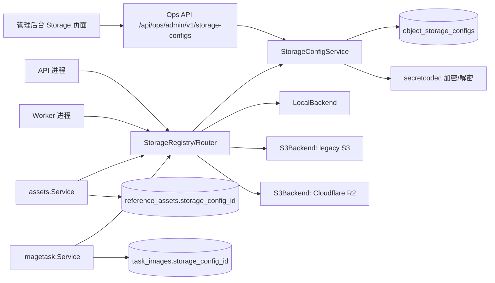
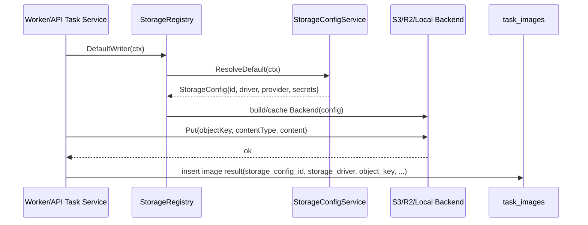
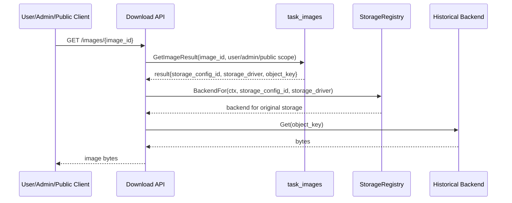
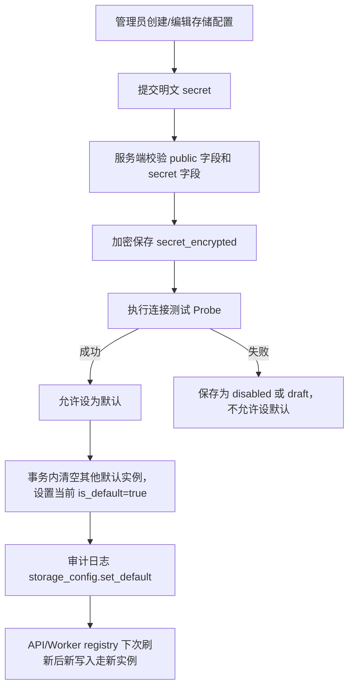
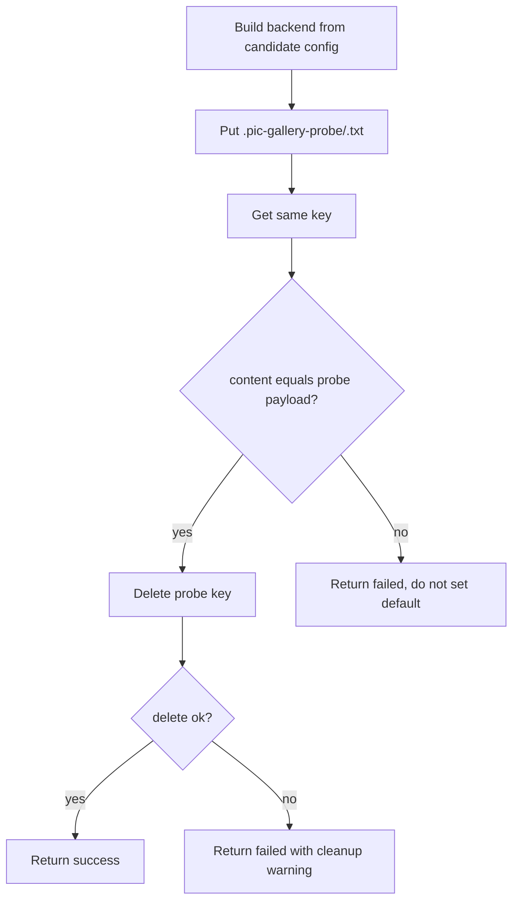

# 多实例 S3/R2 存储 Implementation Plan

> **For Claude:** REQUIRED SUB-SKILL: Use superpowers:executing-plans to implement this plan task-by-task.

**Goal:** 为 pic-gallery 增加多实例 S3-compatible 存储能力，让 Cloudflare R2 作为 S3 协议实例接入，并支持后台管理、默认写入切换、历史图片按原存储实例读取。

**Architecture:** 保留现有 `internal/storage.Backend` 作为单存储实例抽象，在其上新增 `object_storage_configs`、`StorageConfigService` 和 `storage.Registry/Router`。新对象写入通过默认可写实例路由，读取/删除通过对象记录的 `storage_config_id` 精确路由，空 `storage_config_id` 仅作为迁移期 legacy fallback。

**Tech Stack:** Go、Ent、PostgreSQL/SQLite、现有 `secretcodec`、Local FS、S3-compatible API、Cloudflare R2、React admin、OpenAPI、repo workflow scripts。

---

# 多实例 S3/R2 存储技术方案

> 日期：2026-07-05  
> 目标仓库：`/Users/fatballfish/Documents/Projects/GoProjects/Personal/pic-gallery`  
> 方案状态：待评审  
> 需求来源：用户提出「新增 Cloudflare R2 存储，管理后台可管理多个 S3 存储配置；新生成图片使用新存储，历史图片仍从旧存储读取」。

## 一、需求描述

### 1.1 需求背景与预期效果

当前项目已实现 Local FS / S3-compatible 两种存储驱动，核心接口为 `internal/storage.Backend`，但运行时只有一个启动期注入的 backend。生成图和参考图仅保存 `storage_driver` 与 `object_key`，没有记录具体的存储配置实例。

这会导致一个关键问题：当系统从旧 S3 切换到新 S3/R2 后，历史图片仍是 `storage_driver=s3`，读取时无法判断应该访问旧 bucket 还是新 bucket。

预期效果：

- 管理后台可新增、编辑、禁用、测试、设为默认多个 S3-compatible 存储配置。
- Cloudflare R2 作为 S3-compatible provider 的一种配置接入，不新增独立 R2 driver。
- 新上传参考图、新生成图片使用当前默认存储实例写入。
- 历史图片、历史参考图按各自记录的存储实例读取/删除，不受默认存储切换影响。
- 保留现有 Local FS / S3 启动配置作为 bootstrap 和迁移来源，支持平滑升级。

### 1.2 涉及团队与人员

| 角色 | 职责 |
|---|---|
| 服务端 | 数据模型、存储 registry/router、API、迁移、测试 |
| Web 管理后台 | 存储配置管理页面、表单校验、连接测试交互 |
| Web 用户端 | 原则上无需改动；只回归图片展示/下载 |
| QA | 多存储读写、历史兼容、权限、异常场景验证 |
| SRE/部署 | R2/S3 凭证、bucket 权限、生产迁移和回滚 |

### 1.3 目标拆解

| 子目标 | 范围说明 | 交付标准 | 优先级 |
|---|---|---|---|
| 存储实例数据模型 | 新增存储配置表，图片/参考图记录存储实例 ID | DB schema 可兼容迁移，历史数据可回填 | P0 |
| 存储路由层 | 默认实例写入，按实例 ID 读取/删除 | API 与 worker 均使用同一套 registry/router | P0 |
| S3/R2 配置管理 API | Ops API 管理多实例、测试连接、设默认 | 权限、审计、敏感字段加密完整 | P0 |
| 管理后台页面 | Storage 配置真实可用 | 可创建 R2/S3、测试连接、设默认、禁用 | P1 |
| 迁移与灰度 | 从单 backend 平滑升级为多实例 | 老数据可读，新数据可写，支持回滚 | P0 |
| 观测与告警 | 关键存储读写指标和日志 | 可定位是哪个 storage config 出错 | P1 |

### 1.4 不做什么

- 不实现跨存储自动搬迁历史图片。
- 不引入对象级公开访问或 CDN 直出；仍由现有下载 API 鉴权后代理读取。
- 不在首版实现浏览器直传/预签名 URL 上传。现有技术设计中提到 direct upload，可作为后续能力。
- 不新增 Cloudflare Workers R2 binding 路径；本项目后端仍通过 S3 API 访问 R2。

## 二、技术方案详情

### 2.1 整体架构

推荐方案：在现有 `storage.Backend` 之上新增「存储配置服务 + 存储 Registry/Router」，并在 `task_images`、`reference_assets` 记录具体 `storage_config_id`。



核心约定：

- `storage.Backend` 保持为单实例读写接口，不直接承担多实例路由。
- 新增 `storage.Router` 或 `storage.Registry`，负责：
  - `DefaultWriter(ctx)`：获取当前默认启用存储实例。
  - `BackendFor(ctx, storageConfigID)`：获取指定实例。
  - `Probe(ctx, config)`：连接测试，不污染业务数据。
- 图片/参考图写入时记录 `StorageConfigID`。
- 图片/参考图读取和删除时必须使用记录上的 `StorageConfigID`，不能使用当前默认实例兜底，除非是迁移前历史数据且满足兼容规则。

### 2.2 技术选型与方案对比

#### 业界做法

S3-compatible 是对象存储事实标准之一。Cloudflare R2 官方说明 R2 支持 S3-compatible API，已有 S3 代码通常只需替换 endpoint 和 credentials；R2 endpoint 形如 `https://<ACCOUNT_ID>.r2.cloudflarestorage.com`，region 使用 `auto`，空值或 `us-east-1` 会映射到 `auto`。参考：

- Cloudflare R2 S3 API compatibility: https://developers.cloudflare.com/r2/api/s3/api/
- Cloudflare R2 S3 getting started: https://developers.cloudflare.com/r2/get-started/s3/
- Cloudflare R2 presigned URLs: https://developers.cloudflare.com/r2/api/s3/presigned-urls/

#### 方案对比

| 方案 | 描述 | 优点 | 缺点 | 结论 |
|---|---|---|---|---|
| A. 只扩展现有 `StorageConfig.S3` 支持 R2 | 仍保持单全局 backend，后台只改 endpoint/bucket | 改动小 | 无法支持历史旧 S3 读取；API/worker 启动期固定 backend；不满足核心需求 | 不选 |
| B. 多实例配置 + `storage_config_id` 路由 | 新增存储实例表和 registry；图片记录实例 ID | 满足新旧存储并存；迁移清晰；可扩展 S3/R2/Local | DB/API/服务层改动较多 | 推荐 |
| C. 对象 key 内编码存储实例 | 在 `object_key` 前缀放 `storage_code`，不加 DB 字段 | DB 改动较少 | 历史数据仍需推断；对象 key 承载路由语义脆弱；改名困难 | 不选 |
| D. 直接迁移历史对象到新 R2 | 切换默认存储时批量搬迁旧对象 | 历史读取简单 | 成本高、耗时长、失败补偿复杂；用户未要求 | 后续可选 |

选型结论：采用方案 B。它自然延续现有 `storage.Backend` 抽象，同时补齐「配置实例」和「按对象路由」两个缺失层。

### 2.3 业务详细流程

#### 2.3.1 新生成图片写入流程



写入契约伪代码：

```go
func persistBase64ImageResult(ctx, task, index, result):
    content := decode(result.B64JSON)
    meta := inspectImage(content)
    writer, err := storageRouter.DefaultWriter(ctx)
    if err != nil:
        return IMAGE_STORAGE_CONFIG_UNAVAILABLE

    objectKey := generatedImageObjectKey(task.UserID, task.ID, index, resultID, ext)
    if err := writer.Backend.Put(ctx, objectKey, meta.MimeType, content); err != nil:
        return IMAGE_STORAGE_FAILED

    result.StorageConfigID = writer.ConfigID
    result.StorageDriver = writer.Driver
    result.ObjectKey = objectKey
    result.URL = "/api/agent/image/v1/images/" + result.ID
    result.DownloadURL = result.URL
    return result
```

强制契约：

- 只有 `Put` 成功后才能写 DB。
- DB 中 `storage_config_id`、`storage_driver`、`object_key` 必须同时落库。
- 不允许生成图结果只保存 R2/S3 原始 URL 作为业务读取路径，除非 `storage_driver=remote` 的旧兼容分支。

#### 2.3.2 历史图片读取流程



读取契约伪代码：

```go
func DownloadImageResult(ctx, userID, imageID):
    result := store.GetImageResultByID(ctx, userID, imageID)
    if result.StorageDriver == "remote" || result.ObjectKey == "":
        return NOT_FOUND

    backend, err := storageRouter.BackendFor(ctx, result.StorageConfigID, result.StorageDriver)
    if err != nil:
        log.Warn("storage backend unavailable", "image_id", imageID, "storage_config_id", result.StorageConfigID)
        return IMAGE_STORAGE_CONFIG_UNAVAILABLE

    content, err := backend.Get(ctx, result.ObjectKey)
    if err == storage.ErrNotFound:
        return NOT_FOUND
    if err != nil:
        return IMAGE_STORAGE_FAILED
    return result, content
```

兼容规则：

- `storage_config_id` 不为空：必须按该实例读取。
- `storage_config_id` 为空且 `storage_driver=local/s3`：仅用于迁移前历史数据，路由到 bootstrap legacy config。
- `storage_driver=remote`：保持现有逻辑，不走对象存储读取。

#### 2.3.3 切换默认存储流程



设默认契约：

```go
func SetDefault(ctx, id, actorID):
    tx := db.Begin()
    cfg := tx.GetForUpdate(id)
    if cfg.Status != "enabled":
        return BAD_REQUEST
    if !cfg.LastProbeOK:
        return BAD_REQUEST
    tx.UpdateAll("is_default=false")
    tx.Update(id, "is_default=true", "version=version+1", "updated_by=actorID")
    tx.Commit()
    audit("storage_config.set_default", id)
```

异常路径清单：

| 场景 | 行为 |
|---|---|
| 默认配置缺失 | 新写入失败，返回 `IMAGE_STORAGE_CONFIG_UNAVAILABLE`；历史读取不受影响 |
| 默认配置切换中 | DB 事务保证同时只有一个默认；registry 用短 TTL 刷新，最多延迟一个 TTL |
| 新配置测试失败 | 不允许设为默认；保留错误信息和最近测试时间 |
| R2/S3 Put 成功但 DB 写失败 | 立即尝试 Delete 刚写入对象；Delete 失败写 warning 日志，后续由清理任务处理 |
| DB 写成功但响应失败 | 幂等读取按 DB 记录可正常返回 |
| 读取历史对象时旧配置被禁用 | 默认不允许读取 disabled 配置会导致历史图不可读；因此状态需要区分 `enabled_for_read` 与 `disabled`，详见数据结构 |
| API 与 worker 新老版本并存 | 迁移期新字段 nullable；新代码兼容空 `storage_config_id`；老代码仍可用旧 backend |

### 2.4 接口设计

新增接口均为 Ops API，前缀 `/api/ops/admin/v1`，鉴权沿用管理后台权限。读接口需要 `read_only`，写入/测试/设默认需要 `manage:dangerous_config`，因为包含对象存储凭证和生产读写风险。

#### 2.4.1 列表

`GET /api/ops/admin/v1/storage-configs`

响应：

```json
{
  "items": [
    {
      "id": "uuid",
      "code": "r2-prod",
      "name": "Cloudflare R2 Prod",
      "driver": "s3",
      "provider": "r2",
      "status": "enabled",
      "read_enabled": true,
      "write_enabled": true,
      "is_default": true,
      "endpoint": "https://<ACCOUNT_ID>.r2.cloudflarestorage.com",
      "region": "auto",
      "bucket": "pic-gallery-prod",
      "prefix": "prod",
      "force_path_style": false,
      "secret_status": {
        "secret_fields": ["access_key_id", "secret_access_key"],
        "fingerprint": "sha256:...",
        "updated_at": "2026-07-05T00:00:00Z"
      },
      "last_probe": {
        "status": "success",
        "checked_at": "2026-07-05T00:00:00Z",
        "message": "ok"
      },
      "version": 3
    }
  ]
}
```

#### 2.4.2 创建

`POST /api/ops/admin/v1/storage-configs`

请求：

```json
{
  "code": "r2-prod",
  "name": "Cloudflare R2 Prod",
  "driver": "s3",
  "provider": "r2",
  "endpoint": "https://<ACCOUNT_ID>.r2.cloudflarestorage.com",
  "region": "auto",
  "bucket": "pic-gallery-prod",
  "prefix": "prod",
  "force_path_style": false,
  "read_enabled": true,
  "write_enabled": false,
  "secrets": {
    "access_key_id": "xxx",
    "secret_access_key": "yyy"
  }
}
```

契约：

- `code` 全局唯一，不允许修改。
- `provider` 可选值：`aws_s3`、`minio`、`r2`、`custom_s3`。
- `driver` 首版可选值：`local`、`s3`。R2 必须使用 `driver=s3, provider=r2`。
- 创建后默认 `is_default=false`，除非系统内没有任何 enabled write 配置。
- Secret 字段只写不读，响应永远不返回明文。

#### 2.4.3 更新

`PUT /api/ops/admin/v1/storage-configs/{id}`

请求包含 `version` 做乐观锁：

```json
{
  "version": 3,
  "name": "Cloudflare R2 Prod",
  "endpoint": "https://<ACCOUNT_ID>.r2.cloudflarestorage.com",
  "region": "auto",
  "bucket": "pic-gallery-prod",
  "prefix": "prod",
  "force_path_style": false,
  "read_enabled": true,
  "write_enabled": true,
  "secrets": {
    "access_key_id": "new-ak"
  },
  "clear_secrets": []
}
```

幂等性：

- 相同 `version` 只能成功一次。
- 未传的 secret 保留原值。
- 传入 masked placeholder 视为非法，避免把 `******` 当真实凭证保存。

#### 2.4.4 连接测试

`POST /api/ops/admin/v1/storage-configs/{id}:probe`

或创建前：

`POST /api/ops/admin/v1/storage-configs:probe`

请求为完整配置或已有 ID。响应：

```json
{
  "status": "success",
  "checked_at": "2026-07-05T00:00:00Z",
  "latency_ms": 235,
  "message": "put/get/delete probe object succeeded"
}
```

Probe 契约：

```go
func Probe(ctx, cfg):
    backend := NewBackendFromStorageConfigRecord(cfg)
    key := path.Join(cfg.Prefix, ".pic-gallery-probe", uuid()+".txt")
    content := []byte("pic-gallery-storage-probe")
    timeout := 10s

    backend.Put(ctxWithTimeout, key, "text/plain", content)
    got := backend.Get(ctxWithTimeout, key)
    if got != content: return failure
    backend.Delete(ctxWithTimeout, key)
    return success
```

注意：`NewBackend` 当前会自动拼接 prefix，因此 Probe 传入的业务 key 不应重复包含 prefix。最终实现应统一约定：调用方传业务 key，backend 内部负责 prefix。

#### 2.4.5 设为默认

`POST /api/ops/admin/v1/storage-configs/{id}:set-default`

请求：

```json
{ "version": 3 }
```

响应返回更新后的配置。

#### 2.4.6 禁用/启用

`POST /api/ops/admin/v1/storage-configs/{id}:set-status`

请求：

```json
{
  "version": 3,
  "read_enabled": true,
  "write_enabled": false,
  "status": "enabled"
}
```

状态约定：

- `read_enabled=true, write_enabled=false`：历史只读，适合旧 S3。
- `read_enabled=false, write_enabled=false`：完全停用，历史对象会不可读，需二次确认。
- 默认存储必须 `read_enabled=true` 且 `write_enabled=true`。

### 2.5 核心算法/伪代码

#### 2.5.1 StorageRegistry

```go
type BackendRef struct {
    ConfigID string
    Driver   string
    Backend  storage.Backend
}

type Router interface {
    DefaultWriter(ctx context.Context) (BackendRef, error)
    BackendFor(ctx context.Context, configID string, legacyDriver string) (BackendRef, error)
    Probe(ctx context.Context, cfg StorageConfigResolved) ProbeResult
}

type Registry struct {
    source StorageConfigSource
    cache  map[string]cachedBackend
    ttl    time.Duration // default 30s
    mu     sync.RWMutex
}

func (r *Registry) DefaultWriter(ctx context.Context) (BackendRef, error) {
    cfg, err := r.source.GetDefaultWritable(ctx)
    if err != nil { return BackendRef{}, err }
    if !cfg.ReadEnabled || !cfg.WriteEnabled || cfg.Status != "enabled" {
        return BackendRef{}, ErrNoDefaultWritableStorage
    }
    return r.backendForConfig(ctx, cfg)
}

func (r *Registry) BackendFor(ctx context.Context, configID, legacyDriver string) (BackendRef, error) {
    if configID != "" {
        cfg := r.source.GetByID(ctx, configID)
        if !cfg.ReadEnabled || cfg.Status == "deleted" {
            return BackendRef{}, ErrStorageNotReadable
        }
        return r.backendForConfig(ctx, cfg)
    }

    // Migration compatibility only.
    cfg := r.source.GetLegacyByDriver(ctx, legacyDriver)
    if cfg.ID == "" { return BackendRef{}, ErrStorageNotReadable }
    return r.backendForConfig(ctx, cfg)
}
```

#### 2.5.2 Registry 缓存失效

```go
func (r *Registry) backendForConfig(ctx, cfg):
    key := cfg.ID + ":" + cfg.Version + ":" + cfg.SecretFingerprint
    if cached exists and not expired:
        return cached

    resolved := cfg.ToConfigStorageConfigWithSecrets()
    backend := storage.NewBackend(resolved)
    cache[key] = backend with expiresAt=now+30s
    delete stale cache entries for same cfg.ID
    return backend
```

约定：

- 使用 `version + secret_fingerprint` 作为缓存 key 的一部分，后台改配置后无需重启。
- TTL 推荐 30 秒。测试环境可降到 1 秒。
- API 和 worker 都独立缓存；无需跨进程通知。

### 2.6 数据结构设计

#### 2.6.1 新增表：`object_storage_configs`

项目当前 ent 表使用 snake_case 字段、`TimeMixin`、软删 mixin 和普通索引；本表按该风格设计。

| 字段 | 类型 | 说明 |
|---|---|---|
| `id` | uuid | 主键 |
| `code` | varchar(64) | 唯一编码，如 `legacy-s3`、`r2-prod` |
| `name` | varchar(128) | 展示名 |
| `driver` | varchar(16) | `local` / `s3` |
| `provider` | varchar(32) | `local` / `aws_s3` / `minio` / `r2` / `custom_s3` |
| `status` | varchar(32) | `enabled` / `disabled` / `deleted` |
| `read_enabled` | bool | 是否允许历史读取 |
| `write_enabled` | bool | 是否允许新写入 |
| `is_default` | bool | 是否默认写入实例 |
| `endpoint` | varchar(255), nullable | S3/R2 endpoint |
| `region` | varchar(64), nullable | R2 使用 `auto` |
| `bucket` | varchar(128), nullable | bucket 名称 |
| `prefix` | varchar(255) | 对象 key 前缀 |
| `force_path_style` | bool | S3 path-style |
| `public_base_url` | varchar(255), nullable | 预留，首版不直出 |
| `local_root` | varchar(255), nullable | local driver 根目录 |
| `public_value` | json | 非敏感扩展字段 |
| `secret_encrypted` | json | 加密后的 secret |
| `secret_fingerprint` | varchar(128) | secret 指纹 |
| `secret_fields` | json | secret 字段列表 |
| `last_probe_status` | varchar(32) | `success` / `failed` / `never` |
| `last_probe_message` | varchar(512) | 最近测试信息 |
| `last_probe_at` | time, nullable | 最近测试时间 |
| `version` | int64 | 乐观锁 |
| `updated_by` | int64 | 最近更新管理员 |
| `created_at` / `updated_at` / `deleted_at` | time | 沿用 mixin |

索引：

- `uk_object_storage_configs_code`：`code` unique。
- `idx_object_storage_configs_default`：`is_default, status, write_enabled`。
- `idx_object_storage_configs_status`：`status`。

约束：

- 应用层保证最多一个 `is_default=true AND status=enabled AND write_enabled=true`。
- `driver=s3` 时 `endpoint/region/bucket/access_key_id/secret_access_key` 必填。
- `provider=r2` 时 `region` 默认 `auto`。

#### 2.6.2 修改表：`task_images`

新增字段：

| 字段 | 类型 | 说明 |
|---|---|---|
| `storage_config_id` | uuid nullable | 对应 `object_storage_configs.id` |

索引调整：

- 现有 `object_key` unique 不适合多 bucket。调整为：
  - `idx_task_images_storage_config_id`
  - `uk_task_images_storage_config_object_key`：`storage_config_id, object_key` unique，nullable 历史数据需兼容。

兼容策略：

- 第一阶段只新增 nullable 字段和索引，不立即删除旧 unique。
- 回填完成并确认无冲突后，再迁移 unique 约束。

#### 2.6.3 修改表：`reference_assets`

新增字段：

| 字段 | 类型 | 说明 |
|---|---|---|
| `storage_config_id` | uuid nullable | 对应 `object_storage_configs.id` |

索引调整同 `task_images`。

#### 2.6.4 Domain/API 类型

新增字段：

```go
type provider.ImageResult struct {
    StorageConfigID string `json:"storage_config_id,omitempty"`
    StorageDriver   string `json:"storage_driver,omitempty"`
    ObjectKey       string `json:"object_key,omitempty"`
}

type assets.ReferenceAsset struct {
    StorageConfigID string `json:"storage_config_id,omitempty"`
    StorageDriver   string `json:"storage_driver"`
    ObjectKey       string `json:"object_key"`
}
```

前端用户侧可接收但无需展示。管理后台审查/详情可用于排障。

#### 2.6.5 配置与 bootstrap

保留现有 `config.StorageConfig`：

- 启动时用于创建 bootstrap legacy storage config。
- 当 DB 中没有任何 storage config 时，根据 env/yaml 初始化：
  - `storage.driver=local` -> `code=bootstrap-local`
  - `storage.driver=s3` -> `code=bootstrap-s3`
- 若 DB 已有配置，以 DB 为准。

### 2.7 错误码设计

新增或复用错误码：

| 错误码 | HTTP | 场景 | 前端处理 |
|---|---:|---|---|
| `IMAGE_STORAGE_FAILED` | 500 | 具体对象读写失败 | 展示存储读写失败 |
| `STORAGE_CONFIG_UNAVAILABLE` | 500 | 默认或指定存储配置不可用 | 管理后台提示检查配置 |
| `STORAGE_CONFIG_INVALID` | 400 | 配置字段非法 | 表单字段错误 |
| `STORAGE_PROBE_FAILED` | 400 | 连接测试失败 | 展示最近测试信息 |
| `CONFLICT` | 409 | 版本冲突或默认切换竞态 | 刷新后重试 |

### 2.8 灰度设计

#### 阶段 0：仅上线 schema 和兼容读写

- 新增表和 nullable 字段。
- 新代码仍可读旧 `storage_config_id=null` 数据。
- 默认写入可以先继续使用 bootstrap legacy config。
- 回滚：老代码忽略新增字段和表。

成功标准：

- `go test ./...`、`go vet ./...` 通过。
- 旧图片下载、参考图上传、生成图保存通过。

#### 阶段 1：初始化 legacy config 并回填

- 启动或一次性任务创建 `bootstrap-local` / `bootstrap-s3`。
- 回填 `task_images.storage_config_id`、`reference_assets.storage_config_id`。
- 仅回填 `storage_driver in ('local','s3')` 且空 config ID 的数据。

回滚：

- 不删除 legacy config。
- 新字段 nullable，回滚老代码仍按旧 backend 工作。

成功标准：

- 空 `storage_config_id` 数量降到 0，排除 `remote`。
- 历史图片下载成功率不低于上线前基线。

#### 阶段 2：后台开放新增 R2/S3，但不设默认

- 管理员创建配置并 Probe。
- 不影响用户写入。

成功标准：

- Probe 成功。
- 审计日志完整。
- Secret 不出现在接口响应和日志中。

#### 阶段 3：设 R2 为默认写入

- 新生成图片和新参考图写入 R2。
- 历史数据继续从旧 config 读取。

回滚：

- 将 legacy config 重新设为默认。
- 已写入 R2 的图片因记录了 R2 config ID，仍从 R2 读取。

成功标准：

- 新写入对象 `storage_config_id=r2-prod`。
- 生成图保存失败率 15 分钟内不高于 1%。
- 图片下载 P95 延迟不超过上线前 2 倍。

### 2.9 安全合规

- S3/R2 secret 只允许通过 `manage:dangerous_config` 写入。
- Secret 使用现有 `secretcodec` 加密保存，只返回 fingerprint 和字段列表。
- 审计日志记录创建、更新、Probe、设默认、禁用操作，但不得记录明文 secret。
- Probe 对象必须写入 `.pic-gallery-probe/` 前缀，并在测试完成后删除。
- 所有下载继续走现有鉴权 API，首版不引入公开 bucket URL，避免绕过用户/审核权限。
- SSRF 风险：存储 endpoint 由管理员配置，仍需校验 scheme 仅允许 `https`，本地开发可通过配置允许 `http://localhost`、`http://127.0.0.1`、内网 MinIO。生产默认拒绝 `http` 和 link-local 地址。

## 三、稳定性设计

### 3.1 性能指标评估

| 项 | 指标/估算 |
|---|---|
| Backend cache | TTL 30s，单进程内 map 缓存，命中后无 DB 查询 |
| 写入路径额外开销 | 默认配置解析缓存命中时约 O(1)；缓存失效时 1 次 DB 查询 |
| 读取路径额外开销 | 缓存命中 O(1)；失效时按 `storage_config_id` 1 次 DB 查询 |
| Probe 超时 | 单次 Put/Get/Delete 总超时 10s |
| 图片大小 | 当前生成图读取使用内存字节数组；首版沿用，单对象建议控制在 64MB 内 |
| QPS | 👤 待人工确认生产图片生成/下载 QPS 后再定容量 |
| 180 天存储量 | 👤 待人工确认日均生成图片数、平均图片大小、保留策略 |

### 3.2 资源与成本预估

成本由对象存储容量、请求次数、出站流量决定。

粗略公式：

```text
monthly_storage_gb = daily_images * avg_image_mb / 1024 * retention_days
monthly_put_requests = daily_images * 30
monthly_get_requests = daily_downloads * 30
monthly_egress_gb = daily_downloads * avg_image_mb / 1024 * 30
```

SaaS：

- R2 通常适合降低公网出口成本，但仍需结合 Cloudflare 当期计费确认。
- 多实例后可按环境/租户拆分 bucket，但首版不做租户级路由。

私有化：

- MinIO/custom S3 可作为 `provider=minio/custom_s3` 配置。
- 需要部署方保证 bucket 权限、容量、备份和生命周期策略。

### 3.3 兼容性设计

1. 发布过程中新老版本服务端并存  
   新字段 nullable。新代码兼容空 `storage_config_id`，老代码忽略新表字段。但在滚动升级期间不要立即切默认到新 R2，待 API/worker 全部升级完成。

2. 数据库变更兼容  
   分阶段迁移：先新增表/字段，回填后再调整 unique。避免一次性破坏旧约束。

3. 新版服务端兼容老版本客户端  
   图片 URL 和下载接口不变；新增字段仅响应里多出，不影响老前端。

4. 新版客户端兼容老版本服务端  
   Storage 管理页面需要在接口 404 时展示「后端版本不支持」；用户端无影响。

5. 新版客户端兼容老版客户端本地持久化  
   N/A。本需求不修改用户端本地存储格式。

6. 策略/配置向前兼容  
   老 worker 不读取 storage config 表，因此切默认到 R2 必须在所有 worker 升级后执行。

7. 定制化需求兼容  
   私有化 MinIO 通过 `provider=minio` 和 `force_path_style=true` 兼容；生产环境禁止不安全 endpoint 的规则需允许部署方显式配置白名单。

### 3.4 监控与容灾设计

监控指标：

| 指标 | 标签 | 阈值 | 告警 |
|---|---|---|---|
| `storage_put_total` | `storage_config_id`, `driver`, `provider`, `result` | 失败率 > 1% 持续 5 分钟 | P1 |
| `storage_get_total` | 同上 | 失败率 > 2% 持续 5 分钟 | P1 |
| `storage_delete_total` | 同上 | 失败率 > 5% 持续 15 分钟 | P2 |
| `storage_operation_duration_ms` | `operation`, `storage_config_id` | P95 > 3000ms 持续 10 分钟 | P2 |
| `storage_default_config_missing_total` | env | 任意增长 | P0 |
| `storage_probe_total` | `storage_config_id`, `result` | 失败 | P2 |

日志字段：

- `storage_config_id`
- `storage_code`
- `driver`
- `provider`
- `bucket`
- `operation`
- `object_key_hash` 或截断后的 object key，避免泄漏完整路径策略
- `request_id`

容灾策略：

- 默认写入存储不可用：新生成/上传失败，不自动写旧存储，避免静默分叉；管理员可手动切默认。
- 历史读取存储不可用：返回明确存储失败错误；不尝试其他配置读取。
- 配置误删：软删；若仍有对象引用，不允许硬删除。

### 3.5 风险评估

| 风险 | 概率 | 影响 | 应对策略 | Owner |
|---|---|---|---|---|
| 历史数据未回填导致读取路由错误 | 中 | 高 | nullable 兼容 + legacy fallback + 回填校验报表 | 服务端 |
| R2/S3 endpoint/path-style 兼容问题 | 中 | 中 | Probe 覆盖 Put/Get/Delete；R2 推荐 region=auto | 服务端/SRE |
| Secret 泄漏到日志或响应 | 低 | 高 | 复用 secretcodec；统一响应 view；日志禁止 secret 字段 | 服务端 |
| 默认切换时 worker 缓存延迟 | 中 | 中 | TTL 30s；切换后观察；必要时加手动刷新 endpoint | 服务端 |
| 对象 Put 成功 DB 失败产生孤儿对象 | 中 | 低 | 失败时 Delete；后续增加清理任务 | 服务端 |

## 四、架构变更

新增模块建议：

- `internal/domain/storageconfig/types.go`
- `internal/service/storageconfig/service.go`
- `internal/service/storageconfig/store.go`
- `internal/repository/entstore/storage_config_store.go`
- `internal/storage/router.go`
- `internal/http/handlers` 中新增 Storage Config Ops API handlers，或拆出子文件降低 `api.go` 体积
- `web/admin/src/pages/StorageConfigPage.tsx`

修改模块：

- `internal/storage/backend.go`：保留 `Backend`；补 `NewBackendFromResolvedConfig` 或类似工厂。
- `internal/service/assets/service.go`：依赖 router，写入记录 config ID，读取按 config ID。
- `internal/service/imagetask/service.go`：依赖 router，生成图写入记录 config ID，下载/删除按 config ID。
- `internal/repository/ent/schema/imageresult.go`
- `internal/repository/ent/schema/referenceasset.go`
- `internal/repository/entstore/imagetask_store.go`
- `internal/repository/entstore/assets_store.go`
- `internal/app/run.go`、`internal/app/worker.go`：初始化 storage config service 和 router，不再把单 backend 直接传给任务/资产服务。
- `api/openapi`、`web/shared/api-types.ts`：补管理 API 和新增字段。

部署变化：

- 需要新的 DB migration。
- 生产切 R2 前需准备 bucket、access key、secret key、endpoint、region。
- R2 凭证权限建议只给目标 bucket 的 Object Read & Write。

## 五、测试

### 5.1 业务逻辑影响范围

需要回归：

- 图片生成：URL 响应、任务详情、历史列表。
- 图片下载：用户、管理员审核图、公开图库图。
- 参考图上传、下载、从图库导入为参考图。
- 删除图片：对象删除 + DB 软删。
- 管理后台权限：只读管理员不能修改 storage secret。
- 现有 local storage 开发环境。
- 现有 MinIO/S3 兼容环境。

### 5.2 测试用例

#### 单元测试

- `internal/storage`：
  - `S3Backend` 对 R2-like endpoint 的 virtual-host/path-style request target。
  - `Registry.DefaultWriter` 缓存命中、版本变化失效。
  - `Registry.BackendFor` 空 config ID legacy fallback。

- `internal/service/storageconfig`：
  - 创建 R2 配置时 region 默认 `auto`。
  - Secret placeholder 拒绝。
  - SetDefault 要求 enabled + read/write + last probe success。
  - 禁用仍被引用的配置时保留 read-only。

- `internal/service/imagetask`：
  - persist image result 写入 `StorageConfigID`。
  - download 按 result 的 config ID 读取，而不是默认 config。
  - 删除按 result 的 config ID 删除。

- `internal/service/assets`：
  - 上传参考图记录 `StorageConfigID`。
  - LoadInput/Download 按历史 config 读取。

#### 集成测试

- SQLite/Ent schema migration 创建新表和新字段。
- 以 legacy local 初始化，生成图片后回填 config ID。
- 创建两个 fake backend：旧 S3、新 R2；默认切换后：
  - 旧图片仍从旧 backend 读。
  - 新图片写入新 backend。
  - 删除旧图片调用旧 backend Delete。

#### API 测试

- `GET /api/ops/admin/v1/storage-configs` 只读权限可访问。
- `POST/PUT/probe/set-default` 无权限返回 403。
- 创建配置响应不返回 secret。
- Probe 失败不能设默认。
- 乐观锁冲突返回 409。

#### E2E/烟测

- 使用 MinIO 模拟 S3 配置。
- 如 CI 可提供 R2 凭证，则增加可选真实 R2 smoke：
  - 创建 R2 配置。
  - Probe。
  - 设默认。
  - 生成 1 张图或上传参考图。
  - 下载校验 sha256。

验证命令：

```bash
./scripts/workflow/verify.sh
```

涉及后端/API/config 后，提交前还需要：

```bash
./scripts/workflow/review-local.sh --scope committed
./scripts/workflow/check-review-gate.sh
./scripts/workflow/api-smoke.sh
```

## 六、实施计划

> 后续进入编码前必须先运行 `dev-start-coding`，并将本方案作为技术设计来源写入 `.coding-context.json` 或由工作流自动发现。
>
> 编码执行时，每个 Task 都按「先写失败测试 -> 确认失败 -> 最小实现 -> 验证通过 -> 小步提交」推进。若当前工作树已有用户改动，执行者必须只 stage 本任务相关文件。

### Task 1：数据模型和迁移

文件：

- 创建：`internal/repository/ent/schema/objectstorageconfig.go`
- 修改：`internal/repository/ent/schema/imageresult.go`
- 修改：`internal/repository/ent/schema/referenceasset.go`
- 修改/生成：`internal/repository/ent/*`
- 测试：`internal/repository/ent/schema/schema_test.go`

步骤：

1. 写失败测试：在 `internal/repository/ent/schema/schema_test.go` 断言必须存在 `objectstorageconfig.go`，并断言 `ImageResult` / `ReferenceAsset` schema 暴露 nullable `storage_config_id`。
2. 运行失败验证：

   ```bash
   go test ./internal/repository/ent/schema
   ```

   预期：缺少 schema 或字段断言失败。

3. 新增 `ObjectStorageConfig` ent schema，字段按 2.6.1 固定，不允许把 secret 明文拆成独立列。
4. 给 `ImageResult` / `ReferenceAsset` 增加 nullable `storage_config_id`，首阶段保留现有 `object_key` unique，避免破坏滚动升级。
5. 生成 ent 代码：

   ```bash
   go generate ./internal/repository/ent
   ```

6. 运行验证：

   ```bash
   go test ./internal/repository/ent/schema ./internal/repository/entstore
   ```

   预期：PASS。
7. 提交建议：

   ```bash
   git add internal/repository/ent internal/repository/entstore
   git commit -m "feat: add object storage config schema"
   ```

### Task 2：Storage config domain/service/store

文件：

- 创建：`internal/domain/storageconfig/types.go`
- 创建：`internal/service/storageconfig/service.go`
- 创建：`internal/service/storageconfig/store.go`
- 创建：`internal/repository/entstore/storage_config_store.go`
- 测试：`internal/service/storageconfig/service_test.go`
- 测试：`internal/repository/entstore/storage_config_store_test.go`

步骤：

1. 写失败测试：覆盖 `Create` 不返回 secret、R2 默认 region 为 `auto`、masked secret 被拒绝、`SetDefault` 要求 enabled/read/write/probe success、版本冲突返回 409。
2. 运行失败验证：

   ```bash
   go test ./internal/service/storageconfig
   ```

   预期：类型或实现不存在导致失败。

3. 定义 `StorageConfigView`、`WriteRequest`、`ResolvedConfig`、`ProbeResult`，状态枚举必须与 2.4/2.6 保持一致。
4. 实现 secret 写入契约：未传字段保留、传空可清除、响应永不返回明文、日志不得包含 `access_key_id` / `secret_access_key`。
5. 实现 create/update/list/get/set-default/status/bootstrap，`SetDefault` 必须事务内清空其他默认并设置当前默认。
6. 实现 Ent store，所有 `secret_encrypted` 读写都只在 service 层解密给 router/probe 使用。
7. 运行验证：

   ```bash
   go test ./internal/service/storageconfig ./internal/repository/entstore
   ```

   预期：PASS。
8. 提交建议：

   ```bash
   git add internal/domain/storageconfig internal/service/storageconfig internal/repository/entstore/storage_config_store.go
   git commit -m "feat: add storage config service"
   ```

### Task 3：Storage router/registry

文件：

- 创建：`internal/storage/router.go`
- 修改：`internal/storage/backend.go`
- 测试：`internal/storage/router_test.go`
- 测试：`internal/storage/backend_test.go`

步骤：

1. 写失败测试：覆盖 `DefaultWriter` 只选择 enabled/read/write/default，`BackendFor` 按 config ID 精确读取，空 config ID 按 legacy driver fallback，版本/secret 指纹变化时缓存失效。
2. 运行失败验证：

   ```bash
   go test ./internal/storage
   ```

   预期：router 类型不存在或行为失败。

3. 定义 `Router`、`BackendRef`、`ConfigSource`，接口签名必须与 2.5.1 一致。
4. 实现 registry 缓存，key 必须包含 `config_id`、`version`、`secret_fingerprint`，TTL 默认 30 秒。
5. 实现 `Probe`，probe object 只能写入 `.pic-gallery-probe/` 业务 key；prefix 统一由 backend 处理，调用方不得重复拼 prefix。
6. R2 作为 `driver=s3, provider=r2` 处理，`region` 默认 `auto`，不新增 `r2` driver。
7. 运行验证：

   ```bash
   go test ./internal/storage
   ```

   预期：PASS。
8. 提交建议：

   ```bash
   git add internal/storage
   git commit -m "feat: route object storage by config"
   ```

### Task 4：任务服务和资产服务改造

文件：

- 修改：`internal/service/imagetask/service.go`
- 修改：`internal/service/imagetask/store.go`
- 修改：`internal/repository/entstore/imagetask_store.go`
- 修改：`internal/service/assets/service.go`
- 修改：`internal/service/assets/store.go`
- 修改：`internal/repository/entstore/assets_store.go`
- 测试：相关 `*_test.go`

步骤：

1. 写失败测试：构造两个 fake backend，默认切换后旧图仍从旧 backend 读，新图写入新 backend；删除旧图调用旧 backend delete。
2. 运行失败验证：

   ```bash
   go test ./internal/service/imagetask ./internal/service/assets
   ```

   预期：`StorageConfigID` 未保存或读取使用默认 backend 导致失败。

3. 将服务依赖从 `storage.Backend` 改为 `storage.Router`，保留兼容构造器，把旧 backend 包装为 `storage.StaticRouter`。
4. 新生成图片、远端 URL 下载落库、base64 落库、参考图上传都必须通过 `DefaultWriter`，并同时保存 `storage_config_id`、`storage_driver`、`object_key`。
5. 下载、公开图读取、管理员审核图读取、删除、参考图 `LoadInput` 都必须通过 `BackendFor(result.StorageConfigID, result.StorageDriver)`。
6. 对 `storage_driver=remote` 或空 `object_key` 保留现有不走对象存储的兼容分支。
7. 运行验证：

   ```bash
   go test ./internal/service/imagetask ./internal/service/assets
   ```

   预期：PASS。
8. 提交建议：

   ```bash
   git add internal/domain/assets internal/domain/imagetask internal/provider internal/service/assets internal/service/imagetask internal/repository/entstore
   git commit -m "feat: persist image storage config ids"
   ```

### Task 5：API 和 app wiring

文件：

- 修改：`internal/app/run.go`
- 修改：`internal/app/worker.go`
- 修改：`internal/http/router/router.go`
- 修改：`internal/http/handlers/api.go` 或新增 handler 文件
- 测试：`internal/http/router/*storage*_test.go`

步骤：

1. 写失败测试：router 测试断言新增路径存在；handler 测试断言无权限写操作 403、创建/更新响应不含 secret、probe failed 不能 set default。
2. 运行失败验证：

   ```bash
   go test ./internal/http/router ./internal/http/handlers ./internal/app
   ```

   预期：路由或 handler 不存在导致失败。

3. API/worker 启动时初始化 `storageconfig.Service`，执行 bootstrap legacy config。
4. 初始化同一套 `storage.Registry` 并注入 task/assets，禁止 API 和 worker 各自继续使用裸单 backend 写入新图片。
5. 新增 Ops API 路由，路径必须固定为 2.4 定义的 6 个 endpoint。
6. 权限固定：list/get 可读；create/update/probe/set-default/set-status 需要 `manage:dangerous_config`。
7. 审计事件固定：`storage_config.create`、`storage_config.update`、`storage_config.probe`、`storage_config.set_default`、`storage_config.set_status`。
8. 运行验证：

   ```bash
   go test ./internal/http/router ./internal/http/handlers ./internal/app
   ```

   预期：PASS。
9. 提交建议：

   ```bash
   git add internal/app internal/http
   git commit -m "feat: expose storage config admin api"
   ```

### Task 6：管理后台页面

文件：

- 创建：`web/admin/src/pages/StorageConfigPage.tsx`
- 修改：`web/admin/src/pages/index.ts`
- 修改：`web/admin/src/App.tsx`
- 修改：`web/shared/admin-api.ts`
- 修改：`web/shared/api-types.ts`
- 测试：新增 contract 测试

步骤：

1. 写失败 contract：断言 `API_PATHS.ops.storageConfigs` 等路径稳定，`StorageConfigPage` 被导出。
2. 运行失败验证：

   ```bash
   npm --prefix web/admin run typecheck
   ```

   预期：类型或组件不存在导致失败。

3. 在 `web/shared/api-types.ts` 增加 Storage Config API 类型，新增图片/参考图 `storage_config_id` 可选字段。
4. 在 `web/shared/admin-api.ts` 增加 list/create/update/probe/setDefault/setStatus client 方法。
5. 替换管理后台现有静态 Storage 卡片为真实 `StorageConfigPage`，只对 `manage:dangerous_config` 展示写操作。
6. 页面必须支持列表、创建/编辑、R2 模板、secret 更新入口、probe、set default、set read-only/disable。
7. Secret UI 只显示 fingerprint/字段状态/更新时间，不能回填明文或 masked placeholder 到保存 payload。
8. 运行验证：

   ```bash
   npm --prefix web/admin run typecheck
   npm --prefix web/admin run build
   ```

   预期：PASS。
9. 提交建议：

   ```bash
   git add web/shared web/admin/src
   git commit -m "feat: add storage config admin page"
   ```

### Task 7：OpenAPI、文档、验证

文件：

- 修改：`api/openapi/openapi.yaml`
- 修改：`api/openapi/components/schemas/admin.yaml`
- 修改：`docs/runbooks/backend-deployment.md`
- 修改：部署 env example 如需说明 bootstrap storage

步骤：

1. 写失败检查：OpenAPI 中缺少 `/api/ops/admin/v1/storage-configs` 时，本任务不允许完成。
2. 补 Storage Config API schema，请求/响应字段必须与 2.4 一致；secret 字段只出现在 request，不出现在 response。
3. 补 R2 配置 runbook，至少包含 endpoint、region=auto、bucket 权限、probe、设默认、回滚步骤。
4. 运行统一验证：

   ```bash
   ./scripts/workflow/verify.sh
   ```

   预期：PASS。
5. 运行 review gate：

   ```bash
   ./scripts/workflow/review-local.sh --scope committed
   ./scripts/workflow/check-review-gate.sh
   ```

   预期：PASS。
6. 后端/API/config 改动完成后运行 smoke：

   ```bash
   ./scripts/workflow/api-smoke.sh
   ```

   预期：PASS。
7. 如本地具备 Docker E2E 能力，运行仓库 E2E 脚本；若需要真实 R2 凭证但未提供，记录为阻塞项，不能假装通过。
8. 提交建议：

   ```bash
   git add api docs deployments
   git commit -m "docs: document storage config api and r2 runbook"
   ```

### Task 8：生产迁移与上线操作

文件：

- 创建或修改：`docs/runbooks/r2-storage-migration.md`
- 修改：部署说明和环境变量示例
- 只读检查：数据库 `object_storage_configs`、`task_images`、`reference_assets`

步骤：

1. 上线前检查：确认 API/worker 均已部署含本方案代码的版本。
2. 执行 bootstrap：确认 `bootstrap-local` 或 `bootstrap-s3` 存在且 `read_enabled=true`。
3. 回填历史数据：

   ```sql
   update task_images
   set storage_config_id = '<bootstrap-config-id>'
   where storage_config_id is null
     and storage_driver in ('local', 's3')
     and object_key <> '';

   update reference_assets
   set storage_config_id = '<bootstrap-config-id>'
   where storage_config_id is null
     and storage_driver in ('local', 's3')
     and object_key <> '';
   ```

4. 回填验收：

   ```sql
   select storage_driver, count(*)
   from task_images
   where storage_config_id is null
     and storage_driver in ('local', 's3')
     and object_key <> ''
   group by storage_driver;
   ```

   预期：返回 0 行或 count 全部为 0。

5. 管理后台创建 R2 配置，先 `write_enabled=false`，执行 probe。
6. probe success 后开启 `write_enabled=true` 并 set default。
7. 生成或上传 1 个测试对象，确认 DB 记录新 `storage_config_id`，下载成功。
8. 观察 15 分钟：`storage_put_total`、`storage_get_total`、错误日志、图片下载成功率。
9. 回滚方式：把 bootstrap legacy config 重新 set default。已经写入 R2 的对象继续按自身 `storage_config_id` 从 R2 读取。

### Task 9：最终完成定义

本需求只有同时满足以下条件才算完成：

- DB schema、service、router、任务写入、资产写入、API、管理后台、OpenAPI/runbook 均已实现。
- 新生成图片和新上传参考图保存 `storage_config_id`。
- 历史图片读取不依赖当前默认存储。
- Storage Config API 响应不包含任何明文 secret。
- `./scripts/workflow/verify.sh` 通过。
- `./scripts/workflow/review-local.sh --scope committed` 和 `./scripts/workflow/check-review-gate.sh` 通过。
- 后端/API/config 变更后的 `./scripts/workflow/api-smoke.sh` 通过；若真实 R2 凭证不可用，必须至少完成本地 MinIO/S3-compatible smoke，并明确记录真实 R2 smoke 未执行。

## 七、执行锁定契约

以下契约用于防止后续实现偏移，代码评审时按本节逐条检查。

### 7.1 存储路由契约

- 新写入只能调用 `storage.Router.DefaultWriter(ctx)`。
- 读取/删除只能调用 `storage.Router.BackendFor(ctx, storageConfigID, legacyDriver)`。
- `storage_config_id` 非空时必须精确按该实例读取，不允许降级到当前默认实例。
- `storage_config_id` 为空只允许作为迁移期 legacy fallback，且必须同时检查 `storage_driver in ('local','s3')`。
- `remote` 图片不走对象存储路由。
- R2 不新增 driver，固定为 `driver=s3, provider=r2`。

### 7.2 Secret 契约

- `access_key_id`、`secret_access_key` 只允许以 request secret 字段进入服务端。
- 落库必须加密，响应只返回 `secret_status`。
- 未传 secret 字段表示保留原值，传 masked placeholder 必须返回 400。
- 审计日志和应用日志不得记录 secret 明文。

### 7.3 默认配置契约

- 默认写入配置必须满足 `status=enabled`、`read_enabled=true`、`write_enabled=true`、`last_probe_status=success`。
- `SetDefault` 必须在单事务中清理旧默认并设置新默认。
- 禁用默认配置前必须先切换默认，否则返回 400。
- 旧 S3 下线时应先改为 `read_enabled=true, write_enabled=false`，不要直接完全禁用。

### 7.4 Probe 契约



- Probe 总超时默认 10 秒。
- Probe 失败不能设默认。
- Probe key 是业务 key，不能提前拼接 storage prefix。

### 7.5 迁移契约

- 第一版新增字段必须 nullable。
- 第一阶段不得移除旧 `object_key` unique；复合唯一索引在确认历史数据回填和冲突清理后单独迁移。
- 回填只处理 `storage_driver in ('local','s3')` 且 `object_key` 非空的数据。
- 回滚老代码时新增表和新增 nullable 字段可保留，不做破坏性 rollback。

## 八、待人工确认项

| # | 章节 | 待确认内容 | 需要谁确认 | 影响范围 |
|---|---|---|---|---|
| 1 | 2.4 | Storage 写接口是否统一要求 `manage:dangerous_config` | 产品/Tech Lead | 管理后台权限 |
| 2 | 2.6 | 是否允许生产环境配置 `http` endpoint | SRE/Tech Lead | 私有化 MinIO 兼容与安全 |
| 3 | 3.1 | 生产生成/下载 QPS、平均图片大小、保留天数 | SRE/产品 | 容量和成本 |
| 4 | 2.8 | 是否需要真实 R2 凭证进入 CI smoke | SRE | 自动化验证范围 |
| 5 | 4 | 是否接受首版不做直传/预签名 URL | 产品/Tech Lead | 后续体验和带宽成本 |

## 九、评审自检清单

### 完整性

- [x] 所有必填章节已填写。
- [x] 接口定义包含请求/响应格式和关键字段说明。
- [x] 数据模型包含表结构、字段、索引和状态约定。
- [x] 异常路径清单已逐项填写。

### 可评估性

- [x] 性能指标给出可量化阈值；未知业务量标注待确认。
- [x] 成本公式已给出；具体成本待业务量确认。
- [x] 兼容性 7 个场景已逐项回答。
- [x] 技术选型有方案对比和选型理由。

### 可执行性

- [x] 灰度方案含回滚策略和成功标准。
- [x] 监控指标和告警阈值已定义。
- [x] 实施任务拆到文件和步骤。
- [x] 测试用例覆盖正常、异常、兼容、性能路径。

### 安全性

- [x] Secret 加密方案已说明。
- [x] 敏感数据响应/日志限制已说明。
- [x] SSRF、权限、审计已评估。
