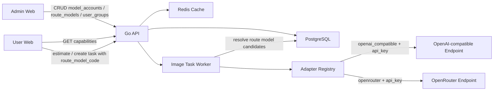
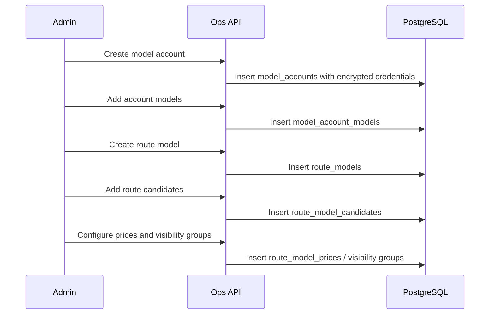

# Pic Gallery 模型接入、路由模型、价格与用户分组改造技术方案

> 文档版本：v1.0
>
> 创建日期：2026-05-23
>
> 关联 PRD：`docs/prd/pic-gallery-prd.md`
>
> 关联现有技术方案：`docs/tech/pic-gallery-tech-design.md`
>
> 方案状态：待评审

## 一、需求描述

### 1.1 需求背景与预期效果

Pic Gallery 当前已经具备管理后台中的模型接入、路由策略、价格配置和用户分组雏形，但现有实现存在结构性问题：

- 用户工作台看到的 `Basic`、`Plus`、`Pro` 来源于计费配置中的抽象模型，和后台路由策略没有强绑定。
- `model_providers` 缺少真实请求所需的 `base_url` 等字段，后台创建的 Provider 无法完整驱动真实上游调用。
- 后端仍依赖配置文件里的 OpenAI/OpenRouter 默认 Provider、能力矩阵和模型映射，导致“后台配置”和“真实运行路径”割裂。
- 价格配置、模型能力和路由候选之间没有形成同一个业务闭环，容易出现前台能选、后端不能调、价格不匹配的问题。
- 用户分组当前更像单一用户属性，无法表达多权益包叠加、不同模型可见范围、不同分组倍率择优计费。

本次改造目标是将模型相关能力重构为四个清晰概念：

1. **模型接入账号**：类似 Sub2API Account，表示一个上游账号、端点或凭据组合。
2. **真实上游模型**：挂在模型接入账号下，表示一个真实可请求的模型代码及其能力、成本。
3. **路由模型**：用户工作台可见的包装模型，例如 `Basic`、`Plus`、`Pro`。
4. **用户分组权益**：用户可绑定多个分组；分组决定路由模型可见范围和计费倍率。

预期效果：

- 所有模型接入信息均从后台配置并存储到数据库，不再依赖配置文件中的默认上游模型配置。
- 用户工作台模型列表完全由启用的路由模型和用户分组可见性计算得出。
- 生图请求从用户选择的路由模型，稳定解析到一个或多个真实上游模型候选，再通过对应 Adapter 发起真实请求。
- 价格按路由模型配置，用户最终扣点按“命中的可见分组中最低倍率”计算。
- 积分扣费保留小数后 5 位四舍五入，前端展示保留小数后 2 位四舍五入。

### 1.2 涉及团队与人员

| 角色 | 负责人 | 职责范围 |
|---|---|---|
| 服务端 | 待人工确认 | 数据模型、路由解析、Adapter 注册、计费、OpenAPI、审计 |
| 管理后台前端 | 待人工确认 | 模型接入、路由模型、价格配置、用户分组、用户分组绑定 |
| 用户工作台前端 | 待人工确认 | capabilities 对接、模型选择、价格展示、创建任务参数调整 |
| QA | 待人工确认 | API/E2E/回归用例设计与执行 |
| SRE/运维 | 待人工确认 | Docker 部署验证、环境变量下线、密钥配置检查 |

### 1.3 目标拆解

| 子目标 | 范围说明 | 交付标准 | 优先级 |
|---|---|---|---|
| G1 概念重构 | 移除旧 Provider/Route/Billing 配置耦合，建立账号、真实模型、路由模型、分组权益模型 | 数据结构、接口、前后端命名统一 | P0 |
| G2 模型接入账号 | 支持 OpenAI-compatible + API Key、OpenRouter + API Key；预留其他 auth type | 后台可创建、编辑、禁用、删除接入账号和真实模型 | P0 |
| G3 路由模型 | 支持 Basic/Plus/Pro 等用户可见模型配置、候选真实模型、权重、优先级、fallback | 用户工作台模型列表由路由模型生成 | P0 |
| G4 多用户分组 | 用户可绑定多个分组；分组可控制模型可见性和倍率 | 用户可见模型聚合去重；价格取最低命中倍率 | P0 |
| G5 价格与扣费 | 路由模型价格配置替代旧 billing quality map；扣费 5 位精度，展示 2 位 | 预估和创建任务后端一致，流水保留价格快照 | P0 |
| G6 上游调用 | 后端根据账号 adapter/auth/base_url/credentials 发起真实请求 | 不再从配置文件创建默认 Provider 客户端 | P0 |
| G7 测试与回归 | 补齐单测、API smoke、Docker E2E、管理后台 E2E | 覆盖所有新老入口和异常路径 | P0 |

## 二、技术方案详情

### 2.1 整体架构



关键设计：

- 管理后台不再维护“Provider 是具体 OpenAI/OpenRouter 账号”的旧概念，而是维护 **模型接入账号**。
- `openai_compatible` 和 `openrouter` 是 Adapter 类型，不是具体模型，也不是唯一 Provider 实例。
- 一个模型接入账号下可以配置多个真实模型代码，例如 `gpt-image-1`、`gpt-image-1.5`。
- 用户看到的 `Basic`、`Plus`、`Pro` 统一称为 **路由模型**，它们通过候选关系映射到多个真实模型。
- 用户可属于多个分组，capabilities 返回时合并所有命中分组的模型并去重。
- 同一模型命中多个分组时，计费取命中分组中最低倍率；如果模型是 public 且没有命中专属分组，则倍率为 `1.00000`。

### 2.2 技术选型与方案对比

#### 2.2.1 方案 A：继续沿用旧 Provider/Route 配置，补字段

- 做法：给 `model_providers` 增加 `base_url`，给当前 `model_routes` 补充可见性和价格关系。
- 优点：改动较小，短期接口变更少。
- 缺点：
  - Provider、真实模型、路由模型仍然混在一起。
  - 难以表达一个账号支持多个真实模型。
  - 难以对齐 Sub2API 的 platform/type/credentials 结构。
  - 仍然容易保留配置文件 fallback 和历史兼容分支。
- 结论：不采用。

#### 2.2.2 方案 B：一个真实模型一条完整接入记录

- 做法：每条记录同时包含 `base_url`、密钥、adapter、model_code、成本、能力。
- 优点：列表直观，每一行都能直接请求。
- 缺点：
  - 同一个账号多个模型会重复存储密钥和 base URL。
  - 密钥轮换、禁用账号、并发限制、错误状态需要同步多行。
  - 无法自然表达账号维度的状态和真实模型维度的能力差异。
- 结论：不采用。

#### 2.2.3 方案 C：模型接入账号 + 真实模型子表 + 路由模型包装

- 做法：
  - `model_accounts` 表示上游账号和端点。
  - `model_account_models` 表示账号下支持的真实模型。
  - `route_models` 表示用户可见模型。
  - `route_model_candidates` 表示路由模型到真实模型的候选映射。
- 优点：
  - 概念边界清晰，和 Sub2API Account 思路一致。
  - 支持一个账号多个模型，也支持一个路由模型多个候选。
  - 便于扩展未来 Claude、Gemini、OAuth、Service Account 等接入方式。
  - 价格、可见性、成本和上游调用职责分离。
- 缺点：需要较彻底重构后台页面、接口和部分服务层。
- 结论：采用。

### 2.3 业务详细流程

#### 2.3.1 后台配置流程



#### 2.3.2 用户可见模型查询流程

1. 用户请求 `/api/agent/image/v1/capabilities`。
2. 后端读取用户绑定的所有启用分组。
3. 后端查询所有启用的 public 路由模型。
4. 后端查询所有启用且与用户任一分组命中的 groups 路由模型。
5. 按 `route_model_id` 聚合去重。
6. 对每个路由模型计算有效倍率：
   - 命中的分组倍率列表为空且模型 public：`1.00000`。
   - 命中的分组倍率列表不为空：取最小值。
   - 模型同时 public 且命中分组：取 `min(1.00000, 命中分组倍率)`。
7. 基于路由模型价格计算 `charged_points = round(base_points * multiplier, 5)`。
8. 返回给前端，展示层再格式化为 2 位小数。

#### 2.3.3 创建生图任务流程

1. 用户提交 `route_model_code`、任务类型、质量、数量、提示词、参考图等参数。
2. 后端重新校验路由模型是否对当前用户可见，不信任前端传入的价格或倍率。
3. 后端计算有效倍率和最终扣点，写入价格快照。
4. 后端查询该路由模型可用候选真实模型，按优先级、权重、fallback 排序。
5. 任务执行器选择候选，读取其所属模型账号的 `adapter_type`、`auth_type`、`base_url`、加密凭据。
6. Adapter 构造上游请求并发起调用。
7. 成功后保存图片、写任务结果、完成扣费；失败后按候选 fallback，全部失败则释放预扣或写退款流水。

#### 2.3.4 异常路径清单

| 场景 | 行为 |
|---|---|
| 未配置任何路由模型 | capabilities 返回空列表，前端展示暂无可用模型 |
| 路由模型无候选真实模型 | 后台保存时允许草稿但不能启用；运行时返回配置错误 |
| 用户无匹配分组但选择 groups 模型 | 创建任务返回 403/模型不可见 |
| 命中多个分组 | 聚合去重模型，计费取最低倍率 |
| 分组倍率非法 | 后台保存校验失败；运行时发现非法值返回配置错误并告警 |
| 真实模型禁用 | 路由解析时跳过该候选 |
| 模型账号禁用或错误 | 路由解析时跳过该账号下候选 |
| Adapter 未实现 | 后台不允许启用该账号；运行时返回配置错误 |
| 上游调用失败 | 按错误策略和候选 fallback 处理，最终失败不扣实际生成费用 |
| 上游密钥错误 | 标记账号错误状态，写审计/日志，后续候选可跳过 |
| 并发配置变更 | 新任务读取新配置，已执行任务使用任务快照 |

### 2.4 接口设计

#### 2.4.1 Admin 模型接入账号

`GET /api/ops/admin/v1/model-accounts`

查询参数：`page`、`page_size`、`adapter_type`、`auth_type`、`status`、`keyword`。

`POST /api/ops/admin/v1/model-accounts`

```json
{
  "name": "OpenAI Main",
  "adapter_type": "openai_compatible",
  "auth_type": "api_key",
  "base_url": "https://api.openai.com",
  "credentials": {
    "api_key": "sk-..."
  },
  "priority": 1,
  "weight": 100,
  "concurrency_limit": 5,
  "timeout_ms": 120000,
  "status": "enabled",
  "extra": {}
}
```

响应中不得返回密钥明文：

```json
{
  "data": {
    "id": 1,
    "name": "OpenAI Main",
    "adapter_type": "openai_compatible",
    "auth_type": "api_key",
    "base_url": "https://api.openai.com",
    "credentials_status": {
      "has_api_key": true
    },
    "status": "enabled"
  }
}
```

`PUT /api/ops/admin/v1/model-accounts/{account_id}`

- 未传 `credentials` 时保留原密钥。
- 传入 `credentials` 时替换密钥并写审计日志。

`DELETE /api/ops/admin/v1/model-accounts/{account_id}`

- 软删除。
- 若存在启用的路由候选引用，返回冲突错误，要求先下线候选或账号。

#### 2.4.2 Admin 真实上游模型

`GET /api/ops/admin/v1/model-accounts/{account_id}/models`

`POST /api/ops/admin/v1/model-accounts/{account_id}/models`

```json
{
  "model_code": "gpt-image-1",
  "display_name": "GPT Image 1",
  "task_types": ["text_to_image", "image_edit", "reference_generate"],
  "qualities": ["auto", "1k", "2k", "4k"],
  "cost_per_image": "0.04000",
  "currency": "USD",
  "enabled": true,
  "extra": {}
}
```

#### 2.4.3 Admin 路由模型

`GET /api/ops/admin/v1/route-models`

`POST /api/ops/admin/v1/route-models`

```json
{
  "code": "plus",
  "name": "Plus",
  "description": "Higher quality image route",
  "visibility": "groups",
  "enabled": true,
  "sort_order": 20,
  "group_ids": [1, 2]
}
```

`POST /api/ops/admin/v1/route-models/{route_model_id}/candidates`

```json
{
  "account_model_id": 10,
  "priority": 1,
  "weight": 80,
  "fallback_order": 1,
  "enabled": true
}
```

#### 2.4.4 Admin 价格配置

`GET /api/ops/admin/v1/route-model-prices?route_model_id=1`

`POST /api/ops/admin/v1/route-model-prices`

```json
{
  "route_model_id": 1,
  "task_type": "text_to_image",
  "quality": "2k",
  "base_points": "8.00000",
  "reference_multiplier": "1.25000",
  "enabled": true
}
```

#### 2.4.5 Admin 用户分组

`GET /api/ops/admin/v1/user-groups`

`POST /api/ops/admin/v1/user-groups`

```json
{
  "code": "vip",
  "name": "VIP",
  "description": "VIP discount group",
  "multiplier": "0.80000",
  "status": "enabled",
  "sort_order": 10,
  "is_default": false
}
```

`PUT /api/ops/admin/v1/users/{user_id}/groups`

```json
{
  "group_ids": [1, 2, 3]
}
```

该接口替代旧的单分组覆盖接口 `/api/ops/admin/v1/users/{user_id}/group`。

#### 2.4.6 Agent capabilities

`GET /api/agent/image/v1/capabilities`

```json
{
  "data": {
    "model_groups": [
      {
        "code": "plus",
        "name": "Plus",
        "description": "Higher quality image route",
        "task_types": ["text_to_image", "image_edit"],
        "qualities": ["auto", "1k", "2k"],
        "effective_multiplier": "0.80000",
        "prices": [
          {
            "task_type": "text_to_image",
            "quality": "2k",
            "base_points": "8.00000",
            "charged_points": "6.40000",
            "display_points": "6.40"
          }
        ]
      }
    ]
  }
}
```

#### 2.4.7 Agent 价格预估

`GET /api/agent/billing/v1/estimate`

请求参数将 `abstract_model` 替换为 `route_model_code`。如果需要保留兼容期，前端和文档优先使用 `route_model_code`，旧参数只在过渡测试中覆盖；本项目当前无历史包袱，建议直接移除旧参数。

### 2.5 算法设计

#### 2.5.1 可见模型聚合

```text
user_groups = enabled groups joined by user_group_members
public_models = enabled route_models where visibility = public
group_models = enabled route_models
  join route_model_visibility_groups
  where visibility = groups and group_id in user_groups

visible_models = unique(public_models + group_models) by route_model_id
```

#### 2.5.2 有效倍率计算

```text
matched_group_multipliers =
  user_groups
  join route_model_visibility_groups by group_id
  where route_model_id = selected_route_model.id

if selected_route_model.visibility includes public:
  candidate_multipliers = matched_group_multipliers + [1.00000]
else:
  candidate_multipliers = matched_group_multipliers

if candidate_multipliers is empty:
  model is not visible

effective_multiplier = min(candidate_multipliers)
```

示例：

```text
分组 A: multiplier = 1.00000，可见模型 A、B
分组 B: multiplier = 0.80000，可见模型 B
用户属于 A、B

选择模型 A: effective_multiplier = 1.00000
选择模型 B: effective_multiplier = 0.80000
```

#### 2.5.3 积分精度

```text
raw_points = base_points * effective_multiplier * task_multiplier * image_count
charged_points = round(raw_points, 5)
display_points = round(charged_points, 2)
```

后端实际余额校验、预扣、扣费、流水、任务价格快照全部使用 5 位小数。前端仅展示 2 位，不参与扣费。

### 2.6 数据结构设计

以下表结构采用 Ent schema 落地。当前项目仍处于开发阶段，不做历史迁移兼容，允许直接替换旧 schema 并重建开发数据库。

#### 2.6.1 `model_accounts`

| 字段 | 类型 | 说明 |
|---|---|---|
| id | bigint | 主键 |
| created_at | timestamptz | 创建时间 |
| updated_at | timestamptz | 更新时间 |
| deleted_at | timestamptz nullable | 软删除时间 |
| name | varchar(128) | 接入账号名称 |
| adapter_type | varchar(64) | `openai_compatible` / `openrouter` |
| auth_type | varchar(64) | 当前支持 `api_key` |
| base_url | varchar(512) | 上游基础地址 |
| credentials_encrypted | jsonb | 加密后的凭据 |
| credentials_fingerprint | varchar(128) | 凭据指纹，用于审计和变更识别 |
| status | varchar(32) | `enabled` / `disabled` / `error` |
| priority | int | 账号级默认优先级 |
| weight | int | 账号级默认权重 |
| concurrency_limit | int | 并发限制 |
| timeout_ms | int | 上游请求超时 |
| error_message | text | 最近错误 |
| last_used_at | timestamptz nullable | 最近使用时间 |
| extra | jsonb | 扩展配置 |

索引：

- `idx_model_accounts_adapter_status(adapter_type, status)`
- `idx_model_accounts_deleted_at(deleted_at)`

#### 2.6.2 `model_account_models`

| 字段 | 类型 | 说明 |
|---|---|---|
| id | bigint | 主键 |
| created_at | timestamptz | 创建时间 |
| updated_at | timestamptz | 更新时间 |
| deleted_at | timestamptz nullable | 软删除时间 |
| account_id | bigint | 所属模型接入账号 |
| model_code | varchar(128) | 真实上游模型名 |
| display_name | varchar(128) | 展示名称 |
| task_types | jsonb | 支持任务类型 |
| qualities | jsonb | 支持质量 |
| cost_per_image | decimal(18,5) | 成本价 |
| currency | varchar(16) | 币种 |
| enabled | bool | 是否启用 |
| extra | jsonb | 扩展配置 |

索引：

- `uk_model_account_models_account_code(account_id, model_code, deleted_at)`
- `idx_model_account_models_enabled(enabled)`

#### 2.6.3 `route_models`

| 字段 | 类型 | 说明 |
|---|---|---|
| id | bigint | 主键 |
| created_at | timestamptz | 创建时间 |
| updated_at | timestamptz | 更新时间 |
| deleted_at | timestamptz nullable | 软删除时间 |
| code | varchar(64) | 用户选择模型代码，如 `basic` |
| name | varchar(128) | 展示名称 |
| description | text | 说明 |
| visibility | varchar(32) | `public` / `groups` / `hidden` |
| enabled | bool | 是否启用 |
| sort_order | int | 排序 |

索引：

- `uk_route_models_code(code, deleted_at)`
- `idx_route_models_visibility_enabled(visibility, enabled)`

#### 2.6.4 `route_model_candidates`

| 字段 | 类型 | 说明 |
|---|---|---|
| id | bigint | 主键 |
| route_model_id | bigint | 路由模型 |
| account_model_id | bigint | 真实上游模型 |
| priority | int | 优先级，越小越优先 |
| weight | int | 同优先级权重 |
| fallback_order | int | fallback 顺序 |
| enabled | bool | 是否启用 |

索引：

- `idx_route_candidates_route_enabled(route_model_id, enabled)`
- `uk_route_candidates_route_account_model(route_model_id, account_model_id)`

#### 2.6.5 `route_model_prices`

| 字段 | 类型 | 说明 |
|---|---|---|
| id | bigint | 主键 |
| route_model_id | bigint | 路由模型 |
| task_type | varchar(64) | 任务类型 |
| quality | varchar(32) | 质量 |
| base_points | decimal(18,5) | 基础积分价格 |
| reference_multiplier | decimal(18,5) | 参考图倍率 |
| enabled | bool | 是否启用 |

索引：

- `uk_route_model_prices_model_task_quality(route_model_id, task_type, quality)`

#### 2.6.6 `user_groups`

保留用户分组表，但改造为权益分组：

| 字段 | 类型 | 说明 |
|---|---|---|
| id | bigint | 主键 |
| code | varchar(64) | 分组代码 |
| name | varchar(128) | 分组名称 |
| description | text | 说明 |
| multiplier | decimal(18,5) | 计费倍率 |
| status | varchar(32) | `enabled` / `disabled` |
| sort_order | int | 排序 |
| is_default | bool | 是否默认分组 |

#### 2.6.7 `user_group_members`

| 字段 | 类型 | 说明 |
|---|---|---|
| user_id | bigint | 用户 ID |
| group_id | bigint | 分组 ID |
| created_at | timestamptz | 绑定时间 |

索引：

- `uk_user_group_members_user_group(user_id, group_id)`
- `idx_user_group_members_group(group_id)`

#### 2.6.8 `route_model_visibility_groups`

| 字段 | 类型 | 说明 |
|---|---|---|
| route_model_id | bigint | 路由模型 ID |
| group_id | bigint | 分组 ID |

索引：

- `uk_route_visibility_model_group(route_model_id, group_id)`

#### 2.6.9 任务和流水快照变更

`image_tasks` 需要保留本次路由和价格快照：

- `route_model_id`
- `route_model_code`
- `account_model_id`
- `model_account_id`
- `upstream_model_code`
- `effective_multiplier`
- `charged_points`
- `pricing_snapshot`
- `routing_snapshot`

流水中继续使用 5 位小数，并记录 `pricing_snapshot`，方便对账。

### 2.7 错误码设计

| 错误码 | HTTP | 含义 |
|---|---:|---|
| `MODEL_ROUTE_NOT_VISIBLE` | 403 | 当前用户无权使用该路由模型 |
| `MODEL_ROUTE_NOT_FOUND` | 404 | 路由模型不存在或未启用 |
| `MODEL_ROUTE_NO_CANDIDATE` | 409 | 路由模型无可用候选真实模型 |
| `MODEL_ACCOUNT_UNSUPPORTED_AUTH` | 400 | 当前 adapter/auth 组合不支持 |
| `MODEL_ACCOUNT_CREDENTIAL_INVALID` | 400 | 密钥格式非法或上游鉴权失败 |
| `MODEL_PRICING_NOT_FOUND` | 409 | 缺少匹配价格配置 |
| `USER_GROUP_DISABLED` | 409 | 绑定了禁用分组或分组不可用于计费 |
| `UPSTREAM_PROVIDER_FAILED` | 502 | 上游调用失败且无可用 fallback |

### 2.8 灰度设计

当前项目仍处于开发阶段，用户明确要求“不做迁移，直接改造”。因此灰度重点不是线上新旧并行，而是本地和测试环境的可回滚开发节奏：

1. 阶段一：落地 schema、领域服务和单元测试。
   - 成功标准：路由解析、分组倍率、价格计算单测通过。
   - 回滚：还原本分支改动。
2. 阶段二：替换 Admin API 和 User capabilities。
   - 成功标准：OpenAPI 测试和 API smoke 通过。
   - 回滚：还原本分支改动。
3. 阶段三：替换管理后台和用户工作台。
   - 成功标准：Docker E2E 覆盖模型配置到生图创建的核心路径。
   - 回滚：还原本分支改动。
4. 阶段四：删除配置文件默认 Provider 和旧 billing quality map 依赖。
   - 成功标准：清空模型配置时系统返回空 capabilities，不再 fallback 到配置文件。

### 2.9 安全合规

- `credentials_encrypted` 必须加密存储，不得明文落库。
- API 响应只返回 `credentials_status`，不得返回密钥明文。
- 修改模型账号密钥、禁用账号、修改路由候选、调整价格、绑定用户分组必须写审计日志。
- 上游请求日志不得打印 Authorization header、API Key、完整凭据 JSON。
- 软删除用户重新注册同邮箱已经要求支持；模型账号、路由模型也采用软删除，避免误删后无法追溯审计。

## 三、稳定性设计

### 3.1 性能指标评估

| 指标 | 目标 |
|---|---|
| capabilities 响应时间 | P95 < 200ms，本地 DB + Redis 缓存场景 |
| 创建任务路由解析 | P95 < 100ms |
| 管理后台列表查询 | P95 < 300ms，默认分页 20 |
| 路由模型数量 | 首版按 100 个以内设计 |
| 真实模型候选数量 | 单个路由模型候选建议 20 个以内 |
| 用户分组数量 | 首版按 1000 个以内设计 |
| 用户所属分组数量 | 单用户建议 20 个以内，超过需要后台提示 |

### 3.2 资源与成本预估

- 新增表均为配置型表，数据量小；主要成本来自审计日志和任务快照。
- capabilities 可使用 Redis 缓存，key 包含用户 ID 和分组版本号，TTL 建议 30-60 秒。
- 配置更新后发布缓存失效事件，避免用户继续看到旧价格。
- 上游成本统计依赖 `model_account_models.cost_per_image` 与任务实际使用模型快照。

### 3.3 兼容性设计

| 场景 | 结论 |
|---|---|
| 发布过程中新老服务端并存 | 本项目开发期直接改造，不设计新旧并存 |
| 数据库变更兼容 | 不保留旧表兼容逻辑，允许开发库重建 |
| 新版服务端兼容老版本客户端 | 不兼容旧 `abstract_model` 语义，前端同步改造 |
| 新版客户端兼容老版本服务端 | 不要求 |
| 新版客户端兼容老版客户端本地持久化 | 清理旧模型偏好；无法匹配时默认选择第一个可见模型 |
| 策略/配置向前兼容 | 新配置必须由后台创建；没有配置不 fallback |
| 定制化需求兼容 | 通过 adapter/auth/extra 和分组可见性扩展 |

### 3.4 监控与容灾设计

监控指标：

- `model_route.resolve.success/failure`
- `model_route.no_candidate.count`
- `model_account.upstream.failure`
- `model_account.auth.failure`
- `model_pricing.missing.count`
- `billing.estimate.failure`
- `capabilities.empty.count`

告警建议：

- 5 分钟内 `UPSTREAM_PROVIDER_FAILED` 超过 20 次：P2。
- 5 分钟内 `MODEL_ROUTE_NO_CANDIDATE` 超过 5 次：P1，属于配置错误。
- 任意启用路由模型缺少价格配置：P1。
- capabilities 对正常用户持续返回空：P1。

降级策略：

- 单个真实模型失败：使用同一路由模型下的 fallback 候选。
- 单个账号鉴权失败：标记账号错误状态，跳过该账号下候选。
- 所有候选失败：任务失败，不扣实际费用，返回明确错误。
- Redis 不可用：退化为 DB 查询配置，不影响核心生图。

### 3.5 风险评估

| 风险 | 概率 | 影响 | 应对策略 | Owner |
|---|---|---|---|---|
| 概念替换导致前后端字段错配 | 中 | 高 | 先改 OpenAPI/types，再改前后端，E2E 覆盖 | 待定 |
| 分组倍率计算错误导致扣费异常 | 中 | 高 | decimal 单测覆盖多分组、public、无分组、小数精度 | 待定 |
| 删除配置文件 fallback 后环境不可用 | 中 | 中 | Docker seed 脚本或测试 fixture 创建最小模型配置 | 待定 |
| 上游 Adapter 差异导致请求失败 | 中 | 高 | 为 OpenAI-compatible/OpenRouter 分别做 contract test | 待定 |
| 管理后台配置过于复杂 | 中 | 中 | 使用向导式表单：账号信息 + 真实模型列表 + 测试连接 | 待定 |

## 四、架构变更

- 移除配置文件中的默认 `providers.openai/openrouter` 运行时依赖和 `routing.provider_model_map` fallback。
- 新增 model account service、route model service、visibility/pricing resolver。
- 改造 `internal/domain/modelhub`，从 config snapshot 解析改为 DB-backed route resolver。
- 改造 `internal/service/imagetask`，根据 route model candidate 创建上游请求。
- 改造 `internal/provider`，以 `adapter_type + auth_type` 创建请求客户端，而不是启动时固定注册 provider map。
- 改造 `web/admin`：模型接入、路由策略、价格配置、用户分组、用户管理绑定分组。
- 改造 `web/user`：模型列表、价格展示、创建任务和偏好字段。
- 更新 OpenAPI 文档、共享类型和 E2E 脚本。

## 五、测试

### 5.1 业务逻辑影响范围

| 模块 | 回归重点 |
|---|---|
| 用户登录与用户管理 | 多分组绑定不影响登录和软删除 |
| capabilities | 模型可见性、去重、最低倍率、价格展示 |
| 价格预估 | 5 位扣费精度、2 位展示、缺价格错误 |
| 创建生图任务 | route_model_code 到候选真实模型解析 |
| Worker | Adapter 调用、fallback、失败不扣费 |
| 管理后台 | CRUD、弹窗、错误提示、审计日志 |
| OpenAPI | 模型相关 schema/path 更新 |
| Docker E2E | 无 sqlite，Postgres/Redis/前后端完整启动 |

### 5.2 测试用例

单元测试：

- 用户属于 A/B 分组，模型只在 A：倍率为 A。
- 用户属于 A/B 分组，模型在 A/B：倍率取最低。
- public 模型无命中分组：倍率为 1。
- public 模型命中折扣分组：倍率取 `min(1, group_multiplier)`。
- `base_points * multiplier` 保留 5 位四舍五入。
- 前端展示价格保留 2 位。
- 路由模型无候选时报错。
- 禁用账号/禁用真实模型不参与候选。
- OpenAI-compatible API Key adapter 构造正确请求。
- OpenRouter API Key adapter 构造正确请求。

API 测试：

- Admin 创建模型账号、添加真实模型、创建路由模型、配置候选、配置价格、配置可见分组。
- Admin 给用户绑定多个分组。
- Agent capabilities 返回去重模型和有效价格。
- Agent estimate 和 create task 使用相同价格快照。
- 删除或禁用模型配置后 capabilities 和 create task 行为正确。

E2E 测试：

1. Docker Compose 启动 Postgres、Redis、后端、用户前端、管理后台。
2. 管理后台登录。
3. 创建用户分组 A/B，倍率分别为 `1.00000` 和 `0.80000`。
4. 创建 OpenAI-compatible 模型接入账号和真实模型。
5. 创建路由模型 A/B，将 A 绑定分组 A，将 B 绑定分组 A/B。
6. 创建价格配置。
7. 创建普通用户并绑定 A/B。
8. 用户工作台登录后验证可见模型 A/B。
9. 验证模型 A 价格按 1.00000，模型 B 价格按 0.80000。
10. 创建任务并验证任务快照、积分流水、审计日志。

## 六、工作分工与排期

待人工确认。建议按以下开发顺序推进：

1. Schema 与领域模型。
2. 路由可见性和价格 resolver。
3. Adapter registry 与上游调用改造。
4. Admin API 与 OpenAPI。
5. Admin Web 页面改造。
6. User Web capabilities 与任务创建改造。
7. E2E 脚本更新和 Docker 验证。

## 七、实施 Prompt

新线程可使用 `docs/prompts/model-routing-redesign-implementation.md` 作为实现任务 Prompt。

## 评审自检清单

- [x] 已说明需求背景和预期效果。
- [x] 已明确推荐方案和备选方案对比。
- [x] 已覆盖接口、数据结构、核心算法和异常路径。
- [x] 已写明不做历史迁移、直接改造。
- [x] 已覆盖多用户分组、模型去重、最低倍率、5 位积分精度。
- [x] 已列出测试策略和 E2E 验收路径。
