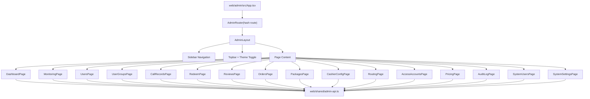

# 管理后台完全重构技术方案

> 文档版本：v1.0
>
> 创建日期：2026-06-12
>
> 需求来源：用户明确要求“根据 `web/redesign-demo` 的样式完全重构管理后台，保留并补齐现有后台真实功能”
>
> 原型来源：`/Users/fatballfish/Documents/Projects/GoProjects/Personal/pic-gallery/web/redesign-demo`
>
> 现有后台：`/Users/fatballfish/Documents/Projects/GoProjects/Personal/pic-gallery/web/admin`
>
> 关联 PRD：`/Users/fatballfish/Documents/Projects/GoProjects/Personal/pic-gallery/docs/prd/pic-gallery-prd.md`
>
> 关联技术设计：`/Users/fatballfish/Documents/Projects/GoProjects/Personal/pic-gallery/docs/tech/pic-gallery-tech-design.md`

## 0. 结论先行

本次管理后台重构不是“换皮”，而是一次以 `web/redesign-demo/src/admin` 为视觉规范、以 `web/admin/src` 真实业务能力为功能边界的完整重建。

重构必须遵守以下结论：

1. 不保留现有后台的浅色柔和网格、`Fraunces + Manrope` 管理端主题、`adminShell/adminPage/adminDataGrid` 视觉表达；全部切换为 demo 的深色工业控制台风格，并支持 demo 已实现的亮暗模式切换。
2. 不直接复制 demo 的 mock 页面数据。demo 只作为布局、密度、色彩、控件、页面气质和交互动效参考。所有业务数据必须接入现有 `adminApi` 和后端 Ops API。
3. 现有后台功能必须全部迁移，不得因为 demo 缺失页面而删除能力。
4. demo 中出现但现有后台未实现的功能必须补齐。当前明确新增 P0 功能是“系统账户管理”，需要补后端 Admin API、OpenAPI、shared 类型、adminApi 和前端页面。
5. 商业化模块从现有 `CashierPage` 单页多 Tab 拆成 demo 的三页：订单管理、套餐管理、收银台配置。三页共享同一个 cashier 数据域，但路由、页面标题、权限和验收独立。
6. 后续执行时应先建立新的设计系统组件，再逐页迁移真实业务，禁止在旧 CSS 类上叠加 demo 类名。

## 1. 需求理解

### 1.1 做什么

将 Pic Gallery 管理后台完全重构为 Gemini demo 中定义的后台视觉系统，覆盖现有后台全部运营能力，并补齐 demo 暗示但当前缺失的系统账户管理能力。

### 1.2 为什么

当前 `web/admin` 已经具备较完整的真实后台能力：用户、用户分组、兑换码、图片审核、调用记录、收银台、模型路由、接入账号、价格配置、系统配置、安全配置、审计、上线检查和系统状态。但 UI 仍是早期运营后台风格，与用户提供的 demo 在主题、布局、信息密度、导航结构和页面气质上完全不同。

用户要求后续重构执行“无误解、无偏差”，因此本方案必须把页面、功能、组件和接口契约全部固化。

### 1.3 不做什么

- 不把 `web/redesign-demo` 作为线上应用入口。
- 不迁移 demo 的 mock 数据、虚构指标、固定文案和不准确业务逻辑。
- 不删除现有真实 API 调用。
- 不在本方案阶段直接改生产代码。本文件是后续执行依据。
- 不引入新的前端状态库，除非后续实现发现现有 React state 无法承担页面复杂度。

### 1.4 确定性标注

- AI 判断：后台重构应优先复用现有 `adminApi`、`web/shared/api-types.ts`、鉴权与权限模型。
- AI 判断：系统账户管理必须补后端，否则 demo 的“系统账户”页面只能成为假页面，违反用户“demo 中尚未实现的功能要实现”的要求。
- 待人工确认：是否允许新增 `lucide-react` 作为统一图标库。若不允许，则沿用 demo 的内联 SVG，但统一封装到 `web/admin/src/ui/icons.tsx`。

## 2. 现状分析

### 2.1 现有后台页面清单

| 路由 | 文件 | 真实功能 |
|---|---|---|
| `#/overview` | `web/admin/src/pages/OverviewPage.tsx` | 运营概览、指标、最近用户、readiness 风险 |
| `#/readiness` | `web/admin/src/pages/ReadinessPage.tsx` | 上线检查、阻塞项、修复建议 |
| `#/health` | `web/admin/src/pages/HealthPage.tsx` | Provider 健康、readiness 运行结果 |
| `#/users` | `web/admin/src/pages/UsersPage.tsx` | 用户列表、筛选、创建、详情、状态、积分、密码、限额、分组 |
| `#/user-groups` | `web/admin/src/pages/UserGroupsPage.tsx` | 用户分组 CRUD、倍率、默认分组 |
| `#/redeem` | `web/admin/src/pages/RedeemPage.tsx` | 兑换码单个/批量创建、导出、状态、核销记录 |
| `#/reviews` | `web/admin/src/pages/ReviewPage.tsx` | 图片公开审核、通过、拒绝、下架 |
| `#/call-records` | `web/admin/src/pages/CallRecordsPage.tsx` | 调用记录筛选、分页、attempt 展开、错误明细 |
| `#/cashier` | `web/admin/src/pages/CashierPage.tsx` | 收银台概览、套餐、自定义金额、可见支付方式、渠道实例、订单、webhook |
| `#/routing` | `web/admin/src/pages/RoutingPage.tsx` | 路由模型、可见性、候选真实模型 |
| `#/provider-models` | `web/admin/src/pages/ProviderModelsPage.tsx` | 接入账号、账号模型、测试图片 |
| `#/pricing` | `web/admin/src/pages/PricingPage.tsx` | 路由模型价格、任务类型、质量、参考图倍率 |
| `#/audit` | `web/admin/src/pages/AuditPage.tsx` | 审计日志筛选、时间线、CSV 导出 |
| `#/config` | `web/admin/src/pages/ConfigPage.tsx` | 非敏感系统配置中心、版本、权限锁 |
| `#/security-config` | `web/admin/src/pages/SecurityConfigPage.tsx` | SMTP 安全配置、write-only 密码、测试发信 |
| `#/login` | `web/admin/src/pages/LoginPage.tsx` | 管理员登录 |

### 2.2 demo 后台页面清单

| demo 路由 | demo 文件 | 用途判断 |
|---|---|---|
| `dashboard` | `Dashboard.tsx` | 作为 `overview` 新视觉参考 |
| `monitoring` | `Monitoring.tsx` | 合并参考 `health` + `readiness` |
| `users` | `UserManagement.tsx` | 作为 `users` 新视觉参考 |
| `groups` | `GroupManagement.tsx` | 作为 `user-groups` 新视觉参考 |
| `records` | `CallRecords.tsx` | 作为 `call-records` 新视觉参考 |
| `coupons` | `CouponManagement.tsx` | 作为 `redeem` 新视觉参考 |
| `audit` | `AuditQueue.tsx` | 作为 `reviews` 新视觉参考 |
| `orders` | `OrderManagement.tsx` | 从现有 `CashierPage` 拆出订单管理 |
| `packages` | `PackageManagement.tsx` | 从现有 `CashierPage` 拆出套餐管理 |
| `cashier` | `CashierManagement.tsx` | 从现有 `CashierPage` 拆出收银台配置 |
| `route-models` | `RouteModelPage.tsx` | 作为 `routing` 新视觉参考 |
| `access-accounts` | `AccessAccountPage.tsx` | 作为 `provider-models` 新视觉参考 |
| `price-config` | `PriceConfigPage.tsx` | 作为 `pricing` 新视觉参考 |
| `logs` | `AuditLog.tsx` | 作为 `audit` 新视觉参考 |
| `system-users` | `SystemUsers.tsx` | 新增系统账户管理 |
| `settings` | `SystemSettings.tsx` | 合并参考 `config` + `security-config` |

### 2.3 关键差异

| 差异 | 现状 | demo | 重构要求 |
|---|---|---|---|
| 主题 | 浅色、低对比、柔和网格 | 深色控制台、OKLCH token、accent 高亮、支持亮色模式 | 完全采用 demo 主题 |
| 导航 | 15 个真实路由，商业化单页 | 16 个 demo 路由，商业化拆三页 | 保留真实能力，按 demo 导航重组 |
| 图标 | 基本无图标 | 导航与操作大量图标 | 所有一级导航与主要操作补图标 |
| 业务数据 | 真实 API | mock 数据 | 只用真实 API |
| 系统账户 | 有权限枚举和表，无管理页/API | 有系统账户页面 | 补后端与前端 |
| 配置 | 通用配置 + SMTP 专页 | 系统设置一页 | 重组为系统设置页的两个区块或子 Tab |
| 收银台 | 单页多 Tab | 订单、套餐、配置分离 | 拆页但复用 API |

## 3. 总体架构

### 3.1 目标前端架构



### 3.2 目标文件组织

后续实现应采用以下结构。允许保留旧文件名逐步迁移，但最终功能边界必须收敛到该结构。

```text
web/admin/src/
  App.tsx
  main.tsx
  styles.css
  types.ts
  layout/
    AdminLayout.tsx
    admin-navigation.ts
    useAdminTheme.ts
  ui/
    admin-classes.ts
    icons.tsx
    primitives.tsx
    data-grid.tsx
    forms.tsx
    dialogs.tsx
    page-shell.tsx
    status.tsx
  pages/
    LoginPage.tsx
    DashboardPage.tsx
    MonitoringPage.tsx
    UsersPage.tsx
    UserGroupsPage.tsx
    CallRecordsPage.tsx
    RedeemPage.tsx
    ReviewsPage.tsx
    OrdersPage.tsx
    PackagesPage.tsx
    CashierConfigPage.tsx
    RoutingPage.tsx
    AccessAccountsPage.tsx
    PricingPage.tsx
    AuditLogPage.tsx
    SystemUsersPage.tsx
    SystemSettingsPage.tsx
```

### 3.3 重构策略

采用“新设计系统先行、页面逐个迁移”的策略。

1. 新增 demo 风格的 `layout/` 与 `ui/` 组件，不在旧 `components.tsx` 上继续扩写。
2. 将 `web/redesign-demo/src/admin/admin-classes.ts` 的视觉 token 转成 admin 正式类名，统一放入 `web/admin/src/ui/admin-classes.ts`。
3. 将 `web/redesign-demo/src/styles.css` 中 admin 相关主题 token 迁入 `web/admin/src/styles.css`，删除当前后台主题 import：`../../shared/admin-theme.css`。可以继续 import `../../shared/base.css`。
4. `App.tsx` 保留现有 session、toast、权限控制、hash route 机制，但重命名路由并扩展新增页面。
5. 页面迁移时只复用现有页面的数据处理函数、row view helper、contract helper，不复用旧视觉类。
6. 新增系统账户 API 后再完成 `SystemUsersPage`，禁止 mock。

## 4. 路由与权限契约

### 4.1 目标路由

```ts
export type AdminRouteId =
  | 'login'
  | 'dashboard'
  | 'monitoring'
  | 'users'
  | 'user-groups'
  | 'call-records'
  | 'redeem'
  | 'reviews'
  | 'orders'
  | 'packages'
  | 'cashier-config'
  | 'routing'
  | 'access-accounts'
  | 'pricing'
  | 'audit'
  | 'system-users'
  | 'system-settings'
```

### 4.2 旧路由兼容跳转

重构后必须兼容旧 hash，避免已保存链接失效。

```ts
const routeAliases: Record<string, AdminRouteId> = {
  overview: 'dashboard',
  health: 'monitoring',
  readiness: 'monitoring',
  'provider-models': 'access-accounts',
  cashier: 'cashier-config',
  config: 'system-settings',
  'security-config': 'system-settings',
}

function normalizeRoute(hash: string): AdminRouteId {
  const raw = hash.replace(/^#\/?/, '').split('?')[0].replace(/^\/+|\/+$/g, '')
  if (raw === 'login') return 'login'
  return routeAliases[raw] ?? (protectedRoutes.includes(raw as AdminRouteId) ? raw as AdminRouteId : 'dashboard')
}
```

### 4.3 权限矩阵

| 路由 | 权限 |
|---|---|
| `dashboard` | `read:all` |
| `monitoring` | `read:all` |
| `users` | `manage:users` |
| `user-groups` | `manage:users` |
| `call-records` | `read:all` |
| `redeem` | `manage:billing` |
| `reviews` | `manage:reviews` |
| `orders` | `manage:cashier` |
| `packages` | `manage:cashier` |
| `cashier-config` | `manage:cashier` |
| `routing` | `manage:models` |
| `access-accounts` | `manage:models` |
| `pricing` | `manage:models` |
| `audit` | `view:audit` |
| `system-users` | `manage:admins` |
| `system-settings` | 普通配置区 `manage:config`；安全配置区 `manage:dangerous_config` |

### 4.4 导航定义

```ts
export const adminNavGroups: AdminNavGroup[] = [
  {
    label: '概览 / Overview',
    items: [
      { id: 'dashboard', label: '运营大盘', icon: ChartIcon },
      { id: 'monitoring', label: '运维监控', icon: ActivityIcon },
    ],
  },
  {
    label: '业务管理 / Business',
    items: [
      { id: 'users', label: '用户管理', icon: UsersIcon },
      { id: 'user-groups', label: '用户分组', icon: GroupIcon },
      { id: 'call-records', label: '调用记录', icon: ListIcon },
      { id: 'redeem', label: '兑换码', icon: TicketIcon },
      { id: 'reviews', label: '审核队列', icon: ShieldIcon, badgeKey: 'review_count' },
    ],
  },
  {
    label: '商业化 / Commercial',
    items: [
      { id: 'orders', label: '订单管理', icon: CreditCardIcon },
      { id: 'packages', label: '套餐管理', icon: BoxIcon },
      { id: 'cashier-config', label: '收银台配置', icon: LayoutIcon },
    ],
  },
  {
    label: '路由与模型 / Models',
    items: [
      { id: 'routing', label: '路由模型', icon: ZapIcon },
      { id: 'access-accounts', label: '接入账号', icon: CloudIcon },
      { id: 'pricing', label: '价格配置', icon: CoinsIcon },
    ],
  },
  {
    label: '系统 / System',
    items: [
      { id: 'audit', label: '审计日志', icon: FileTextIcon },
      { id: 'system-users', label: '系统账户', icon: SystemUserIcon },
      { id: 'system-settings', label: '系统设置', icon: SettingsIcon },
    ],
  },
]
```

## 5. 视觉系统方案

### 5.1 主题 token

正式后台必须迁移 demo 的 token 语义，统一由 `data-theme` 或 `.theme-light` 控制。

```css
:root {
  --admin-bg: oklch(12% 0.015 260);
  --admin-surface: oklch(16% 0.02 260);
  --admin-fg: oklch(95% 0.01 80);
  --admin-muted: oklch(90% 0.01 80 / 0.68);
  --admin-border: oklch(100% 0 0 / 0.1);
  --admin-accent: oklch(70% 0.12 75);
  --admin-accent-coral: oklch(65% 0.14 45);
  --admin-accent-purple: oklch(60% 0.18 275);
  --admin-accent-emerald: oklch(75% 0.15 165);
  --admin-font-body: 'Manrope', system-ui, sans-serif;
  --admin-font-mono: 'JetBrains Mono', monospace;
  --admin-sidebar-width: 18rem;
  --admin-topbar-height: 5rem;
}

[data-theme='light'] {
  --admin-bg: oklch(96% 0.012 88);
  --admin-surface: oklch(99% 0.004 95);
  --admin-fg: oklch(19% 0.018 255);
  --admin-muted: oklch(42% 0.02 255 / 0.72);
  --admin-border: oklch(30% 0.018 255 / 0.12);
  --admin-accent: oklch(58% 0.13 72);
  --admin-accent-coral: oklch(61% 0.14 42);
  --admin-accent-purple: oklch(50% 0.15 276);
  --admin-accent-emerald: oklch(55% 0.13 160);
}
```

### 5.2 页面密度规范

| 元素 | 规范 |
|---|---|
| 主背景 | `#050505` 近黑 + 顶部微弱 radial highlight |
| Sidebar | 宽 `18rem`，`#0a0a0a`，右边框 `white/5` |
| Topbar | 高 `5rem`，半透明深色，backdrop blur |
| 内容区 | `p-10`，`space-y-10`，滚动在主内容区内 |
| 卡片 | `rounded-3xl border border-white/5 bg-white/[0.02]` |
| 表格 | `rounded-3xl` 外框，表头 `text-white/30`，行 hover `bg-white/[0.02]` |
| 弹窗 | 居中，最大高 `90vh`，深色表面，背景 `black/60` |
| 主按钮 | `bg-[var(--admin-accent)] text-white rounded-xl shadow` |
| 危险按钮 | `rose-500` 系列，不用旧红色 token |

### 5.3 亮暗模式

主题状态必须持久化到 localStorage，key 使用正式命名，不能继续使用 demo key。

```ts
const adminThemeKey = 'pic_gallery_admin_theme'

export function useAdminTheme() {
  const [theme, setTheme] = useState<'dark' | 'light'>(() => {
    return window.localStorage.getItem(adminThemeKey) === 'light' ? 'light' : 'dark'
  })

  useEffect(() => {
    window.localStorage.setItem(adminThemeKey, theme)
    document.documentElement.dataset.adminTheme = theme
  }, [theme])

  return {
    theme,
    nextTheme: theme === 'dark' ? 'light' : 'dark',
    toggleTheme: () => setTheme((current) => current === 'dark' ? 'light' : 'dark'),
  }
}
```

### 5.4 响应式规范

- 桌面端保持 demo 的固定 sidebar + topbar。
- `max-width: 920px` 时 sidebar 改为横向滚动导航，topbar 自动换行。
- 表格统一横向滚动，不压缩关键列到不可读。
- 所有弹窗在移动端宽度为 `calc(100vw - 2rem)`。

## 6. 通用组件契约

### 6.1 `AdminLayout`

职责：导航、标题、面包屑、系统状态、主题切换、管理员信息、退出登录。

```tsx
type AdminLayoutProps = {
  route: ProtectedAdminRouteId
  title: string
  session: AdminSession
  badges: {
    review_count: number
    failed_webhook_count: number
    config_drafts: number
  }
  systemStatus: {
    online: boolean
    primaryProvider?: string
    queuePressure?: string
  }
  onNavigate(route: AdminRouteId): void
  onLogout(): void
  children: React.ReactNode
}

function AdminLayout(props: AdminLayoutProps) {
  const theme = useAdminTheme()
  const visibleNav = filterAdminNavGroups(adminNavGroups, props.session)

  return (
    <div className={admin.layout} data-theme={theme.theme}>
      <Sidebar nav={visibleNav} active={props.route} onNavigate={props.onNavigate} badges={props.badges} />
      <main className={admin.main}>
        <Topbar title={props.title} session={props.session} status={props.systemStatus} onThemeToggle={theme.toggleTheme} onLogout={props.onLogout} />
        <section className={admin.content}>{props.children}</section>
      </main>
    </div>
  )
}
```

### 6.2 `PageSection`

用于页面二级区块，不允许嵌套卡片套卡片。

```tsx
type PageSectionProps = {
  title: string
  eyebrow?: string
  actions?: React.ReactNode
  children: React.ReactNode
}

function PageSection({ title, eyebrow, actions, children }: PageSectionProps) {
  return (
    <section>
      <div className={admin.sectionHeader}>
        <h2>{title}</h2>
        {eyebrow ? <span>{eyebrow}</span> : null}
        {actions}
      </div>
      {children}
    </section>
  )
}
```

### 6.3 `StatCard`

```tsx
type StatCardProps = {
  label: string
  value: string | number
  trend?: string
  tone?: 'positive' | 'negative' | 'neutral' | 'warning'
  sparkline?: number[]
}
```

使用场景：运营大盘、订单管理、监控、用户分组、收银台风险指标。

### 6.4 `AdminTable`

所有列表页统一使用该组件表达 demo 表格风格。

```tsx
type AdminColumn<T> = {
  key: string
  title: string
  width?: string
  align?: 'left' | 'right' | 'center'
  render(row: T): React.ReactNode
}

type AdminTableProps<T> = {
  columns: AdminColumn<T>[]
  rows: T[]
  rowKey(row: T): string
  loading?: boolean
  emptyText?: string
  expandedRowKey?: string | null
  renderExpanded?(row: T): React.ReactNode
}
```

### 6.5 `Modal` / `ConfirmModal`

以 demo `components/ui.tsx` 为准，但改为强类型。

```tsx
type ModalProps = {
  open: boolean
  title: string
  size?: 'sm' | 'md' | 'lg' | 'xl'
  onClose(): void
  footer?: React.ReactNode
  children: React.ReactNode
}

type ConfirmModalProps = {
  open: boolean
  title: string
  message: React.ReactNode
  confirmText?: string
  tone?: 'primary' | 'danger' | 'success'
  loading?: boolean
  onCancel(): void
  onConfirm(): void
}
```

### 6.6 `FilterBar`

用于用户、调用记录、订单、兑换码、审计。

```tsx
type FilterBarProps = {
  children: React.ReactNode
  onSubmit(event: React.FormEvent): void
  onReset(): void
  submitting?: boolean
}
```

### 6.7 `StatusBadge`

```tsx
type BadgeTone = 'success' | 'warning' | 'danger' | 'info' | 'neutral'

function StatusBadge({ tone, children }: { tone: BadgeTone; children: React.ReactNode }) {
  const className = {
    success: admin.badgeSuccess,
    warning: admin.badgeWarning,
    danger: admin.badgeError,
    info: admin.badgeInfo,
    neutral: admin.badgeNeutral,
  }[tone]
  return <span className={cn(admin.badge, className)}>{children}</span>
}
```

### 6.8 `AsyncBoundary`

所有真实 API 页面必须有统一 loading、error、empty。

```tsx
function AsyncBoundary<T>({
  state,
  children,
  onRetry,
}: {
  state: { loading: boolean; error: string | null; data?: T | null }
  children: React.ReactNode
  onRetry(): void
}) {
  if (state.loading) return <FullPageLoader text="Loading admin data..." />
  if (state.error) return <ErrorState message={state.error} onRetry={onRetry} />
  return <>{children}</>
}
```

## 7. 每页重构方案

### 7.1 登录页 `LoginPage`

参考 demo 风格：深色背景、品牌 orb、简洁表单、状态错误内联展示。

必须保留：

- `adminApi.login(email, password)`
- env 默认账号填充：`VITE_ADMIN_EMAIL` / `VITE_ADMIN_PASSWORD` 现有逻辑
- `adminLoginValidation`
- 错误提示
- busy 状态

目标布局：

```tsx
function LoginPage({ onLogin }: { onLogin(session: AdminSession): void }) {
  return (
    <main className={adminLogin.root}>
      <section className={adminLogin.panel}>
        <BrandMark label="Pic Gallery Admin" />
        <form onSubmit={submit}>
          <Field label="管理员邮箱" error={emailError}>
            <TextInput value={email} onChange={setEmail} autoComplete="email" />
          </Field>
          <Field label="密码" error={passwordError}>
            <PasswordInput value={password} onChange={setPassword} autoComplete="current-password" />
          </Field>
          <Button type="submit" loading={busy} disabled={Boolean(emailError || passwordError)}>
            登录后台
          </Button>
        </form>
      </section>
    </main>
  )
}
```

验收：

- 登录成功写入 `sessionStorage[pic_gallery_admin_session]`。
- 登录失败不跳转，显示真实 API 错误。
- 亮暗模式不影响登录页可读性。

### 7.2 运营大盘 `DashboardPage`

来源：

- 现有：`OverviewPage`
- demo：`Dashboard`
- API：`adminApi.dashboard()`、`adminApi.listUsers()`、`adminApi.getReadiness()`

页面功能：

1. 顶部 4 张指标卡：从 `dashboard.metrics` 映射。
2. 今日商业化指标：从 `dashboard.operations` 映射。
3. Provider 健康摘要：从 `dashboard.providers` 映射。
4. 待处理队列：从 `dashboard.queue` 映射。
5. 最近用户：从 `listUsers('', 1, 5)` 或现有 `listUsers()` 映射。
6. Readiness 风险：从 `getReadiness()` 映射。
7. 最近审计：从 `dashboard.audit` 映射。

伪代码：

```tsx
async function loadDashboard() {
  const [dashboard, usersPage, readiness] = await Promise.all([
    adminApi.dashboard(),
    adminApi.listUsersPage('', 1, 5),
    adminApi.getReadiness(),
  ])

  return {
    metrics: dashboard.metrics,
    operations: dashboard.operations,
    providers: dashboard.providers,
    queue: dashboard.queue,
    audit: dashboard.audit,
    recentUsers: usersPage.items,
    readiness,
  }
}
```

布局：

- `StatCardGrid`：4 列，移动端 1 列。
- `PageSection("模型调用")`：类似 demo `ModelStat`，但数据来自 providers + call metrics。
- `PageSection("待处理事项")`：readiness fail/warn、待审核、failed webhook。
- `PageSection("最近用户")`：真实用户，不显示 demo 假人名。

验收：

- 没有任何 hardcoded mock 数字，除非真实 API 字段为空且显示 `--`。
- readiness fail 必须可点击跳转到 `monitoring?tab=readiness`。

### 7.3 运维监控 `MonitoringPage`

来源：

- 现有：`HealthPage` + `ReadinessPage`
- demo：`Monitoring`
- API：`adminApi.dashboard()`、`adminApi.getReadiness()`

页面功能：

1. `tab=health`：Provider/模型账号健康、延迟、错误率。
2. `tab=readiness`：上线检查项。
3. `tab=queue`：任务队列/运营队列。若后端暂无专门 API，使用 `dashboard.queue`。

伪代码：

```tsx
type MonitoringTab = 'health' | 'readiness' | 'queue'

function MonitoringPage() {
  const [tab, setTab] = useQueryState('tab', 'health')
  const data = useAdminAsync(loadMonitoring)

  return (
    <>
      <MetricStrip items={monitoringSummary(data)} />
      <SegmentedTabs value={tab} onChange={setTab} items={tabs} />
      {tab === 'health' && <ProviderHealthGrid providers={data.providers} />}
      {tab === 'readiness' && <ReadinessTable checks={data.readiness.checks} />}
      {tab === 'queue' && <QueuePanel items={data.queue} />}
    </>
  )
}
```

验收：

- `readiness` 原页面功能完整保留：status、blocking、summary/detail、fix action。
- `health` 原页面功能完整保留：provider 状态和 readiness run rows。

### 7.4 用户管理 `UsersPage`

来源：

- 现有：`UsersPage`
- demo：`UserManagement`
- API：用户相关 `adminApi`

必须保留功能：

- 用户分页列表
- query/status/group/sort 筛选
- 创建用户
- 删除用户
- 启用/禁用/关闭用户
- 重置密码
- 调整积分，含 reason 与 idempotency key
- 更新 RPM/并发限制
- 分配单个或多个用户组
- 用户详情抽屉：余额桶、积分流水、订单、任务、API Key

目标交互：

- 列表沿用 demo 表格样式。
- “新增用户”使用 `Modal`。
- “用户详情”使用右侧 drawer 或大 modal，视觉统一深色。
- 危险操作全部用 `ConfirmModal`。

核心状态机：

```ts
type UserAction =
  | { type: 'create'; draft: AdminUserCreateRequest }
  | { type: 'status'; user: AdminUser; status: string }
  | { type: 'points'; user: AdminUser; change_points: string; reason: string }
  | { type: 'reset-password'; user: AdminUser; new_password: string }
  | { type: 'limits'; user: AdminUser; rpm_limit: number; concurrency_limit: number }
  | { type: 'groups'; user: AdminUser; group_ids: ID[] }
  | { type: 'delete'; user: AdminUser }
```

保存契约：

```ts
async function saveUserAction(action: UserAction) {
  switch (action.type) {
    case 'create':
      return adminApi.createUser(action.draft)
    case 'status':
      return adminApi.updateUserStatus(action.user.id, action.status)
    case 'points':
      return adminApi.adjustUserPoints(
        action.user.id,
        action.change_points,
        action.reason,
        `admin-user-points-${action.user.id}-${Date.now()}`,
      )
    case 'reset-password':
      return adminApi.resetUserPassword(action.user.id, action.new_password)
    case 'limits':
      return adminApi.updateUserLimits(action.user.id, action.rpm_limit, action.concurrency_limit)
    case 'groups':
      return adminApi.assignUserGroups(action.user.id, action.group_ids)
    case 'delete':
      return adminApi.deleteUser(action.user.id)
  }
}
```

验收：

- 详情中的每个数据区块没有数据时显示空态，不隐藏区块标题。
- 积分调整必须要求 reason 非空。
- 删除用户前二次确认。

### 7.5 用户分组 `UserGroupsPage`

来源：

- 现有：`UserGroupsPage`
- demo：`GroupManagement`
- API：`listUserGroups/createUserGroup/updateUserGroup/deleteUserGroup`

必须保留：

- 分组编码、名称、倍率、状态、排序、默认分组、描述。
- 创建、编辑、删除。

目标布局：

- 顶部统计：总分组、启用分组、默认分组、最高倍率。
- 表格行可展开显示描述和适用路由数量。若后端暂无路由数量，前端可通过 `listRouteModels` 计算 `route.groups` 引用数。

伪代码：

```ts
async function loadGroupsPage() {
  const [groups, routes] = await Promise.all([
    adminApi.listUserGroups(),
    adminApi.listRouteModels({ page_size: 100 }),
  ])

  return {
    groups,
    routeUsage: countRouteUsageByGroup(groups, routes),
  }
}
```

验收：

- 删除默认分组必须禁用按钮或后端返回错误后清晰提示。
- 倍率输入保留 5 位小数展示能力。

### 7.6 调用记录 `CallRecordsPage`

来源：

- 现有：`CallRecordsPage`
- demo：`CallRecords`
- API：`adminApi.listCallRecords(query)`

必须保留：

- page/page_size
- user_id、task_id、status、task_type、provider、date range 筛选
- 展开 attempt 明细
- 展示 account_model_id、model_account_id、upstream_model_code、error_detail
- 任务 ID、用户 ID、来源渠道、积分、成本、毛利、延迟

目标布局：

- 顶部 `TimePill` 快捷时间筛选：今天、7 天、30 天。
- 顶部统计卡：总调用、成功率、平均延迟、错误数。若后端仅返回列表，则按当前页计算并标注为“当前页”。
- 分布卡：按 provider、status、task_type 聚合当前页。
- 主表格：可展开行。

伪代码：

```ts
function callRecordQuery(filters: CallRecordFilters, page: number) {
  return {
    page,
    page_size: 20,
    user_id: filters.user_id || undefined,
    task_id: filters.task_id || undefined,
    status: filters.status || undefined,
    task_type: filters.task_type || undefined,
    provider: filters.provider || undefined,
    created_from: filters.created_from || undefined,
    created_to: filters.created_to || undefined,
  }
}
```

验收：

- 错误详情 JSON 使用 `pre` 或 code viewer，不能挤压表格列。
- attempt 没有数据时显示“暂无底层尝试记录”。

### 7.7 兑换码 `RedeemPage`

来源：

- 现有：`RedeemPage`
- demo：`CouponManagement`
- API：兑换码相关 `adminApi`

必须保留：

- 单码创建
- 批量创建
- 批量后自动导出
- 全量导出
- 状态变更
- 核销记录查看
- 分页

目标布局：

- 顶部操作区拆成两个卡片：单个兑换码、批量生成。
- 主列表按 demo Coupon Row 风格展示。
- 核销记录用 modal table。

伪代码：

```ts
async function batchCreateAndExport(draft: BatchRedeemDraft) {
  const result = await adminApi.batchCreateRedeemCodes(redeemBatchCreatePayload(draft))
  const exported = await adminApi.exportRedeemCodes({ batch_id: result.batch_id })
  downloadCodes(exported.items, result.batch_id)
  return result
}
```

验收：

- CSV 导出保留 BOM，Excel 打开中文不乱码。
- 批量 count、valid_days、max_redemptions 必须有前端校验。

### 7.8 审核队列 `ReviewsPage`

来源：

- 现有：`ReviewPage`
- demo：`AuditQueue`
- API：`listReviews`、`imageReviewUrl`、`decideReview`

必须保留：

- status 筛选：pending/all/approved/rejected/unpublished。
- 审核图片展示使用 access token query。
- 通过、拒绝、下架。
- 拒绝和下架必须填写原因。

目标布局：

- 使用 demo 的审核卡片流，每张卡片包含缩略图、用户、任务类型、prompt 摘要、状态、时间、操作。
- 点击图片打开预览 modal。
- 操作使用 confirm modal。

伪代码：

```ts
async function submitReviewDecision(decision: ReviewDecision) {
  if ((decision.type === 'reject' || decision.type === 'unpublish') && !decision.reason.trim()) {
    throw new Error('请填写原因')
  }
  return adminApi.decideReview(decision.image_id, decision.type, decision.reason)
}
```

验收：

- `pending_review` 是默认筛选。
- 审核成功后当前行状态更新，不强制整页闪烁。

### 7.9 订单管理 `OrdersPage`

来源：

- 从现有 `CashierPage` 拆出 orders/events/overview 部分
- demo：`OrderManagement`
- API：`getCashierOverview`、`listPaymentOrders`、`getPaymentOrder`、订单操作、`listPaymentWebhookEvents`、`retryPaymentWebhookEvent`

必须实现：

- 订单概览
- 订单列表筛选：order_no、user_id、status、visible_method、purchase_type
- 订单详情
- 手动完成
- 关闭订单
- 退款
- 扣回/chargeback，带 idempotency key
- 同步渠道状态
- webhook 事件列表
- webhook 重试

目标 tab：

```ts
type OrdersTab = 'overview' | 'orders' | 'webhooks'
```

伪代码：

```tsx
function OrdersPage({ onFeedback }: PageProps) {
  const [tab, setTab] = useState<OrdersTab>('overview')
  const orders = usePagedOrders(orderFilters)
  const webhooks = usePagedWebhookEvents()

  return (
    <>
      <FinancialOverview data={overview} />
      <SegmentedTabs value={tab} onChange={setTab} />
      {tab === 'overview' && <OrderAnalytics overview={overview} orders={orders.currentPageItems} />}
      {tab === 'orders' && <OrdersTable rows={orders.items} actions={orderActions} />}
      {tab === 'webhooks' && <WebhookEventsTable rows={webhooks.items} onRetry={retryWebhook} />}
    </>
  )
}
```

验收：

- 所有写操作沿用现有 API 与错误提示。
- `chargebackPaymentOrder` 必须继续传 `Idempotency-Key`。
- 手动完成、退款、扣回都必须二次确认。

### 7.10 套餐管理 `PackagesPage`

来源：

- 从现有 `CashierPage` 拆出 plans/custom amount/trial config
- demo：`PackageManagement`
- API：`listCashierPlans/create/update/delete`、`get/updateCashierCustomAmountConfig`、`list/updateConfigTabs` 读取 signup trial

必须实现：

- 套餐列表
- 新增/编辑/删除套餐
- 购买开关
- 套餐类型 `points_package` / `subscription`
- 价格、积分、赠送积分、周期、排序
- 自定义金额配置
- 新用户试用积分配置

目标布局：

- `PlanCardGrid` 展示启用套餐。
- `AdminTable` 展示完整套餐。
- 右侧或底部 `CustomAmountPanel`、`TrialGrantPanel`。

保存套餐契约：

```ts
function cashierPlanSavePayload(draft: PlanDraft): Partial<CashierPlan> {
  return {
    plan_code: draft.plan_code.trim(),
    plan_name: draft.plan_name.trim(),
    plan_type: draft.plan_type,
    purchase_enabled: draft.purchase_enabled,
    price_cny: normalizeDecimal(draft.price_cny, 2),
    points: normalizeDecimal(draft.points, 5),
    bonus_points: normalizeDecimal(draft.bonus_points, 5),
    duration_days: Number(draft.duration_days),
    currency: 'CNY',
    sort_order: Number(draft.sort_order),
    status: draft.status,
    description: draft.description.trim(),
  }
}
```

验收：

- 删除套餐前提示可能影响用户端购买入口。
- 自定义金额 min <= max。
- `cny_per_point` 不允许小于等于 0。

### 7.11 收银台配置 `CashierConfigPage`

来源：

- 从现有 `CashierPage` 拆出 visible methods/provider instances/risk overview
- demo：`CashierManagement`
- API：`getCashierOverview`、`list/updatePaymentVisibleMethods`、`list/create/update/deletePaymentProviderInstances`

必须实现：

- 可见支付方式维护
- 支付方式排序、开启、来源 provider type、调度策略、描述
- 支付渠道实例 CRUD
- 支付实例 write-only secret 语义：非敏感 config + secrets + clear_secrets
- provider structured fields
- 风险指标：mock enabled、failed webhook、pending orders、enabled methods

渠道实例保存契约：

```ts
async function saveProviderInstance(draft: InstanceDraft) {
  const parsedConfig = parseConfigText(draft.config_text)
  const explicitSecrets = parseOptionalConfigText(draft.secrets_text)
  const { config, secrets: extractedSecrets } = splitProviderConfigSecrets(parsedConfig)

  const payload: PaymentProviderInstanceWriteRequest = {
    provider_type: draft.provider_type,
    name: draft.name.trim(),
    enabled: draft.enabled,
    supported_methods: draft.supported_methods,
    sort_order: Number(draft.sort_order),
    scheduler_weight: Number(draft.scheduler_weight),
    limits: parseLimits(draft),
    config,
    secrets: { ...extractedSecrets, ...explicitSecrets },
    clear_secrets: parseSecretFieldList(draft.clear_secrets_text),
  }

  return draft.id
    ? adminApi.updatePaymentProviderInstance(draft.id, payload)
    : adminApi.createPaymentProviderInstance(payload)
}
```

验收：

- GET 响应里的 secret 不得回填到 secrets textarea。
- clear secret 操作必须二次确认。
- 支付方式与 provider type 不兼容时前端阻止保存。

### 7.12 路由模型 `RoutingPage`

来源：

- 现有：`RoutingPage`
- demo：`RouteModelPage`
- API：route model + candidate 相关 `adminApi`

必须保留：

- route model CRUD
- code/name/description/visibility/enabled/sort_order/group_ids
- candidate CRUD
- account_model_id/priority/weight/fallback_order/enabled
- 加载用户分组和接入账号模型作为选择项

目标交互：

- 路由模型表格行可展开，显示候选模型表格。
- 新增路由和编辑路由使用 modal。
- 新增候选和编辑候选使用 modal。

伪代码：

```ts
async function loadRoutingPage() {
  const [routes, groups, accounts] = await Promise.all([
    adminApi.listRouteModels({ page_size: 100 }),
    adminApi.listUserGroups(),
    adminApi.listModelAccountsPage({ page_size: 100 }),
  ])

  const accountModels = flatten(await Promise.all(
    accounts.items.map((account) => adminApi.listModelAccountModels(account.id)),
  ))

  const candidates = Object.fromEntries(await Promise.all(
    routes.map(async (route) => [String(route.id), await adminApi.listRouteModelCandidates(route.id)] as const),
  ))

  return { routes, groups, accountModels, candidates }
}
```

验收：

- `visibility='groups'` 时至少选择一个 group。
- candidate 权重、优先级、fallback 必须是正数或非负数，遵守现有校验。

### 7.13 接入账号 `AccessAccountsPage`

来源：

- 现有：`ProviderModelsPage`
- demo：`AccessAccountPage`
- API：model account/model/test image

必须保留：

- 账号 CRUD
- adapter_type/auth_type/base_url/api_key/status/priority/weight/concurrency_limit/timeout_ms/source_mode
- 账号下模型 CRUD
- model_code/display_name/task_types/qualities/cost_per_image/currency/enabled
- 测试生图，展示 result image
- API Key write-only，不回显明文

目标布局：

- 左侧账号列表或主表格行展开。
- 展开后显示模型列表。
- 测试图片使用 modal：prompt、model、source_mode。

保存账号契约：

```ts
function modelAccountPayload(draft: AccountDraft): ModelAccountWriteRequest {
  return {
    name: draft.name.trim(),
    adapter_type: draft.adapterType,
    auth_type: draft.authType,
    base_url: draft.baseUrl.trim(),
    credentials: draft.apiKey.trim() ? { api_key: draft.apiKey.trim() } : undefined,
    priority: Number(draft.priority),
    weight: Number(draft.weight),
    concurrency_limit: Number(draft.concurrencyLimit),
    timeout_ms: Number(draft.timeoutMS),
    status: draft.status,
    extra: { source_mode: draft.sourceMode },
  }
}
```

验收：

- 编辑已有账号时 API Key 输入为空表示保留旧 key。
- 测试图片失败显示 provider_request_id 或 request_id。

### 7.14 价格配置 `PricingPage`

来源：

- 现有：`PricingPage`
- demo：`PriceConfigPage`
- API：route model prices

必须保留：

- 按 route_model、task_type、quality 配置价格。
- base_points、reference_multiplier、enabled。
- 新增、编辑。
- 删除如后端支持则保留；现有 `adminApi.deleteRouteModelPrice` 已存在。

目标布局：

- 按 route model + task type 聚合成可展开行，参考 demo `AggregatedPriceRow`。
- 展开后显示 quality 价格明细。
- 编辑单个 quality 价格使用 modal。

聚合契约：

```ts
type AggregatedPriceGroup = {
  route_model_id: ID
  route_model_name: string
  task_type: ImageTaskType
  qualities: RouteModelPrice[]
}

function groupPrices(routes: RouteModel[], prices: RouteModelPrice[]): AggregatedPriceGroup[] {
  return routes.flatMap((route) => {
    const byTask = groupBy(
      prices.filter((price) => String(price.route_model_id) === String(route.id)),
      (price) => price.task_type,
    )
    return Object.entries(byTask).map(([task_type, qualities]) => ({
      route_model_id: route.id,
      route_model_name: route.name,
      task_type: task_type as ImageTaskType,
      qualities,
    }))
  })
}
```

验收：

- base_points 使用 5 位小数输入。
- reference_multiplier 默认 `1.00000`。
- disabled price 必须视觉弱化。

### 7.15 审计日志 `AuditLogPage`

来源：

- 现有：`AuditPage`
- demo：`AuditLog`
- API：`adminApi.listAudit`

必须保留：

- query/action 筛选。
- action options 根据 rows 推导。
- CSV 导出。
- 时间线展示。
- metadata 展示。

目标布局：

- 左侧或顶部筛选。
- 主区域使用时间线卡片流，不强制表格。
- 支持“导出当前筛选结果”。

伪代码：

```ts
function auditSearchText(row: AuditLog) {
  return [
    row.actor,
    row.action,
    row.target,
    row.detail,
    row.actor_type,
    row.target_type,
    row.ip_addr,
  ].filter(Boolean).join(' ').toLowerCase()
}
```

验收：

- 导出内容必须与当前可见 rows 一致。
- metadata 不得丢失，可折叠展示。

### 7.16 系统账户 `SystemUsersPage`

来源：

- demo：`SystemUsers`
- 现有：仅有 `admin_users` 表、登录 API、`manage:admins` 权限，无管理 API 和前端页面。

这是本次重构必须新增的功能。

前端功能：

- 管理员账户列表。
- 创建管理员。
- 修改角色。
- 启用/禁用。
- 重置密码。
- 删除管理员。
- 展示最近更新时间。若后端没有 last_login_at，本期不展示 last login，不使用 demo 假字段。

后端新增 API：

| 方法 | 路径 | 权限 | 说明 |
|---|---|---|---|
| `GET` | `/api/ops/admin/v1/admin-users` | `manage:admins` | 管理员列表 |
| `POST` | `/api/ops/admin/v1/admin-users` | `manage:admins` | 创建管理员 |
| `PUT` | `/api/ops/admin/v1/admin-users/{admin_id}` | `manage:admins` | 更新角色/状态 |
| `POST` | `/api/ops/admin/v1/admin-users/{admin_id}/reset-password` | `manage:admins` | 重置密码 |
| `DELETE` | `/api/ops/admin/v1/admin-users/{admin_id}` | `manage:admins` | 删除管理员 |

shared 类型：

```ts
export type SystemAdminUser = {
  id: ID
  email: string
  role: AdminRole
  status: 'active' | 'disabled' | string
  created_at: string
  updated_at: string
}

export type SystemAdminUserCreateRequest = {
  email: string
  password: string
  role: AdminRole
  status?: string
}

export type SystemAdminUserUpdateRequest = {
  role?: AdminRole
  status?: string
}

export type SystemAdminPasswordResetRequest = {
  new_password: string
}
```

adminApi 契约：

```ts
systemAdmins: {
  list: async (query?: PageQuery): Promise<PageResult<SystemAdminUser>> =>
    normalizePage(await sharedApiClient.request(API_PATHS.ops.adminUsers, { query })),
  create: (input: SystemAdminUserCreateRequest) =>
    sharedApiClient.request<SystemAdminUser>(API_PATHS.ops.adminUsers, { method: 'POST', body: input }),
  update: (admin_id: ID, input: SystemAdminUserUpdateRequest) =>
    sharedApiClient.request<SystemAdminUser>(API_PATHS.ops.adminUserDetail, { method: 'PUT', pathParams: { admin_id }, body: input }),
  resetPassword: (admin_id: ID, new_password: string) =>
    sharedApiClient.request<void>(API_PATHS.ops.adminUserResetPassword, { method: 'POST', pathParams: { admin_id }, body: { new_password } }),
  delete: (admin_id: ID) =>
    sharedApiClient.request<void>(API_PATHS.ops.adminUserDetail, { method: 'DELETE', pathParams: { admin_id } }),
}
```

后端领域契约：

```go
type AdminUserListRequest struct {
    Query string
    Role string
    Status string
    Page int
    PageSize int
}

type AdminUserWriteRequest struct {
    Email string
    Password string
    Role string
    Status string
}

type AdminUserUpdateRequest struct {
    Role *string
    Status *string
}
```

安全约束：

- 禁止删除或禁用当前登录管理员自己。
- 禁止最后一个 active `super_admin` 被降级、禁用或删除。
- 只有 `super_admin` 拥有 `manage:admins`。
- 创建/重置密码使用现有 `adminauth.HashPassword`。
- 所有操作写审计日志，不能记录密码。

验收：

- 普通 `admin` 看不到系统账户菜单。
- `super_admin` 可以创建另一个 admin。
- 禁用账号后该账号旧 token 下次请求失效，因为 `ParseAccessToken` 会读取 DB 并校验 status。

### 7.17 系统设置 `SystemSettingsPage`

来源：

- 现有：`ConfigPage` + `SecurityConfigPage`
- demo：`SystemSettings`
- API：`listConfig/listConfigTabs/updateConfigTab`、SMTP API

目标结构：

```ts
type SystemSettingsTab =
  | 'general-config'
  | 'generation'
  | 'billing'
  | 'gallery'
  | 'security'
  | 'smtp'
```

映射规则：

- `general-config/generation/billing/gallery/security` 来自 `ConfigTab`。
- `smtp` 来自 `SecurityConfigPage`。
- 危险配置区根据 `configPermission(tab)` 和 `manage:dangerous_config` 锁定。

必须保留：

- config drafts
- conflict validation
- version save
- revert
- `StructuredListField`
- `MapField`
- SMTP enabled/host/port/username/from/starttls/insecure_skip_verify
- SMTP password write-only，留空保留，勾选清空才清空
- SMTP 测试发信

保存配置契约：

```ts
async function saveActiveConfigTab(tab: ConfigTab, drafts: DraftMap) {
  return adminApi.updateConfigTab(tab.tab_key, {
    version: tab.version,
    items: tab.items.map((item) => ({
      config_category: item.config_category ?? item.tab,
      config_key: item.config_key ?? item.key,
      config_value: drafts[draftId(item)] as Record<string, unknown>,
      scope: item.scope ?? 'global',
    })),
  })
}
```

SMTP 保存契约：

```ts
function smtpPayloadFromDraft(draft: SMTPDraft, current: SMTPConfigView): SMTPConfigWriteRequest {
  return {
    version: current.version,
    enabled: draft.enabled,
    host: draft.host.trim(),
    port: Number(draft.port),
    username: draft.username.trim(),
    from: draft.from.trim(),
    starttls: draft.starttls,
    insecure_skip_verify: draft.insecure_skip_verify,
    secrets: draft.password.trim() ? { password: draft.password.trim() } : undefined,
    clear_secrets: draft.clear_password ? ['password'] : undefined,
  }
}
```

验收：

- SMTP password 永不从 API 响应回填。
- 没有 `manage:dangerous_config` 时 SMTP 保存按钮禁用。
- 普通配置校验错误阻止保存。

## 8. 新增系统账户后端方案

### 8.1 代码改动范围

| 层 | 文件 |
|---|---|
| Domain | `internal/domain/adminauth/types.go` 或新增 `internal/domain/adminaccount/types.go` |
| Service | 扩展 `internal/service/adminauth` 或新增 `internal/service/adminaccount` |
| Store | 扩展 `internal/service/adminauth/store.go`、`internal/repository/entstore/admin_auth_store.go` |
| Handler | `internal/http/handlers/api.go` |
| Router | `internal/http/router/router.go` |
| OpenAPI | `api/openapi/openapi.yaml`、`api/openapi/components/schemas/admin.yaml` |
| Tests | `internal/http/router/admin_accounts_api_test.go`、`internal/repository/entstore/admin_auth_store_test.go`、`api/openapi/openapi_test.go` |

### 8.2 Store 接口

```go
type AdminAccountStore interface {
    ListAdmins(ctx context.Context, req AdminListRequest) (AdminListPage, error)
    GetAdminByID(ctx context.Context, id int64) (AdminUser, error)
    GetAdminByEmail(ctx context.Context, email string) (AdminUser, error)
    CreateAdmin(ctx context.Context, admin AdminUser) (AdminUser, error)
    UpdateAdmin(ctx context.Context, id int64, patch AdminPatch) (AdminUser, error)
    UpdateAdminPassword(ctx context.Context, id int64, newHash string) error
    DeleteAdmin(ctx context.Context, id int64) error
    CountActiveSuperAdmins(ctx context.Context) (int, error)
}
```

### 8.3 Handler 伪代码

```go
func (a *API) HandleAdminAccounts(w http.ResponseWriter, r *http.Request) {
    principal, ok := a.requireAdminPermission(w, r, adminauth.PermissionManageAdmins)
    if !ok {
        return
    }

    switch r.Method {
    case http.MethodGet:
        req := parseAdminListRequest(r)
        page, err := a.adminAccountSvc.List(r.Context(), req)
        a.writeResult(w, page, err)
    case http.MethodPost:
        var input AdminCreateRequest
        if !decodeJSON(w, r, &input) { return }
        created, err := a.adminAccountSvc.Create(r.Context(), principal.AdminID, input)
        a.writeResult(w, created, err)
    default:
        methodNotAllowed(w)
    }
}

func (a *API) HandleAdminAccountDetail(w http.ResponseWriter, r *http.Request) {
    principal, ok := a.requireAdminPermission(w, r, adminauth.PermissionManageAdmins)
    if !ok {
        return
    }

    adminID, action := parseAdminAccountPath(r.URL.Path)
    switch {
    case r.Method == http.MethodPut && action == "":
        updated, err := a.adminAccountSvc.Update(r.Context(), principal.AdminID, adminID, input)
        a.writeResult(w, updated, err)
    case r.Method == http.MethodPost && action == "reset-password":
        err := a.adminAccountSvc.ResetPassword(r.Context(), principal.AdminID, adminID, input.NewPassword)
        a.writeResult(w, map[string]string{"status": "ok"}, err)
    case r.Method == http.MethodDelete && action == "":
        err := a.adminAccountSvc.Delete(r.Context(), principal.AdminID, adminID)
        a.writeResult(w, map[string]string{"status": "deleted"}, err)
    default:
        methodNotAllowed(w)
    }
}
```

### 8.4 审计

每个系统账户写操作必须写审计：

| action | target_type | detail |
|---|---|---|
| `admin_user.create` | `admin_user` | 创建管理员 `<email>`，角色 `<role>` |
| `admin_user.update` | `admin_user` | 更新角色/状态 |
| `admin_user.reset_password` | `admin_user` | 重置密码，不记录密码 |
| `admin_user.delete` | `admin_user` | 删除管理员 `<email>` |

## 9. API 与数据契约总表

| 页面 | 读取 API | 写入 API |
|---|---|---|
| Dashboard | dashboard、users、readiness | 无 |
| Monitoring | dashboard、readiness | 无 |
| Users | users、user detail、groups | create user、status、points、reset password、limits、groups、delete |
| UserGroups | user-groups、route-models | create/update/delete group |
| CallRecords | call-records | 无 |
| Redeem | redeem-codes、redemptions | create、batch-create、export、status |
| Reviews | image-reviews | approve、reject、unpublish |
| Orders | cashier overview、orders、webhook-events | complete、close、refund、chargeback、sync、retry webhook |
| Packages | cashier plans、custom amount、config-tabs | create/update/delete plan、update custom amount、update trial config |
| CashierConfig | cashier overview、visible methods、provider instances | update methods、create/update/delete instance |
| Routing | route-models、groups、accounts/models、candidates | create/update/delete route model、candidate |
| AccessAccounts | model-accounts、account models | create/update/delete account、model、test image |
| Pricing | route-models、route-model-prices | create/update/delete price |
| AuditLog | audit-logs | export local CSV |
| SystemUsers | admin-users | create/update/reset/delete admin |
| SystemSettings | config-tabs、security/smtp | update config tab、update SMTP、test SMTP |

## 10. 前端状态与错误处理

### 10.1 API 加载模式

每个页面使用相同模式：

```ts
type AsyncState<T> = {
  loading: boolean
  error: string | null
  data: T | null
}

async function guardedLoad<T>(setState: SetState<AsyncState<T>>, loader: () => Promise<T>) {
  setState({ loading: true, error: null, data: null })
  try {
    const data = await loader()
    setState({ loading: false, error: null, data })
  } catch (error) {
    setState({ loading: false, error: normalizeError(error), data: null })
  }
}
```

### 10.2 Toast 规则

- 成功：右上 toast，5.2 秒自动消失。
- 写操作失败：toast + modal 内联错误。
- 读操作失败：页面 error state。
- 401：保持现有全局 unauthorized 逻辑，跳登录。

### 10.3 表单保存规则

所有表单保存必须：

1. 前端同步校验。
2. 保存按钮 loading。
3. 保存成功后关闭 modal。
4. 局部 reload 对应数据，不整站刷新。
5. toast 告知结果。

## 11. 可访问性与可用性

- 导航按钮必须有可读文本，不只显示 icon。
- icon-only 按钮必须有 `aria-label` 和 `title`。
- 表单错误使用文本，不只用红色边框。
- modal 打开后 focus 第一个可操作控件，关闭后返回触发按钮。
- 危险操作必须二次确认。
- 表格横向滚动时操作列不丢失。
- 亮色模式下所有 `text-white/*` 类必须被主题覆盖或改成 token 类，避免浅色模式不可读。

## 12. 测试方案

### 12.1 前端 contract/typecheck

```bash
npm --prefix web/admin run typecheck
npm --prefix web/admin run build
```

### 12.2 后端新增系统账户测试

```bash
go test ./internal/service/adminauth ./internal/repository/entstore ./internal/http/router -run 'Admin.*Account|Admin.*Permission' -count=1
go test ./api/openapi -count=1
```

### 12.3 全量验证

```bash
./scripts/workflow/verify.sh
```

### 12.4 浏览器验收

后续实现完成后必须启动后台：

```bash
npm --prefix web/admin run dev
```

验收路径：

1. 登录页可登录。
2. 暗色/亮色切换后刷新仍保持。
3. 一级导航全部可访问，权限不足菜单不显示。
4. 每个页面至少完成一次真实 API 加载。
5. 每个写操作页面至少验证一个成功路径和一个失败路径。
6. 移动宽度 390px、桌面 1440px 都无文本重叠。

## 13. 实施拆分

### 阶段 1：设计系统落地

- 新增 `layout/` 和 `ui/`。
- 迁移 demo token 到 `styles.css`。
- 实现 `AdminLayout`、theme toggle、nav、modal、table、badge、stat card、async states。
- `App.tsx` 使用新 layout，但页面仍可暂时挂旧页面内容。

### 阶段 2：路由重组

- 更新 `AdminRouteId`、权限矩阵、route aliases。
- 将商业化拆为 `orders/packages/cashier-config`。
- 将 `provider-models` 重命名为 `access-accounts`。
- 将 `overview` 重命名为 `dashboard`。
- 将 `health/readiness` 合并为 `monitoring`。

### 阶段 3：P0 读页面迁移

- Dashboard
- Monitoring
- CallRecords
- AuditLog

### 阶段 4：P0 写页面迁移

- Users
- UserGroups
- Redeem
- Reviews
- Routing
- AccessAccounts
- Pricing

### 阶段 5：商业化页面拆分

- OrdersPage
- PackagesPage
- CashierConfigPage
- 删除旧 `CashierPage` 或保留为纯 re-export/redirect。

### 阶段 6：系统账户新增

- 后端 Admin Account API。
- OpenAPI 与 shared 类型。
- `SystemUsersPage`。
- 权限与审计测试。

### 阶段 7：系统设置合并

- `SystemSettingsPage` 合并 Config 与 SMTP。
- 保留危险配置权限锁。

### 阶段 8：验收与清理

- 删除旧视觉类和未使用组件。
- 删除 demo 复制残留。
- 跑 typecheck/build/verify。
- 浏览器截图验收。

## 14. 风险与回滚

| 风险 | 影响 | 缓解 |
|---|---|---|
| 页面多，迁移遗漏功能 | 高 | 按本方案页面验收表逐项打勾 |
| demo mock 逻辑误入正式后台 | 高 | 禁止复制 demo 数据数组；所有页面 loading 都从 adminApi 开始 |
| 系统账户 API 涉及权限安全 | 高 | super_admin only、禁止移除最后 super_admin、完整审计 |
| 亮色模式 token 覆盖不完整 | 中 | Playwright 检查浅色模式 |
| 商业化拆页导致状态重复加载 | 中 | 三页各自加载所需数据，避免共享复杂全局 store |
| 旧 hash 链接失效 | 中 | routeAliases 兼容 |

回滚策略：

- 前端重构前保留旧页面文件，分阶段切路由。
- 系统账户 API 可以先后端灰度，不在导航暴露；确认权限后再开放菜单。
- 若商业化拆页出现问题，旧 `#/cashier` alias 可临时指回旧 `CashierPage`。

## 15. 最终验收清单

### 15.1 页面级

- [ ] 登录页完成 demo 风格重构。
- [ ] 运营大盘完成，真实指标加载。
- [ ] 运维监控完成，health/readiness 全覆盖。
- [ ] 用户管理全部原功能可用。
- [ ] 用户分组全部原功能可用。
- [ ] 调用记录筛选、分页、attempt 展开可用。
- [ ] 兑换码单码、批量、导出、核销记录可用。
- [ ] 审核队列通过、拒绝、下架可用。
- [ ] 订单管理所有订单操作可用。
- [ ] 套餐管理、自定义金额、试用配置可用。
- [ ] 收银台配置支付方式和渠道实例可用。
- [ ] 路由模型和候选模型可用。
- [ ] 接入账号、账号模型、测试图片可用。
- [ ] 价格配置可用。
- [ ] 审计日志筛选和导出可用。
- [ ] 系统账户管理可用。
- [ ] 系统设置与 SMTP 可用。

### 15.2 视觉级

- [ ] 不再引用旧 `shared/admin-theme.css`。
- [ ] 不再使用旧 `adminShell/adminPage/adminDataGrid` 作为页面主视觉。
- [ ] sidebar/topbar/card/table/modal 与 demo 风格一致。
- [ ] 支持亮暗模式，刷新持久化。
- [ ] 390px、920px、1440px 无重叠。

### 15.3 契约级

- [ ] `web/shared/api-types.ts` 包含系统账户类型。
- [ ] `API_PATHS.ops` 包含系统账户路径。
- [ ] `adminApi` 包含系统账户方法。
- [ ] OpenAPI 包含系统账户路径和 schema。
- [ ] 所有新增写 API 有权限校验和审计。

### 15.4 验证级

- [ ] `npm --prefix web/admin run typecheck` 通过。
- [ ] `npm --prefix web/admin run build` 通过。
- [ ] `go test ./api/openapi -count=1` 通过。
- [ ] `./scripts/workflow/verify.sh` 通过。
- [ ] 浏览器手工/自动截图验收通过。

