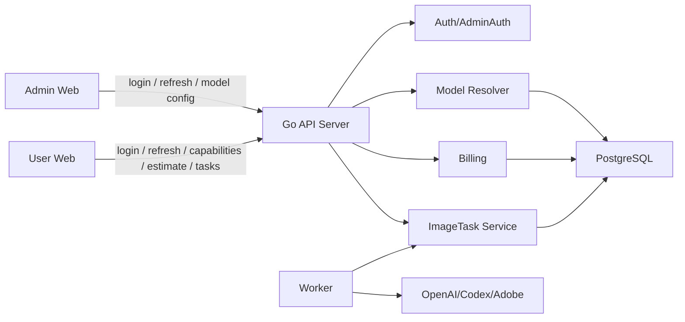
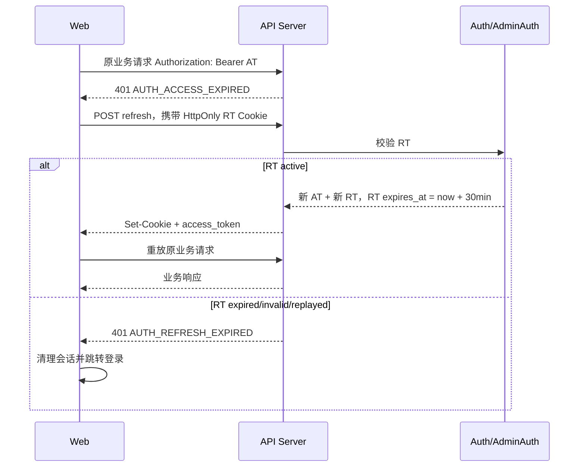
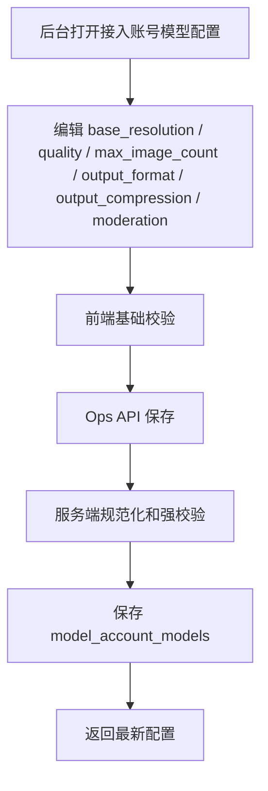
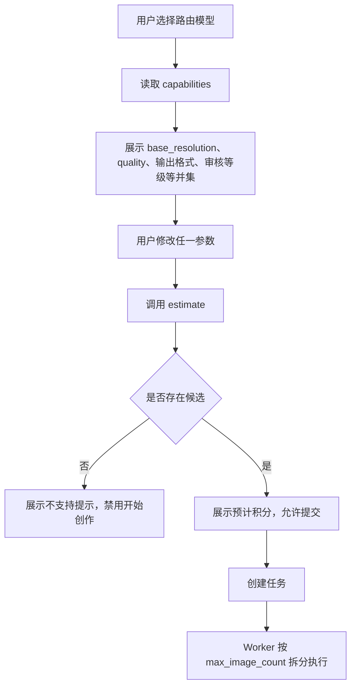

# 后台 Token 续期与图片生成参数能力改造技术方案

> 文档版本：v1.0
>
> 创建日期：2026-07-09
>
> 关联上下文：`docs/prd/pic-gallery-prd.md`、`docs/prd/2026-07-09-image-generation-account-model-capabilities-prd.md`、`docs/tech/2026-07-09-image-generation-account-model-capabilities-tech-design.md`
>
> 方案状态：实现完成，准出验证与 Docker 重部署已完成

## 一、需求描述

### 1.1 需求背景与预期效果

当前 Pic Gallery 已经具备用户端 Access Token + Refresh Token 的会话设计，但实际使用中存在两个问题：

- 用户或管理员持续操作页面时，Access Token 到固定时间后仍会失效，导致频繁重新登录。
- 管理后台现有认证链路是 Access Token + 内存 session，没有完整 Refresh Token 自动续期能力。

同时，图片生成模型能力在完成“尺寸模式、像素尺寸、参考图数量”改造后，还需要继续补齐质量、基础分辨率、单次上游最大出图数、输出格式、压缩质量和审核等级等能力。不同上游能力差异明显：Codex/GPT 反代通常质量参数只支持 `auto`，单次上游请求只支持 1 张；Adobe/官方 API 可支持更多质量档位和更多单次图片数量。

本方案预期效果：

- 用户端和管理后台在 Access Token 过期时自动使用 Refresh Token 静默续期。
- Refresh Token 默认有效期为 30 分钟，并在每次成功刷新时滑动顺延。
- 图片生成参数字段语义重新定死：`quality` 表示真正传给上游的质量参数，`base_resolution` 表示原 `qualities` 承担的 1K/2K/4K 基础分辨率和计费桶。
- 模型配置、用户端参数、计费预估、任务创建、Worker 调用、日志和调用记录全部使用同一套新字段，不做旧字段兼容和历史数据迁移。
- 生成任务按照候选账号模型的 `max_image_count` 自动拆分上游请求，并保持 Codex/GPT 多图 fanout 并行。

### 1.2 涉及团队与人员

| 角色 | 负责人 | 职责范围 |
|---|---|---|
| 服务端 | 👤 待人工确认 | Auth/AdminAuth、API DTO、Ent schema、路由匹配、计费、任务创建、Worker fanout、日志与测试 |
| 用户端 Web | 👤 待人工确认 | 创作页参数展示、estimate 失败禁用生成、Token 自动续期、任务状态展示 |
| 管理后台 Web | 👤 待人工确认 | 登录态自动续期、账号模型配置表单、字段文案和校验 |
| QA | 👤 待人工确认 | Token 续期 E2E、模型能力配置、计费预估、任务拆分、部分成功回归 |
| SRE/运维 | 👤 待人工确认 | Docker 重部署、必要时重建 PG、监控告警、发布回滚 |

### 1.3 目标拆解

| 子目标 | 范围说明 | 交付标准 | 优先级 |
|---|---|---|---|
| G1 Token 滑动续期 | 用户端和后台 401 后自动刷新 AT/RT | 持续操作不登出；RT 过期或无效才回登录页 | P0 |
| G2 字段语义更名 | `qualities` 全链路改为 `base_resolution`，新增真正 `quality` | 代码、API、前端文案、日志不再使用旧 `qualities` 语义 | P0 |
| G3 模型能力扩展 | 增加 `quality`、`max_image_count`、`output_format`、`output_compression`、`moderation` | 后台可配置，API 可保存，capabilities 可返回 | P0 |
| G4 参数校验与预估 | estimate/create 统一按新字段匹配候选 | 不支持参数返回 `IMAGE_CAPABILITY_MISMATCH`，生成按钮禁用 | P0 |
| G5 Worker 拆分执行 | 按候选 `max_image_count` 拆分上游请求并并行执行 | Codex 5 张拆 5 个并行请求；Adobe 5 张可 1 个请求 | P0 |
| G6 测试与验证 | Go 单测、React 类型检查、Docker E2E、代码 review | 验证通过后才视为完成 | P0 |

### 1.5 实现进度记录

| 时间 | 子目标 | 状态 | 当前证据 |
|---|---|---|---|
| 2026-07-09 | G1 Token 滑动续期 | 已实现 | 用户端和管理端共享 HTTP client 401 refresh 回调；后端提供用户/后台 refresh 接口；默认 AT 10 分钟、RT 30 分钟并旋转顺延 |
| 2026-07-09 | G2 字段语义更名 | 已实现 | 生产链路旧字段扫描无命中：`qualities/generation_qualities/moderation_modes/requested_quality/resolved_quality_bucket/request_quality` 均已清理 |
| 2026-07-09 | G3 模型能力扩展 | 已实现 | 模型能力配置、OpenAPI、后台表单、capabilities 均包含 `quality/max_image_count/output_format/output_compression/moderation/base_resolution` |
| 2026-07-09 | G4 参数校验与预估 | 已实现 | Resolver/Billing/ImageTask 统一按新字段匹配；用户端 estimate 失败会禁用开始创作 |
| 2026-07-09 | G5 Worker 拆分执行 | 已实现 | Worker 按候选 `max_image_count` 拆分 chunk，并保持 Codex/GPT fanout 并行；部分成功按成功图片数结算 |
| 2026-07-09 | G6 测试与验证 | 已完成 | `./scripts/workflow/verify.sh`、review gate、Docker E2E、API smoke 均已通过；dev Docker API/worker/user-web/admin-web 已重部署 |

### 1.4 不做范围

- 不兼容历史 `qualities` 字段，不做历史数据迁移。
- 不保留旧请求字段 `requested_quality` 的兼容入口；前后端和 Open API 同步改为 `base_resolution` 与 `quality`。
- 不改变积分价格体系的核心公式；本期 `quality` 不引入价格倍率。
- 不把 Codex/GPT 多图 fanout 改成串行。
- 不新增新的上游供应商类型。

## 二、技术方案详情

### 2.1 整体架构



🤖 AI 判断：现有代码已经有用户端 Refresh Token 存储、前端 401 重试入口、模型路由 Resolver、计费 Calculator 和 Worker fanout 链路。本次不新增服务，只在现有链路中做字段语义替换和能力扩展。

关键边界：

- Auth 只负责会话续期，不参与生图参数判断。
- Resolver 是唯一的生图能力匹配入口。
- Billing 只按 `base_resolution` 等计费字段计算积分，不按 `quality` 加价。
- Worker 只执行已被 Resolver 验证过的参数，运行时仍需二次校验以防配置变化。

### 2.2 技术选型与方案对比

#### 方案 A：兼容旧字段并新增新字段

做法：保留 `qualities/requested_quality`，新增 `quality/base_resolution`，读写时兼容转换。

优点：

- 滚动升级风险低。
- 历史数据和老客户端可继续工作。

缺点：

- `quality` 与 `qualities` 极易混淆，后续实现会继续偏移。
- 计费、日志、Worker 会长期存在双字段判断。
- 用户已明确要求不考虑历史数据、不做迁移和兼容。

结论：不采用。

#### 方案 B：破坏式字段更名和统一新契约

做法：

- 原模型能力字段 `qualities` 改为 `base_resolution`。
- 新增模型能力字段 `quality`，类型为数组，表示支持的真实质量档位。
- 生图请求字段使用：
  - `base_resolution`: `auto | 1K | 2K | 4K`
  - `quality`: `auto | low | medium | high`
- 不读取旧字段，不迁移旧数据。

优点：

- 字段语义清晰，后续编码不需要兼容分支。
- 计费和上游参数拆开，避免 `quality` 同时代表价格档和上游质量。
- 符合用户本轮明确要求。

缺点：

- 需要同步修改 DB、API、Web、Worker、测试和本地数据。
- 不支持新老服务滚动并存。

结论：采用方案 B。

#### 方案 C：独立能力表

做法：新增 `model_account_model_capabilities` 表，所有能力以多行结构保存。

优点：表达能力最强，便于未来按任务类型和上游类型做复杂组合。

缺点：本次字段仍属于账号模型的一等配置，独立表会明显增加 CRUD、路由 join 和后台表单复杂度。

结论：本期不采用。

### 2.3 业务详细流程

#### 2.3.1 Token 刷新流程



契约：

```text
Refresh(refresh_token):
  hash = sha256(refresh_token)
  current = loadActiveRefreshSession(hash)
  if current missing or expired:
    return AUTH_REFRESH_EXPIRED
  if current.status != active:
    revokeFamily(current.family_id)
    return AUTH_REFRESH_REPLAY_BLOCKED

  mark current rotated
  next = issueSession(
    family_id = current.family_id,
    access_expires_at = now + access_ttl,
    refresh_expires_at = now + refresh_ttl
  )
  persist next
  return next
```

管理后台：

- 新增 `/api/ops/admin/v1/auth/session/refresh`。
- 后台 RT Cookie 名称固定为 `pg_admin_refresh_token` 或新增配置项 `admin_refresh_cookie_name`，不复用用户端 `refresh_cookie_name`。
- 后台 logout 同时撤销后台 refresh session 并清理后台 Cookie。

#### 2.3.2 模型配置流程



校验规则：

- `base_resolution` 至少 1 个，可选 `auto`、`1K`、`2K`、`4K`。
- `quality` 至少 1 个，可选 `auto`、`low`、`medium`、`high`。
- Codex 来源默认并建议只配置 `quality=["auto"]`、`max_image_count=1`。
- Adobe 来源默认 `max_image_count=6`，`quality` 可配置全部档位。
- `output_format` 至少 1 个，可选 `png`、`jpeg`、`webp`。
- `output_compression` 范围 `0-100`，默认 `100`；仅当请求 `output_format` 为 `jpeg/webp` 时透传。
- `moderation` 至少 1 个，可选 `auto`、`low`。

#### 2.3.3 用户端生图流程



estimate 失败时：

- 前端必须禁用“开始创作”按钮。
- 展示文案：“当前配置暂不支持生成，请更换类似配置。”
- create task 仍必须二次校验，不能信任前端状态。

#### 2.3.4 Worker fanout 流程

```text
candidate = resolver.Match(task.params)
if candidate missing:
  fail IMAGE_CAPABILITY_MISMATCH

chunks = splitCount(task.requested_output_image_count, candidate.max_image_count)
parallelLimit = len(chunks) or existing provider concurrency limit

for chunk in chunks parallel:
  req = ProviderImageRequest{
    prompt,
    model,
    size,
    count: chunk.count,
    quality: task.quality,
    output_format: task.output_format,
    output_compression: only jpeg/webp ? task.output_compression : nil,
    moderation: task.moderation,
  }
  call provider

merge successful images
if success == 0: task failed
if 0 < success < requested: task partial_failed
if success == requested: task succeeded
actual_points = unit_points(base_resolution) * success_count * multipliers
```

Codex/GPT 反代要求：

- `max_image_count=1` 时，5 张图拆为 5 个 chunk。
- chunk 并行执行，不能改成串行。
- EOF、context deadline、invalid_response 等 provider 错误需要记录到 chunk attempt 日志，不能让 1 个 chunk 失败导致已成功图片丢失。

### 2.4 接口设计

#### 2.4.1 用户端刷新

```http
POST /api/agent/auth/v1/session/refresh
Cookie: pg_refresh_token=<rt>
```

响应：

```json
{
  "data": {
    "access_token": "jwt",
    "expires_in_seconds": 600,
    "user_id": 1
  }
}
```

鉴权：Refresh Cookie。

幂等性：非幂等。每次成功刷新都会旋转 RT；旧 RT 再次使用视为 replay。

#### 2.4.2 管理后台刷新

```http
POST /api/ops/admin/v1/auth/session/refresh
Cookie: pg_admin_refresh_token=<rt>
```

响应：

```json
{
  "data": {
    "access_token": "jwt",
    "expires_in_seconds": 600,
    "admin_id": 1,
    "email": "admin@example.com",
    "role": "super_admin",
    "permissions": []
  }
}
```

鉴权：后台 Refresh Cookie。

限流：按 IP + admin_id 建议 `30/min`。

#### 2.4.3 模型配置保存

```http
PUT /api/ops/admin/v1/model-accounts/{account_id}/models/{model_id}
Authorization: Bearer <admin_at>
```

请求：

```json
{
  "model_code": "gpt-image-2",
  "display_name": "GPT Image 2",
  "task_types": ["text_to_image", "reference_generate", "image_edit"],
  "base_resolution": ["1K", "2K"],
  "quality": ["auto"],
  "max_reference_image_count": 5,
  "max_image_count": 1,
  "size_modes": ["ratio", "pixel"],
  "supported_ratios": ["1:1", "16:9"],
  "supported_pixel_sizes": ["1024x1024"],
  "output_format": ["png", "jpeg", "webp"],
  "output_compression": 100,
  "moderation": ["auto", "low"],
  "cost_per_image": "0.00000",
  "currency": "USD",
  "enabled": true
}
```

响应：返回完整模型配置。

破坏性说明：旧 `qualities` 字段不再接收。

#### 2.4.4 capabilities

```http
GET /api/agent/image/v1/capabilities
Authorization: Bearer <user_at>
```

响应片段：

```json
{
  "model_groups": [
    {
      "code": "plus-image",
      "base_resolution": ["1K", "2K"],
      "quality": ["auto", "low", "medium", "high"],
      "max_reference_image_count": 5,
      "max_image_count": 6,
      "size_modes": ["ratio", "pixel"],
      "aspect_ratios": ["1:1", "16:9"],
      "pixel_sizes": ["1024x1024"],
      "output_format": ["png", "jpeg", "webp"],
      "output_compression": { "min": 0, "max": 100, "default": 100 },
      "moderation": ["auto", "low"]
    }
  ]
}
```

注意：capabilities 返回单字段并集，不保证任意组合都支持；组合支持性以 estimate 为准。

#### 2.4.5 计费预估

```http
GET /api/agent/billing/v1/estimate
```

Query：

```text
task_type=text_to_image
route_model_code=plus-image
size_mode=ratio
aspect_ratio=1:1
base_resolution=2K
quality=auto
output_format=png
output_compression=100
moderation=auto
requested_output_image_count=5
reference_image_count=0
```

响应：

```json
{
  "data": {
    "supported": true,
    "base_resolution": "2K",
    "quality": "auto",
    "estimated_points": "40.00000",
    "charged_points": "40.00000",
    "sufficient": true
  }
}
```

#### 2.4.6 创建任务

```http
POST /api/agent/image/v1/tasks
Authorization: Bearer <user_at>
```

请求：

```json
{
  "task_type": "text_to_image",
  "prompt": "A small product photo of a ceramic coffee cup",
  "route_model_code": "plus-image",
  "size_mode": "pixel",
  "requested_size": "1024x1024",
  "base_resolution": "1K",
  "quality": "auto",
  "output_format": "png",
  "output_compression": 100,
  "moderation": "auto",
  "requested_output_image_count": 5,
  "reference_asset_ids": [],
  "response_mode": "async",
  "idempotency_key": "client-generated-key"
}
```

### 2.5 算法设计

#### 2.5.1 能力匹配

```text
MatchCandidate(req):
  for candidate in route.enabled_candidates:
    cap = candidate.account_model.capability
    if req.task_type not in cap.task_types: continue
    if req.reference_count > cap.max_reference_image_count: continue
    if req.size_mode not in cap.size_modes: continue
    if req.size_mode == ratio:
      if req.aspect_ratio not in cap.supported_ratios: continue
      if req.base_resolution not in cap.base_resolution: continue
    if req.size_mode == pixel:
      if req.requested_size not in cap.supported_pixel_sizes: continue
      if req.base_resolution not in cap.base_resolution: continue
    if req.quality not in cap.quality: continue
    if req.output_format not in cap.output_format: continue
    if req.moderation not in cap.moderation: continue
    if req.output_compression < 0 or req.output_compression > 100: continue
    return candidate
  return IMAGE_CAPABILITY_MISMATCH
```

#### 2.5.2 积分计算

```text
estimated_points =
  price(route_model, task_type, base_resolution)
  * requested_output_image_count
  * task_type_multiplier
  * reference_image_multiplier
  * user_group_multiplier

actual_points =
  price(route_model, task_type, base_resolution)
  * success_output_image_count
  * task_type_multiplier
  * reference_image_multiplier
  * user_group_multiplier
```

本期 `quality`、`output_format`、`output_compression`、`moderation` 不参与价格倍率，只参与能力校验和 provider 参数。

### 2.6 数据结构设计

#### 2.6.1 `model_account_models`

| 字段 | 类型 | 说明 |
|---|---|---|
| `base_resolution` | JSON array | 原 `qualities`，支持 `auto/1K/2K/4K`，用于基础分辨率、尺寸换算、计费桶 |
| `quality` | JSON array | 真正上游质量，支持 `auto/low/medium/high` |
| `max_image_count` | int | 单次上游请求最大出图数，Codex 默认 1，Adobe 默认 6 |
| `output_format` | JSON array | 支持输出格式，`png/jpeg/webp` |
| `output_compression` | int | 默认压缩质量，`0-100`，默认 100 |
| `moderation` | JSON array | 支持审核等级，`auto/low` |

删除/停止使用：

- `qualities`

#### 2.6.2 `image_tasks`

| 字段 | 类型 | 说明 |
|---|---|---|
| `base_resolution` | string | 用户请求的基础分辨率或后端解析结果 |
| `quality` | string | 上游质量参数 |
| `output_format` | string | 输出格式 |
| `output_compression` | int | 输出压缩质量 |
| `moderation` | string | 审核等级 |

删除/停止使用：

- `requested_quality`
- `resolved_quality_bucket`

🤖 AI 判断：由于用户明确要求不考虑历史数据和兼容，推荐本地开发环境重建 PG 或执行破坏式 schema 变更。生产环境如有历史任务仍需保留，则必须另行补充迁移方案；本方案不覆盖。

#### 2.6.3 Provider request

```go
type ImageRequest struct {
    Model             string
    Prompt            string
    Size              string
    Count             int
    BaseResolution    string
    Quality           string
    OutputFormat      string
    OutputCompression *int
    Moderation        string
}
```

### 2.7 错误码设计

| 错误码 | 触发条件 | 前端处理 |
|---|---|---|
| `AUTH_ACCESS_EXPIRED` | AT 过期或无效 | 自动刷新 |
| `AUTH_REFRESH_EXPIRED` | RT 过期或缺失 | 清理会话，跳登录 |
| `AUTH_REFRESH_REPLAY_BLOCKED` | 旧 RT 重放 | 清理会话，提示重新登录 |
| `IMAGE_CAPABILITY_MISMATCH` | 无候选支持当前参数组合 | 禁用开始创作并提示 |
| `BAD_REQUEST` | 字段格式非法 | 表单定位或 Toast |
| `UPSTREAM_UNAVAILABLE` | 上游不可用或超时 | 任务失败或部分失败展示 |

### 2.8 灰度设计

本次字段改造为破坏式变更，不支持新老服务滚动并存，采用硬切发布。

阶段：

1. 本地开发环境重建 PG 或清空相关模型/任务数据。
2. API、Worker、用户端、后台前端一次性重建镜像并同时部署。
3. 执行 Docker E2E：
   - 管理员登录、刷新。
   - 用户登录、刷新。
   - 后台配置模型能力。
   - 用户端 estimate 成功/失败。
   - 创建 5 张 Codex 任务，确认并行 fanout。
4. 观察 30 分钟日志：
   - `AUTH_REFRESH_EXPIRED` 不应在持续操作场景出现。
   - `IMAGE_CAPABILITY_MISMATCH` 只应出现在真实不支持组合。
   - 多图任务部分成功不应被整体覆盖为失败。

回滚：

- 回滚到上一个镜像版本。
- 因不做 schema 兼容，回滚前需要恢复旧 DB 快照或重建本地 DB。

### 2.9 安全合规

- Refresh Token 只通过 HttpOnly Cookie 保存，前端 JS 不读取。
- 用户端和后台使用不同 Cookie 名称，避免同源覆盖。
- RT 存储只保存 hash，不保存明文。
- RT 轮换后旧 token 再次使用判定 replay，并撤销同 family 会话。
- 生图 provider 日志不得输出上游密钥、完整 Authorization、Refresh Token 或图片 base64 原文。
- 输出格式和压缩质量均为受控枚举/范围，不接受任意字符串透传。

## 三、稳定性设计

### 3.1 性能指标评估

| 项 | 指标 |
|---|---|
| Token refresh | 单次 DB/内存查询 + JWT 签发，目标 P95 < 100ms |
| capabilities | 复用现有路由快照，目标 P95 < 200ms |
| estimate | Resolver + Billing，目标 P95 < 200ms |
| create task | 二次 Resolver + DB 写入，目标 P95 < 300ms |
| Worker fanout | 并行 chunk 数不超过请求张数；Codex 5 张最多 5 个并发上游请求 |

### 3.2 资源与成本预估

- 新增字段均为小 JSON/int/string 字段，存储成本可忽略。
- Token refresh 会增加少量认证接口 QPS，预计与 AT TTL 成反比；默认 AT 10 分钟时，持续在线用户约每 10 分钟刷新一次。
- 多图 fanout 不增加总图片数量成本，但会提高瞬时并发；需要沿用账号并发限制和 Worker 并发限制。

### 3.3 兼容性设计

| 场景 | 结论 |
|---|---|
| 新老服务端并存 | 不支持。字段破坏式更名，必须硬切 |
| 数据库变更兼容 | 不兼容。推荐本地重建 PG 或生产另行制定迁移 |
| 新服务端兼容老客户端 | 不兼容。老客户端传 `requested_quality/qualities` 会失败 |
| 新客户端兼容老服务端 | 不兼容。老服务端不识别 `base_resolution/quality` |
| 本地持久化 | 前端需清理旧偏好中的 `quality=1K/2K/4K`，改为 `base_resolution` |
| 策略配置向前兼容 | 不兼容。后台配置必须一次性使用新字段 |
| 定制化需求 | 👤 待人工确认是否存在私有化客户；若存在需单独评估迁移窗口 |

### 3.4 监控与容灾设计

关键日志：

- `auth.refresh.success`: user/admin、session_id、expires_at。
- `auth.refresh.failed`: code、reason，不输出 token。
- `image.capability.match.failed`: route_model_code、task_type、base_resolution、quality、output_format、moderation。
- `image.worker.fanout.start`: task_id、candidate_id、requested_count、chunk_count、max_image_count。
- `image.worker.fanout.chunk.done`: task_id、chunk_index、count、success_count、error_code、duration_ms。

告警建议：

| 指标 | 阈值 | 级别 |
|---|---|---|
| refresh 失败率 | 5 分钟 > 5% | P2 |
| estimate `IMAGE_CAPABILITY_MISMATCH` 占比 | 10 分钟 > 30% | P2 |
| 多图任务全失败但上游部分成功 | 任意出现 | P1 |
| provider timeout/EOF | 10 分钟 > 10 次 | P2 |

### 3.5 风险评估

| 风险 | 概率 | 影响 | 应对 |
|---|---|---|---|
| 字段破坏式更名遗漏调用点 | 高 | 高 | `rg qualities/requested_quality/resolved_quality_bucket` 清零，增加编译和契约测试 |
| 后台和用户端 Cookie 互相覆盖 | 中 | 高 | 使用独立后台 Cookie 名称和刷新接口 |
| Codex 多图并发导致上游 EOF/timeout | 中 | 中 | 保持并行但记录 chunk 级日志，遵守账号并发限制 |
| estimate 成功但 create 失败 | 中 | 中 | estimate/create/Worker 共用 Resolver 匹配器 |
| 部分成功被错误标为全失败 | 中 | 高 | fanout merge 以成功图片数决定状态和扣费 |

## 四、架构变更

- 新增后台刷新接口：`/api/ops/admin/v1/auth/session/refresh`。
- 管理后台前端接入 401 自动刷新。
- 用户端和后台共享 HTTP client 的刷新逻辑，但 refresh callback 分别调用自己的接口。
- Ent schema 破坏式字段更名：
  - `qualities` -> `base_resolution`
  - 新增 `quality`
  - 新增 `max_image_count`
  - 新增 `output_format`
  - 新增 `output_compression`
  - 新增 `moderation`
- Worker provider request 增加质量、输出格式、压缩和审核字段。

## 五、测试

### 5.1 业务逻辑影响范围

需要回归：

- 用户登录、刷新、退出。
- 管理员登录、刷新、退出。
- 后台账号模型配置 CRUD。
- 用户端 capabilities 参数展示。
- 计费预估。
- 创建任务。
- Worker 调用上游。
- 历史任务和调用记录展示字段。
- Open API 图片接口。

### 5.2 测试用例

| 类型 | 用例 |
|---|---|
| Go 单测 | 用户 RT 成功刷新后 RT 过期时间顺延 |
| Go 单测 | 后台 RT 成功刷新后原 RT 失效 |
| Go 单测 | 旧 RT 重放返回 `AUTH_REFRESH_REPLAY_BLOCKED` |
| Go 单测 | Resolver 匹配 `base_resolution + quality + output_format + moderation` |
| Go 单测 | 不支持质量返回 `IMAGE_CAPABILITY_MISMATCH` |
| Go 单测 | Codex `max_image_count=1`，5 张拆 5 个 chunk |
| Go 单测 | Adobe `max_image_count=6`，5 张拆 1 个 chunk |
| Go 单测 | 部分 chunk 成功时任务为 `partial_failed` 且按成功张数扣费 |
| React 类型检查 | 用户端/后台 `api-types.ts` 无旧字段 |
| React 交互测试 | estimate 不通过时开始创作按钮禁用 |
| Docker E2E | 登录 -> 刷新 -> 配置模型 -> estimate -> 创建任务 -> Worker 完成 |

必须执行：

```bash
go test ./...
go vet ./...
npm --prefix web/user run typecheck
npm --prefix web/user run build
npm --prefix web/admin run typecheck
npm --prefix web/admin run build
./scripts/workflow/verify.sh
./scripts/workflow/api-smoke.sh
```

### 5.3 最终验证记录

| 验证项 | 命令/证据 | 结果 |
|---|---|---|
| 仓库完整验证 | `./scripts/workflow/verify.sh` | 通过，覆盖 Go test/vet、前端 contracts、用户端/管理端 typecheck 和 build |
| 字段旧契约扫描 | `rg "qualities|generation_qualities|moderation_modes|requested_quality|resolved_quality|resolved_quality_bucket|request_quality" ...` | 生产链路 0 命中 |
| Review gate | `./scripts/workflow/review-local.sh --scope all` | PASS |
| Docker E2E | `POSTGRES_PORT=15432 ... ./scripts/e2e/run-docker-e2e.sh --start --clean` | 通过，报告：`tmp/e2e/latest-report.md` |
| API smoke | `./scripts/workflow/api-smoke.sh` | 通过 |
| Dev Docker 重部署 | `docker compose -f deployments/docker-compose/docker-compose.dev.yml up -d api worker user-web admin-web nginx` | API、worker、user-web、admin-web、nginx 均启动；`GET http://127.0.0.1:8088/readyz` 返回 ready |
| 后台登录 smoke | `POST /api/ops/admin/v1/auth/login` with `admin@example.com/admin123456` | 通过 |

备注：由于本方案明确不做历史字段迁移，dev Docker 首次按新 schema 启动时旧 Postgres 中 `route_model_prices.base_resolution` 存在 NULL，已按需求授权重建 dev Postgres 卷后完成部署。

## 六、工作分工与排期

👤 待人工确认。

建议实施顺序：

1. Auth/AdminAuth 后端续期和测试。
2. Ent schema 与领域 DTO 字段更名。
3. Resolver/Billing/ImageTask/Worker 全链路改造。
4. 用户端和后台前端类型、表单、文案和交互改造。
5. E2E、review、Docker 重部署。

## 待人工确认项

- 是否允许本地开发环境直接重建 PG 数据库。
- 后台 Refresh Cookie 名称是否固定为 `pg_admin_refresh_token`。
- Access Token TTL 是否保持现有默认值，仅将 Refresh Token TTL 调整为 30 分钟。
- Open API 是否同步破坏式改字段，还是需要单独保留一个兼容版本；本方案按同步破坏式处理。
- 私有化/生产环境是否存在必须保留历史任务数据的场景。

## 评审自检清单

- [x] 所有必填章节已填写。
- [x] 接口定义包含请求/响应格式和关键字段说明。
- [x] 数据模型包含变更字段和停止使用字段。
- [x] 异常路径清单已覆盖认证、能力匹配、Worker fanout。
- [x] 兼容性场景已逐项回答。
- [x] 监控指标和告警阈值已定义。
- [x] 测试用例覆盖正常、异常、兼容和 E2E 路径。
