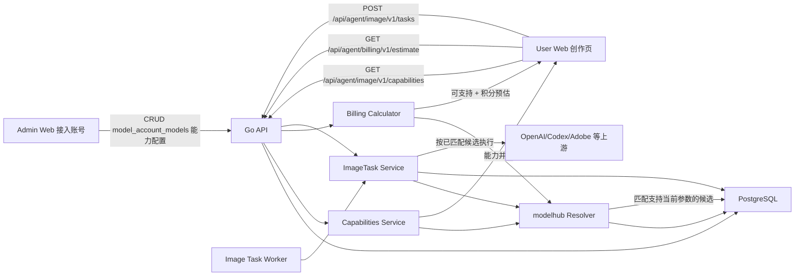
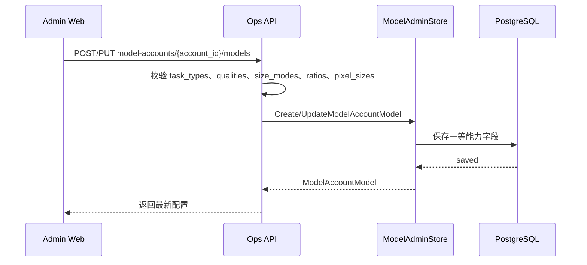
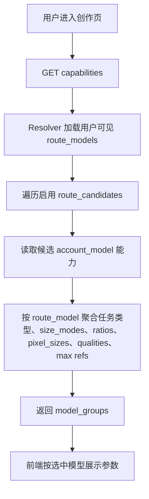
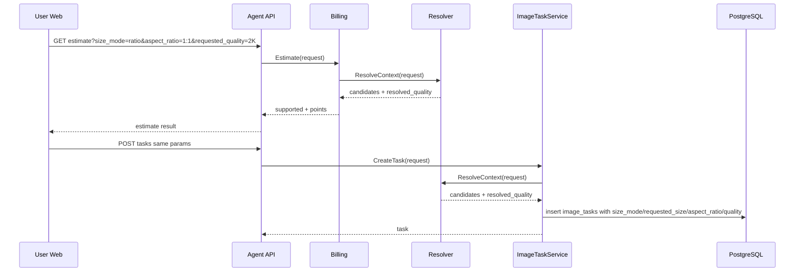
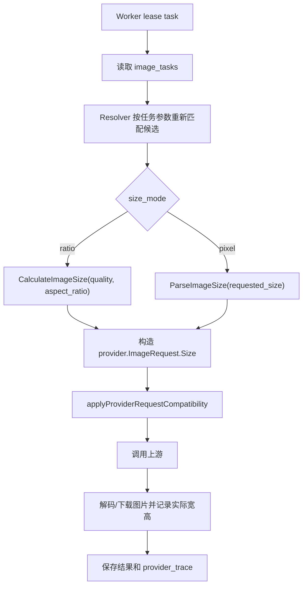

# 图片生成平台账号与模型能力配置改造技术方案

> 文档版本：v1.0
>
> 创建日期：2026-07-09
>
> 关联 PRD：`docs/prd/2026-07-09-image-generation-account-model-capabilities-prd.md`
>
> 关联既有方案：`docs/tech/2026-05-23-model-routing-redesign.md`、`docs/tech/pic-gallery-tech-design.md`
>
> 方案状态：已评审准出

## 一、需求描述

### 1.1 需求背景与预期效果

当前平台已经完成“模型接入账号 -> 账号下真实模型 -> 路由模型 -> 用户可见 capabilities -> 预估/创建任务 -> Worker 调用上游”的主链路，但模型能力仍只覆盖任务类型、质量列表、少量比例和数量上限，无法准确表达不同上游账号和不同模型之间的能力差异。

PRD 指出 GPT/Codex、Adobe 等上游在参考图数量、比例、像素尺寸、清晰度和尺寸参数生效规则上存在差异。继续让前端只按路由模型展示固定比例/清晰度，会导致用户能选到实际没有任何候选账号支持的参数，最终在任务执行阶段失败，或者出现积分预估与真实执行不一致。

本方案预期效果：

- 管理后台可在“账号下真实模型”维度配置最大参考图数量、尺寸模式、支持比例、支持像素尺寸。
- 用户端 capabilities 返回当前路由模型下所有可用候选真实模型的能力并集。
- 预估接口和创建任务接口使用同一套后端能力匹配逻辑，参数不可支持时提前阻断。
- Worker 执行前只调度真正支持当前参数的候选账号/模型。
- 比例模式和像素模式在请求契约、计费解析、Worker 参数转换上有明确边界。
- Codex/GPT 类型尺寸参数是否生效通过可观测日志和测试入口排查，排查结果回写到模型能力配置，而不是继续在前端暴露不确定能力。

### 1.2 涉及团队与人员

| 角色 | 负责人 | 职责范围 |
|---|---|---|
| 服务端 | 👤 待人工确认 | Ent schema、领域模型、路由匹配、计费预估、任务创建、Worker 参数转换、日志监控 |
| 管理后台前端 | 👤 待人工确认 | 接入账号真实模型表单新增能力配置、列表摘要、校验提示 |
| 用户端前端 | 👤 待人工确认 | 创作页尺寸模式切换、capabilities 驱动参数、预计尺寸和积分展示、不支持提示 |
| QA | 👤 待人工确认 | 能力配置、路由匹配、计费、Worker、Codex 参数排查用例 |
| SRE/运维 | 👤 待人工确认 | 灰度开关、Docker 部署、监控告警、失败任务观察 |

### 1.3 目标拆解

| 子目标 | 范围说明 | 交付标准 | 优先级 |
|---|---|---|---|
| G1 能力数据模型 | 在 `model_account_models` 增加模型级能力字段，并建立默认值和迁移策略 | 旧数据可无损迁移，后台读写新字段 | P0 |
| G2 管理后台配置 | 真实模型表单支持最大参考图、尺寸模式、比例列表、像素尺寸列表 | 保存后后端、capabilities、路由均可读取 | P0 |
| G3 能力聚合 | capabilities 按路由模型聚合候选真实模型能力并集 | 用户端不再依赖硬编码比例/像素尺寸 | P0 |
| G4 能力校验与预估 | estimate/create task 调用同一套候选匹配逻辑 | 无候选支持时返回明确错误和文案；可支持时返回积分预估 | P0 |
| G5 Worker 参数转换 | 区分 `ratio` 与 `pixel` 模式 | 比例模式继续换算尺寸；像素模式直接透传尺寸 | P0 |
| G6 Codex 尺寸排查 | 记录上游请求参数和实际图片尺寸，支持后台测试入口验证 | 能确认 Codex 支持范围，并用配置收敛前端选项 | P1 |
| G7 测试与回归 | 单测、API 测试、前端契约测试、Docker smoke | PRD 验收项均有对应测试 | P0 |

### 1.4 不做范围

- 不新增新的上游账号类型。
- 不重构现有路由权重、优先级、fallback 策略。
- 不重构积分体系本身；仅扩展预估入参和解析逻辑。
- 不一次性内置大量像素尺寸；除 `1024x1024` 外的默认预设由后续产品确认。
- 不改造非图片生成相关功能。

## 二、技术方案详情

### 2.1 整体架构



🤖 AI 判断：现有系统已经有天然承载本需求的分层：

- `internal/repository/ent/schema/modelaccountmodel.go`：账号下真实模型表。
- `internal/domain/modeladmin/types.go`：后台模型读写 DTO。
- `internal/repository/entstore/model_admin_store.go`：从 DB 构建 `modelhub.ModelRoutingSnapshot`。
- `internal/domain/modelhub/resolver.go`：路由模型可见性、质量解析、候选过滤和排序。
- `internal/service/capabilities/service.go`：用户端 capabilities。
- `internal/domain/billing/calculator.go`：积分预估。
- `internal/service/imagetask/service.go`：任务创建、执行、Worker provider request 构造。
- `web/admin/src/pages/ProviderModelsPage.tsx`：后台账号下真实模型表单。
- `web/user/src/pages/WorkspacePage.tsx`：用户端创作参数入口。

因此本方案不引入新服务，只扩展现有模型路由闭环。

### 2.2 技术选型与方案对比

#### 2.2.1 问题域调研结论

业界主流做法是把“模型支持的参数”视为模型或端点元数据，而不是在前端硬编码。OpenAI Images API 官方文档按模型约束 `size`、`quality`、输出格式等参数；OpenRouter 这类模型聚合平台也通过模型元数据表达可用参数。这个方向与本项目现有“路由模型 + 候选真实模型 + capabilities”架构一致。

结论：本项目应采用“内部归一化能力矩阵 + 后端统一匹配器”的设计。前端只消费 capabilities 和 estimate 结果，不复制后端匹配逻辑。

#### 2.2.2 方案 A：继续把新能力塞进 `extra` JSON

做法：

- 复用 `model_account_models.extra` 保存：

```json
{
  "max_reference_image_count": 5,
  "size_modes": ["ratio", "pixel"],
  "supported_ratios": ["1:1", "16:9"],
  "supported_pixel_sizes": ["1024x1024"]
}
```

优点：

- 不需要 DB schema 迁移，短期实现最快。
- 历史表结构已有 `extra`，读写链路可少改动。

缺点：

- 字段契约弱，后台、后端、Worker 容易出现不同默认值。
- 无法通过 Ent 类型约束、索引和迁移保障数据质量。
- 后续需要按能力筛查配置质量时查询困难。
- `extra` 目前已用于账号来源等兼容参数，继续堆业务核心字段会降低可维护性。

结论：不推荐作为最终方案，只可作为灰度兼容读取来源。

#### 2.2.3 方案 B：在 `model_account_models` 增加一等能力字段

做法：

- 在账号下真实模型表增加以下字段：
  - `max_reference_image_count int`
  - `size_modes json`
  - `supported_ratios json`
  - `supported_pixel_sizes json`
- Domain、Admin API、routing snapshot、capabilities、resolver 均直接使用这些字段。
- 兼容读取旧 `extra` 中的同名字段作为迁移兜底。

优点：

- 能力配置成为核心业务契约，类型和默认值明确。
- 与现有 `task_types`、`qualities` JSON 字段风格一致。
- 便于后台表单、列表摘要、测试用例和后续巡检。
- 后续如需把某些字段索引化，可平滑从 JSON 拆出。

缺点：

- 需要 Ent schema、迁移、DTO、前后端类型同步修改。
- 滚动升级期间需要考虑新老版本读写兼容。

结论：推荐采用。

#### 2.2.4 方案 C：新增 `model_account_model_capabilities` 独立表

做法：

- 每个账号真实模型关联一条或多条能力记录。
- 比例、像素、任务类型、清晰度等全部拆到独立表或子表。

优点：

- 规范化程度最高，适合复杂组合规则、版本化、审计和批量分析。

缺点：

- 当前能力字段数量有限，独立表会明显增加 CRUD、join、迁移和后台复杂度。
- PRD 明确本期不做大规模路由策略重构，独立表收益不足。

结论：本期不采用。若未来要表达“同一模型的不同任务类型对应不同尺寸集合”，再升级到能力版本表。

#### 2.2.5 最终选型

采用方案 B：一等字段 + `extra` 兼容读取 + 统一能力匹配器。

关键原则：

- 能力配置存储在 `model_account_models`，维度严格为“账号下真实模型”。
- 用户端 capabilities 展示能力并集，但 estimate/create task/Worker 必须判断是否存在支持完整组合的候选。
- 预估、创建、Worker resolve 使用同一个 `modelhub.MatchCandidates` 契约，禁止前端或不同服务各自拼校验。
- `billing.Calculator` 当前只负责质量桶解析和点数计算，不负责路由候选筛选；本次必须将 estimate 编排升级为“先 Resolver 匹配候选并得到 resolved_quality，再调用 Billing 计算价格”，或让 Billing 注入完整 `RouteResolver`。禁止只在 create task 中筛选候选而 estimate 仍只按质量估价。

### 2.3 业务详细流程

#### 2.3.1 管理后台配置流程



异常路径：

| 场景 | 行为 |
|---|---|
| 未勾选任何尺寸模式 | Ops API 返回 `400 BAD_REQUEST`，提示至少选择一种尺寸模式 |
| 勾选比例模式但比例为空 | 返回 `400 BAD_REQUEST` |
| 勾选像素模式但像素尺寸为空 | 返回 `400 BAD_REQUEST` |
| 比例格式非法 | 返回 `400 IMAGE_CAPABILITY_MISMATCH` 或 `BAD_REQUEST`，格式要求 `W:H` |
| 像素尺寸非法 | 返回 `400 IMAGE_AUTO_UNSUPPORTED` 或 `BAD_REQUEST`，格式要求 `WIDTHxHEIGHT`，宽高均为正整数 |
| 编辑期间账号被删除 | 返回 `404 NOT_FOUND` |
| 唯一键冲突 | 沿用现有 `account_id + model_code` 冲突处理 |

#### 2.3.2 用户端 capabilities 流程



并集契约：

- `size_modes`：候选支持模式的并集。
- `aspect_ratios`：支持 `ratio` 模式候选的比例并集。
- `pixel_sizes`：支持 `pixel` 模式候选的像素尺寸并集。
- `qualities`：仅用于 `ratio` 模式展示；按“路由价格中启用的 quality”与“至少一个 ratio 候选支持的 quality”求交集后返回，额外保留 `auto`。
- `max_reference_image_count`：取可见候选最大值，表示用户最多可上传数量；提交时后端仍需按完整组合再次匹配。

前端重要约束：

- capabilities 返回的是单字段并集，不保证任意字段组合都有候选支持。
- 用户每次切换模型、任务类型、尺寸模式、比例、像素尺寸、清晰度、参考图数量后，都必须重新调用 estimate；estimate 成功才允许点击生成。
- 如果 estimate 返回 `IMAGE_CAPABILITY_MISMATCH`，前端展示“当前配置暂不支持生成，请更换类似配置。”并禁用生成按钮。

#### 2.3.3 预估和创建任务流程



核心约束：

- estimate 与 create task 必须传入同一组尺寸参数。
- create task 不能信任前端 estimate 成功状态，必须重新调用 Resolver。
- OpenAPI 入口与用户 Web 入口使用相同字段和相同匹配器。

#### 2.3.4 Worker 执行流程



异常路径：

| 场景 | 行为 |
|---|---|
| Worker 运行时配置已变化，原任务参数不再有候选支持 | 任务失败，错误码 `IMAGE_CAPABILITY_MISMATCH`，保留原 `route_snapshot_version` 便于排查 |
| 比例模式无法换算尺寸 | 任务失败，错误码 `IMAGE_CAPABILITY_MISMATCH` |
| 像素模式尺寸解析失败 | 任务失败，错误码 `IMAGE_AUTO_UNSUPPORTED` 或 `IMAGE_CAPABILITY_MISMATCH` |
| 上游超时 | 沿用现有 provider timeout/fallback；所有候选失败后任务失败 |
| Codex 返回图片尺寸与请求尺寸不一致 | 不直接判失败；记录 `provider_trace.actual_width/actual_height`，后台测试报告标记为 mismatch，供能力配置修正 |

### 2.4 接口设计

#### 2.4.1 Ops API：账号真实模型读写

路径沿用现有：

- `GET /api/ops/admin/v1/model-accounts/{account_id}/models`
- `POST /api/ops/admin/v1/model-accounts/{account_id}/models`
- `PUT /api/ops/admin/v1/model-accounts/{account_id}/models/{model_id}`

新增请求/响应字段：

```json
{
  "model_code": "gpt-image-2",
  "display_name": "GPT Image 2",
  "task_types": ["text_to_image", "reference_to_image", "image_edit"],
  "qualities": ["1K", "2K"],
  "max_reference_image_count": 5,
  "size_modes": ["ratio", "pixel"],
  "supported_ratios": ["1:1", "16:9", "9:16", "4:3", "3:4"],
  "supported_pixel_sizes": ["1024x1024"],
  "cost_per_image": "0.00000",
  "currency": "USD",
  "enabled": true
}
```

字段规则：

| 字段 | 类型 | 必填 | 默认值 | 规则 |
|---|---|---|---|---|
| `max_reference_image_count` | int | 否 | `5` | `0-64`，`0` 表示不支持参考图 |
| `size_modes` | string array | 是 | `["ratio"]` | 仅允许 `ratio/pixel`，至少一个 |
| `supported_ratios` | string array | 条件必填 | `["1:1","16:9","9:16","4:3","3:4"]` | `size_modes` 包含 `ratio` 时不能为空 |
| `supported_pixel_sizes` | string array | 条件必填 | `["1024x1024"]` | `size_modes` 包含 `pixel` 时不能为空 |

鉴权：沿用 Ops Admin JWT。

限流：沿用后台 API 限流策略；无额外高频调用。

幂等性：POST 非幂等；PUT 幂等更新。

#### 2.4.2 Agent API：capabilities

路径沿用现有：

`GET /api/agent/image/v1/capabilities`

在 `model_groups[]` 上新增字段：

```json
{
  "model_groups": [
    {
      "id": 1,
      "code": "plus-image",
      "name": "Plus Image",
      "task_types": ["text_to_image", "reference_to_image"],
      "size_modes": ["ratio", "pixel"],
      "aspect_ratios": ["1:1", "16:9", "9:16"],
      "pixel_sizes": ["1024x1024", "2048x2048"],
      "qualities": ["auto", "1K", "2K"],
      "max_output_image_count": 5,
      "max_reference_image_count": 5,
      "prices": [
        {
          "task_type": "text_to_image",
          "quality": "1K",
          "charged_points": "2.00000",
          "display_points": "2.00"
        }
      ]
    }
  ],
  "reference_image_max_mb": 10,
  "reference_image_max_bytes": 10485760
}
```

兼容性：

- 新增字段不破坏老前端。
- 老前端缺省按 `ratio` 模式理解，继续使用 `aspect_ratios` 和 `qualities`。
- 新前端如果服务端未返回 `size_modes`，按 `["ratio"]` 降级。

#### 2.4.3 Agent API：积分预估

路径沿用现有：

`GET /api/agent/billing/v1/estimate`

OpenAPI 同步扩展：

`GET /api/open/image/v1/estimate`

新增 query 参数：

| 参数 | 说明 |
|---|---|
| `size_mode` | `ratio` 或 `pixel`，为空时兼容为 `ratio` |
| `aspect_ratio` | 比例模式必填，兼容当前前端已有参数 |
| `requested_quality` | 比例模式展示并参与计费解析；像素模式可传空或 `auto` |
| `requested_size` | 像素模式必填；比例模式新客户端传空或 `auto`，由后端按比例和清晰度换算 |

比例模式示例：

```http
GET /api/agent/billing/v1/estimate?route_model_code=plus-image&task_type=text_to_image&size_mode=ratio&aspect_ratio=16:9&requested_quality=2K&requested_output_image_count=1
```

像素模式示例：

```http
GET /api/agent/billing/v1/estimate?route_model_code=plus-image&task_type=text_to_image&size_mode=pixel&requested_size=1024x1024&requested_output_image_count=1
```

兼容旧客户端：

- 旧用户端当前会把 `quality + aspect_ratio` 先换算成 `requested_size` 后提交，且不提交 `aspect_ratio`。新后端必须兼容该请求：当 `size_mode` 为空且 `aspect_ratio` 为空但 `requested_size` 是合法像素尺寸时，内部按 `legacy_ratio_size` 处理，根据 `requested_size` 推断 `resolved_quality_bucket` 和约分比例，再按 ratio 候选匹配。`legacy_ratio_size` 不对外出现在 capabilities，不落库，最终任务落库为 `size_mode=ratio`。
- 新用户端必须停止在比例模式下自行计算最终像素，改为提交 `size_mode=ratio + aspect_ratio + requested_quality`，`requested_size` 传空或 `auto`。
- OpenAPI 文档保留旧 `requested_size` 参数，同时新增 `size_mode/aspect_ratio`；调用方可逐步迁移。

服务端实现分工：

```go
func Estimate(req EstimateRequest) (EstimateResult, error) {
    normalized, err := modelhub.NormalizeResolveRequest(req.toResolveRequest())
    if err != nil {
        return EstimateResult{}, err
    }
    resolved, err := resolver.ResolveContext(ctx, normalized)
    if err != nil {
        return EstimateResult{}, err
    }
    return calculator.EstimateResolved(EstimateResolvedRequest{
        TaskType: req.TaskType,
        RouteModelCode: req.RouteModelCode,
        SizeMode: normalized.SizeMode,
        AspectRatio: normalized.AspectRatio,
        RequestedSize: normalized.RequestedSize,
        ResolvedQualityBucket: resolved.ResolvedQualityBucket,
        CandidateCount: len(resolved.Providers),
        RequestedOutputImageCount: req.RequestedOutputImageCount,
        ReferenceImageCount: req.ReferenceImageCount,
        UserGroupCodes: req.UserGroupCodes,
    })
}
```

`EstimateResolved` 只消费已解析质量桶和 route model 价格，不再自行判断支持性。这样 estimate、create task、Worker 的“是否支持”只来自 Resolver。

成功响应新增字段：

```json
{
  "supported": true,
  "size_mode": "pixel",
  "requested_size": "1024x1024",
  "resolved_quality_bucket": "1k",
  "estimated_points": "2.00000",
  "display_points": "2.00",
  "sufficient": true
}
```

不支持响应：

```json
{
  "error": {
    "code": "IMAGE_CAPABILITY_MISMATCH",
    "message": "当前配置暂不支持生成，请更换类似配置。"
  }
}
```

#### 2.4.4 Agent API：创建任务

现有 Web 创建任务入口和 OpenAPI 创建任务入口都新增同样字段：

```json
{
  "task_type": "text_to_image",
  "route_model_code": "plus-image",
  "prompt": "A ceramic coffee cup",
  "size_mode": "ratio",
  "aspect_ratio": "1:1",
  "requested_quality": "2K",
  "requested_size": "auto",
  "requested_output_image_count": 1,
  "reference_asset_ids": []
}
```

像素模式：

```json
{
  "task_type": "text_to_image",
  "route_model_code": "plus-image",
  "prompt": "A ceramic coffee cup",
  "size_mode": "pixel",
  "requested_size": "1024x1024",
  "requested_output_image_count": 1
}
```

幂等性：

- Web 入口继续使用 `Idempotency-Key`。
- idempotent task id 的输入必须包含 `size_mode`、`aspect_ratio`、`requested_quality`、`requested_size`，避免同一 key 下不同尺寸参数复用旧任务。

落库约定：

- ratio 模式：`size_mode=ratio`，`aspect_ratio` 保存用户选择，`requested_quality` 保存用户选择，`requested_size` 保存 `auto` 或空值；`resolved_width/resolved_height` 在后端换算后写入。
- pixel 模式：`size_mode=pixel`，`requested_size` 保存用户选择的规范化尺寸，`requested_quality` 保存 `auto`，`aspect_ratio` 保存由像素尺寸约分得到的比例，便于历史列表展示。

#### 2.4.5 Admin API：测试生图增强

现有：

`POST /api/ops/admin/v1/model-accounts/{account_id}/test-image`

建议扩展请求：

```json
{
  "model_id": 1,
  "prompt": "admin smoke image",
  "source_mode": "codex_responses",
  "size_mode": "pixel",
  "requested_size": "1024x1024",
  "requested_quality": "auto",
  "aspect_ratio": "1:1"
}
```

响应增加诊断字段：

```json
{
  "status": "succeeded",
  "width": 1024,
  "height": 1024,
  "actual_params": {
    "size_mode": "pixel",
    "requested_size": "1024x1024",
    "upstream_size": "1024x1024",
    "quality": "auto",
    "response_format": "b64_json"
  },
  "diagnostics": {
    "size_matched": true,
    "adapter_type": "openai_compatible",
    "source_mode": "codex_responses"
  }
}
```

### 2.5 算法设计

#### 2.5.1 归一化能力结构

```go
type SizeMode string

const (
    SizeModeRatio SizeMode = "ratio"
    SizeModePixel SizeMode = "pixel"
)

type ImageModelCapability struct {
    MaxReferenceImageCount int
    SizeModes              []SizeMode
    SupportedRatios        []string
    SupportedPixelSizes    []string
}

type ImageSizeRequest struct {
    SizeMode                  SizeMode
    AspectRatio               string
    RequestedQuality          string
    RequestedSize             string
    RequestedOutputImageCount int
    ReferenceImageCount       int
    TaskType                  string
    MaskPresent               bool
}
```

归一化契约：

```go
func NormalizeCapability(raw ImageModelCapability) (ImageModelCapability, error) {
    cap := raw
    cap.SizeModes = normalizeModes(cap.SizeModes)
    if len(cap.SizeModes) == 0 {
        cap.SizeModes = []SizeMode{SizeModeRatio}
    }
    // Persisted records are already filled by DB defaults.
    // 0 is a valid explicit value and means reference images are unsupported.
    if cap.MaxReferenceImageCount < 0 {
        return cap, BadRequest("max_reference_image_count must be >= 0")
    }
    if contains(cap.SizeModes, SizeModeRatio) {
        cap.SupportedRatios = normalizeRatios(defaultIfEmpty(cap.SupportedRatios, defaultRatios))
        if len(cap.SupportedRatios) == 0 {
            return cap, BadRequest("ratio mode requires supported_ratios")
        }
    } else {
        cap.SupportedRatios = nil
    }
    if contains(cap.SizeModes, SizeModePixel) {
        cap.SupportedPixelSizes = normalizePixelSizes(defaultIfEmpty(cap.SupportedPixelSizes, []string{"1024x1024"}))
        if len(cap.SupportedPixelSizes) == 0 {
            return cap, BadRequest("pixel mode requires supported_pixel_sizes")
        }
    } else {
        cap.SupportedPixelSizes = nil
    }
    return cap, nil
}
```

请求归一化契约：

```go
func NormalizeResolveRequest(req ResolveRequest) (ResolveRequest, error) {
    mode := strings.ToLower(strings.TrimSpace(req.SizeMode))
    if mode == "" {
        // Legacy clients submit requested_size calculated from quality+ratio
        // and do not submit aspect_ratio. Preserve that path as ratio
        // compatibility instead of requiring pixel-mode support.
        if strings.TrimSpace(req.AspectRatio) == "" {
            if size := normalizePixelSize(req.RequestedSize); size != "" && !strings.EqualFold(size, "auto") {
                req.SizeMode = "legacy_ratio_size"
                req.RequestedSize = size
                req.AspectRatio = ratioFromPixelSize(size)
                return req, nil
            }
        }
        mode = "ratio"
    }
    switch mode {
    case "legacy_ratio_size":
        size := normalizePixelSize(req.RequestedSize)
        if size == "" {
            return req, errs.New(400, errs.CodeImageAutoUnsupported, "unsupported size")
        }
        req.SizeMode = "legacy_ratio_size"
        req.RequestedSize = size
        req.AspectRatio = ratioFromPixelSize(size)
        return req, nil
    case "ratio":
        req.SizeMode = "ratio"
        req.AspectRatio = normalizeRatio(defaultString(req.AspectRatio, "1:1"))
        if strings.TrimSpace(req.RequestedQuality) == "" {
            req.RequestedQuality = "auto"
        }
        // New clients do not need requested_size in ratio mode.
        if strings.TrimSpace(req.RequestedSize) == "" {
            req.RequestedSize = "auto"
        }
        return req, nil
    case "pixel":
        size := normalizePixelSize(req.RequestedSize)
        if size == "" {
            return req, errs.New(400, errs.CodeImageAutoUnsupported, "unsupported size")
        }
        req.SizeMode = "pixel"
        req.RequestedSize = size
        req.RequestedQuality = "auto"
        req.AspectRatio = ratioFromPixelSize(size)
        return req, nil
    default:
        return req, errs.BadRequest("unsupported size_mode")
    }
}
```

#### 2.5.2 候选匹配契约

必须新增统一函数，供 capabilities 以外的 estimate、create task、Worker resolve 使用。

```go
func CandidateSupportsRequest(candidate ProviderCandidate, req ResolveRequest, resolvedQuality string) bool {
    if !candidateHealthUsable(candidate.HealthStatus) {
        return false
    }
    if len(candidate.SupportedTaskTypes) > 0 && !contains(candidate.SupportedTaskTypes, req.TaskType) {
        return false
    }
    if candidate.MaxImageCount > 0 && req.RequestedOutputImageCount > candidate.MaxImageCount {
        return false
    }
    if req.ReferenceImageCount > candidate.MaxReferenceImageCount {
        return false
    }
    if req.ReferenceImageCount > 0 && !candidate.SupportsImageInput {
        return false
    }
    if req.MaskPresent && !candidate.SupportsMask {
        return false
    }

    mode := normalizeSizeMode(req.SizeMode)
    if mode == "legacy_ratio_size" {
        mode = "ratio"
    }
    if !contains(candidate.SizeModes, mode) {
        return false
    }

    switch mode {
    case "ratio":
        if len(candidate.SupportedAspectRatios) > 0 && !containsRatio(candidate.SupportedAspectRatios, req.AspectRatio) {
            return false
        }
        if len(candidate.SupportedQualities) > 0 && !containsQuality(candidate.SupportedQualities, resolvedQuality) {
            return false
        }
        return true
    case "pixel":
        size := normalizePixelSize(req.RequestedSize)
        if size == "" {
            return false
        }
        if len(candidate.SupportedPixelSizes) > 0 && !contains(candidate.SupportedPixelSizes, size) {
            return false
        }
        // Pixel mode does not show quality to users, but it still maps to a
        // billing/statistics quality bucket. If a candidate explicitly limits
        // qualities, the inferred bucket must be allowed.
        if len(candidate.SupportedQualities) > 0 && !containsQuality(candidate.SupportedQualities, resolvedQuality) {
            return false
        }
        return true
    default:
        return false
    }
}
```

注意：`MaxReferenceImageCount=0` 是合法业务值，表示该模型不支持参考图；快照构建层必须保证历史空值已经被迁移或归一化为默认 `5`，匹配层不能再用 `>0` 判断跳过 0。

路由解析流程：

```go
func ResolveContext(ctx context.Context, req ResolveRequest) (ResolvedRequest, error) {
    req = NormalizeResolveRequest(req)
    routeModel := findVisibleRouteModel(req.RouteModelCode, req.UserGroupCodes)
    resolvedQuality := ResolveQualityBySizeMode(req, routeModel)

    candidates := []ProviderCandidate{}
    for _, routeCandidate := range routing.Candidates {
        candidate := accountModels[routeCandidate.AccountModelID]
        candidate.applyRouteCandidate(routeCandidate)
        if CandidateSupportsRequest(candidate, req, resolvedQuality) {
            candidates = append(candidates, candidate)
        }
    }
    if len(candidates) == 0 {
        return partial, errs.New(409, errs.CodeImageCapabilityMismatch, "当前配置暂不支持生成，请更换类似配置。")
    }
    sortCandidatesByExistingRules(candidates)
    return ResolvedRequest{ResolvedQualityBucket: resolvedQuality, Providers: candidates}, nil
}
```

#### 2.5.3 质量解析契约

```go
func ResolveQualityBySizeMode(req ResolveRequest, route RouteModelConfig) (string, error) {
    switch normalizeSizeMode(req.SizeMode) {
    case "legacy_ratio_size":
        quality, ok, err := resolveExplicitOrSizedQuality(req.RequestedQuality, req.RequestedSize)
        if err != nil {
            return "", err
        }
        if !ok || quality == "" {
            return ResolveRouteQuality(route, req.TaskType, req.RequestedQuality, "", autoDefaults, prices)
        }
        if !hasRoutePrice(route.ID, req.TaskType, quality, prices) {
            return "", errs.New(409, errs.CodeRouteModelPriceMissing, "model pricing not found")
        }
        return quality, nil
    case "ratio":
        quality, err := ResolveRouteQuality(route, req.TaskType, req.RequestedQuality, "", autoDefaults, prices)
        if err != nil {
            return "", err
        }
        // requested_size is calculated after quality+ratio are accepted.
        return quality, nil
    case "pixel":
        width, height, ok := ParseImageSize(req.RequestedSize)
        if !ok {
            return "", errs.New(400, errs.CodeImageAutoUnsupported, "unsupported size")
        }
        quality := QualityBucketByLongestEdge(width, height)
        if !hasRoutePrice(route.ID, req.TaskType, quality, prices) {
            return "", errs.New(409, errs.CodeRouteModelPriceMissing, "model pricing not found")
        }
        return quality, nil
    default:
        return "", errs.BadRequest("unsupported size_mode")
    }
}
```

说明：

- 像素模式仍需要解析出 `resolved_quality_bucket`，用于价格表和任务统计，但不向用户展示清晰度选项。
- 当前 `resolveExplicitOrSizedQuality` 已能从 `requested_size` 推断 `1k/2k/4k`，可提取为公共函数并显式受 `size_mode=pixel` 驱动。

#### 2.5.4 Worker 参数转换契约

```go
func BuildProviderImageRequest(task Task, candidate ProviderCandidate, resolved ResolvedRequest) (provider.ImageRequest, error) {
    req := provider.ImageRequest{
        Model:            providerModelName(task.AbstractModel, candidate.Provider, candidate.ModelCode),
        TaskType:         provider.TaskType(task.TaskType),
        Prompt:           task.Prompt,
        Quality:          resolved.ResolvedQualityBucket,
        OutputImageCount: normalizedCount(task.OutputImageCount),
        ResponseFormat:   normalizeResponseFormat(task.ResponseMode),
    }

    switch normalizeSizeMode(task.SizeMode) {
    case "ratio":
        size, err := modelhub.CalculateImageSize(resolved.ResolvedQualityBucket, defaultString(task.AspectRatio, "1:1"))
        if err != nil {
            return req, errs.New(400, errs.CodeImageCapabilityMismatch, "unsupported image size")
        }
        req.Size = size
    case "pixel":
        if _, _, ok := modelhub.ParseImageSize(task.RequestedSize); !ok {
            return req, errs.New(400, errs.CodeImageAutoUnsupported, "unsupported image size")
        }
        req.Size = normalizePixelSize(task.RequestedSize)
        req.Quality = "auto"
    default:
        return req, errs.BadRequest("unsupported size_mode")
    }

    return applyProviderRequestCompatibility(req, task, candidate, resolved)
}
```

Codex 兼容规则：

- `gpt-image-2 + codex_responses` 当前已有逻辑把 `Quality=auto`、`ResponseFormat=b64_json`，并在 size 为空时用 `CalculateImageSize` 补齐。
- 本次改造后：比例模式由主流程先算出 `Size`；像素模式直接传用户选择的像素尺寸。兼容函数只做 provider 特有修正，不再悄悄改变尺寸模式语义。

### 2.6 数据结构设计

#### 2.6.1 `model_account_models`

Ent schema：`internal/repository/ent/schema/modelaccountmodel.go`

新增字段：

| 字段 | 类型 | 默认值 | 说明 |
|---|---|---|---|
| `max_reference_image_count` | int | `5` | 该真实模型最大参考图数量，`0` 表示不支持参考图 |
| `size_modes` | json string array | `["ratio"]` | 支持的尺寸模式 |
| `supported_ratios` | json string array | 默认比例列表 | 支持的图片比例 |
| `supported_pixel_sizes` | json string array | `["1024x1024"]` | 支持的像素尺寸 |

推荐 Ent 定义：

```go
field.Int("max_reference_image_count").Default(5),
field.JSON("size_modes", []string{"ratio"}).Optional(),
field.JSON("supported_ratios", []string{"1:1", "16:9", "9:16", "4:3", "3:4"}).Optional(),
field.JSON("supported_pixel_sizes", []string{"1024x1024"}).Optional(),
```

索引：

- 本期不新增索引。原因：能力字段主要通过账号模型 ID 加载后在内存中匹配，现有查询不会按比例/像素尺寸直接筛 DB。

迁移：

```sql
ALTER TABLE model_account_models
  ADD COLUMN max_reference_image_count integer NOT NULL DEFAULT 5,
  ADD COLUMN size_modes jsonb NOT NULL DEFAULT '["ratio"]',
  ADD COLUMN supported_ratios jsonb NOT NULL DEFAULT '["1:1","16:9","9:16","4:3","3:4"]',
  ADD COLUMN supported_pixel_sizes jsonb NOT NULL DEFAULT '["1024x1024"]';
```

兼容策略：

- 新增列有 DB 默认值，历史记录迁移后不应出现空字段。
- `size_modes/supported_ratios/supported_pixel_sizes` 为空数组时，Domain 层按默认能力补齐。
- `max_reference_image_count=0` 不做默认补齐，必须保留为“不支持参考图”。
- 若历史 `extra` 中已存在同名字段，迁移脚本优先把 `extra` 的有效值写入一等字段。
- 保存时一律写一等字段，不再向 `extra` 写同名能力字段。

#### 2.6.2 Domain 类型

`internal/domain/modeladmin/types.go` 的 `ModelAccountModel` 与 `ModelAccountModelWriteRequest` 增加：

```go
MaxReferenceImageCount int      `json:"max_reference_image_count"`
SizeModes              []string `json:"size_modes"`
SupportedRatios        []string `json:"supported_ratios"`
SupportedPixelSizes    []string `json:"supported_pixel_sizes"`
```

`internal/domain/modelhub/resolver.go` 的结构增加：

```go
type ResolveRequest struct {
    SizeMode string
    AspectRatio string
    RequestedSize string
    RequestedQuality string
    // existing fields...
}

type ProviderCandidate struct {
    SizeModes []string
    SupportedPixelSizes []string
    // existing fields...
}

type VisibleRouteModel struct {
    SizeModes []string
    PixelSizes []string
    // existing fields...
}
```

`internal/domain/billing/types.go` 增加：

```go
type EstimateRequest struct {
    SizeMode string
    AspectRatio string
    // existing fields...
}

type PricingSnapshot struct {
    SizeMode string `json:"size_mode,omitempty"`
    AspectRatio string `json:"aspect_ratio,omitempty"`
    // existing fields...
}
```

`internal/domain/imagetask/types.go` 增加：

```go
type CreateRequest struct {
    SizeMode string
    AspectRatio string
    // existing fields...
}

type ExecuteRequest struct {
    SizeMode string
    AspectRatio string
    // existing fields...
}

type Task struct {
    SizeMode string `json:"size_mode,omitempty"`
    // existing fields...
}
```

内部兼容模式说明：

- `legacy_ratio_size` 只存在于请求归一化和 Resolver 过程中，用于兼容旧客户端。
- 创建任务落库前必须把 `legacy_ratio_size` 转回 `ratio`，并保存归一化后的 `aspect_ratio/requested_size/resolved_quality_bucket`。
- capabilities、Admin 表单、OpenAPI 文档中不得暴露 `legacy_ratio_size`。

#### 2.6.3 `image_tasks`

现有 `image_tasks` 已有 `requested_size`、`requested_quality`、`resolved_quality_bucket`、`aspect_ratio` 字段。为清晰区分两种模式，新增：

| 字段 | 类型 | 默认值 | 说明 |
|---|---|---|---|
| `size_mode` | varchar(16) | `ratio` | `ratio/pixel` |

不新增 `pixel_size` 字段，像素模式复用 `requested_size` 保存精确尺寸。

现有 `aspect_ratio` 字段继续保留：

- ratio 模式保存用户选择的比例。
- pixel 模式保存由 `requested_size` 约分得到的比例，用于历史列表和图库筛选，不参与上游尺寸换算。

推荐 Ent 定义：

```go
field.String("size_mode").MaxLen(16).Default("ratio"),
```

推荐索引：

- 本期不新增单列索引。`size_mode` 主要用于任务执行和展示，不作为高频查询条件。

#### 2.6.4 缓存设计

现有 capabilities 当前从 resolver/DB 读取。若后续接入 Redis 缓存，建议：

- Key：`capabilities:v2:user:{user_id}:groups:{hash(group_codes)}:route_snapshot:{version}`
- TTL：30-60 秒。
- 失效：模型账号、真实模型、路由模型、候选、价格、用户分组变更后自然通过 `route_snapshot.version` 切换。

本期可先不新增缓存，保持现有路径。

#### 2.6.5 配置项

| 配置 | 默认值 | 说明 |
|---|---|---|
| `default_size_modes` | `["ratio"]` | 历史模型默认按比例模式兼容 |
| `default_supported_ratios` | `["1:1","16:9","9:16","4:3","3:4"]` | PRD 建议默认比例 |
| `default_supported_pixel_sizes` | `["1024x1024"]` | PRD 要求至少包含 |
| `default_max_reference_image_count` | `5` | PRD 要求默认 |

🤖 AI 判断：默认 `size_modes` 选择 `["ratio"]` 而不是 `["ratio","pixel"]`，是为了避免历史模型在未验证像素模式时被前端暴露为可选。新建模型表单可以勾选像素模式并默认带出 `1024x1024`。

### 2.7 错误码设计

优先复用现有错误码：

| 错误码 | HTTP | 触发场景 | 前端处理 |
|---|---|---|---|
| `IMAGE_CAPABILITY_MISMATCH` | 400/409 | 没有候选支持当前完整参数组合 | 展示“当前配置暂不支持生成，请更换类似配置。”并禁用生成 |
| `IMAGE_REFERENCE_EXCEEDED` | 400 | 参考图数量超过平台或模型上限 | 提示删除部分参考图 |
| `IMAGE_AUTO_UNSUPPORTED` | 400 | 像素尺寸格式非法或超过解析范围 | 提示选择支持的像素尺寸 |
| `MODEL_ROUTE_NOT_FOUND` | 404 | 路由模型不存在 | 刷新 capabilities |
| `MODEL_ROUTE_NO_CANDIDATE` | 409 | 路由模型无可用候选 | 提示模型暂不可用 |

建议在 `IMAGE_CAPABILITY_MISMATCH` 的 `error.meta` 中增加诊断字段：

```json
{
  "route_model_code": "plus-image",
  "size_mode": "pixel",
  "requested_size": "4096x4096",
  "reason": "NO_CANDIDATE_SUPPORTS_PIXEL_SIZE"
}
```

### 2.8 灰度设计

本改造涉及配置、前端参数、计费和 Worker 执行，建议分阶段灰度。

| 阶段 | 范围 | 观察指标 | 进入下一阶段条件 | 回滚方案 |
|---|---|---|---|---|
| Phase 0 | DB 字段 + 后端兼容读取，不开放前端像素模式 | API 错误率、迁移成功率 | 24 小时无新增 5xx | 回滚代码；字段保留不影响老版本 |
| Phase 1 | Admin 可配置能力，但用户端仍只展示比例模式 | Admin 保存失败率、capabilities 字段正确性 | 核心模型配置完成并通过测试生图 | 隐藏后台新增表单项 |
| Phase 2 | 用户端按 capabilities 展示比例模式能力，并启用后端完整匹配 | `IMAGE_CAPABILITY_MISMATCH` 占比、任务成功率 | 成功率不低于改造前，错误提示可理解 | 前端降级为旧参数展示 |
| Phase 3 | 对白名单模型开放像素模式 | 像素模式任务成功率、实际尺寸匹配率、Codex mismatch | 像素模式成功率 >= 95%，尺寸匹配率 >= 95% | 关闭对应模型 `pixel` 模式配置 |
| Phase 4 | 全量启用 | 总体任务成功率、预估/扣费一致性 | 连续 3 天无 P0/P1 问题 | 逐模型禁用像素模式或回退前端入口 |

灰度开关建议：

- 后端配置 `image_capabilities_v2_enabled`。
- 前端配置 `workspace_pixel_size_mode_enabled`。
- 单模型最终以 `size_modes` 是否包含 `pixel` 为准。

### 2.9 安全合规

- 本需求不新增密钥字段，不改变账号凭据加密存储。
- capabilities 面向登录用户返回可见模型的能力集合，不返回上游账号 ID、base URL、密钥、成本价。
- Admin 测试生图响应中的 `actual_params` 只允许返回非敏感参数，如 model、size、quality、response_format；不得返回 Authorization、API Key、Cookie。
- provider trace 可记录上游返回结构和尺寸，但不得记录完整 base64 图片内容。
- OpenAPI 创建任务仍需 AK/SK 鉴权和额度预留；新增尺寸字段不改变鉴权范围。

## 三、稳定性设计

### 3.1 性能指标评估

| 项目 | 目标 |
|---|---|
| capabilities P95 | < 200ms，本地 DB 配置量 100 个路由模型、1000 个候选以内 |
| estimate P95 | < 150ms，不调用上游，只做 DB/内存匹配和余额查询 |
| create task P95 | < 300ms，不含异步 Worker 生成 |
| Resolver 候选匹配复杂度 | O(route_candidates)，单次遍历候选 |
| Admin 模型保存 P95 | < 300ms |
| Worker 参数转换开销 | 微秒级，远小于上游调用 |

👤 待人工确认：生产环境真实 QPS、路由候选规模和 180 天任务量。当前指标按本项目本地/小规模 SaaS 形态设定。

### 3.2 资源与成本预估

新增存储：

- `model_account_models` 每行新增 4 个字段，按 1000 个真实模型估算，小于 1MB。
- `image_tasks.size_mode` 每任务约 5-16 字节，按 180 天 1080 万任务估算，原始字段增量约 170MB 以内，索引不新增。
- provider trace 若记录实际尺寸和参数，每任务增量通常小于 1KB；只在失败和 Admin 测试中记录详细诊断，避免日志膨胀。

计算成本：

- capabilities 聚合与 Resolver 匹配是内存集合操作，成本随候选数量线性增长。
- 不新增上游探测定时任务；Codex 尺寸排查通过后台测试入口按需执行。

SaaS/私有化差异：

- SaaS 可通过监控统计各模型 mismatch 率，统一修正默认配置。
- 私有化部署可能上游反代差异更大，必须允许每个账号真实模型单独配置能力，不能依赖全局默认。

### 3.3 兼容性设计

| 场景 | 设计 |
|---|---|
| 1. 发布过程中新老版本服务端并存 | DB 新字段有默认值；老服务端忽略新字段；新服务端兼容旧请求缺省 `size_mode=ratio` |
| 2. 数据库变更兼容 | 仅新增带默认值字段，不删除旧字段；`requested_size/aspect_ratio/quality` 保留 |
| 3. 新版服务端兼容老版本客户端 | 老客户端不传 `size_mode`，按比例模式处理；capabilities 新字段为追加字段 |
| 4. 新版客户端兼容老版本服务端 | 前端若 capabilities 无 `size_modes/pixel_sizes`，降级只展示比例模式 |
| 5. 新版客户端本地持久化变更 | 用户偏好如新增 `size_mode/pixel_size`，读取旧偏好时默认 `ratio` |
| 6. 策略/配置向前兼容 | 老配置没有新能力字段时由 Domain 默认补齐；`extra` 同名字段只作为迁移兜底 |
| 7. 定制化需求兼容 | 各私有化上游可单独配置能力；不把 Codex/Adobe 规则硬编码到前端 |

### 3.4 监控与容灾设计

指标：

| 指标 | 阈值 | 告警级别 |
|---|---|---|
| `image_capability_mismatch_total / estimate_total` | 10 分钟 > 5% | P2 |
| `image_task_failed_total{code="IMAGE_CAPABILITY_MISMATCH"}` | 10 分钟 > 20 | P2 |
| `image_task_failed_total{code="IMAGE_STORAGE_FAILED"}` | 沿用现有告警 | P1/P2 |
| `image_provider_size_mismatch_total` | 白名单像素模式 > 5% | P2 |
| capabilities 空模型用户占比 | 10 分钟 > 1% | P1 |
| estimate/create 参数不一致导致失败 | 任意出现 | P2 |

日志埋点：

- Resolver 匹配失败时记录 route_model_code、task_type、size_mode、quality、ratio、pixel_size、reference_count、候选总数、每类过滤原因计数。
- Worker 调用上游前记录非敏感 request summary：model、adapter、size、quality、response_format、source_mode。
- Worker 获得图片后记录实际 width/height、requested_size、size_matched。
- Admin 测试生图保留完整非敏感诊断，方便排查 Codex 参数不生效。

降级：

- capabilities 失败：前端展示“平台模型配置暂不可用”，禁用生成。
- estimate 失败：前端不允许创建任务。
- 某模型像素模式失败率高：直接从该模型 `size_modes` 移除 `pixel`，不需要回滚代码。

### 3.5 风险评估

| 风险 | 概率 | 影响 | 应对策略 | Owner |
|---|---|---|---|---|
| 能力并集展示导致用户选择到“单项都存在但无单个候选支持完整组合”的参数 | 中 | 高 | estimate/create 必须用完整组合匹配；前端选择变化后实时 estimate | 服务端 |
| Codex/GPT 反代忽略像素尺寸参数 | 高 | 中 | Admin 测试入口记录实际尺寸；默认不开启像素模式；按模型配置收敛 | 服务端 + QA |
| 价格预估与最终路由候选成本认知不一致 | 中 | 中 | 本期继续按路由模型价格计费，provider 成本只做毛利统计；待人工确认策略 | 产品 + 服务端 |
| 老任务在新 Worker 下缺少 `size_mode` | 低 | 中 | DB 默认 `ratio`，读取空值按 `ratio` 处理 | 服务端 |
| 前端本地参数与 capabilities 更新后不一致 | 中 | 中 | capabilities 刷新后校正当前选择；estimate 失败时禁用生成 | 前端 |

## 四、架构变更

- 不新增服务或进程。
- 不改变 Docker 拓扑。
- 新增 DB 字段和 Ent 迁移。
- 扩展 Admin API、Agent API、OpenAPI 的请求/响应字段。
- 扩展 `modelhub.Resolver` 为统一能力匹配器。
- 扩展 Worker provider request 构造逻辑。
- 可选新增前端灰度开关。

## 五、测试

### 5.1 业务逻辑影响范围

需要回归：

- 管理后台接入账号和真实模型 CRUD。
- 路由模型候选配置。
- 用户端 capabilities、创作页参数选择、estimate、create task。
- OpenAPI estimate/create task。
- Worker 执行 text_to_image、reference_to_image、image_edit。
- 历史任务详情、图片展示、公开图库元信息。
- 计费预留、实际扣费、余额不足提示。

### 5.2 测试用例

#### 单元测试

| 模块 | 用例 |
|---|---|
| `modelhub` | NormalizeCapability 默认值、非法模式、非法比例、非法像素尺寸 |
| `modelhub` | CandidateSupportsRequest 在比例模式下校验 task/quality/ratio/ref count |
| `modelhub` | CandidateSupportsRequest 在像素模式下校验 pixel size 且不要求 quality |
| `modelhub` | visible route model 聚合 size_modes/ratios/pixel_sizes/max refs |
| `billing` | 像素模式 `1024x1024/2048x2048` 推断 `1k/2k` 并正确计费 |
| `imagetask` | ratio 模式调用 `CalculateImageSize`，pixel 模式直接透传 `requested_size` |

#### API 测试

| 接口 | 用例 |
|---|---|
| Admin 模型 CRUD | 新字段保存、编辑、列表回显 |
| capabilities | 两个候选能力取并集 |
| estimate | 完整组合有候选则成功，无候选则 `IMAGE_CAPABILITY_MISMATCH` |
| create task | 不依赖前端 estimate，后端强校验 |
| OpenAPI create | 新字段兼容 AK/SK 额度预留 |

#### 前端契约测试

| 页面 | 用例 |
|---|---|
| Admin ProviderModelsPage | 尺寸模式至少选一个；勾选后展示对应列表编辑 |
| User WorkspacePage | ratio 模式展示比例和清晰度；pixel 模式展示像素尺寸且隐藏清晰度 |
| User WorkspacePage | estimate 不支持时展示“当前配置暂不支持生成，请更换类似配置。”并禁用生成 |
| User WorkspacePage | capabilities 无新字段时降级到旧比例模式 |

#### E2E/手动验证

- 配置一个只支持 `ratio + 1:1 + 1K` 的模型，验证用户不能提交 `16:9`。
- 配置两个候选：A 支持 `1:1`，B 支持 `1024x1024`，验证前端展示两种能力，但选择 `pixel 1024x1024` 时路由只命中 B。
- 配置 Codex 模型像素模式 `1024x1024`，后台测试生图后检查 actual width/height 与请求尺寸。
- Docker 环境完整生成一张图，确认任务成功、图片保存、积分扣减。

### 5.3 PRD 验收标准映射

| PRD 验收项 | 对应方案/测试 |
|---|---|
| 模型配置最大参考图数量 | §2.4.1、§2.6.1、Admin CRUD 测试 |
| 配置尺寸支持类型 | §2.4.1、前端契约测试 |
| 配置比例/像素列表 | §2.4.1、§2.6.1 |
| 用户端选择比例/像素模式 | §2.4.2、Workspace 测试 |
| 不支持配置提示 | §2.4.3、estimate API 测试 |
| 积分预估展示 | §2.4.3、billing 单测 |
| 后端能力并集 | §2.3.2、modelhub 单测 |
| 后端支持性校验 | §2.5.2、estimate/create API 测试 |
| Worker 比例/像素执行 | §2.5.4、imagetask 单测 |
| Codex 参数排查 | §2.4.5、E2E 手动验证 |

## 六、工作分工与排期

👤 待人工确认。建议拆分如下：

| 阶段 | 工作项 | 负责人 | 里程碑 |
|---|---|---|---|
| 1 | Ent schema、迁移、Domain DTO、Admin API | 待确认 | 后端字段读写完成 |
| 2 | `modelhub` 能力结构、聚合、匹配器、单测 | 待确认 | Resolver 契约稳定 |
| 3 | billing estimate、create task、OpenAPI 入参扩展 | 待确认 | API 联调完成 |
| 4 | Worker 参数转换和 Codex 诊断 | 待确认 | 本地真实上游 smoke |
| 5 | Admin 前端表单和列表摘要 | 待确认 | 后台可配置 |
| 6 | 用户端 Workspace 改造 | 待确认 | 用户可选择 ratio/pixel |
| 7 | QA 回归、Docker 部署、灰度 | 待确认 | 验收通过 |

## 待人工确认项

| # | 章节 | 待确认内容 | 需要谁确认 | 影响范围 |
|---|---|---|---|---|
| 1 | §2.6.5 | 历史模型默认 `size_modes` 是否只启用 `ratio` | 产品/Tech Lead | 是否默认暴露像素模式 |
| 2 | §2.4.3 | 像素模式积分预估按最长边映射 `1k/2k/4k` 是否符合产品定价 | 产品/服务端 | 计费准确性 |
| 3 | §2.4.3 | 多个候选都支持时，预估按路由模型价格还是最低 provider 成本 | 产品/财务/服务端 | 价格展示和毛利 |
| 4 | §2.8 | 是否需要后端和前端双开关灰度 | Tech Lead/SRE | 发布策略 |
| 5 | §3.1 | 生产 QPS、候选规模、180 天任务量 | SRE/产品 | 性能和成本估算 |
| 6 | §2.4.5 | Codex 类型接口实际支持哪些尺寸参数 | 服务端/QA | 默认能力配置 |
| 7 | §2.6.5 | 除 `1024x1024` 外是否内置更多默认像素尺寸 | 产品 | Admin 默认表单 |

## 评审自检

| 检查项 | 结果 |
|---|---|
| 所有必填章节已填写 | 通过 |
| 接口定义包含请求/响应格式和关键字段说明 | 通过 |
| 数据模型包含表结构、字段、迁移和兼容策略 | 通过 |
| 异常路径清单已逐项填写 | 通过 |
| 性能数据有量化目标 | 通过，真实 QPS 待确认 |
| 成本有 SaaS/私有化估算 | 通过，生产规模待确认 |
| 兼容性 7 个场景已逐项回答 | 通过 |
| 技术选型有方案对比和理由 | 通过 |
| 灰度方案含回滚策略和成功标准 | 通过 |
| 监控指标和告警阈值已定义 | 通过 |
| 测试用例覆盖正常、异常、兼容、性能路径 | 通过 |
| 安全和敏感数据处理已说明 | 通过 |
