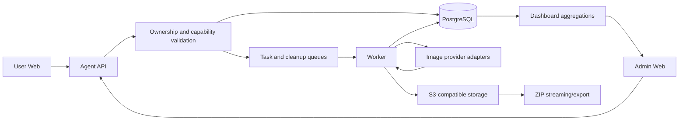

# v0.0.9 Experience Remediation Technical Design

Date: 2026-08-08
Status: Proposed for implementation
Requirement source: `docs/prd/2026-08-08-v009-experience-remediation-requirements.md`
Target repository baseline: `v0.0.9` (`fa6bdda`)

## 1. Summary

This design closes the user and administration gaps reported against v0.0.9 without rewriting the platform's existing image-task fan-out or edit flow. The work is divided into six bounded domains:

1. Correct points grants, expiry snapshots, order presentation, and ledger attribution.
2. Replace the current always-present image `size` contract with explicit `auto`, `ratio`, and `pixel` modes; add capability-driven background selection.
3. Reuse generated images as reference aliases without copying storage objects, then protect shared objects with reference-aware asynchronous cleanup.
4. Introduce user-owned projects as the required ownership boundary for tasks and generated outputs.
5. Complete batch and administration lifecycle operations while preserving historical snapshots.
6. Correct documentation/payment readiness, single-node visibility, and call-distribution telemetry.

The implementation uses additive migrations and compatibility readers first. Destructive behavior, specifically removing `/docs` and the obsolete documentation-setting write fields, is released explicitly and is not hidden behind a compatibility redirect.

## 2. Sources And Current-State Findings

### 2.1 Normative sources

- Product requirements: `docs/prd/2026-08-08-v009-experience-remediation-requirements.md`.
- OpenAI image generations reference: `https://developers.openai.com/api/reference/resources/images/methods/generate`.
- Existing account-model capability requirements and design:
  - `docs/prd/2026-07-09-image-generation-account-model-capabilities-prd.md`
  - `docs/tech/2026-07-09-image-generation-account-model-capabilities-tech-design.md`
- Existing field-contract design: `docs/tech/2026-07-09-image-generation-field-contract-fix-tech-design.md`.
- Existing plan/media lifecycle documents:
  - `docs/prd/2026-08-05-plan-public-media-lifecycle-requirements.md`
  - `docs/tech/2026-08-05-plan-public-media-lifecycle-tech-design.md`
  - `docs/prd/2026-08-06-payment-media-reliability-requirements.md`
  - `docs/tech/2026-08-06-payment-media-reliability-tech-design.md`

The requirement document in this change is authoritative when these sources conflict. In particular, gallery-to-reference import is no longer copy-on-import. The current OpenAI edits reference is deliberately non-normative; existing edit behavior remains and receives only generation-compatible validation shared by the platform.

### 2.2 Verified v0.0.9 behavior

| Area | Current behavior | Consequence |
|---|---|---|
| Cashier crediting | The current cashier path creates permanent recharge grants for base and bonus points; a legacy path applies plan duration. | Fixed-package validity configuration is not consistently effective. |
| Order schema | Payment expiration exists, but the order does not snapshot credit validity and actual credit expiry. | UI cannot accurately distinguish pay-before from use-before dates. |
| Balance API | Bucket totals, gift points, and next-expiry data are available. | User UI omits the default gift split and under-explains expiry. |
| Generation ledger | Ledger entries carry `task_id`; image tasks retain output and charge facts. | Quantity and unit price can be projected without denormalizing ledger rows. |
| Documentation | A direct URL resolver exists, but some navigation passes through `/docs`; readiness still checks obsolete title/base-path configuration. | A click leaves a dead intermediate route and diagnostics can be false. |
| Prompt layout | Right padding reserves button width across every textarea line. | Prompt text cannot use the full width. |
| Gallery import | `import-from-gallery` creates an owned reference copy in object storage. | Import latency and storage usage grow unnecessarily. |
| Size request | GPT Image adapter always sends `size` and also sends `response_format`. | Auto/default provider behavior is impossible and the adapter sends a non-GPT-Image field. |
| Size calculation | Local 1K 16:9 calculation resolves to `1280x720`. | Reported `1672x941` output is not explained by the local calculator and requires correlated upstream diagnostics. |
| Custom pixels | Invalid explicit values may be normalized. | The submitted request can differ from user intent. |
| Output count | A platform task can fan out into several upstream calls based on each candidate's maximum `n`. | This compatibility layer must be retained. |
| History | A multi-result task opens image detail directly. | There is no task-level overview. |
| Assets | Assets have groups but no project ownership. | Cross-page project scoping cannot be enforced. |
| Batch download | The UI starts repeated browser downloads. | It does not produce one ZIP archive. |
| Deletion | Generated images can delete storage before hard-deleting a row; reference deletion may only change DB state. | Failure recovery and shared-object safety are inconsistent. |
| Admin lifecycle | Several DELETE APIs exist, but corresponding UI actions are absent; candidate/price deletion is physical. | Configuration accumulates and historical display depends on snapshots. |
| Full deployment | Full mode maps to single topology, while an empty node ID skips heartbeat registration. | A healthy one-node installation can render an empty cluster. |
| Model distribution | Dashboard distribution uses provider health/latency weights and legacy provider data. | It does not represent actual calls. |

## 3. Goals And Non-goals

### 3.1 Goals

- Make persisted values authoritative and explainable across checkout, wallet, tasks, and UI.
- Keep optional upstream fields optional and reject invalid explicit user input.
- Establish project ownership and object lifecycle invariants at the database boundary.
- Preserve historical records after configuration lifecycle changes.
- Make operational dashboards derive from the same runtime state used by production flows.

### 3.2 Non-goals

- No `/docs` redirect or legacy route.
- No stream or partial-image protocol.
- No rewrite of task output fan-out, concurrency, fallback, partial success, or billing.
- No conformance rewrite based on the current OpenAI edits documentation.
- No multi-currency settlement or exchange-rate subsystem.
- No team projects, roles, membership, or sharing.
- No synchronous object deletion requirement and no full object-store inventory scan on each delete.

## 4. Architecture



The API remains the authority for tenant ownership, effective model capabilities, estimates, and mutation idempotency. Workers remain responsible for upstream image calls and durable background work. Storage keys are implementation details: clients operate on stable entity IDs and receive authorized projected URLs or streamed archives.

### 4.1 Domain boundaries

| Domain | Owner | Primary invariant |
|---|---|---|
| Billing | cashier/store transaction | One paid order credits once using its creation-time snapshot. |
| Generation contract | capability resolver + estimate/create validation | Estimate, create, worker, and provider see the same normalized request. |
| Projects | project service/repository | Every task and generated result belongs to exactly one project owned by the same user. |
| Media references | reference-asset service | An alias may share an object but never owns or prematurely deletes it. |
| Object cleanup | cleanup outbox/worker | Physical deletion occurs only after a fresh zero-reference check. |
| Operations | readiness/metrics services | Status derives from executable runtime configuration and actual records. |

## 5. Design Decisions And Alternatives

### 5.1 Project storage

| Option | Description | Advantages | Disadvantages |
|---|---|---|---|
| A. Add `project_id` only to final image rows | Derive task project from results. | Small task schema change. | A task has no project before outputs exist; failures and future video tasks are ambiguous. |
| B. Add `project_id` to `image_tasks` and `task_images` | Snapshot ownership on both task and result. | Queryable at every state; supports historical and future media records; transfer can update both transactionally. | Requires a bounded dual-table backfill. |
| C. Generic polymorphic asset table immediately | Every media type points through one asset super-table. | Long-term uniformity. | Large migration and behavioral rewrite before video exists. |

Decision: Option B. Introduce `projects`; put `project_id` on tasks and generated results. Future video records must carry the same project foreign key, but a generic asset super-table is deferred.

Reference inputs remain user-scoped. They are not assigned a single `project_id` because one reference can legitimately be reused by tasks in multiple projects.

### 5.2 Reference reuse

| Option | Description | Advantages | Disadvantages |
|---|---|---|---|
| A. Continue storage copy | Import owns an independent object. | Simple deletion semantics. | Duplicate storage, import delay, unnecessary data transfer. |
| B. Reference generated image directly from task input | Store only the generated-result ID on a task. | No extra reference record. | Breaks current reference library workflow and metadata/custom uploads. |
| C. Create a reference alias | Keep a reference record with `source_image_result_id` and shared storage tuple; mark that it does not own the object. | Preserves APIs and metadata while avoiding copy. | Requires reference-aware cleanup and race handling. |

Decision: Option C. New gallery imports create aliases. Existing copied reference records continue with `owns_object=true` and are not rewritten.

### 5.3 Object cleanup

| Option | Description | Advantages | Disadvantages |
|---|---|---|---|
| A. Delete storage synchronously before DB mutation | Current generated-image pattern. | Immediate reclamation. | Partial failure can leave DB/storage disagreement; unsafe with aliases. |
| B. In-process best-effort goroutine | Return quickly and delete later. | Minimal schema. | Work is lost on restart and retry state is invisible. |
| C. Transactional cleanup outbox plus worker | Soft-delete business row and enqueue a deduplicated deletion candidate in the same DB transaction. | Durable, idempotent, observable, retryable. | Adds worker and job retention. |

Decision: Option C. A reconciliation schedule supplements, but does not replace, the durable outbox.

### 5.4 ZIP download

| Option | Description | Advantages | Disadvantages |
|---|---|---|---|
| A. Browser fetches every file and creates ZIP | No server archive endpoint. | Low backend work. | Memory-heavy, fragile with expiring URLs/CORS, poor large-batch behavior. |
| B. API streams ZIP directly | Authorize IDs, fetch objects, and stream one response. | Simple user flow and no archive storage for bounded batches. | Holds an API connection and consumes API bandwidth. |
| C. Asynchronous export job | Worker builds temporary ZIP and returns an expiring download. | Handles large batches and retries. | More state, cleanup, and user polling. |

Decision: deliver Option B for a bounded initial selection and define a threshold where the API returns `202` and uses Option C. Both paths produce one archive and the same manifest. Browser-side repeated download is removed.

## 6. Data Design

Names below describe the logical schema; exact Ent field names follow repository conventions during implementation.

### 6.1 Projects

`projects`

| Field | Type | Rules |
|---|---|---|
| `id` | UUID/string ID | Primary key. |
| `user_id` | user ID | Required; immutable owner. |
| `name` | string | Trimmed, non-empty, bounded length. |
| `is_default` | bool | Required, default false. |
| `status` | enum | `active`, `deleted`. |
| `created_at`, `updated_at`, `deleted_at` | timestamps | `deleted_at` only for soft deletion. |

Indexes and constraints:

- Unique active name per user using a normalized name or service-enforced equivalent.
- Partial unique index on `user_id WHERE is_default = true AND status = 'active'`.
- Index `(user_id, status, updated_at DESC)` for project selectors.
- The service prevents rename/delete of `is_default=true`; database triggers are optional defense in depth if supported by migration conventions.

Add nullable `project_id` foreign keys to `image_tasks` and `task_images`. Index task queries by `(user_id, project_id, created_at DESC)` and result queries by `(user_id, project_id, created_at DESC)`. The migration backfills before new-write enforcement is tightened.

Project transfer updates all project-owned task/result records in one transaction. It locks the source project, verifies target ownership/status, updates rows in bounded SQL statements, marks the source deleted, and emits one audit event. For very large projects, use a transfer job and keep the source in `transferring` state; do not expose a half-transferred project as deleted.

### 6.2 Payment-order credit snapshots

Add to payment orders:

| Field | Type | Meaning |
|---|---|---|
| `credit_valid_days` | nullable integer | Package validity copied at order creation; null for non-expiring fixed packages and custom recharge. |
| `credit_expiry_enabled` | boolean | Expiry policy copied at order creation; false for permanent fixed packages and custom recharge. |
| `base_credit_amount` | fixed decimal | Purchased points snapshot. |
| `bonus_credit_amount` | fixed decimal | Gift points snapshot. |
| `credited_at` | nullable timestamp | Actual successful grant time. |
| `credit_expires_at` | nullable timestamp | `credited_at + credit_valid_days`; null for long-lived grants. |

Add `credit_expiry_enabled` to fixed-package plan storage with default true. Existing plan rows are backfilled true. `duration_days` remains required and positive only when this switch is true; when false, the API returns it as null/omitted for the effective credit policy even if a legacy storage value remains during compatibility rollout.

Do not reuse the payment/order `expires_at`, which remains the deadline to complete payment. Order creation snapshots credit amounts, `credit_expiry_enabled`, and validity days. Completion locks the order and uses only those snapshots, never the then-current plan.

Expiring fixed packages create separate purchased and gift grants with the same `credit_expires_at`. Non-expiring fixed packages create the same separate grant types with null expiry. Custom recharge creates a long-lived recharge grant. A unique order/grant-purpose key prevents duplicate base or bonus grants. Existing permanent grants remain unchanged.

Ledger response enrichment joins `task_id` to immutable task/result settlement facts and returns `successful_output_count`, `effective_unit_points`, and `charged_points`. Unit points are calculated from the persisted charged total divided by successful count, to five decimal places; zero-success rows return no unit price rather than dividing by zero.

### 6.3 Account-model capability fields

Extend the account-model generation capability payload/storage:

| Field | Type | Validation |
|---|---|---|
| `size_modes` | enum array | Subset of `auto`, `ratio`, `pixel`; non-empty for generation models. |
| `base_resolutions` | string array | No `auto`; values supported by the existing resolution calculator. |
| `aspect_ratios` | string array | Valid normalized positive ratios only. |
| `supports_custom_ratio` | bool | Effective only when ratio mode is enabled. |
| `pixel_presets` | dimension array | Each preset must satisfy all hard and configured limits. |
| `supports_custom_pixels` | bool | Effective only when pixel mode is enabled. |
| `min_width`, `max_width` | integer | Positive, min <= max, both within provider/platform hard limits. |
| `min_height`, `max_height` | integer | Positive, min <= max, both within provider/platform hard limits. |
| `supported_backgrounds` | enum array | Subset of `auto`, `opaque`, `transparent`. Empty means the control/field is unsupported. |
| `max_image_count` | integer | Required upstream max `n`, from 1 through 10. |

Effective route capabilities are the safe intersection across active candidates, following the existing resolver contract. Unsupported presets and values are omitted. Administration saves reject invalid configurations rather than relying only on user-side filtering.

### 6.4 Image-task request and diagnostics

Task request snapshots must distinguish absence from a literal value:

| Field | Type | Meaning |
|---|---|---|
| `size_mode` | enum | `auto`, `ratio`, or `pixel`. |
| `requested_size` | nullable string | Null in auto mode; final `WxH` sent for ratio/pixel mode. |
| `requested_base_resolution` | nullable string | Ratio mode input only. |
| `requested_aspect_ratio` | nullable string | Normalized ratio-mode input only. |
| `requested_width`, `requested_height` | nullable integer | Exact resolved/requested dimensions. |
| `background` | nullable enum | Omitted when unsupported/unselected. |
| `output_format` | enum | Existing capability-driven format. |

Per upstream call, persist or emit correlated structured diagnostics containing task ID, call/attempt ID, route model, account model, upstream model, outbound size presence/value, source size mode, upstream request ID, returned width/height, and a mismatch classification. Never log credentials, request image bytes, signed URLs, or private prompts in operational dimensions.

### 6.5 Reference aliases

Extend reference assets:

| Field | Type | Meaning |
|---|---|---|
| `source_image_result_id` | nullable result ID | Set for no-copy gallery imports. |
| `owns_object` | bool | True for uploads/legacy copies; false for aliases. |
| storage tuple | existing fields | Alias snapshots the same backend/bucket/key or resolves it through the source ID. |

Prefer storing `source_image_result_id` plus the immutable storage tuple needed by the existing media access path. The foreign key uses a restrictive or soft-reference policy so business deletion of the source record does not make an alias unreadable. New aliases set `owns_object=false`; new uploads set it true; existing records are backfilled true.

A unique constraint on `(user_id, source_image_result_id, active-status)` may deduplicate repeated imports if current UX treats them as one library item. If duplicate reference entries are a supported UX, use an idempotency key per import request instead and allow several aliases.

### 6.6 Object deletion jobs

`object_deletion_jobs`

| Field | Type | Rules |
|---|---|---|
| `id` | ID | Primary key. |
| `storage_backend`, `bucket`, `object_key` | strings | Canonical object identity. |
| `state` | enum | `pending`, `running`, `retry`, `done`, `blocked`. |
| `attempt_count` | integer | Increment on claimed attempt. |
| `next_attempt_at` | timestamp | Exponential backoff with jitter. |
| `last_error_code` | nullable string | Bounded/sanitized. |
| `created_at`, `updated_at`, `completed_at` | timestamps | Lifecycle timestamps. |

Use a uniqueness key for the live canonical object identity so duplicate deletes coalesce. The worker claims with row locking/skip-locked semantics, rechecks live references, and only then deletes storage. A job with live references becomes `blocked` or `done-with-reference`; deletion of the last reference enqueues/reactivates it. Storage not-found is idempotent success.

Reference checks include all live generated results, reference aliases, public/publication records, and artifact-recovery records. The import transaction locks/rechecks its source against deletion state. The cleanup worker performs a final database check after claim so an import/delete race cannot delete a newly referenced object.

## 7. API And Contract Changes

### 7.1 Project APIs

| Method and path | Behavior |
|---|---|
| `GET /api/agent/project/v1/projects` | List the authenticated user's active projects and identify the default. |
| `POST /api/agent/project/v1/projects` | Create a non-default project. Supports an idempotency key. |
| `PATCH /api/agent/project/v1/projects/{id}` | Rename a non-default active project. |
| `DELETE /api/agent/project/v1/projects/{id}` | Delete empty project, or transfer then delete when `target_project_id` is supplied. |

Delete request example:

```json
{
  "target_project_id": "project_default_id",
  "expected_version": 4
}
```

Return `409 project_not_empty` with counts when no target is supplied, `409 project_changed` on stale version, `403 default_project_immutable` for the default, and `404` for a missing or foreign project.

Task creation accepts optional `project_id`; omission resolves the authenticated user's default project. Task/list/detail and gallery list responses return `project_id` and a minimal project snapshot. Gallery queries accept `project_id` and enforce ownership before querying.

The shared frontend project store persists a project ID scoped by authenticated user ID, not one unqualified global key. On bootstrap it loads server projects, validates the remembered ID, falls back to default, and publishes the selection to workspace/gallery navigation in the same tab and through the browser `storage` event across tabs.

### 7.2 Batch asset APIs

Use stable IDs and explicit per-item results:

- `POST /api/agent/gallery/v1/images:batch-publish`
- `POST /api/agent/gallery/v1/images:batch-group`
- `POST /api/agent/gallery/v1/images:batch-delete`
- `POST /api/agent/gallery/v1/images:batch-transfer-project`
- `POST /api/agent/gallery/v1/images:batch-download`

Mutation response:

```json
{
  "succeeded": [{"id": "img_1", "entity": {}}],
  "failed": [{"id": "img_2", "code": "conflict", "message": "..."}]
}
```

The initial selection contract sends explicit loaded IDs. The UI says `selected N loaded assets`; it does not imply selection of unloaded search results. Each endpoint deduplicates IDs, caps batch size, checks every item belongs to the user and current/source project, and commits item-safe changes. Project transfer rejects a target outside the user.

For bounded ZIPs, `POST .../download` authorizes IDs, creates a deterministic sanitized filename manifest, and streams `application/zip`. It records per-file failures in `manifest.json` unless authorization fails, in which case the whole request fails without leaking existence. Above configured byte/count thresholds it returns an export job and status endpoint. Temporary archives have expiry and enqueue their own cleanup job.

### 7.3 Generation capability and request APIs

Capability responses add:

```json
{
  "size_modes": ["auto", "ratio", "pixel"],
  "base_resolutions": ["1K", "2K"],
  "aspect_ratios": ["1:1", "16:9"],
  "supports_custom_ratio": true,
  "pixel_limits": {
    "min_width": 512,
    "max_width": 4096,
    "min_height": 512,
    "max_height": 4096
  },
  "supports_custom_pixels": true,
  "pixel_presets": ["1024x1024"],
  "supported_backgrounds": ["auto", "opaque", "transparent"],
  "max_image_count": 4
}
```

Estimate and create requests use the same discriminated size contract. Examples:

```json
{"size_mode":"auto","output_format":"png"}
```

```json
{"size_mode":"ratio","base_resolution":"1K","aspect_ratio":"16:9","output_format":"webp"}
```

```json
{"size_mode":"pixel","width":1280,"height":720,"background":"transparent","output_format":"png"}
```

Estimate returns `resolved_size=null` for auto and the exact resolved dimensions for ratio/pixel. Task creation repeats validation against the current capability version. The worker validates the persisted normalized snapshot again before provider construction to prevent stale/forged jobs.

The GPT Image generation adapter:

- omits `size` when mode is auto;
- sends the resolved `WxH` only for ratio/pixel;
- omits `response_format` for GPT Image models;
- sends background only when configured and selected;
- preserves existing quality, moderation, output format, and conditional compression behavior;
- does not add stream or partial-image fields.

### 7.4 Documentation and readiness contracts

Remove the user route registration/component for `/docs`. All buttons/links call the existing URL resolver and navigate directly to the effective `PIC_GALLERY_DOCS_URL`/`VITE_DOCS_URL` target using the intended same/new-tab behavior.

Remove obsolete documentation title/base-path controls from the admin read/write UI and stop using them as a readiness prerequisite. For one compatibility release, backend reads may ignore stored legacy keys; writes reject or ignore them according to the repository's config-version policy. Secrets/config exports should no longer advertise them.

The documentation readiness check resolves the same effective target used for deployment and probes the local/deployed OpenAPI/examples contract with a bounded timeout. It reports URL class and sanitized failure reason, not tokens or full signed query strings.

Payment readiness calls the same effective method-to-enabled-provider eligibility resolver used by checkout. Mock providers are excluded in production. A readiness item is healthy only when at least one enabled, adequately configured instance can serve the payment method.

### 7.5 Dashboard call distribution

Add a dashboard aggregation query over actual upstream call/attempt records in a required time window. Response dimensions include route model at minimum and may include account model/upstream model:

```json
{
  "window": {"from":"...","to":"..."},
  "total_calls": 42,
  "groups": [
    {"key":"route-image-main","calls":30,"percentage":71.42857},
    {"key":"unrouted","calls":12,"percentage":28.57143}
  ]
}
```

Count upstream call attempts, not requested output count. Preflight failures without a selected route/account model are explicitly grouped as `unrouted` only if they have a call record; otherwise the API returns a separate preflight-failure counter outside `total_calls`. Group counts must equal `total_calls` exactly. The UI labels the time window and metric.

### 7.6 Admin lifecycle APIs and UI

Reuse existing DELETE/lifecycle endpoints where present; do not create parallel mutations solely for the UI. Add visible icon actions with tooltips, confirmation, dependency-conflict rendering, and audit events for:

- account and real account model deletion;
- route model and candidate/capability deletion;
- resolution price-row deletion;
- plan enable/disable/archive/restore.

Account, account-model, and route-model deletion remains soft. Candidate and price-row deletion may remain physical because task/call/order records retain immutable route, upstream identity, and price snapshots. Before allowing a physical delete, verify those snapshots are populated for all affected historical record versions; otherwise backfill or convert that resource to soft deletion.

## 8. Size And Field Validation

### 8.1 One normalization function

Implement one pure domain validator used by capability filtering, estimate, create, and worker validation. Frontend validation mirrors it for immediacy but is never authoritative.

Input: effective capability, `size_mode`, ratio/base resolution or explicit width/height, background, output format, and model family.

Output: normalized persisted fields, optional outbound size, resolved dimensions, or a stable typed error.

### 8.2 Auto mode

1. Require effective capability to include `auto`.
2. Reject ratio/base-resolution/pixel fields if supplied, rather than silently retaining stale hidden values.
3. Persist `size_mode=auto` and nullable requested dimensions.
4. Omit the downstream `size` key entirely.

### 8.3 Pixel mode

1. Require `pixel` capability.
2. Require integer width and height.
3. If using a preset, require it to remain in effective presets.
4. If custom, require `supports_custom_pixels=true`.
5. Enforce configured min/max width and height.
6. Enforce provider/platform hard constraints, including dimensions divisible by 16 and aspect ratio between `1:3` and `3:1` for the GPT Image generations-compatible contract.
7. Reject on any failure. Never round, clamp, swap, or substitute explicit pixel values.

### 8.4 Ratio mode

1. Require `ratio` capability and a supported base resolution.
2. Parse `W:H` as positive bounded integers, reduce by greatest common divisor, and enforce `1:3 <= W/H <= 3:1`.
3. Require a configured ratio unless `supports_custom_ratio=true`.
4. Resolve nominal dimensions using the existing base-resolution policy.
5. Round computed dimensions to the nearest legal 16-pixel grid while preserving the ratio as closely as possible and remaining inside hard/configured limits.
6. If no legal pair exists, reject instead of silently selecting a different ratio/resolution.
7. Return the exact resolved `WxH` from estimate and display it before create.

Only computed ratio-mode dimensions may be rounded. The same resolver must run in estimate and creation, and the task snapshots its result so worker behavior cannot drift if admin configuration changes later.

### 8.5 Background and output format

1. Omit background when the effective capability has no supported background values.
2. Reject a selected value outside `supported_backgrounds`.
3. Require `output_format in {png, webp}` when `background=transparent`.
4. The UI may automatically move background to `auto` or `opaque` when the user changes output format to JPEG, but it must visibly update the selector. API callers receive a typed validation error instead of silent coercion.
5. Repeat the invariant in estimate, create, and provider construction.

### 8.6 Output count and fan-out preservation

`max_image_count` is the maximum `n` for one upstream request to one account model and is constrained to `1..10`. It is not the platform task output limit.

The current task planner continues to split total requested outputs into several upstream calls, applying the selected candidate's `max_image_count`, existing concurrency limits, fallback order, partial-success settlement, and billing rules. For example, a 12-image platform request routed to a candidate with max `n=4` remains three upstream calls. This remediation may add tests and validation around the planner but must not replace it.

Edits continue through the current edit adapter and fan-out behavior. Only shared generation-compatible validation, such as optional size and transparent-format compatibility where already applicable, is reused.

### 8.7 Requested versus actual dimensions

Do not change the 1K 16:9 resolver merely to match the observed `1672x941` output. Instrument each provider response to decode actual dimensions and compare them with the outbound request:

- `match`
- `upstream_rewritten`
- `missing_outbound_size`
- `decode_failed`
- `local_contract_violation`

If the outbound request remains `1280x720` and the upstream result is `1672x941`, classify it as upstream rewrite and display actual dimensions on the asset while retaining requested dimensions in task detail. A local fix is authorized only if tracing shows an adapter or worker mutation before the HTTP request.

## 9. User Experience Changes

### 9.1 Orders and balance

Recent order rows show base and bonus credits separately. Pending rows show `valid N days after crediting`; completed rows show the immutable `credit_expires_at`. Payment expiry keeps a separate label.

Balance uses returned buckets to show fixed-package purchased, custom recharge, gift, and trial points. It shows the next expiring amount/time across all grants. Ledger generation rows show successful count, unit points, total charged, and task link. Values use the platform's five-decimal rules and never infer expiry from the current plan.

### 9.2 Workspace

The prompt textarea takes full width and reserves only bottom padding for overlaid action buttons. The buttons use a positioned layer with accessible focus handling and do not cover the last line.

On importing from gallery into an empty reference list, the response includes a reusable source-task parameter snapshot. The client applies only fields still valid under current effective capability and presents any fallback/change. Once one reference exists, subsequent imports append without parameter overwrite.

History tasks with multiple successful results open `TaskResultOverview`; selecting a result opens the existing `ImageDetailModal`. Closing detail restores overview state. Single-result tasks may continue to open detail directly.

### 9.3 Projects and assets

Workspace and gallery share one project selector and project store. The project management menu supports create, rename, and delete/transfer. The default project is visibly locked for rename/delete without explanatory marketing copy.

Asset selection controls remain visible enough to discover. The toolbar has select all, invert, clear, ZIP download, publish, group, delete, and project transfer. Stable toolbar dimensions prevent layout shifts. Successful batch items update locally; failed IDs remain selected with an error summary and retry action.

## 10. Transaction, Concurrency, And Idempotency

### 10.1 Payment completion

- Lock order by order number inside the existing completion transaction.
- Treat an already completed order with matching payment identity as success.
- Create base/gift grants using unique `(order_id, grant_kind)` keys.
- Set `credited_at` and `credit_expires_at` in the same transaction.
- Use decimal arithmetic and UTC timestamps.

### 10.2 Default project creation

- `ensureDefaultProject(userID)` is idempotent under the unique default-project constraint.
- User creation creates the default project in its transaction when feasible.
- Read/write fallback may call ensure for legacy users during migration.
- A task without project ID resolves/locks the default before insertion.

### 10.3 Project deletion and transfer

- Lock source and target projects in stable ID order.
- Reject default/foreign/deleted targets and self-transfer.
- Recount project-owned records inside the transaction.
- Update tasks and results, then soft-delete source and write audit.
- An idempotency key makes client retries return the prior result.

### 10.4 Alias import versus deletion

- Import validates user ownership, locks or version-checks the live source result, inserts alias with an idempotency key, then commits.
- Source deletion soft-deletes the business result and enqueues its object candidate in one transaction.
- Cleanup never trusts the enqueue-time reference count; it rechecks after claiming.
- A late alias transaction either observes deleted source and fails, or commits before cleanup's final reference query and protects the object.

### 10.5 Batch mutations

Each item has its own typed result. For mutations that must be all-or-nothing by business meaning, such as deleting a project with transfer, use one transaction. Ordinary heterogeneous batch actions may use bounded item transactions so one conflict does not roll back unrelated successes.

## 11. Error Model

Stable error codes include:

| Code | HTTP | Meaning |
|---|---:|---|
| `invalid_size_mode` | 400 | Mode absent or unsupported. |
| `invalid_explicit_dimensions` | 400 | Pixel value violates exact constraints. |
| `invalid_aspect_ratio` | 400 | Ratio malformed/out of bounds/unavailable. |
| `transparent_format_conflict` | 400 | Transparent requested with non-PNG/WebP output. |
| `capability_changed` | 409 | Estimate snapshot no longer matches current effective capability. |
| `project_not_empty` | 409 | Target required before deletion. |
| `project_changed` | 409 | Optimistic version conflict. |
| `default_project_immutable` | 403 | Rename/delete attempted on default. |
| `source_asset_unavailable` | 409 | Alias source was deleted during import. |
| `configuration_in_use` | 409 | Admin resource has live dependency. |
| `export_too_large` | 413/202 | Request rejected or promoted to async export according to configured policy. |

Provider rejection keeps a sanitized provider code/message and correlated attempt ID. Cleanup failures are not exposed as successful physical deletion; the asset remains business-deleted and the retry is visible to operations.

## 12. Migration And Compatibility

### 12.1 Schema rollout

1. Add project, order snapshot, alias, capability, diagnostic, and cleanup-job structures with nullable/backward-safe fields.
2. Deploy dual-read/new-write code that ensures a default project and writes project IDs for new tasks/results.
3. Backfill one default project per user idempotently.
4. Backfill task/result project IDs in bounded user/time ranges. Record progress and retry without table-wide transactions.
5. Validate no active task/result lacks a project, then tighten new-write/database constraints in a later migration.
6. Backfill existing reference assets as `owns_object=true`; only post-rollout gallery imports set aliases/false.
7. Infer account-model `size_modes` to include `auto` when the legacy base-resolution list contained `auto`, then remove that token from base resolutions. Flag configurations with no remaining legal mode for administrator repair.
8. Validate/clamp no data silently: invalid legacy pixel presets are retained in admin storage for diagnosis but filtered from effective user capabilities until corrected.
9. Existing permanent wallet grants remain permanent. Only orders created/completed under the snapshot contract gain corrected expiry.

### 12.2 Breaking changes

- Remove `/docs` route and references in the same release. Do not redirect it.
- Remove documentation title/base-path fields from admin UI and public write contracts. Stored legacy keys may remain inert until a later storage cleanup migration.
- Base-resolution `auto` is no longer accepted on new configuration writes; `size_modes` owns auto behavior.
- `max_image_count` values outside `1..10` must be repaired before affected account models can be enabled/saved. Existing running configuration should be surfaced as invalid rather than silently changed.

### 12.3 Compatibility scenarios

| Scenario | Required behavior |
|---|---|
| Old task has no project during backfill | Read resolves/display default project; new mutations first persist the default project ID. |
| Client omits project ID | Server assigns authenticated user's default. |
| Browser remembers deleted/foreign project | Bootstrap replaces it with default and updates storage. |
| Existing copied reference is deleted | Its owned object enters cleanup only after all live references are gone. |
| New alias source row is soft-deleted | Alias remains readable and protects the shared object. |
| Historical grant has no expiry | Remains long-lived; UI does not infer current plan duration. |
| Legacy task has `base_resolution=auto` | Historical display remains readable; replay/new write maps to `size_mode=auto` and omits size after capability validation. |
| Platform task requests 12 outputs with max `n=4` | Existing planner emits multiple calls; no API validation caps platform total at 10. |
| Stale client sends transparent JPEG | Server rejects consistently even if old UI allowed it. |
| Deleted model configuration appears in history | Snapshot/fallback identity and price remain visible without joining only to active config. |

## 13. Cluster And Operational Corrections

For `full`/single topology, expose one synthetic logical node with a stable installation ID and role/state derived from the local API/worker supervisor. Do not create separate logical nodes per process. Persist or deterministically derive the installation ID from deployment configuration; an empty optional distributed node ID must not suppress single-node visibility.

Distributed topology keeps heartbeat registration, TTL, and stale-node behavior. The cluster API identifies node origin as `logical-single` or `heartbeat` so diagnostics are explicit.

Readiness checks must be individually timed, cached briefly, and report `healthy`, `degraded`, or `unavailable` with last-check time. They must not mutate provider or docs configuration.

## 14. Observability And Alerts

### 14.1 Metrics

- `billing_credit_completion_total{plan_type,result}`
- `billing_credit_expiry_snapshot_missing_total`
- `image_request_total{route_model,account_model,upstream_model,result}`
- `image_size_mismatch_total{classification,account_model,upstream_model}`
- `image_validation_rejection_total{field,code}`
- `reference_import_total{kind=alias|copy,result}`
- `object_cleanup_jobs{state}` and `object_cleanup_attempt_total{result}`
- `object_cleanup_age_seconds` for oldest pending/retry job
- `project_backfill_remaining`
- `zip_export_total{mode,result}` and duration/bytes
- `readiness_check_total{component,status}`

Avoid user IDs, object keys, prompts, signed URLs, or unbounded model/error strings as metric labels.

### 14.2 Structured events

Record bounded events for order credit snapshots, project lifecycle/transfer, admin lifecycle changes, reference alias creation, cleanup decisions, and requested/actual size mismatches. Events include stable IDs and actor/audit metadata, not secrets.

### 14.3 Alerts

- Any duplicate grant invariant violation.
- Cleanup retry backlog above count/age threshold.
- Sustained object-delete failure rate.
- Project backfill stalled or active rows missing project after enforcement milestone.
- Sustained size mismatch increase by account/upstream model.
- Model-call aggregation lag or reconciliation mismatch.
- Full deployment reporting zero or more than one logical single node.
- Checkout-enabled method with no eligible production provider.

## 15. Security And Tenant Isolation

- Resolve every project, task, result, reference, group, and batch ID under the authenticated user scope.
- Do not reveal whether a foreign ID exists; return the repository-standard not-found response.
- Project transfer requires both source and target to share the same owner.
- Reference aliases can only target user-owned generated results or explicitly public-import flows with their existing authorization policy.
- Object cleanup is a privileged worker operation; user input never supplies a raw bucket/key to a delete endpoint.
- ZIP entry names are sanitized, deduplicated, and protected against path traversal; archive limits guard memory, CPU, and decompression abuse.
- Documentation readiness only probes allowlisted deployment-resolved targets and must not become an arbitrary URL/SSRF endpoint.
- Audit all admin lifecycle and project destructive actions with actor, target, before/after state, and correlation ID.

## 16. Performance And Cost

- Alias import removes S3 Copy/Put and avoids a second object, reducing both latency and storage.
- Project indexes keep workspace/gallery queries bounded by user and project.
- Backfills use keyset pagination and rate limits; no unbounded transaction spans all users.
- Cleanup workers use bounded concurrency per storage backend, exponential backoff, and batch reference queries.
- Dashboard aggregation uses indexed call timestamps/dimensions or a periodic rollup if the raw table exceeds the latency budget. Do not compute from provider health weights.
- Direct ZIP streaming is capped by count and estimated bytes; large exports use asynchronous temporary objects with lifecycle cleanup.
- Actual dimension decoding reuses already-read response bytes or metadata and must not redownload generated objects solely for metrics when dimensions are already available.

## 17. Rollout And Rollback

### Stage 0: diagnostics and additive schema

- Add observability and nullable fields/tables.
- Instrument outbound and actual image dimensions before changing size behavior.
- Deploy no user-visible breaking change.

Rollback: disable new writers; additive schema remains inert.

### Stage 1: correctness fixes

- Enable order credit snapshots and correct grant types/expiry for new orders.
- Fix balance/order/ledger presentation, prompt layout, ICP removal, docs direct links/readiness, and admin lifecycle actions.
- Remove `/docs` and obsolete docs fields with release-note communication.

Rollback: retain snapshot readers; revert UI/route bundle if necessary. Never delete grants already correctly issued.

### Stage 2: image contract

- Migrate capabilities from legacy auto.
- Enable `size_mode`, exact validation, optional size, background, and max `n=1..10` behind capability/config rollout.
- Preserve fan-out and edits behavior.

Rollback: disable new controls and continue reading snapshots. Do not reintroduce silent pixel normalization. Re-enable legacy adapter only if provider calls fail broadly and record the temporary exception.

### Stage 3: aliases and cleanup

- Enable cleanup outbox first, then no-copy import for a cohort.
- Monitor alias import and cleanup backlog.
- Reconcile legacy deletion candidates.

Rollback: turn off new alias creation and return to copy for new imports only. Existing aliases remain supported and continue protecting shared objects.

### Stage 4: projects and batch workflow

- Create defaults, enable project-aware new writes, complete backfill, then expose selectors/management and enforce project constraints.
- Enable ZIP and batch transfer.

Rollback: hide selectors and resolve default server-side while retaining project IDs. Do not drop projects or reverse transferred ownership.

### Stage 5: operational dashboards

- Enable logical single-node projection and real call distribution.
- Compare aggregation totals against raw records before replacing old cards.

Rollback: hide affected visualization; retain raw metrics and records. Do not fall back to labeling health weights as call distribution.

Release blockers/rollback triggers include duplicate credit, cross-tenant project exposure, shared-object premature deletion, material generation failure-rate increase, unresolved migration gaps, or call totals failing reconciliation.

## 18. Test Strategy

### 18.1 Backend unit and repository tests

- Order snapshot creation, fixed-package base/gift grants, custom recharge permanence, idempotent completion, and historical non-expiry.
- Fixed-package expiry-switch defaults, validation, permanent grants, and order-policy immutability after plan edits.
- Balance bucket/next-expiry projection and generation ledger quantity/unit calculations, including zero and partial success.
- Project default uniqueness, CRUD invariants, ownership, atomic transfer, idempotency, and concurrent delete/create behavior.
- Capability migration/filtering and admin validation for auto, base resolutions, pixel ranges, background, and max `n`.
- Table-driven size validator tests at every min/max, divisibility, and ratio boundary; property tests ensure returned ratio-mode dimensions are legal.
- Estimate/create/worker normalization equivalence.
- GPT Image payload serialization verifies absent `size`, absent `response_format`, and transparent-format rejection.
- Fan-out regression tests for totals below, equal to, and above candidate max `n`, including partial success/fallback/billing.
- Alias imports perform zero storage Copy/Put; alias/source deletion races; last-reference cleanup; storage-not-found; retry/restart recovery.
- ZIP authorization, manifest, duplicate names, path traversal, limits, partial object failures, and temporary archive cleanup.
- Admin delete dependency conflicts and historical snapshot fallbacks.
- Single topology logical node and distributed heartbeat behavior.
- Payment/docs readiness parity and call-distribution reconciliation.

### 18.2 Frontend tests

- Order/base/bonus/expiry states and wallet split/next expiry.
- Direct docs URL navigation and absence of `/docs` route.
- Prompt full-line width and non-overlapping action controls at desktop/mobile sizes.
- Size-mode conditional controls, custom ratio/pixel errors, unsupported option filtering, and estimate display.
- Transparent background/format interaction with visible state updates.
- First reference applies compatible parameters; later references do not overwrite.
- Multi-result overview-to-detail-to-overview navigation.
- User-scoped remembered project selection, deleted-project fallback, cross-tab sync, and default project restrictions.
- Discoverable selection toolbar and partial batch-result behavior.
- Admin lifecycle controls, confirmation, dependency errors, capability validation, and readiness/distribution rendering.

### 18.3 Integration and smoke tests

- Create/pay fixed package, verify two grants/order UI/next expiry, then settle a partial-success task and reconcile ledger.
- Generate with auto and assert provider capture has no `size`; generate ratio/pixel and assert exact resolved size.
- Request platform count greater than max upstream `n` and assert existing multi-call behavior and one platform task settlement.
- Import gallery image, assert unchanged object count/key, generate from alias, delete source, verify alias still works, then delete last reference and observe cleanup.
- Migrate legacy user/assets, switch project between workspace/gallery, transfer/delete a populated project.
- Stream/download one ZIP and inspect entries/manifest.
- Run full deployment and verify exactly one logical node.
- Seed call attempts and verify dashboard totals/percentages.

Repository verification before implementation completion must use `./scripts/workflow/verify.sh`. Backend/API/config/deployment changes also require `./scripts/workflow/api-smoke.sh`; visual workflows require browser checks at representative desktop and mobile viewports.

## 19. Acceptance-Criteria Traceability

| Requirement acceptance criterion | Design and primary verification |
|---:|---|
| AC1-2 | Sections 6.2, 7.1, 9.1, 10.1; billing/store and UI tests. |
| AC3-4 | Sections 7.4 and 17 Stage 1; route/link and readiness tests. |
| AC5-7 | Sections 6.3-6.4, 7.3, 8.1-8.5; validator/payload tests. |
| AC8 | Section 8.6; fan-out regression/integration test. |
| AC9-10 | Sections 5.2, 6.5, 9.2, 10.4; storage-spy and frontend state tests. |
| AC11 | Section 9.2; overview/detail component test. |
| AC12-13 | Sections 6.1, 7.1, 10.2-10.3, 12; migration and ownership tests. |
| AC14-15 | Sections 5.3-5.4, 6.6, 7.2, 10.4-10.5; ZIP and cleanup fault tests. |
| AC16 | Sections 7.6 and 12.3; lifecycle/history tests. |
| AC17-18 | Sections 7.5 and 13; topology and aggregation tests. |
| AC19 | Sections 6.4, 8.7, and 14; correlated mismatch integration test. |

## 20. Expected Code Impact

This is an implementation map, not permission to modify generated Ent output by hand. Schema edits must be made in `internal/repository/ent/schema` and regenerated using the repository workflow.

| Area | Existing primary modules | Expected change |
|---|---|---|
| Payment and points | `internal/domain/billing/types.go`, `internal/service/billing`, `internal/repository/ent/schema/subscriptionplan.go`, `internal/repository/ent/schema/paymentorder.go`, `internal/repository/entstore/billing_store.go` | Add plan expiry switch and order credit snapshots; unify completion grants; enrich order/balance/ledger projections. |
| User billing UI | `web/user/src/pages/ProfilePage.tsx`, `web/user/src/pages/profileBalanceModel.ts`, order/checkout view models | Render base/gift/expiry and task charge calculations. |
| Docs/compliance | `web/user/src/docsUrl.ts`, user routing/components, `web/user/src/components.tsx`, `internal/http/handlers/api.go`, admin system-settings pages | Remove `/docs` and ICP text; remove obsolete fields; use effective readiness checker. |
| Generation capability | `internal/domain/modeladmin/types.go`, `internal/domain/modelhub`, `internal/repository/ent/schema/modelaccountmodel.go`, `internal/service/modeladmin`, `web/admin/src/pages/ProviderModelsPage.tsx` | Add auto/background/custom ratio/pixel bounds and max `n` validation; migrate legacy auto. |
| Task validation/provider | `internal/service/imagetask`, `internal/provider/openai/client.go`, `internal/provider/contracts.go`, billing estimate handlers | Share size/background normalization, omit optional fields, preserve fan-out, capture actual dimensions. |
| Workspace | `web/user/src/pages/WorkspacePage.tsx`, workspace draft/view models and contracts | Full-width prompt, conditional size/background controls, first-reference reuse, multi-result overview, project selector. |
| Reference assets | `internal/service/assets/gallery_import.go`, `internal/service/assets`, `internal/repository/ent/schema/referenceasset.go`, related stores/handlers | Replace copy with alias creation; return reusable source parameters; protect shared objects. |
| Projects | new domain/service/store plus `internal/repository/ent/schema/project.go`, `imagetask.go`, `imageresult.go`, `internal/http/router/router.go` | CRUD, default ensure/backfill, task/gallery scoping, atomic transfer, audit. |
| Gallery/batch/export | `web/user/src/pages/GalleryPage.tsx`, `galleryBatchActions.ts`, gallery handlers/store, storage abstraction | Discoverable selection, partial-result mutations, project transfer, one ZIP/export job. |
| Object lifecycle | `internal/service/imagetask/service.go`, asset deletion paths, new cleanup service/schema/worker wiring | Soft delete plus durable outbox, reference recheck, retry and reconciliation. |
| Admin lifecycle | `web/admin/src/pages/CashierPage.tsx`, model/route/pricing pages, `internal/service/modeladmin`, existing admin handlers | Surface existing actions, validate dependencies, audit, preserve history snapshots. |
| Cluster/operations | `internal/app/cluster_heartbeat.go`, `internal/service/cluster`, cluster store/API, `web/admin/src/pages/OverviewPage.tsx`, readiness/cluster view models | Logical single node, runtime-parity readiness, real call aggregation. |

New API routes belong in `internal/http/router/router.go` and its route-policy table. Shared frontend API types and contract fixtures must be updated together with backend JSON contracts.

## 21. Implementation Plan And Ownership

The sequence is dependency-driven; calendar estimates require human confirmation after owners and migration volumes are known.

| Phase | Work | Depends on | Owner | Schedule |
|---|---|---|---|---|
| 1 | Add schemas, typed contracts, diagnostics, and compatibility readers | None | Backend/Data | To be confirmed |
| 2 | Add fixed-package expiry switch, correct order/grant transaction, and update user billing views | Phase 1 order/plan fields | Backend + User Web + Admin Web | To be confirmed |
| 3 | Docs/compliance/prompt and readiness fixes | None | User Web + Admin Web + Backend | To be confirmed |
| 4 | Capability migration, size/background validation, adapter changes, fan-out regression coverage | Phase 1 contracts | Backend + Worker + both Web apps | To be confirmed |
| 5 | Alias import and durable cleanup | Phase 1 cleanup/alias schema | Backend + Worker | To be confirmed |
| 6 | Default projects, backfill, project APIs/store/UI | Phase 1 project schema | Backend + User Web + Data | To be confirmed |
| 7 | Multi-result overview, batch actions, ZIP/export | Project APIs and cleanup | User Web + Backend + Worker | To be confirmed |
| 8 | Admin lifecycle completion, logical node, real call distribution | Snapshot and telemetry readiness | Admin Web + Backend/SRE | To be confirmed |
| 9 | Full verification, isolated smoke, browser QA, rollout review | All phases | QA + all owners | To be confirmed |

Work may be split into independently reviewable changes, but project enforcement must not ship before backfill validation, and no-copy aliases must not ship before reference-aware cleanup is operational.

## 22. Risks And Mitigations

| Risk | Impact | Mitigation |
|---|---|---|
| Corrected expiry changes user-visible balances | High | Apply only to new snapshotted orders; show exact expiry; audit grants. |
| Project backfill locks large tables | High | Nullable-first rollout, keyset batches, rate limit, progress metric, later constraint. |
| Alias/source deletion race removes live object | Critical | Transaction/version serialization plus cleanup-time reference recheck. |
| Object cleanup leaks data after repeated failures | Medium | Durable jobs, backoff, oldest-age alert, low-frequency reconciliation. |
| Cleanup deletes an object referenced by an overlooked record type | Critical | Central reference query includes generated, alias, public, and recovery records; fault/invariant tests. |
| Effective capability intersection hides all options | Medium | Admin validation and explicit invalid configuration diagnostics. |
| Strict pixel validation increases client errors | Medium | Filter invalid presets, mirror validation in UI, return typed actionable errors. |
| Upstream rewrites dimensions | Medium | Preserve requested/actual values and classify; do not fake calculator agreement. |
| ZIP streaming exhausts API resources | High | Count/byte/time limits and async threshold. |
| Physical config deletion harms history | High | Verify immutable snapshots before delete or switch resource to soft deletion. |
| Dashboard aggregation becomes expensive | Medium | Indexed bounded window, cache/rollup, reconciliation checks. |
| Removing `/docs` breaks bookmarks | Accepted | Intentional breaking change, direct current links, release notes; no redirect. |

## 23. Self-review Checklist

- [x] Every user-side and administration report item is represented by a requirement and a technical component.
- [x] `/docs` removal is explicitly breaking and has no redirect.
- [x] Background is capability-configured and transparent requires PNG/WebP at every validation layer.
- [x] Stream and partial images are excluded.
- [x] Platform output fan-out is preserved; only per-account-model upstream max `n` is constrained to 1-10.
- [x] Existing edits behavior is retained and the outdated edits reference is non-normative.
- [x] Project ownership, default migration, global selection, and delete-with-transfer are specified.
- [x] Reference reuse performs no object copy and shared-object deletion is race-safe.
- [x] Order/payment expiry and credit expiry use different snapshots/fields.
- [x] Fixed packages can be permanent; legacy/new defaults and order snapshot immutability are specified.
- [x] Requested and actual image dimensions remain distinct and diagnosable.
- [x] Destructive admin lifecycle actions preserve historical meaning through snapshots or soft deletion.
- [x] Rollout, rollback, observability, security, performance, tests, and acceptance mapping are included.
- [ ] Engineering owners, migration volume, rollout dates, and environment thresholds require human confirmation before implementation.
