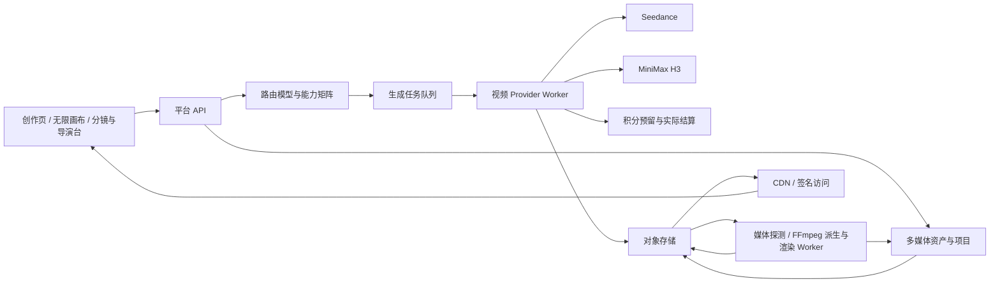

# 多媒体创作平台技术预研报告

> 日期：2026-08-11
> 基线：当前工作树 `codex/v012-workspace-prompt-followups`，HEAD `d988552`
> 范围：视频生成、无限画布、本地资产上传、多媒体资产管理、分镜编排与在线多媒体导演台
> 性质：技术预研，不是已排期的实施方案。文中的人月、服务器规格和成本均需通过 PoC 与真实业务数据校准。

## 1. 执行摘要

基于当前平台代码、Nova Image Studio 画布实现，以及 Seedance、MiniMax 官方资料，本次目标中有三条链路可以在现有基础上较快跑通：

1. **本地多媒体上传与资产管理**：当前项目、对象存储、签名 URL、资产迁移及异步删除能力可以复用；需要将图片专用资产扩展为图片、视频、音频统一的媒体资产，并增加缩略图、视频海报、预览代理、音频波形等派生文件。
2. **双厂商视频生成**：当前“路由模型 -> 账号与真实模型 -> 异步任务 -> 积分预留和结算 -> 对象存储”的主链路可复用。视频任务和计费维度不能直接塞入现有图片表，应新建视频任务域、厂商适配器和可扩展计量规则。
3. **无限画布**：Nova 已证明自研 DOM 节点、CSS 视口变换、SVG 连线的方案能支撑图片生成画布。项目所有者已确认通过线下与作者沟通取得商业授权，可在授权范围内复用实现；平台仍需重做服务端持久化、版本控制、视频节点、任务恢复和现有设计系统集成。

“Adobe Premiere/剪映等价”的专业多轨导演台不适合作为初创阶段的一期目标。建议先交付“分镜编排器 + AI 镜头生成 + 简单时间线 + 服务端 FFmpeg 导出”，用真实用户行为验证需求后，再决定是否投入完整多轨编辑器。

推荐采用“**增量多媒体内核**”路线：现有图片链路保持兼容，新视频和上传资产进入新的媒体内核，之后再逐步让图片资产接入统一模型。这样能避免一次性重构现有稳定业务，也不会为视频复制一套长期无法统一的孤立系统。

目标架构关系如下：



## 2. 调研边界与结论标记

本文采用以下标记：

- **官方事实**：来源于厂商或 Web 标准官方文档，链接见文末。
- **代码事实**：来源于当前仓库或 Nova Image Studio 的实际代码。
- **技术判断**：结合现状给出的架构建议，需在实施设计阶段确认。
- **已确认决策**：项目所有者在后续 PRD/技术方案中已经固化的产品输入。

价格资料检索于 2026-08-11。厂商可能随时调整价格、模型版本、限流和能力，正式上线时必须以当日控制台和合同价格为准。

## 3. 当前已有材料能支撑什么

### 3.1 当前平台可复用的能力

当前图片生成主链路已经具备：

```text
路由模型
  -> 候选账号 / 真实模型
  -> 异步 ImageTask + Worker lease
  -> Provider fallback / 并发控制
  -> 积分预留 / 实际结算
  -> 对象存储
  -> 项目资产
```

可直接复用或扩展的基础设施如下：

| 能力 | 现状 | 视频/多媒体的复用方式 |
| --- | --- | --- |
| 路由模型、账号、候选关系 | 已有 `route_models`、`model_accounts`、`route_model_candidates` | 保留身份、权重、启停、路由关系，增加媒体类型和视频能力描述 |
| 异步任务与 Worker | 已有任务租约、重试、并发和状态流转 | 复用调度思想，新建视频任务及 provider job 状态，不共用图片字段 |
| 计费钱包 | 已有 Reserve/Finalize | 继续用于预留与最终结算，扩展视频计量规则和厂商成本快照 |
| 项目 | 资产已有项目归属和默认项目 | 上传、生成的视频/音频都必须归属项目 |
| 对象存储 | 支持多存储后端、临时签名 URL、异步删除 | 原文件与派生文件分层存储，媒体大文件由浏览器直传/直取 |
| 附件策略 | 配置已预留 image/video/audio/document 的大小和格式 | 补齐真正的多媒体上传、探测、转码和安全校验链路 |

代码层面的主要复用入口包括：

- `internal/repository/ent/schema/imagetask.go`
- `internal/repository/ent/schema/imageresult.go`
- `internal/repository/ent/schema/modelaccount.go`
- `internal/repository/ent/schema/modelaccountmodel.go`
- `internal/repository/ent/schema/routemodel*.go`
- `internal/domain/modelhub/`
- `internal/service/imagetask/service.go`
- `internal/domain/billing/calculator.go`
- `internal/service/billing/service.go`
- `internal/storage/backend.go`

### 3.2 不应直接复用的部分

以下结构高度图片化，直接增加视频字段会造成大量空字段、互斥规则和难以维护的分支：

- `ImageTask`、`ImageResult` 和图片 Provider 请求/响应；
- 以尺寸、基础分辨率为主的图片能力配置；
- 唯一键为 `route_model_id + task_type + base_resolution` 的价格表；
- 只表达图片张数、像素、质量的计价器。

视频至少还会引入输出秒数、输入视频秒数、额外参考图、分辨率、是否含音频、token、重生成和厂商专属能力。将这些维度继续压进图片价格表，会让校验、报价和审计失去清晰边界。

### 3.3 可跑通能力与尚缺能力

| 目标 | 当前判断 | 关键缺口 |
| --- | --- | --- |
| 本地图片/视频/音频上传 | 可跑通 | 直传会话、MIME/编码探测、派生文件 Worker、上传配额与安全扫描 |
| 多媒体资产管理 | 可跑通 | 通用资产表、派生文件表、各类型预览器、处理状态与失败重试 |
| Seedance/MiniMax 视频生成 | 可跑通 | 视频任务域、两个 Provider 适配器、能力矩阵、视频计费、结果及时转存 |
| 图片/视频无限画布 | 可跑通 | 授权范围内复用 Nova 内核、服务端持久化、节点注册、撤销重做、任务恢复与性能治理 |
| 分镜生成与简单拼接导出 | 可跑通 | 分镜模型、镜头工作流、简单时间线、FFmpeg 渲染 Worker |
| 专业多轨导演台 | 技术可行，近期不建议全做 | 帧级同步、浏览器编解码、代理媒体、复杂时间线、渲染农场和大量兼容性工作 |
| 多人实时协作 | 不在近期链路内 | 权限模型、CRDT/OT、冲突解决、在线状态与审计 |

## 4. 视频生成厂商能力调研

### 4.1 共同链路

Seedance 和 MiniMax H3 都是“提交异步任务 -> 轮询或回调 -> 获取限时结果 URL -> 平台转存”的链路。平台不能把厂商 URL 当长期资产 URL：MiniMax 只保留最近 7 天任务，Seedance 结果 URL 有 24 小时限制，Seedance 2.5 的结果 URL 还存在下载次数限制。

建议统一状态机：

```text
created
  -> reserved
  -> submitting
  -> queued
  -> running
  -> artifact_pending
  -> succeeded

任一执行阶段 -> failed
queued       -> cancelled（仅厂商支持时）
```

`artifact_pending` 必须独立存在：上游已生成成功但尚未转存到平台对象存储时，任务不能对用户标记为最终成功，也不能丢失重试入口。

### 4.2 能力对比

首发模型代码已固定为 `doubao-seedance-2-5-260628`、`doubao-seedance-2-0-260128` 和 `MiniMax-H3`。具体合法参数组合仍以真实账号 PoC 固化的 capability version 为准。

| 维度 | Seedance 2.5 | Seedance 2.0 系列 | MiniMax H3 |
| --- | --- | --- | --- |
| API | 火山方舟内容生成异步任务 | 同左 | `POST /v2/video_generation` |
| 最大输出时长 | 30 秒 | 15 秒 | 15 秒，4-15 秒整数 |
| 分辨率 | 480p、720p | 480p、720p、1080p、4K，具体以子模型为准 | 768P、2K |
| 比例 | 21:9、16:9、4:3、1:1、3:4、9:16、adaptive | 同类比例，按模型能力校验 | adaptive、21:9、16:9、4:3、1:1、3:4、9:16 |
| 文生视频 | 支持 | 支持 | 支持；ratio 必填且不可为 adaptive |
| 首尾帧/图生视频 | 支持 | 支持 | 支持；图生时按 adaptive |
| 多模态参考 | 最多 30 图、10 视频、10 音频，总计 50 | 最多 9 图、3 视频、3 音频 | 最多 9 图、3 视频、3 音频，总计 12 文件 |
| 参考视频总时长 | 不超过 30 秒 | 按模型规则 | 不超过 15 秒 |
| 参考音频总时长 | 不超过 30 秒 | 2.0 音频需搭配图片或视频 | 不超过 15 秒 |
| 有声视频 | `generate_audio` | 按子模型能力 | 由 H3 请求能力和参考输入决定，需 PoC 核对实际响应 |
| 输出格式 | MP4、MOV | MP4 | 以官方返回视频格式为准，平台统一转存/规范化 |
| 视频编辑/延长 | 2.5 支持，参数有专门限制 | 视子模型 | 图生、多模态参考；另有 Context-IR 和 2K regeneration |
| 回调 | 支持 `callback_url` | 支持 | 支持，接入前需处理 challenge 验证 |
| 取消 | 依任务接口能力处理 | 同左 | queued 可取消，running 不可取消 |
| 结果保留 | 任务/URL 均有限时 | 同左 | 最近 7 天任务，结果 URL 有效期有限 |

首期媒体格式采用平台管理白名单与模型输入能力分层：

- 图片资产接受 JPG/JPEG、PNG、WEBP、HEIC/HEIF、BMP、TIFF、GIF；MiniMax H3 直接输入为 JPG/JPEG、PNG、WEBP、HEIC/HEIF，Seedance 额外覆盖 BMP/TIFF/GIF，最终仍按候选能力过滤。
- 视频资产接受 MP4、MOV，至少支持 MP4；Seedance 支持 MP4/MOV，编码按 H.264/H.265、音轨 AAC/MP3 校验。详情统一生成 H.264/AAC faststart MP4 proxy，原件保留下载。
- 音频资产接受 MP3、M4A、WAV；两家直接参考以 WAV/MP3 为共同基线，M4A 在模型需要时生成受控 WAV/MP3 派生。

### 4.3 无法强行统一的部分

统一抽象不能等同于取能力并集。以下差异必须保留在具体模型的能力矩阵和 Provider 适配器中：

1. 时长、分辨率、比例的合法组合，而不是三个互不相关的枚举。
2. 文生、首帧、首尾帧、多模态参考、编辑、延长之间的互斥关系。
3. Seedance 2.5 的 MOV、返回尾帧、视频编辑、延长、`service_tier`、优先级等能力。
4. MiniMax H3 的 Context-IR、768P 到 2K regeneration、参考文件总数限制。
5. 不同厂商的取消语义、回调验签/验证、限流、请求幂等和结果保留时间。
6. 人脸、肖像、版权和内容安全规则。Seedance 对真人参考素材有专门授权链路限制，不能只做前端提示。
7. 输入文件大小、时长、帧率、编码、请求体上限等上传前校验。

路由 fallback 的候选集合必须满足本次请求的**完整能力约束**。例如请求 1080p 时不能把仅支持 720p 的 Seedance 2.5 放入候选；包含 20 秒参考视频时不能回退到 H3。平台也不能在 fallback 时静默降分辨率、删素材或关闭音频，除非用户明确选择允许降级。

## 5. 建议的视频路由抽象

### 5.1 领域请求

```text
VideoGenerationRequest
  route_model_id
  project_id
  task_type                 # text_to_video / image_to_video / reference_to_video /
                            # video_edit / video_extend / regenerate
  prompt
  duration_seconds
  resolution
  aspect_ratio
  generate_audio
  output_format
  watermark
  references[]
    asset_id
    media_type              # image / video / audio
    role                    # first_frame / last_frame / reference / source_video ...
    ordinal
  provider_options          # 只允许能力声明中白名单字段
```

建议的 Provider 接口：

```text
Submit(ctx, normalizedRequest) -> ProviderJob
Poll(ctx, providerJobID)        -> ProviderStatus
Cancel(ctx, providerJobID)      -> best effort
NormalizeUsage(response)        -> Usage
FetchArtifact(resultURL)        -> Artifact
```

`provider_options` 不是逃避抽象的任意 JSON 垃圾桶。每个真实模型必须提供版本化 schema、默认值和校验规则；未知字段拒绝下发，防止管理后台误配直接污染上游请求。

### 5.2 能力矩阵

每个真实模型建议保存版本化能力声明：

```json
{
  "media_type": "video",
  "task_types": ["text_to_video", "image_to_video"],
  "durations": {"min": 4, "max": 15, "step": 1},
  "resolutions": ["768p", "2k"],
  "aspect_ratios_by_task": {
    "text_to_video": ["16:9", "9:16", "1:1"],
    "image_to_video": ["adaptive"]
  },
  "references": {
    "image": {"max_count": 9, "max_bytes": 31457280},
    "video": {"max_count": 3, "max_total_seconds": 15},
    "audio": {"max_count": 3, "max_total_seconds": 15}
  },
  "features": {
    "audio_generation": true,
    "cancel_queued": true
  }
}
```

前端参数只能展示路由模型所有可用候选中可安全路由的能力。如果产品需要展示能力并集，则用户选定参数后必须重新筛选候选，并在没有候选时立即阻止提交，而不是等到 Worker 才失败。

### 5.3 幂等与故障处理

视频单次成本远高于图片，重试必须区分：

- 请求明确未到上游：可换账号/候选重试；
- 请求超时但上游可能已接受：先使用平台请求号或厂商任务号查询，禁止直接重复提交；
- 上游任务成功但转存失败：只重试转存，不重新生成；
- 上游明确失败：根据错误类别决定换候选或最终失败；
- 用户取消：仅在厂商允许的阶段 best effort 取消，并明确“取消请求已提交”不等于“不会计费”。

每次提交应保存平台 attempt ID、候选模型、账号、厂商任务 ID、请求指纹、状态原文、usage 原文和结算状态，以便对账。

## 6. 视频计费体系设计

### 6.1 厂商当前计费方式

MiniMax H3 主要按输出秒数收费，并对输入视频秒数、超过免费额度的参考图、重生成和 Context-IR token 单独计费：

| 项目 | 官方价格 |
| --- | ---: |
| 768P 输出 | 0.50 元/秒 |
| 2K 输出 | 0.80 元/秒 |
| 输入音频 | 免费 |
| 输入图片 | 前 5 张免费，之后 0.20 元/张 |
| 768P 输入视频 | 0.50 元/秒 |
| 2K 输入视频 | 0.80 元/秒 |
| Regeneration | 0.30 元/输出秒 |
| Context-IR 输入 | 5.80 元/百万 token |
| Context-IR 输出 | 23.00 元/百万 token |

Seedance 按 token 计费，官方估算公式为：

```text
token 用量约等于
(输入视频时长 + 输出视频时长)
× 输出宽 × 输出高 × FPS / 1024

费用 = token 用量 × 对应模型、分辨率和输入类型的 token 单价
```

最终应以成功任务响应中的 `usage.completion_tokens` 为准。官方元/百万 token 刊例价如下：

| 模型 | 480p/720p 不含输入视频 | 480p/720p 含输入视频 | 1080p 不含/含视频 | 4K 不含/含视频 |
| --- | ---: | ---: | ---: | ---: |
| Seedance 2.5 | 70 / 百万 token | 42 / 百万 token | 不支持 | 不支持 |
| Seedance 2.0 | 46 / 百万 token | 28 / 百万 token | 51 / 31 | 26 / 16 |
| Seedance 2.0 Fast | 37 / 百万 token | 22 / 百万 token | 以官方能力为准 | 以官方能力为准 |
| Seedance 2.0 Mini | 23 / 百万 token | 14 / 百万 token | 以官方能力为准 | 以官方能力为准 |

Seedance 的“含输入视频”虽然 token 单价较低，但输入视频本身也计入 token 数，不能据此判断总价一定更低。

### 6.2 平台计量模型

现有按图片分辨率定价的表不足以表达视频费用。建议新增可版本化计量项：

```text
output_second
input_video_second
extra_image
fixed_task
provider_token
regeneration_second
context_ir_input_token
context_ir_output_token
```

每个路由模型的销售价规则与每个真实模型的成本规则分开保存：

- **销售价快照**：用户提交时看到的积分规则、预估积分和价格版本；
- **成本快照**：实际候选账号、厂商刊例/合同价、币种、汇率版本；
- **usage 快照**：厂商原始 usage 及平台标准化计量；
- **结算快照**：预留、实际扣除、退款和毛利。

建议继续复用 Reserve/Finalize：提交前按该路由模型允许组合的最大可计费上界预留积分；失败全退；成功后按实际成功产物与 usage 结算，多退少补。是否允许“少量补扣”必须受余额和产品策略控制，不能生成成功后才发现无法结算。

若一次平台请求被拆成多个镜头或多个厂商任务，每个子任务单独记账，父任务只汇总，避免部分成功时无法解释费用。

### 6.3 面向用户的定价建议

首期不建议把厂商 token 公式原样暴露给用户。可以按“模型分组 + 分辨率 + 输出秒数 + 输入视频秒数 + 附加项”显示确定或区间积分：

```text
预计积分 = 输出秒数单价
         + 输入视频秒数单价
         + 超额参考素材
         + 功能附加费
```

Seedance 的内部成本仍按实际 token 对账，平台销售价则定期根据 P50/P90 实际 usage 校准。对于成本不能提前精确确定的组合，前端必须展示“预计冻结 / 最终按实际用量结算”，并设置最大扣费上限。

后续已确认采用成本安全线，而不是经验加价。默认 `1 积分=0.3125 元`、最多 20% 套餐赠送和 3% 支付手续费时，每积分净收入下限约 0.25260 元：

```text
安全销售积分 = ceil_to_0.1(
  (所有启用候选的厂商成本最大值 * 1.10
   + 0.15 元/成功结果
   + 0.02 元 * 输出秒数
   + 素材处理与其他变动成本)
  / 0.25260
  / (1 - 25%)
)
```

由此每 1 元厂商成本约需 5.806 积分。为避免四舍五入在长视频中累积成亏损，初始化建议均按 0.1 积分向上取整：H3 768P 3.1、H3 2K 4.8、Seedance 2.5 480P 4.0、720P 8.9、Seedance 2.0 480P 2.8、720P 5.9、1080P 14.6、4K 29.5 积分/秒，另加 1.0 固定积分/结果和 0.2 积分/首帧或尾帧的平台处理费。Provider 对音频、图片或视频参考的实际增量成本必须继续叠加；正式值由真实账号 PoC 和合同价重算，临时活动价不进入长期默认配置。

## 7. 2 分钟短视频成本估算

### 7.1 估算口径

以下仅计算 120 秒最终视频的**一次成功输出成本**，不含失败重试、废片、提示词优化、图片关键帧、输入参考视频、音频生成/配音、存储、转码、CDN、支付手续费和平台毛利。

它不是现实项目预算。AI 视频很难一次全部可用，实际成本应再乘以“生成总秒数 / 成片采用秒数”的损耗系数。例如采用率 40%，生成成本约为表中数字的 2.5 倍。

### 7.2 纯输出理论下限

| 模型与规格 | 典型单价 | 120 秒理论费用 | 最少任务切分 |
| --- | ---: | ---: | ---: |
| MiniMax H3 768P | 0.50 元/秒 | 60.00 元 | 8 × 15 秒 |
| MiniMax H3 2K | 0.80 元/秒 | 96.00 元 | 8 × 15 秒 |
| Seedance 2.5 480p | 约 0.67 元/秒 | 80.40 元 | 4 × 30 秒 |
| Seedance 2.5 720p | 约 1.51 元/秒 | 181.20 元 | 4 × 30 秒 |
| Seedance 2.0 480p | 约 0.46 元/秒 | 55.20 元 | 8 × 15 秒 |
| Seedance 2.0 720p | 约 0.99 元/秒 | 118.80 元 | 8 × 15 秒 |
| Seedance 2.0 1080p | 约 2.48 元/秒 | 297.60 元 | 8 × 15 秒 |
| Seedance 2.0 4K | 约 5.05 元/秒 | 606.00 元 | 8 × 15 秒 |
| Seedance 2.0 Fast 720p | 刊例约 0.80 元/秒 | 96.00 元 | 8 × 15 秒 |
| Seedance 2.0 Mini 720p | 刊例约 0.50 元/秒 | 60.00 元 | 8 × 15 秒 |

Seedance 数字来自官方 16:9、5 秒示例折算，实际按像素、FPS、输入/输出秒数和最终 usage 变化。2026-08-07 至 2026-09-07 官方页面存在 Fast 75 折、Mini 4 折的临时活动，理论上 120 秒 720p 约为 72 元和 24 元；**临时活动价不得写入平台长期默认价**。

### 7.3 更接近生产的预算方式

建议成本计算器使用以下公式：

```text
总生成成本 = 成片秒数
           ÷ 镜头采用率
           × 对应输出秒单价
           + 输入参考视频成本
           + 关键帧图片成本
           + 配音/音乐成本
           + 转码、存储与下行成本
```

若采用率为 40%，仅视频生成一项的粗略范围为：

- H3 768P：约 150 元；
- H3 2K：约 240 元；
- Seedance 2.5 720p：约 453 元；
- Seedance 2.0 720p：约 297 元。

这仍未包含用参考视频保障镜头一致性的输入费用。H3 输入视频按秒收费，Seedance 输入视频计入 token，因此真实的连续叙事短片通常明显高于纯文生视频理论下限。

## 8. 多媒体资产模型与本地上传

### 8.1 推荐数据模型

新建通用 `media_assets`，而不是把视频和音频字段塞进图片资产：

```text
media_assets
  id / user_id / project_id / group_id
  media_type            # image / video / audio
  source_type           # generated / local_upload / imported / rendered
  name
  original_object_key
  mime_type / bytes / checksum
  width / height / duration_ms / frame_rate
  codec / container / channels / sample_rate
  processing_status
  source_task_type / source_task_id
  deleted_at

media_derivatives
  id / asset_id
  kind                  # thumbnail / poster / hover_preview /
                        # proxy / hls / waveform / audio_proxy
  object_key / mime_type / bytes
  width / height / duration_ms / bitrate
  transform_version
  status / error
```

原文件保持不可变；展示和剪辑使用派生文件。`transform_version` 允许将来升级编码或尺寸策略后异步重建，不覆盖旧文件造成缓存混乱。

### 8.2 上传链路

```text
浏览器申请上传会话
  -> 后端校验配额、格式和项目
  -> 返回 multipart presigned URL
  -> 浏览器直传 S3
  -> 浏览器/存储事件通知完成
  -> 后端校验 checksum 和对象元数据
  -> 媒体探测 Worker 读取文件头
  -> 生成派生文件
  -> 资产进入 ready 状态
```

单文件默认上限已确定为 1 GiB。S3/MinIO 使用 Multipart 直传，支持分片重试、断点续传和最终 checksum 校验；Local filesystem 也必须通过上传会话、固定分块、断点续传和服务端流式合并支持 1 GiB，不能把完整正文读入 API 内存。前端声明的 MIME、扩展名和时长不可信，Worker 使用 `ffprobe` 或等价工具做实际探测，并限制解压炸弹和畸形媒体。

“历史资产-本地上传”应由 `source_type=local_upload` 筛选得到，不建议把来源做成互斥目录。用户仍可以按项目、分组、媒体类型、来源、时间进行组合筛选。

### 8.3 迁移策略

现有图片资产继续可用，采用渐进迁移：

1. 新上传的视频和音频只写 `media_assets`。
2. 新生成的视频写视频任务结果和 `media_assets`。
3. 为现有图片建立映射或后台迁移到 `media_assets`，保留旧 ID/任务引用。
4. 用户接口逐页切换到统一资产查询；切换完成前保持双读或适配层，不长期双写。
5. 最终统一项目转移、分组、删除、下载和公开逻辑。

## 9. 多媒体预览与带宽/S3 成本优化

### 9.1 总原则

- 列表永远优先请求小型派生资源，原件仅用于下载、最终渲染或高质量详情。
- 媒体正文由对象存储/CDN 直出，不经过 API 服务器。
- 私有资产使用 CDN 签名 Cookie/URL 或短时 S3 签名 URL；公开派生文件可长缓存。
- 派生文件用内容哈希和变换版本命名，设置 `Cache-Control: public, max-age=31536000, immutable`。
- 前端使用 `IntersectionObserver` 懒加载，限制并发并对离开视口的请求执行 abort。

普通 S3 的对象 URL 不能仅靠附加“压缩参数”动态改变图片质量。可选用 CloudFront/Lambda@Edge、Cloudflare Image Resizing 或其他图片服务做按需变换，但为了部署可移植性和成本可预测性，首期推荐由 Worker 预生成固定档位派生图。

### 9.2 图片

- 保存一份原图；生成约 320px、640px、1280px 的 WebP/AVIF 派生图，按浏览器能力回退。
- 瀑布流仅加载 320/640 档，使用 `srcset` 和实际布局宽度选择。
- 详情先加载 1280 档，用户主动查看原图或下载时才签发原图 URL。
- 已是小尺寸且格式合适的图片可去重派生，避免机械存两份更大的文件。

### 9.3 视频

- 列表默认只加载 poster 单帧，禁止所有卡片自动下载完整视频。
- hover 150-300ms 后才请求 3-6 秒、360p/480p、低码率、静音的 preview；移出后暂停并取消未完成请求。
- 同屏最多播放 1-2 个 hover preview，移动端改为点击预览，避免没有 hover 时无节制预加载。
- P0 详情页固定播放 H.264/AAC faststart MP4 proxy + HTTP Range；只有下载和模型输入使用原文件。
- P0 不生成 HLS；出现真实长视频数据证明 MP4 Range 不足时再单独评审 HLS/fMP4。
- poster、preview、proxy 由异步 FFmpeg Worker 生成并通过 CDN 缓存。

### 9.4 音频

- 列表只加载时长、格式、波形 peaks JSON，不下载音频正文。
- 点击播放后请求低码率 AAC/MP3 proxy，支持 Range。
- 波形在上传后离线计算，不在每次页面访问时扫描整段音频。
- 原音频仅用于下载、模型输入和最终混音。

### 9.5 生命周期和可观测性

- 未完成 multipart 上传、失败转码临时文件、过期导出文件按生命周期自动清理。
- 删除资产先做数据库软删除和对象清理任务；原件、派生资源及引用关系都处理完后记录最终清理状态。
- 对派生文件命中率、CDN hit ratio、原件下载流量、转码耗时和失败率设置指标。
- 可根据近 30/90 天访问情况把冷原件迁移到低频/归档存储，但生成模型仍需引用的资产不能进入不可即时读取的层级。

## 10. 无限画布技术路线

### 10.1 Nova Image Studio 已验证的内容

Nova 当前使用：

- DOM 节点；
- CSS `translate + scale` 实现无限视口；
- SVG 连线；
- Pointer Events 处理拖拽、框选和缩放；
- Zustand 管理前端状态；
- localForage/IndexedDB 持久化；
- 图片、文本、配置、文本标注节点；
- 图片生成、任务恢复、节点连线和框选。

这证明对目前规模而言，不引入 React Flow/Fabric/Konva 也能完成图片生成画布。但其 `CanvasEditor.tsx` 已超过两千行，状态主要在浏览器本地，且 `CanvasGenerationMode` 目前只有 `image`，不能直接视为生产级视频画布。

### 10.2 授权结论与依赖义务

项目所有者已确认通过线下与 Nova 作者沟通取得商业授权，允许本平台复用无限画布实现。该事实没有在当前仓库形成授权文件、许可证变更或其他代码层证明，文档只记录项目所有者的确认，不虚构仓库凭证，也不再把洁净重写作为既定路线。

商业授权解决的是 Nova 作者所拥有代码的使用边界，不能自动覆盖 Nova 引入的第三方包、字体、图标或媒体资源。编码前仍需形成依赖许可证清单，逐项确认商用、修改、再分发和 NOTICE 要求；这一检查不要求项目所有者提供不存在的线下沟通文件。

### 10.3 推荐画布架构

```text
Canvas Core
  viewport / selection / pointer / snapping / spatial index

Node Registry
  prompt / image / video / audio / storyboard / generation / output

Graph Commands
  add / move / connect / delete / update / undo / redo

Server Persistence
  canvas document / revision / autosave / conflict detection

Generation Adapter
  image request / video request / task status / result attachment
```

画布文档只保存节点布局、参数、资产引用、任务引用和边，不内嵌媒体二进制或永久签名 URL。视频节点默认展示 poster/preview，只有主动播放时加载 proxy。

每份画布必须属于一个项目并支持主动转移。转移只改变画布归属和后续生成结果的项目，不移动画布引用的跨项目资产；画布存在运行中生成任务时禁止转移，避免同一次运行跨越项目语义。

首期使用命令日志 + 周期快照支持 undo/redo 和恢复；服务端用文档 revision 做乐观锁。多人实时协作暂不引入 CRDT，避免在产品价值未验证前提高所有命令和节点的复杂度。

当节点规模增长后，应增加视口裁剪和空间索引，只渲染可见节点；视频同时解码数量必须严格限制。不能仅依赖 React 的普通列表渲染承担数百个媒体节点。

## 11. 在线多媒体导演台预研

### 11.1 建议的一期产品边界

推荐先做“AI 分镜编排器 + 简单导出”，而不是完整 NLE：

1. 输入或导入故事/分镜文本。
2. 拆分镜头，编辑每个镜头的 Prompt、对白、时长、比例和参考资产。
3. 为每个镜头生成关键帧图片。
4. 基于关键帧、镜头脚本和参考素材生成视频。
5. 镜头排序、入出点裁切、少量固定转场。
6. 添加一条或少量配音/音乐轨、调整音量和淡入淡出。
7. 添加字幕与封面。
8. 服务端异步导出 MP4，支持进度、取消、失败重试和版本记录。

这条链路能验证“用户是否愿意在平台完成从分镜到成片”，同时复用视频生成与资产基础设施。

### 11.2 完整导演台需要的技术储备

| 领域 | 需要解决的问题 |
| --- | --- |
| 时间线内核 | 多轨、clip/track/transition/effect 模型，帧率与 timebase，命令系统，撤销重做 |
| 浏览器预览 | WebCodecs、Media Source Extensions、Web Audio、OffscreenCanvas，代理媒体和解码器资源管理 |
| 音画同步 | 精确 seek、关键帧索引、变速、采样率、缓冲、丢帧策略 |
| 视频/音频处理 | FFmpeg、编码器与容器兼容、H.264/H.265/AV1、AAC、颜色空间、旋转和 HDR 处理 |
| 字幕与字体 | 字幕时间轴、换行与样式、字体授权、服务端渲染一致性 |
| 渲染服务 | 队列、进度、取消、幂等、分段渲染、失败恢复、临时文件、资源限额 |
| 项目文件 | EDL/工程版本、资产引用、迁移、导入导出和向后兼容 |
| 性能 | 大工程内存、代理媒体、波形与缩略图缓存、可见区渲染、并发解码上限 |
| 后续协作 | 细粒度权限、评论、审阅版本；实时协作还需 CRDT/OT |

WebCodecs 可提供低层视频帧和音频块访问，但不是完整编辑器；MSE 负责流式媒体缓冲，也不会自动解决帧级时间线、转场或最终编码。浏览器预览与服务端 FFmpeg 的最终渲染必须共享一套明确的时间线语义，并通过黄金样例校验差异。

Remotion、OpenTimelineIO 等可作为局部参考或互操作工具：前者适合 React 驱动的视频合成，后者适合编辑时间线交换；它们都不直接等同于浏览器专业 NLE 内核，是否采用应通过 PoC 决定。

### 11.3 工作量粗估

以下按具备 Go、React、媒体处理经验的小型全职团队估算，包含设计、开发和基本测试，不包含长期运营、内容审核体系和大规模兼容性测试：

| 阶段 | 范围 | 粗估 |
| --- | --- | ---: |
| 多媒体资产 | 直传、探测、派生文件、图片/视频/音频列表与预览 | 2-3 人月 |
| 双厂商视频生成 | 视频路由、能力矩阵、Provider、计费、转存与管理后台 | 3-5 人月 |
| 无限画布服务化 | 授权范围内平台化 Nova、服务端文档、节点体系、图片/视频任务节点 | 3-5 人月 |
| 分镜编排 + 简单导出 | 分镜、镜头工作流、简易时间线、音轨/字幕、FFmpeg 导出 | 5-8 人月 |
| 专业多轨导演台 MVP | 多轨编辑、精确预览、代理媒体、基础特效和生产可用导出 | 12-20 人月 |
| 成熟生产级导演台 | 广泛格式、性能、稳定性、协作、审阅、更多特效与运维 | 25-40+ 人月 |

这些数字是多人团队的等效工作量参照，不是当前项目排期。项目由一人负责，不能把“人月”直接等同于自然月，也不设置虚构的固定里程碑；每个技术依赖包验证通过后继续，全部本期功能通过测试即可上线。若缺少媒体编解码经验，专业导演台阶段的偏差可能超过 50%。

### 11.4 初始服务器配置估算

视频模型本身由厂商推理，平台主要承担任务调度、下载转存、代理媒体生成和最终渲染：

| 服务 | 建议起步规格 | 说明 |
| --- | --- | --- |
| API | 2-4 vCPU / 4-8 GB | 不代理媒体正文，不执行 FFmpeg |
| 普通异步 Worker | 2-4 vCPU / 4-8 GB | 厂商轮询、回调、转存、元数据处理 |
| PostgreSQL | 4 vCPU / 8-16 GB | 任务、资产、工程版本和计费账本；按 IOPS 调整 |
| Redis | 1-2 vCPU / 2-4 GB | 队列、租约、限流和短期状态 |
| CPU FFmpeg Worker | 8-16 vCPU / 16-32 GB | 每节点低并发，适合低量代理与导出 |
| GPU FFmpeg Worker | NVIDIA T4/L4 级起 | 对快速 H.264/H.265 代理/导出有价值，需按编码质量实测 |
| 对象存储 + CDN | 按容量/流量弹性 | 原件私有，派生资源高缓存命中 |

转码和渲染必须使用独立队列与 Worker 池，并设置每任务 CPU、内存、磁盘、时长和并发限制。临时工作盘通常比 API 节点磁盘需求大得多；高峰期更适合弹性扩容 Worker，而不是长期把 API 机器堆到高规格。

容量规划至少采集：每天上传 GB、每天生成视频秒数、代理媒体倍数、峰值并发、平均工程素材量、导出分辨率和 CDN 命中率。没有这些数据时，任何固定机器数量都只是占位值。

## 12. 三条总体架构路线

| 路线 | 做法 | 优点 | 主要问题 | 结论 |
| --- | --- | --- | --- | --- |
| A. 最小视频外挂 | 新建 `video_tasks/video_results`，复制图片服务结构 | 最快接通双厂商 | 重复路由、资产、计费和状态逻辑，导演台阶段还要再重构 | 仅适合一次性验证，不建议成为正式架构 |
| B. 增量多媒体内核 | 保留图片链路；新增统一媒体资产、视频任务和通用 provider/usage contract；图片以后渐进接入 | 风险、速度和长期可维护性最平衡 | 前期需设计迁移和兼容层 | **推荐** |
| C. 直接重构工作流/导演台 | 一次建设 Canvas、DAG、Timeline、Render Farm 和统一任务内核 | 理论上最完整 | 范围巨大，难以按期验证价值，现有图片业务回归风险高 | 初创阶段不建议 |

## 13. 推荐实施阶段与验收重点

### 工作包 0：两家厂商与媒体基础 PoC

- 用真实账号覆盖文生、图生、多模态参考、回调、轮询、取消、超时和结果转存。
- 记录每种分辨率/时长的实际 usage、延迟、失败率和文件特征。
- 验证 Seedance 请求幂等/超时行为、H3 callback challenge 和两家结果 URL 失效策略。
- 用 20-50 个代表素材验证 1 GiB 分块上传、`ffprobe`、poster、preview、MP4 proxy 和波形生成。
- 核对 Nova 第三方依赖许可证；商业授权使用线下确认结论，不虚构仓库文件。

验收重点：能形成可复现的能力矩阵、错误分类、实际成本样本和接口适配测试，不以“控制台成功生成一次”为完成标准。

### 工作包 1：多媒体资产与本地上传

- `media_assets`、`media_derivatives`、上传会话和处理状态。
- 图片、视频、音频上传、预览、下载、分组、项目转移、删除。
- CDN/签名访问、生命周期、配额、可观测性和失败重试。
- 将现有图片资产通过兼容层纳入统一资产入口。

### 工作包 2：视频路由、计费与双厂商

- 视频任务/结果/attempt、能力矩阵、Seedance/MiniMax Provider。
- 请求前校验、路由筛选、并发与 fallback、callback/轮询、结果转存。
- 视频销售价和成本规则、Reserve/Finalize、usage/毛利审计。
- 用户创作页、历史任务、资产入库和管理后台配置。

### 工作包 3：服务端创意画布

- 在商业授权范围内平台化 Nova Canvas Core、Node Registry、Command/History。
- 服务端画布文档、自动保存、revision 冲突和任务恢复。
- 图片、视频、音频、Prompt、生成任务节点及媒体预览性能治理。

### 后续工作包 4：分镜编排与简单导出

- 分镜脚本、镜头生成链路、简单时间线、字幕/配音/音乐。
- FFmpeg 渲染 Worker、导出版本、进度/取消/重试和成本限额。
- 用真实用户验证完播、导出和复用率，再决定 Phase 5。

### 后续工作包 5：专业多轨导演台

只有在 Phase 4 能证明用户会持续在平台完成剪辑和导出时启动。先单独定义格式范围、最大工程长度、轨道数、帧率、精度、浏览器范围和协作需求，避免以“像 PR/剪映”作为不可验收的范围描述。

## 14. 关键风险

| 风险 | 影响 | 建议 |
| --- | --- | --- |
| Nova 第三方依赖许可证遗漏 | 商业授权不能覆盖第三方依赖义务 | 记录线下商业授权事实，逐项核对依赖许可证，不虚构仓库凭证 |
| 厂商接口与价格快速变化 | 能力、成本和 UI 失真 | 能力/价格版本化，定期自动或人工复核，保留生效时间 |
| 上游已受理但平台超时 | 重复任务和重复费用 | provider job 幂等、attempt 审计、先查询后重试 |
| 限时结果未转存 | 用户资产永久丢失 | `artifact_pending`、高优先级转存重试和到期告警 |
| 参考素材合规 | 人脸、版权、隐私风险 | 上传声明、内容审核、授权链路、审计与删除能力 |
| 大媒体带宽/存储失控 | 毛利被基础设施吞噬 | 派生资源、CDN、直传直取、生命周期、配额和成本指标 |
| 浏览器媒体兼容性 | 预览与导出不一致 | 明确浏览器矩阵、proxy 格式、黄金工程和服务端最终渲染 |
| 专业编辑器范围膨胀 | 长期无法交付 | 先分镜与简单导出，用指标决定是否做完整 NLE |

## 15. 已固化的产品决策

1. Nova 商业授权来自项目所有者与作者的线下沟通，允许复用；仓库没有授权证明文件，不虚构补充材料，第三方依赖许可证单独核对。
2. 首发 `doubao-seedance-2-5-260628`、`doubao-seedance-2-0-260128`、`MiniMax-H3`。
3. 本期覆盖常规文生视频、首帧/首尾帧视频、1-4 个结果；视频编辑、延长、Context-IR 和 2K regeneration 等高级能力不开放。
4. 采用预计/最大预留/实际结算，失败全退、部分成功按成功 item 收费；Seedance token 组合默认 1.15 reserve markup，精确按秒组合默认 1.00。
5. 销售价按厂商最坏候选成本、10% 成本缓冲、3% 支付手续费、25% 目标毛利、0.15 元固定平台成本、0.02 元/输出秒准备金计算，人工价不得低于安全线。
6. 图片接受 JPG/JPEG、PNG、WEBP、HEIC/HEIF、BMP、TIFF、GIF；视频接受 MP4、MOV；音频接受 MP3、M4A、WAV，模型输入再按候选能力过滤。
7. 单文件默认上限 1 GiB，S3/MinIO 和 Local filesystem 都必须支持可恢复分块上传。
8. P0 视频详情固定 H.264/AAC faststart MP4 proxy，不生成 HLS。
9. 首尾帧、多结果、小地图、节点搜索、模板和自动整理随 P0 同期；平板横屏支持完整画布编辑。
10. 画布属于项目且可转移；运行中禁止转移，引用资产不随画布迁移。
11. 项目由一人负责，不设固定里程碑；AI 先完成视觉验收，项目所有者最终人工验收，全部验证通过即可上线。

## 16. 实施前 PoC 门禁

产品范围不再等待确认，但以下技术事实必须在对应工作包编码前通过 PoC 固化：

1. 三个首发模型的真实账号 API 契约、参数/格式组合、限流、取消、回调/轮询和 URL 生命周期；
2. 真实 usage、合同/控制台费率、延迟和失败率矩阵，并据此生成成本规则和销售安全线；
3. S3/MinIO 与 Local 两条 1 GiB 上传、探测、MP4 proxy 和派生文件链路；
4. 平板横屏触控、软键盘和 200 节点/300 连线画布性能；
5. Nova 第三方依赖许可证清单。

PoC 未通过的 Provider 参数不得暴露给用户，成本未固化的组合不得启用；这属于实现门禁，不是重新打开产品范围。

## 17. 参考资料

### 厂商官方资料

- 火山方舟，Seedance 2.5 使用教程：<https://console.volcengine.com/ark/region:cn-beijing/docs/82379/2607688?lang=zh>
- 火山方舟，创建视频生成任务：<https://console.volcengine.com/ark/region:cn-beijing/docs/82379/1520757?lang=zh>
- 火山方舟，查询视频生成任务：<https://console.volcengine.com/ark/region:cn-beijing/docs/82379/1521309?lang=zh>
- 火山方舟，视频生成模型计费：<https://console.volcengine.com/ark/region:cn-beijing/docs/82379/1544106?lang=zh>
- MiniMax，视频生成指南：<https://platform.minimaxi.com/docs/guides/video-generation>
- MiniMax，创建视频生成任务：<https://platform.minimaxi.com/docs/api-reference/video-generation-v2-create>
- MiniMax，查询视频生成任务：<https://platform.minimaxi.com/docs/api-reference/video-generation-v2-query>
- MiniMax，按量付费价格：<https://platform.minimaxi.com/docs/guides/pricing-paygo#视频>

### Web 与媒体基础设施

- MDN，WebCodecs API：<https://developer.mozilla.org/en-US/docs/Web/API/WebCodecs_API>
- W3C，WebCodecs：<https://www.w3.org/TR/webcodecs/>
- MDN，Media Source Extensions API：<https://developer.mozilla.org/en-US/docs/Web/API/Media_Source_Extensions_API>
- MDN，Web Audio API：<https://developer.mozilla.org/en-US/docs/Web/API/Web_Audio_API>
- AWS S3，Multipart Upload：<https://docs.aws.amazon.com/AmazonS3/latest/userguide/mpuoverview.html>
- AWS S3，Range GET：<https://docs.aws.amazon.com/AmazonS3/latest/API/API_GetObject.html>
- FFmpeg 官方文档：<https://ffmpeg.org/documentation.html>
- OpenTimelineIO：<https://opentimelineio.readthedocs.io/>
- Remotion 官方文档：<https://www.remotion.dev/docs/>

### 本地代码材料

- 当前平台：`/Users/fatballfish/.codex/worktrees/3113/mikiko-gallery-studio`
- Nova Image Studio：`/Users/fatballfish/Documents/Projects/GoProjects/Personal/nova-image-studio`
- Nova 当前调研版本：`main@7768f3f`
