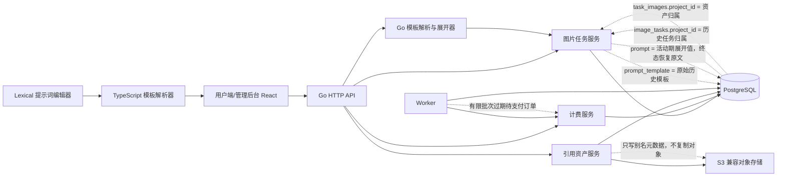
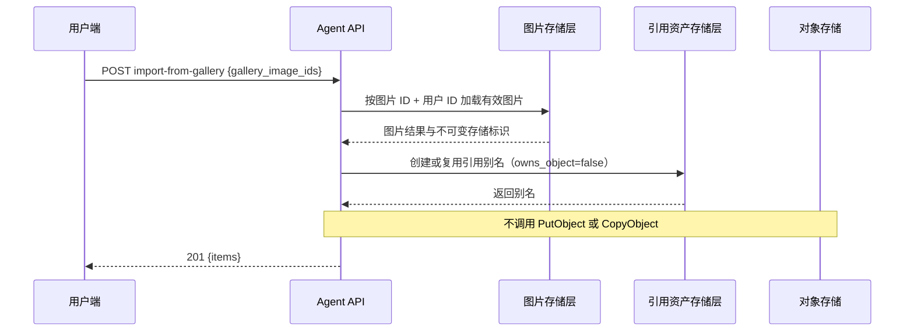
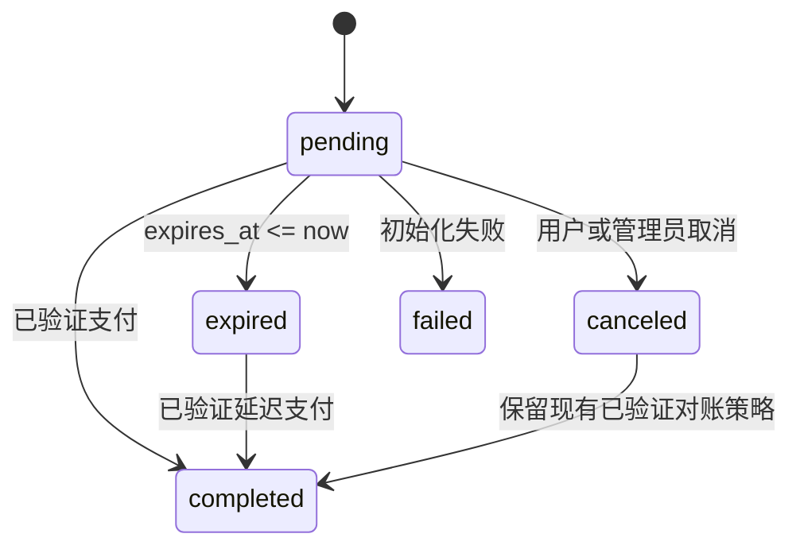
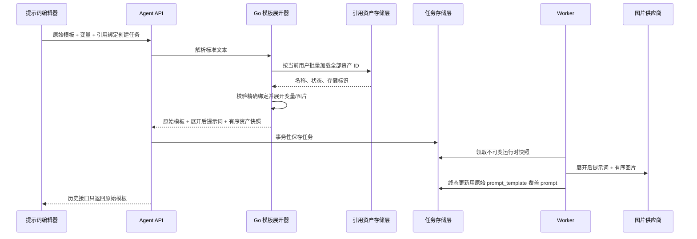

# v0.0.12 体验问题修复与提示词模板技术方案

日期：2026-08-11
状态：关键业务决策已确认，待开发
需求文档：`docs/prd/2026-08-11-v012-post-release-experience-remediation-requirements.md`
实现基线：`origin/main` 提交 `7d6a928`；`v0.0.11` 注解标签对象为 `0b2210a`，解引用后指向同一提交；代码树为 `8bc03f7`
目标版本：`v0.0.12`

## 1. 需求说明

### 1.1 背景与预期效果

v0.0.11 的项目模型已经允许任务和任务产出的每张图片在迁移后分别属于不同项目，但部分数据映射仍从任务记录重建图片归属。`mapTaskEntity` 使用 `image_tasks.project_id` 覆盖每个结果项的项目，`mapGalleryImageEntity` 则把图片 `project_id` 与任务项目快照组合到一起。因此，公开图片时会使用错误项目执行带项目条件的更新；引用导入也会拒绝当前项目与创作项目不同的图片。

v0.0.12 将图片结果行作为资产归属的权威来源，移除引用别名灰度门控，补全订单超时，完善其余界面与 API 缺口，并在不替换 v0.0.10 基础设施的前提下新增一套标准提示词模板契约。

### 1.2 目标拆解

| 目标 | 交付标准 | 优先级 |
|---|---|---|
| 修正图片归属 | 所有查询和变更流程都保持任务项目与图片项目相互独立。 | P0 |
| 可靠复用引用 | 只校验归属；无条件创建别名；对象复制次数为零。 | P0 |
| 闭环订单超时 | 动态默认 15 分钟；有限批次扫描；惰性兜底；延迟支付安全。 | P0 |
| 提供可操作的生成校验 | 用结构化字段错误替代含糊的就绪状态。 | P1 |
| 补全后台流程 | 完成订单字段投影，以及套餐搜索、排序和生命周期操作。 | P1 |
| 统一前端操作体验 | 优化创作页、支付、刷新和资产选择。 | P1/P2 |
| 支持提示词模板 | 确定性解析、富文本 Token 编辑、仅运行时展开、安全优化和原始模板复用。 | P1 |

### 1.3 影响范围

- Go 领域、服务和存储层：图片任务/图库、引用资产、计费、后台配置、Worker。
- Agent API：图库图片操作、引用导入、收银台选项和订单、生成能力和任务创建。
- Ops API：收银台订单和套餐，以及移除引用别名灰度管理能力。
- 用户端 React：创作页、资产页、项目页、收银台和共享 API 类型。
- 提示词编辑：紧凑与弹窗共用的模板编辑器、自动补全菜单、变量表单和优化结果对比。
- 管理后台 React：订单、套餐、所有列表菜单页和共享表格控件。
- OpenAPI、契约测试、冒烟测试和浏览器端到端测试。

## 2. 技术方案

### 2.1 总体架构



现有服务边界保持不变。归属修复的核心是不再从任务状态重建图片结果状态。提示词编辑会新增一个前端依赖，但系统间的标准契约仍是纯文本；TypeScript 和 Go 各实现一套小型确定性解析器，以 Go 解析器作为权威结果。编辑器内部状态既不持久化，也不被 API 接受。

### 2.2 方案比较与决策

#### 图片项目归属

| 方案 | 优点 | 缺点 |
|---|---|---|
| A. 每次迁移图片时同步迁移任务 | 局部修改较小。 | 同任务不同图片属于不同项目时必然错误，且已被业务规则明确否决。 |
| B. 删除结果级项目归属 | 只有一个归属来源。 | 推翻已经交付的产品模型，无法支持单张图片迁移。 |
| C. 保留两级归属，资产操作以结果行归属为准 | 符合当前表结构和业务规则，支持同任务图片分散到不同项目。 | 需要审计所有数据映射和变更入口。 |

决策：选择 C。`image_tasks.project_id` 管理历史任务归属，`task_images.project_id` 管理具体资产归属。

#### 订单过期

| 方案 | 优点 | 缺点 |
|---|---|---|
| A. 只在读取时推导过期 | 不需要 Worker。 | 数据库状态长期停留在待支付，后台统计和待支付数量限制不准确。 |
| B. 只使用定时 Worker | 状态会持久化流转。 | Worker 不可用时，订单继续显示待支付。 |
| C. 幂等定时扫描加受保护的读取时惰性过期 | 状态持久、可观测且可自愈。 | 两类调用方需要复用同一个状态流转方法。 |

决策：选择 C。两个入口调用同一个条件更新方法。内部状态使用 `expired`，用户端映射为支付超时取消。

#### 全局列表刷新

| 方案 | 优点 | 缺点 |
|---|---|---|
| A. 每个页面单独添加本地按钮 | 初期实现快。 | 加载、过期请求和错误处理行为不一致。 |
| B. 把全部数据请求迁移到新的查询框架 | 一致性强。 | 对修复版本而言迁移风险过高。 |
| C. 共用展示控件和轻量请求代次辅助逻辑，保留页面自身加载函数 | 用户体验一致，改动范围可控。 | 各页面仍需维护领域相关加载函数。 |

决策：选择 C。本版本不要求迁移到新的查询库。

#### 用户端支付 DTO 隐私

| 方案 | 优点 | 缺点 |
|---|---|---|
| A. 只在 JSX 中隐藏供应商名称 | 后端改动少。 | 内部路由信息仍通过 API 暴露，也可能在其他页面重新出现。 |
| B. 分离用户端和后台数据投影 | 信任边界明确，公开术语稳定。 | 需要兼容映射历史订单快照。 |

决策：选择 B。服务端只向用户返回公开支付方式和展示信息。

#### 提示词编辑器实现

| 方案 | 优点 | 缺点 |
|---|---|---|
| A. 原生 textarea 加镜像高亮层 | 保留原生文本输入，依赖较轻。 | 行内悬浮目标、Token 选择、IME/光标同步、滚动镜像和自动补全定位都较脆弱。 |
| B. 手写 `contenteditable` Token 节点 | 可以展示可交互的行内 Tag。 | 需要自行实现选择、撤销、粘贴、输入法组合、无障碍和浏览器 DOM 标准化，回归风险高。 |
| C. Lexical 自定义行内 Token 节点，并序列化为纯文本 | React 编辑、选择和 IME 模型成熟；支持 Tag、悬浮、工具栏、触发器、撤销和粘贴扩展；标准文本独立于编辑器。 | 新增前端依赖，需要补充自定义节点和序列化测试。 |

决策：选择 C。Lexical 只作为编辑和展示引擎。`PromptTokenNode` 保存 `kind` 和标准化 `name`，渲染为可访问的行内 Tag，并序列化为 `{{@name}}` 或 `{{$name}}`。其他内容保持普通文本。粘贴或外部值变化时，由共享 TypeScript 解析器把标准文本转换为节点；编辑器每次变化都重新序列化为标准文本。

#### 模板展开位置

| 方案 | 优点 | 缺点 |
|---|---|---|
| A. 只在浏览器展开并发送最终提示词 | Worker 路径简单。 | 伪造客户端可以绕过校验，原始模板和绑定不可信。 |
| B. 只在 Worker 中展开 | 创建任务逻辑较薄。 | 非法任务会先排队并预占积分，资产名称也可能在等待期间变化。 |
| C. 在创建事务内解析和展开，再保存原始模板及供 Worker 使用的不可变兼容执行快照 | 服务端权威、尽早失败、异步执行确定；后续资产改名不影响已排队任务；旧 Worker 仍可读取展开后的 `prompt`。 | 需要新增任务字段和终态清理。 |

决策：选择 C。浏览器解析器提供编辑时即时诊断；创建任务时，服务端根据当前资产名称和能力执行权威解析和校验。创建操作分别保存原始模板，把展开后运行时文本写入现有 `prompt` 字段以兼容旧 Worker，并固化有序绑定快照。v0.0.12 在任务进入终态时用原始模板覆盖 `prompt`，清除已填写变量值。价格预估与提示词内容相互独立。

### 2.3 详细流程

#### 跨项目导入引用



API 对 ID 去重，并保留现有批量上限。图片不存在、已删除或属于其他用户时统一返回 404，不暴露归属信息。旧请求中的 `project_id` 在一个兼容版本内仍可解析，但会被忽略。

#### 公开已迁移图片

1. 按 `task_images.id`、`user_id` 和 `deleted_at IS NULL` 直接加载一张图库图片；来源任务只用于补充提示词和模型元数据；项目快照关联图片当前项目。
2. 内容审核继续使用任务提示词。
3. 公开状态变更使用已加载图片的项目 ID，或直接使用图片 ID 与用户 ID 的原子条件，不再扫描项目下任务列表。
4. 如果并发迁移导致更新结果变化，重新直接读取一次或返回明确冲突，不得返回误导性的通用 404。

#### 支付订单过期



创建订单时只读取一次动态超时，并把绝对 UTC `ExpiresAt` 传给计费服务和存储层；存储层不得自行读取配置。状态流转使用 `UPDATE ... WHERE status='pending' AND expires_at<=now`，因此 Worker 和惰性过期重复调用不会产生副作用。

Worker 每 30 秒扫描一次，每批最多 500 条。只有返回满批数据时才继续下一批，并在上下文关闭时及时退出。订单列表、详情、同步和待支付数量限制检查，先处理与当前请求相关的到期记录，或调用同一个有限批次状态流转方法。

#### 提示词模板解析与任务创建

语法保持小型确定性，不允许递归求值：

```text
template             := (plain_text | escaped_opener | resource | variable)*
escaped_opener       := "\\{{@" | "\\{{$"
resource             := "{{@" canonical_name "}}"
variable             := "{{$" canonical_name "}}"
canonical_name       := 1..64 个 Unicode 字符，不含花括号/控制字符/换行/制表符
```

名称去除首尾空白并标准化为 Unicode NFC，匹配时区分大小写。解析器返回按源文本顺序排列的片段，包含起止位置、类型、标准名称和语法/解析状态。同名 Token 的每个出现位置都保留，但绑定列表只生成一项。



展开时只遍历一次解析片段。变量替换为提交的普通文本值，变量内容不再次解析。资源名称按最终 `reference_asset_ids` 顺序映射为 `图片1`、`图片2` 等。未在模板中出现但已选择的引用继续保留，以兼容现有行为。创建事务再次检查资产当前归属和名称，关闭改名或选择竞态。价格预估不解析或绑定提示词模板，继续使用现有能力版本契约。

#### 占位符安全的提示词优化

1. 解析原始模板，在调用文本模型前，把每个不同占位符出现位置替换为不透明哨兵，例如 `⟦MGS_TOKEN_0001⟧`。
2. 系统指令明确要求哨兵不可修改，必须在原语义位置恰好出现一次，不得翻译、改名、复制或删除；不向文本模型发送资源图片或变量值。
3. 解析供应商结果并校验哨兵多重集合完全一致。出现未知、缺失、重复、拆分或修改的哨兵时返回 `INVALID_OPTIMIZATION_RESULT`。
4. 用原始标准占位符恢复合法哨兵，再执行一次普通模板解析后返回优化结果。
5. 失败时不修改编辑器草稿；现有询价、执行和积分结算生命周期保持不变。

#### 资产拖拽框选

1. 按图片 ID 注册卡片 DOM 节点。
2. 在非操作按钮区域按下主指针时，保存起始选择并捕获指针。
3. 移动超过 6 px 阈值后显示固定定位选择框。
4. 每个动画帧计算选择框与可见卡片边界的交集。普通拖拽替换选择，Ctrl/Cmd 拖拽与起始选择合并。
5. 指针进入有限边缘区域时自动滚动，并在滚动期间重新计算交集。
6. 指针抬起或取消时提交选择，并阻止随后一次点击；粗指针和触屏设备禁用框选。

### 2.4 API 设计

#### 引用导入

`POST /api/agent/image/v1/reference-assets:import-from-gallery`

当前请求：

```json
{"gallery_image_ids":["image-id"]}
```

兼容请求：

```json
{"gallery_image_ids":["image-id"],"project_id":"ignored-legacy-value"}
```

鉴权仍使用用户会话或 Token。操作继续遵循现有别名和幂等规则。此路径禁止调用对象存储写入接口。

导入和上传引用的响应新增 `name`。自动命名优先采用合法的上传文件名主体，否则使用第一个空闲的 `图片N`。数据库唯一约束负责最终并发保护，发生冲突时进行有限次数重试。

#### 引用资产重命名

`PATCH /api/agent/image/v1/reference-assets/{asset_id}`

```json
{"name":"主体角色"}
```

接口同时绑定资产 ID 与当前用户，对名称执行标准化和校验，并返回更新后的公开引用资产。其他有效且属于当前用户的资产已使用同一标准名称时，返回 409 / `REFERENCE_ASSET_NAME_CONFLICT`。重命名不改写已保存任务模板或任务绑定快照；只有 PATCH 成功后，浏览器当前草稿才更新匹配的 Token 节点。

#### 支持模板的任务创建

现有任务创建接口继续使用 `prompt` 保存标准原始模板，并新增绑定字段：

```json
{
  "prompt":"让 {{@主体}} 穿着 {{$服装}} 站在 {{$地点}}",
  "prompt_variables":[
    {"name":"服装","value":"蓝色风衣"},
    {"name":"地点","value":"雨夜街道"}
  ],
  "reference_asset_ids":["asset-subject","asset-style"],
  "reference_bindings":[
    {"name":"主体","asset_id":"asset-subject"},
    {"name":"风格参考","asset_id":"asset-style"}
  ]
}
```

规则：

- `reference_asset_ids` 是下游顺序的权威来源；`reference_bindings` 只能引用其中的子集，并且名称必须与服务端当前名称一致。
- 每个解析出的资源名称必须恰好有一个绑定。拒绝额外资源绑定；允许已选但模板未引用的 ID。
- 每个解析出的变量名称必须恰好有一个值。拒绝缺失和额外变量；值作为不透明文本，不递归解析。
- 请求中没有占位符时，可以省略绑定数组，并保持 v0.0.11 行为。
- TypeScript 解析器提供草稿即时诊断；任务创建是唯一的服务端权威模板校验边界，会按数据库当前状态重新校验全部绑定。
- 价格预估接口保持不变：不接收模板绑定、不解析提示词内容，继续沿用现有能力版本和重新预估行为。
- API 对外返回的 `prompt` 使用 `COALESCE(prompt_template,prompt)`。活动任务的展开执行值、变量值和运行时载荷不得出现在用户端或后台任务响应中。

模板校验失败使用 HTTP 400 / `PROMPT_TEMPLATE_INVALID`，安全详情包括 `field`、`name`、`offset` 和 `rule`。提交的名称绑定与资产当前名称不一致时，创建接口返回 HTTP 409 / `PROMPT_TEMPLATE_STALE`。其他用户资产统一返回 404，不暴露其存在性。

#### 后台订单列表

`GET /api/ops/admin/v1/cashier/orders`

保留现有筛选参数。`query` 可搜索订单号、交易号、用户 ID、邮箱或昵称。每条记录新增仅后台可见的数据：

```json
{
  "user": {"id": 42, "email": "user@example.com", "nickname": "Mikiko", "deleted": false},
  "points": "100.00000",
  "bonus_points": "20.00000",
  "total_points": "120.00000"
}
```

用户信息按当前页批量查询。用户缺失或已删除时回退到订单 `user_id`，禁止逐行查询。

#### 后台套餐列表

`GET /api/ops/admin/v1/cashier/plans`

| 查询参数 | 取值或含义 |
|---|---|
| `query` | 套餐代码或名称模糊搜索。 |
| `plan_type` | 精确套餐类型。 |
| `status` | `active`、`disabled`、`archived`、`all`；为空时排除已归档。 |
| `sort_by` | `price_cny`、`points`、`sort_order`。 |
| `sort_order` | `asc`、`desc`。 |
| `page`、`page_size` | 沿用现有分页规则。 |

所有排序字段使用白名单，ID 作为确定性次级排序。现有详情 DELETE 接口和状态流转接口仍是权威操作入口。

#### 生成能力

每个可见模型分组新增：

```json
{"minimum_points":"2.50"}
```

该值是在当前用户有效倍率下，当前可见且启用的价格记录中最小的 `charged_points`。它只是展示元数据，不是报价；预估和创建接口仍是计价权威来源。

生成尺寸非法时继续返回 HTTP 400 / `IMAGE_CAPABILITY_MISMATCH`。可以安全确定具体规则时补充：

```json
{"details":{"field":"width","rule":"range","min":512,"max":4096}}
```

#### 用户端收银台投影

收银台支付方式只返回公开字段：

```json
{
  "method":"alipay",
  "label":"支付宝",
  "enabled":true,
  "display_order":10,
  "presentation":"redirect"
}
```

`presentation` 使用公开枚举白名单，例如 `redirect`、`qr`、`embedded` 或 `mock`。用户响应删除 `source_provider_type` 和调度字段。用户订单响应返回 `visible_method` 和支付展示数据，但不返回内部供应商类型或实例；后台接口保留完整诊断信息。

#### 提示词优化

`POST /api/agent/text/v1/prompt-optimizations/estimate` 和 `POST /api/agent/text/v1/prompt-optimizations` 继续接收 `prompt`，但明确将其视为原始提示词模板。预估接口继续按现有逻辑签署原始模板哈希；优化接口执行哨兵保护，并在 `optimized_prompt` 中返回已恢复的标准占位符。接口不接收或返回变量值和引用内容。

#### 移除的契约

- 新客户端调用图库引用导入时不再传 `project_id`。
- 从生成请求类型、OpenAPI、模拟 API、后台限制配置界面，以及新任务持久化和使用逻辑中移除 `negative_prompt`。
- 新二进制移除引用别名灰度 Ops 路由、领域/存储接线和配置目录项。

滚动升级期间，Go JSON 解码仍容忍旧 `negative_prompt` 字段，但新二进制忽略该值。

### 2.5 核心算法

#### 编辑器共享状态与页面布局

创作表单顺序固定为：

```text
模型分组下拉框
引用资产管理区（名称、重命名、新增、移除）
提示词模板工具栏
提示词模板编辑器
变量值填写表单
其他生成参数
```

紧凑和弹窗编辑器是同一个标准 `promptTemplate` 字符串和同一份草稿变量映射的两种视图。任意时刻只有一个编辑器持有焦点。打开弹窗时传递标准文本，并尽可能恢复选择区；关闭时先序列化，再把焦点交还紧凑编辑器。编辑器本身不持有引用资产或变量业务状态。

自动补全仅在非 IME 组合输入且选择区收起时，检查光标前文本。未转义的独立 `@` 或 `$` 开始一段搜索范围；选择菜单项后用一个 Token 节点替换该范围，取消时保留已输入文本。工具栏插入复用同一光标命令。选择尚未加入草稿的图库图片时，先完成现有导入请求，确认引用资产和唯一名称后再插入 Token。

#### 标准模板展开器

```text
解析原始模板 -> 按顺序得到片段
标准化提交的变量名和引用名称
使用一次用户范围查询加载所有提交资产
校验解析绑定集合完全一致，并校验当前资产名称唯一
按源文本顺序处理每个片段：
  普通文本/转义开头 -> 追加普通文本
  变量 -> 追加提交的不透明变量值
  资源 -> 追加 "图片" + 该资产在 reference_asset_ids 中从 1 开始的下标
校验展开后字符数限制
返回原始模板、展开后提示词、绑定快照
```

#### 结果项目映射规则

```text
task.project_id   := image_tasks.project_id
result.project_id := task_images.project_id
result.project    := task_images.project_id 关联的项目

禁止把 task.project_id 或 task.project 赋给 task.results[*]。
```

所有图库项目构建逻辑共用一个以结果归属为准的映射辅助函数。返回多条结果的查询使用有限 JOIN 或预加载项目，避免 N+1。

#### 尺寸模式初始化

```text
1. 已恢复草稿或复用配置仍受支持时，保留该明确配置。
2. 同一模型下用户上次手动选择仍受支持时，保留该选择。
3. 否则，支持 auto 时选择 auto。
4. 否则，使用现有按比例或首个受支持选项的回退逻辑。
```

能力数据变化不得覆盖明确且仍有效的选择。选择失效时只标准化一次；如果涉及用户填写的自定义值，同时展示具体原因。

#### 结构化本地校验

共享 TypeScript 尺寸校验器返回标准值，或 `{code, field, message, details}`。创作页就绪状态新增 `parameterError`，优先级依次为：参数错误、余额不足、可生成、确实缺少参数。同一错误同时展示在字段下方和禁用操作详情中。

### 2.6 数据与配置

无需新增数据表，但需要新增兼容字段和一个部分唯一索引。

| 现有数据或配置 | 变更 |
|---|---|
| `image_tasks.project_id` | 保留为历史任务归属。 |
| `task_images.project_id` | 作为具体资产归属的权威来源。 |
| `payment_orders.expires_at/status` | 固化动态截止时间；将到期的待支付记录转换为现有 `expired`。 |
| `payments/order_timeout_seconds` | 默认值从 1800 改为 900；建议范围 60 至 86400 秒。 |
| `image_tasks.negative_prompt` | 新任务停止写入和读取；可空字段至少保留一个回滚窗口。 |
| `runtime_rollout/no_copy_reference_aliases` | 从配置目录和运行时判断中移除。混合版本及回滚窗口内保留一条已启用旧记录，之后再清理。 |
| `reference_assets.name` | 用户可见标准资源名；滚动迁移初期允许为空；最长 64 字符。 |
| `reference_assets.name_normalized` | Unicode NFC 标准化并去除首尾空白后的匹配键，用于唯一约束，不单独对外暴露。 |
| `image_tasks.prompt` | 兼容执行字段：新模板任务活动期间保存展开文本；v0.0.12 的所有终态更新再用 `prompt_template` 覆盖。旧任务不变。 |
| `image_tasks.prompt_template` | 可空的标准原始模板。模板感知的新任务始终写入；API、历史和复用通过 `COALESCE(prompt_template,prompt)` 返回。 |
| `image_tasks.prompt_template_version` | 解析器契约版本；新模板写入默认为 `1`，旧记录为 `0`。 |
| `image_tasks.prompt_binding_snapshot` | JSON，保存有序资源 `{name, asset_id, index}` 绑定和去重变量名，绝不保存变量值。 |

套餐归档继续使用 `status=archived`，不需要物理删除或新增软删除字段。

推荐索引在实现前必须对照生成的 Schema 和迁移再次确认：

- `payment_orders(status, expires_at, id)`：支持有限批次过期扫描。
- 现有结果 `(user_id, project_id, ...)` 和 ID 主键路径预计已能支持直接图片查询，不重复建索引。
- 在预期规模下，套餐代码和名称模糊搜索先使用现有索引。只有测量证明必要时再引入 PostgreSQL trigram，本版本不预先增加。
- 对 `(user_id, name_normalized)` 建立部分唯一索引，条件为 `deleted_at IS NULL` 且状态不是已删除；名称分配器在唯一冲突时重试。

迁移顺序：

1. 先添加可空引用名称和可空或带默认值的任务字段，确保 v0.0.11 二进制仍可读写。
2. 按用户和 `(created_at,id)` 顺序回填有效引用资产。有合法保存或上传文件名时优先使用，否则分配第一个空闲 `图片N`。
3. 审计并回填重复值后添加部分唯一索引。即使存储字段在滚动升级期间仍允许为空，v0.0.12 服务边界也必须要求新记录有名称。
4. 历史任务不需要改写提示词：保持 `prompt_template_version=0`、`prompt_template=NULL`，当前 `prompt` 原样返回。
5. 兼容字段只有在回滚窗口结束后才能收紧或删除；v0.0.12 不执行破坏性 Schema 变更。

模板限制：

- 原始模板和展开后提示词都遵循现有 `prompt_max_chars` 限制。
- 每个任务最多允许 100 个占位符出现位置和 50 个不同变量。
- 单个变量值可以达到提示词长度上限，但最终展开后提示词仍必须满足同一上限。
- 资源数量继续受当前模型有效引用上限和平台现有上限约束。

### 2.7 错误处理

| 场景 | 处理结果 |
|---|---|
| 引用图片属于其他用户或已删除 | 返回 404，不暴露资源是否存在。 |
| 当前用户拥有的跨项目引用图片 | 返回 201 别名，绝不返回 404。 |
| 批量操作期间图片被并发迁移 | 对该图片返回冲突或过期结果，其他图片继续处理。 |
| 引用别名数据库写入失败 | 事务回滚；因为没有对象存储写入，所以不存在存储副作用。 |
| 自定义尺寸非法 | 本地显示字段错误；伪造请求返回带安全详情的 400。 |
| 占位符非法或未闭合 | 编辑器显示红色语法标记；创建任务返回 400 `PROMPT_TEMPLATE_INVALID`。 |
| 缺少变量或资源绑定 | 显示红色未解析 Tag，阻止生成，API 返回字段和名称详情。 |
| 草稿绑定后资产被改名 | 创建任务返回 409 `PROMPT_TEMPLATE_STALE`；客户端刷新名称并要求用户确认修复后的绑定。 |
| 优化器修改占位符 | 拒绝优化结果，保留原草稿和绑定。 |
| 有效资源名称重复 | 重命名或导入分配器重试或返回 409，不接受歧义绑定。 |
| 过期 Worker 重复或并发执行 | 条件更新对已进入终态的记录影响行数为零。 |
| 过期 Worker 不可用 | 列表、详情和同步的惰性过期修正用户可见状态。 |
| 手动刷新失败 | 保留上次成功数据和控件状态，展示非阻塞错误。 |
| 历史订单缺少公开支付方式 | 服务端把供应商快照映射为公开方式，不返回内部名称。 |

### 2.8 灰度与回滚

1. 发布前，在共享数据库把旧 `no_copy_reference_aliases` 灰度配置设为启用，防止滚动升级期间旧 v0.0.11 节点继续返回 409。
2. 先执行可空和增量式提示词/引用名称 Schema 变更，并在开放模板流量前完成名称回填和索引。
3. 先部署 v0.0.12 Worker。新版 Worker 可以处理旧任务，也知道在模板任务进入终态时清理展开后的 `prompt`。此时尚未部署模板前端，所以旧 Worker 不会收到新模板任务。
4. 部署向后兼容的 API 节点。新二进制忽略别名灰度值、接受旧导入和限制词字段、返回增量字段并支持创建模板任务。任务活动期间现有 `prompt` 字段保存展开文本，因此紧急混跑时旧 Worker 仍可执行。
5. 所有 API 和 Worker 节点都报告 v0.0.12 就绪后，再部署用户端和管理后台。前端部署后启用模板创建，不再增加额外运行时开关。
6. 至少观察一个正常流量窗口：迁移图片公开/引用成功率、别名路径对象存储调用数、订单过期延迟、模板解析/创建错误、未清理终态提示词数量、API 4xx/5xx 及前端遥测。
7. 新版本移除别名配置目录、界面和路由。旧数据库记录在回滚窗口内保持启用，物理清理由后续维护迁移完成。
8. 只有在旧二进制不能再回滚之后，后续版本才可删除历史 `negative_prompt` 字段或收紧可空提示词名称字段。

回滚时先回滚前端。模板流量已经进入系统后，如果需要完整回滚 Worker/API，应先排空活动模板任务，或确认兼容执行提示词存在。旧 Worker 可以执行这些活动任务，但不会做终态清理；恢复后由 v0.0.12 对满足 `prompt_template IS NOT NULL AND prompt <> prompt_template` 的终态记录执行修复清理。已标记为 `expired` 的订单仍兼容，因为 v0.0.11 支付对账已接受 `expired` 作为前置状态。增量字段继续保留，不回滚 Schema。

### 2.9 安全与合规

- 每次图片查询都在数据库条件中同时绑定图片 ID 和已认证用户 ID。
- 允许跨项目不等于允许跨用户。
- 用户端支付 DTO 最小化内部供应商拓扑和实例标识。
- 后台订单用户补充信息继续要求现有收银台管理权限。
- 错误详情只暴露数值约束和字段名，绝不暴露供应商凭据、对象 Key、签名 URL 或其他用户资源标识。
- 支付品牌图标本地打包，避免运行时第三方追踪请求。
- 提示词 Token 和粘贴内容通过编辑器文本或自定义节点渲染，绝不使用 `dangerouslySetInnerHTML`；资源和变量名称按文本转义。
- 资源名称匹配前，服务端按当前用户加载所有提交 ID；猜测名称不能引用其他用户资产。
- 变量值只作为展开后提示词的一部分发送给图片供应商，不发送给文本优化器，不在任务/历史 API 返回，不写审计元数据，也不写日志。
- 终态清理和修复任务从 `image_tasks.prompt` 移除展开变量值；运行日志只记录任务 ID、解析器版本和错误码。

## 3. 稳定性设计

### 3.1 性能目标

| 路径 | 目标 |
|---|---|
| 直接查询当前用户图片 | 一次有限结果/任务/项目查询；p95 低于当前图库详情 p95。 |
| 引用导入 | 对象存储写入/复制调用为零；数据库工作量最多随 20 个 ID 线性增长。 |
| 后台订单页 | 最多两次主要数据库查询加一次批量用户查询；无 N+1。 |
| 订单过期 | 每批 500 条、间隔 30 秒；正常过期延迟不超过 35 秒。 |
| 后台套餐列表 | 数据库分页和排序，不先全量加载再内存分页。 |
| 手动刷新 | 保留内容；100 ms 内开始展示可见反馈。 |
| 拖拽框选 | 指针处理按动画帧调度；渲染 500 张卡片时目标 60 fps。 |
| 模板解析 | O(提示词长度 + 绑定数量)；4000 字符上限内 p95 小于 5 ms。 |
| 提示词编辑器 | 100 个占位符情况下，输入和 Tag 更新目标一个动画帧完成且不产生布局跳动。 |
| 模板创建校验 | 所有提交引用 ID 只执行一次批量用户范围查询，不按 Token 逐条查库。 |

所有新图库引用复用同一对象，因此存储成本下降。提示词模板每个任务新增一项有限文本和一个小型 JSON 快照；展开值复用现有 `prompt` 字段，并在终态清理。不新增表或持久事件流。Lexical 会增加用户端包体，生产构建必须测量增量；如果压缩后超过仓库当前路由预算，可以随创作路由或弹窗延迟加载编辑器。

### 3.2 兼容性矩阵

| 场景 | 设计 |
|---|---|
| 新旧 API 节点混跑 | 预先启用旧别名灰度；新节点忽略它。大部分字段为增量字段；用户支付投影在增加公开替代字段后，有意移除内部字段。 |
| 数据库迁移 | 先加可空/增量字段，有限批次回填名称，再建部分唯一索引；旧二进制忽略新字段。 |
| 新服务端、旧用户端 | 接受并忽略旧项目/限制词字段；无绑定数组的普通提示词继续兼容。旧收银台已有 `visible_method` 回退。 |
| 新用户端、旧服务端 | 通过部署顺序禁止创建模板任务；服务端缺少 `prompt_template_version=1` 能力时，前端隐藏模板工具。 |
| 新 API、旧 Worker | 活动模板任务的现有 `prompt` 保存展开文本，因此执行正确；只有终态清理等待 v0.0.12 修复任务完成。 |
| 浏览器持久状态 | 现有项目选择 Key 不变。恢复尺寸模式时校验旧 `ratio`；普通字符串提示词草稿迁移为模板 v1，变量值和绑定为空。 |
| 配置向前兼容 | 旧别名记录保持启用但在界面隐藏；超时配置 Key 路径和类型不变。 |
| 定制化部署 | 不新增外部服务；无 Worker 或仅 API 部署通过惰性过期保证正确性，但健康检查会提示缺少定时扫描。 |

### 3.3 监控与恢复

新增结构化指标和日志：

- `gallery_reference_import_total{result}` 和 `gallery_reference_storage_write_total`；对象存储写入非零即告警。
- 一个诊断版本内采集 `gallery_image_project_mismatch_read_total`；任何可能覆盖结果项目的映射都告警。
- `payment_order_expiry_transition_total`、`payment_order_expiry_lag_seconds`、`payment_order_expiry_sweep_last_success_timestamp`。
- `prompt_template_parse_total{result,rule}`、`prompt_template_stale_total`、`prompt_optimization_placeholder_violation_total`。
- `prompt_runtime_unscrubbed_terminal_total`；所有 Worker 都升级到 v0.0.12 后持续 5 分钟非零，触发 P1。
- 记录引用重命名冲突和名称分配重试次数，但不记录名称或提示词内容。
- 预期运行 Worker 的部署中，过期扫描 120 秒未成功触发 P1；p95 过期延迟连续 10 分钟超过 120 秒触发 P1。
- 公开和导入接口 404/409 比例及错误看板包含 request ID，但不包含私有对象标识。
- 采集前端刷新失败和自定义尺寸校验错误码遥测。

某批扫描失败时记录脱敏错误，并在下一周期重试；惰性过期继续可用。引用别名创建失败时直接返回错误，不能回退为复制对象。

### 3.4 风险评估

| 风险 | 概率 | 影响 | 应对措施 |
|---|---|---|---|
| 其他路径仍隐藏着“任务项目等于图片项目”的假设 | 中 | 高 | 统一映射辅助函数、全仓检索、为每类图片变更补充迁移图片 API 测试。 |
| 滚动升级时旧节点返回别名 409 | 中 | 高 | 发布前强制启用旧配置，并增加部署前检查。 |
| 已超时订单后来支付 | 中 | 高 | 保留从 `expired` 开始的已验证对账、幂等入账及测试。 |
| 用户支付 DTO 删除字段破坏特定界面流程 | 中 | 中 | 删除字段前以明确公开 `presentation` 枚举替换内部供应商判断。 |
| 全局刷新意外改变页面状态 | 中 | 中 | 建立逐页验收矩阵，保留状态并使用请求代次保护。 |
| 框选与滚动或卡片操作冲突 | 中 | 中 | 使用移动阈值、粗指针禁用、排除操作按钮并执行浏览器 E2E。 |
| 富编辑器破坏 IME、光标或撤销 | 中 | 高 | 使用 Lexical 而非手写 contenteditable，并覆盖组合输入、粘贴、撤销、移动端和无障碍 E2E。 |
| TypeScript 与 Go 解析器行为分叉 | 中 | 高 | 两端消费同一份与语言无关的测试语料，并以服务端为权威。 |
| 优化器修改占位符 | 中 | 高 | 使用不透明哨兵、精确校验多重集合，失败时拒绝应用。 |
| 资源改名与任务创建竞态 | 中 | 中 | 提交预期名称，在事务内重新校验并返回明确过期错误。 |
| 任务结束后仍残留已填写变量值 | 低 | 高 | 终态覆盖、修复指标和任务；任何接口都不暴露活动执行提示词。 |

## 4. 架构变更

- 不新增进程、数据库、缓存、队列或对象存储依赖。
- 在现有 Worker Runner 中增加计费过期处理器，或增加一个只在计费存储可用时接线的同级有限循环。
- 满足滚动升级前置条件后，从新二进制移除别名灰度运行时接线和 Ops 路由。
- 只有在确实减少重复状态和竞态逻辑时，才新增共享前端刷新与框选工具。
- 用户端新增 Lexical 包，并由紧凑和弹窗视图共用一个 `PromptTemplateEditor`。
- 新增与语言无关的解析器测试语料，以及 TypeScript 展示解析包和 Go 权威解析/展开包。
- 新增引用资产命名/重命名支持和图片任务模板快照增量字段，不引入新服务进程。
- 扩展任务终态持久化及有限修复扫描，用于清理兼容执行提示词。

## 5. 测试与验证计划

### 5.1 后端测试

1. 数据投影：一个任务生成两张图片并分别迁移到不同项目后，返回正确任务项目及两个正确结果项目/快照。
2. 单图公开、取消公开、分组、删除和下载在迁移后成功，且不修改任务或同任务图片项目。
3. 当前用户跨项目引用导入成功；其他用户图片返回 404；对象存储探针记录零次 Put/Copy。
4. 缺少别名灰度配置且带旧 `project_id` 时，引用导入仍成功。
5. 固定套餐和自定义订单创建使用动态 900 秒默认值及修改后的配置值。
6. 并发过期扫描幂等；列表/详情惰性过期有效；延迟支付只入账一次。
7. 后台订单页批量查询用户，返回基础/赠送/总积分，并正确处理已删除用户回退。
8. 套餐模糊搜索、精确筛选、数值排序、生命周期操作、分页和审计记录。
9. 用户收银台投影移除所有内部供应商字段，同时保留所有必要支付流程。
10. 生成尺寸非法详情和 `minimum_points` 计算。
11. 表驱动 Go 解析器语料覆盖有效资源/变量 Token、Unicode 标准化、转义、非法/未闭合/嵌套语法、重复项、偏移和限制。
12. 模板展开覆盖精确绑定集合、引用顺序到 `图片N`、不透明变量值、额外已选图片、跨用户拒绝、改名竞态和展开长度限制。
13. 创建任务同时写入展开后 `prompt` 和原始 `prompt_template`；所有终态路径和修复流程都清除已填写变量值。
14. 引用名称迁移、分配和重命名唯一性在并发及软删除情况下保持安全。
15. 提示词优化完整保留哨兵多重集合，并对删除、复制、修改或注入哨兵的结果拒绝应用。

### 5.2 前端契约与组件测试

1. 非法像素、范围和自定义比例错误优先于 `等待参数`。
2. 自动默认值遵循四步优先规则。
3. 创作页顺序为模型分组、引用资产、提示词工具栏/编辑器、变量表单、其他参数；限制词不存在。
4. 后台订单和套餐字段、操作、筛选、排序及刷新正常渲染。
5. 每个范围内列表页都包含共享可访问刷新控件和过期响应保护。
6. 资产刷新和选择状态 Reducer 保持文档定义行为。
7. 支付方式使用公开品牌映射，绝不渲染 JeePay、EasyPay、direct 或 manual 渠道文案。
8. TypeScript 解析器运行与 Go 相同的测试语料，产生完全一致的 Token 类型、名称、偏移、转义和错误规则。
9. Lexical 序列化在输入、粘贴、撤销/重做、IME 组合输入、Token 删除及紧凑/弹窗外部同步时都能往返保留标准文本。
10. 工具栏和 `@`/`$` 自动补全在光标位置插入；取消时保留普通触发字符；满足键盘和焦点无障碍要求。
11. 变量表单按首次出现去重，值仅属于当前草稿，并通过非纯颜色方式标记未赋值变量和资源。
12. 复用只恢复原始模板和参数，初始不挂载引用资产且变量值为空。

### 5.3 API 冒烟与浏览器端到端测试

- 构造一个任务和两张结果图片，只迁移其中一张，再公开并引用迁移图片。
- 在隔离测试配置下创建短超时订单，观察过期，然后模拟经过验证的延迟回调。
- 验证套餐搜索、排序、禁用、归档和恢复。
- 在桌面和移动宽度检查收银台支付方式，并检查响应载荷不泄露供应商信息。
- 验证资产勾选对比度、选择模式点击、拖拽追加/替换、Escape、操作按钮、触屏滚动和刷新。
- 编写包含重复资源/变量 Token 的中英文混合提示词，重命名资源、填写变量，并验证假供应商实际收到的提示词和图片顺序。
- 重新加载历史并复用生成提示词，验证原始 Token 保留，所有值和资源从未解析状态开始。
- 分别使用遵守规则和破坏 Token 的假文本供应商优化模板，只接受遵守规则的结果。
- 使用键盘、鼠标、移动触摸、中文 IME、粘贴、撤销/重做、悬浮/聚焦预览和 `@`/`$` 菜单验证紧凑及弹窗编辑器。
- PR 或推送前运行 `./scripts/workflow/verify.sh`、已提交范围 Review Gate 和 `./scripts/workflow/api-smoke.sh`。

### 5.4 验收映射

配套需求文档的每一条编号需求，都至少映射到上述一项后端、前端、API 冒烟或浏览器 E2E 用例。v0.0.10 现有验收套件继续纳入回归，重点覆盖项目迁移、别名清理、积分钱包过期、背景/尺寸、批量资产、集群、上线检查和调用分布。

## 6. 交付顺序

1. P0 图片归属投影和直接图片变更操作。
2. P0 无条件引用别名及混合版本发布准备。
3. P0 订单超时快照、定时扫描、惰性兜底和监控。
4. P1 生成错误、默认值、布局及公开最低积分契约。
5. P1 引用名称迁移/API 和共享模板解析器语料。
6. P1 服务端展开器、任务快照、终态清理和占位符安全优化。
7. P1 Lexical 编辑器、变量表单、资产/变量插入和复用行为。
8. P1 后台订单/套餐流程和支付 DTO 隐私。
9. P2 共享刷新和资产选择交互。
10. 完整验证、本地 Review Gate、API 冒烟、浏览器 QA、创建 PR、合并，然后从合并后的 `main` 提交创建 `v0.0.12` 标签。

负责人和日期等待项目负责人确定优先级后安排。订单状态和变量展开两项关键业务决策已经确认，本方案具备进入编码阶段的条件。

## 7. 评审自检

- [x] 目标、范围、非目标、影响组件、兼容性、风险和验收均已明确。
- [x] API 变更包含请求、响应和兼容行为。
- [x] 数据归属和订单状态流转已经定义。
- [x] 正常与异常跨组件路径均已覆盖。
- [x] 灰度和回滚已考虑新旧 API 并存。
- [x] 安全、监控、性能和成本影响均已说明。
- [x] 自动化与手动验证范围已经映射。

## 8. 已确认业务决策

### 8.1 订单超时状态

- 确认结论：订单超时后内部状态使用 `expired`，用户端显示为 `已取消（支付超时）`。
- 实现规则：Worker 和惰性过期都把 `pending` 转为 `expired`；人工取消继续使用 `canceled`；后台筛选、统计和监控必须区分两者。
- 对账规则：经过验证的延迟支付可以从 `expired` 幂等转换为 `completed`，且积分只入账一次。

### 8.2 变量占位符展开内容

- 确认结论：原描述中的“变量名称”实际表示用户在变量表单中填写的变量值。
- 展开规则：例如 `穿着 {{$服装}}` 加变量值“蓝色风衣”，下游实际收到 `穿着 蓝色风衣`。
- 数据规则：变量值只进入活动任务的展开后运行时提示词，不写入绑定快照、不出现在历史接口中，并在任务终态清理。
