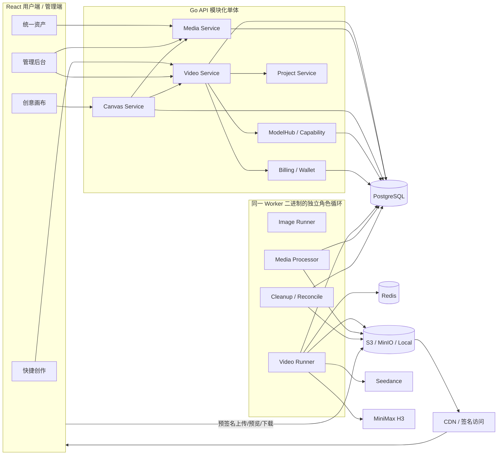
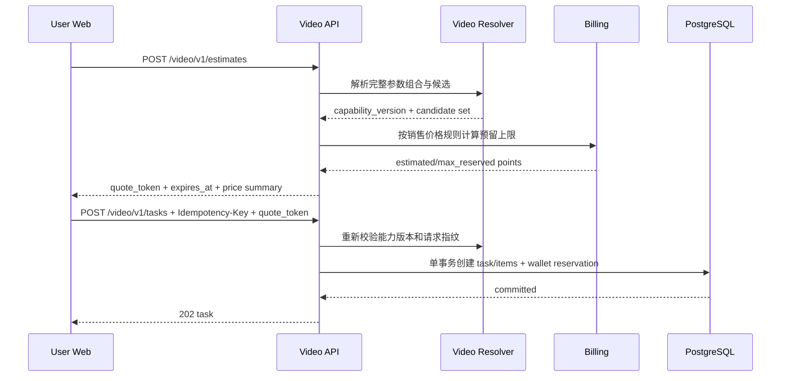
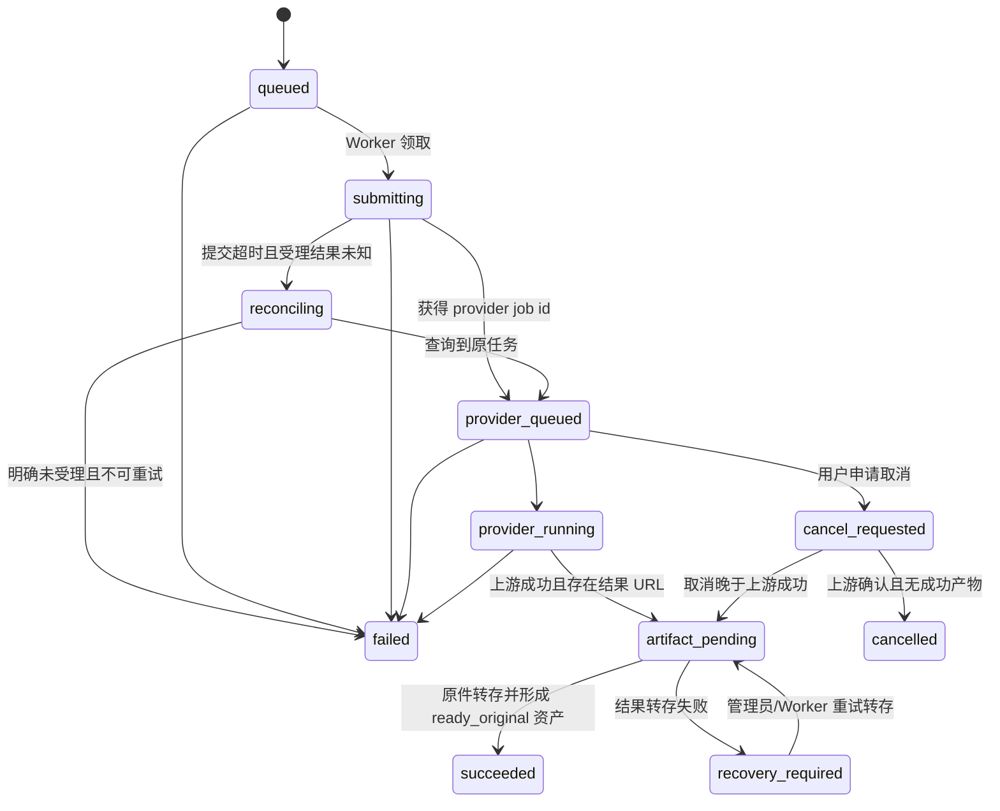
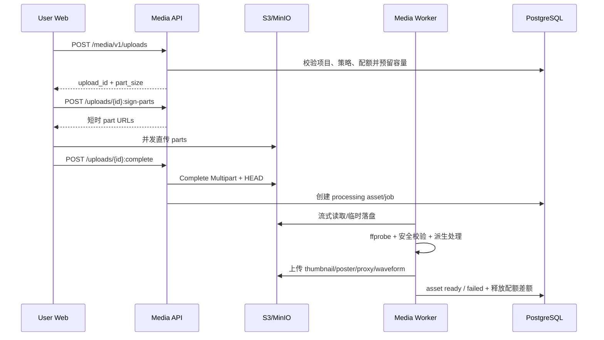
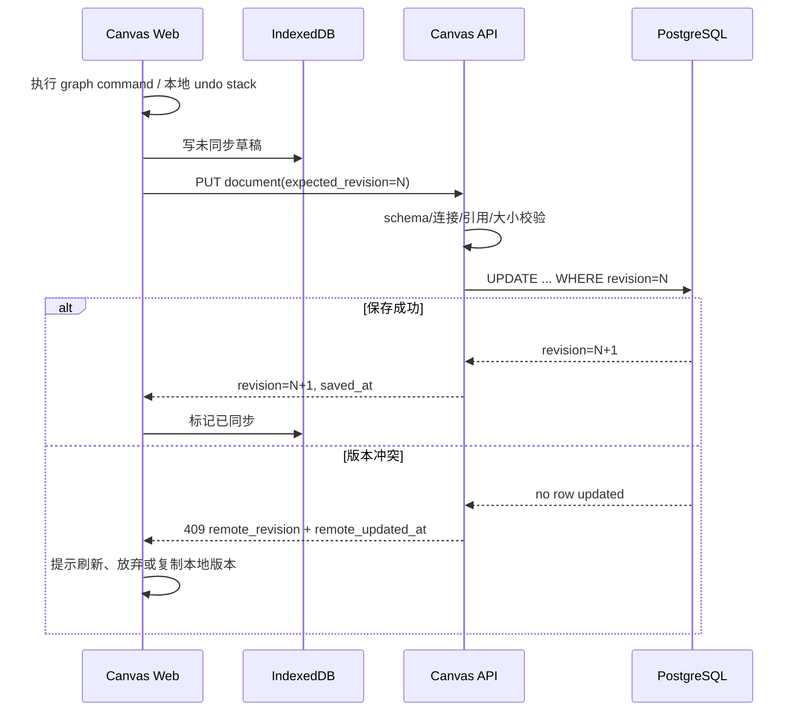

# 多媒体创作平台一期技术方案

> 日期：2026-08-12
> 状态：需求与技术方案已确认，实施中
> 目标基线：v0.0.12，当前工作树 `codex/v012-workspace-prompt-followups`，基线提交 `d988552`
> 需求来源：`docs/prd/2026-08-12-multimedia-creation-phase1-prd.md`
> 技术预研：`docs/tech/2026-08-11-multimedia-creation-platform-research.md`
> 交互参考：`docs/prototypes/multimedia-creation-phase1-demo.html`
> Nova 调研版本：`nova-image-studio main@7768f3f`

本文中的结论使用以下标记：

- **【已确认】**：来自已确认的产品决策或现有代码事实。
- **【技术判断】**：基于当前代码和问题域调研给出的推荐方案。
- **【PoC 固化】**：接口、成本或性能数据必须通过真实环境 PoC 固化，不能只依赖文档推测。


---

## 0. 执行结论

**【技术判断】推荐采用“现有模块化单体内新增多媒体内核”的增量方案：**

1. 保留现有图片任务链路和 API，避免视频接入造成图片生成回归。
2. 复用用户、项目、路由候选、钱包预留/结算、对象存储路由、审计和 Worker 租约基础设施。
3. 新增独立视频任务域、视频 Provider 适配器和视频价格规则，不把视频字段继续塞进 `image_tasks`、`task_images` 和 `route_model_prices`。
4. 新增统一 `media_assets` 资产层，以“不复制历史原图对象”的方式渐进接入历史图片；视频、音频和新本地上传从第一天写入统一资产层。
5. 创意画布复用 Nova 已授权的 DOM 节点、CSS 视口变换、SVG 连线和 Pointer Events 核心思想及授权范围内代码，但重做平台 API、云端持久化、任务恢复、主题与组件集成。
6. API、现有 Worker 二进制和部署拓扑保持单体形态。Worker 在同一二进制内按 `image/video/media/cleanup` 角色启动独立执行循环，避免长视频轮询和 FFmpeg 处理挤占图片任务槽位；后续可按角色水平扩容，无需本期拆微服务。
7. 视频异步任务采用“提交后释放租约、按 `next_action_at` 重新领取”的持久化状态机，不让一个 Go 协程和数据库租约阻塞数分钟。
8. 媒体正文坚持浏览器/Worker 与对象存储直传直取；API 只下发短时访问凭证和元数据。S3 兼容存储使用预签名分片上传，本地文件存储仅保留受限的流式兼容路径。

该方案与业界常见的“能力矩阵 + 异步 Provider Job + 原件/派生资源分层 + 乐观锁画布文档”方向一致，同时最大限度延续当前 Go + Ent + PostgreSQL + Redis + React/Vite 架构。

---

## 一、需求描述

### 1.1 背景与预期效果

当前平台已经具备图片生成、模型路由、项目、积分钱包、对象存储和图片资产能力，但核心实体和界面均以图片为中心。多媒体一期需要在不建设专业视频剪辑器的前提下，补齐三条可持续演进的主链路：

- 快捷视频生成：接入 Seedance 2.5/2.0 与 MiniMax H3，提供文生视频、单首帧/首尾帧图生视频和 1-4 个结果。
- 创意画布：组织提示词、图片、视频、音频以及生图、生视频关系，所有付费节点必须由用户主动执行。
- 统一资产：管理平台生成与本地上传的图片、视频、音频，提供低流量预览、下载、分组、项目转移、删除和复用。

预期结果不是“把视频表单加到页面”，而是形成后续分镜、导演台和更多多媒体 Provider 可以继续复用的任务、计费和资产底座。

### 1.2 角色和职责

| 角色 | 职责 |
| --- | --- |
| 产品 | 确认首发模型、参数组合、价格展示、配额和灰度人群 |
| Web 前端 | 快捷创作、创意画布、统一资产、移动端查看和管理后台界面 |
| Go 服务端 | 视频路由/任务/计费、媒体资产、上传会话、画布持久化、管理 API |
| Provider 接入 | Seedance、MiniMax 契约、回调、轮询、错误映射和 usage 归一化 |
| Worker/媒体 | 视频任务调度、结果转存、ffprobe/FFmpeg 派生处理和对象清理 |
| QA | Provider 契约、计费一致性、媒体兼容、画布恢复、迁移和回归测试 |
| SRE/部署 | FFmpeg 镜像、Worker 角色、对象存储/CDN、告警和容量管理 |
| 项目所有者 | 对产品、设计、开发、测试、运维和上线承担最终责任；Nova 商业授权来自其与作者的线下沟通确认 |

以上是职责视角而非人员编制。本项目为一人公司，由项目所有者统一承担，不设置虚构的多人 Owner、固定里程碑或上线窗口；实现、自动化测试、AI 视觉验收和项目所有者人工验收全部通过后即可上线。

### 1.3 目标拆解

| 子目标 | 范围 | 交付标准 | 优先级 |
| --- | --- | --- | --- |
| G1 视频路由与能力 | 两家 Provider、真实模型能力、路由候选、能力组合 | 前端只看到至少一个可用候选完整支持的组合 | P0 |
| G2 视频任务与计费 | 报价、预留、异步任务、转存、结算、退款、成本快照 | 重复请求/回调不重复生成和结算，失败全额释放 | P0 |
| G3 多媒体资产 | 图片/视频/音频、本地上传、派生文件、访问与管理 | 原件不用于列表预览，大文件不进入 API 内存 | P0 |
| G4 创意画布 | 列表、编辑、自动保存、节点/连线、任务恢复 | 200 节点/300 边基准可操作，连接不自动扣费 | P0 |
| G5 管理后台 | Provider、能力、路由、价格、任务、媒体策略和就绪检查 | 错配组合无法上线，管理员可恢复转存/派生处理 | P0 |
| G6 完整画布与批量结果 | 首尾帧、2-4 结果、模板、小地图、节点搜索、自动整理、取消 | 与可靠性底座同期纳入本期 P0 验收 | P0 |

### 1.4 明确非目标

本期不实现：

- 视频编辑、延长、重生成、Context-IR、2K regeneration 等厂商高级能力。
- 视频/音频作为生成参考、多模态批量参考。
- 专业时间线、多轨剪辑、字幕、配音、转场和成片导出。
- 画布自动工作流、条件分支、循环、无人值守执行和自动扣费。
- 多人实时协作、评论、共享项目和 CRDT。
- 手机端完整画布编辑；平板横屏必须支持完整编辑。
- 视频/音频公开广场以及面向开发者的公开视频生成 Open API。
- 一次性重建全部历史图片派生资源。

### 1.5 设计约束

1. 现有图片默认入口、深链接、数量拆分、fallback 和计费必须保持兼容。
2. 所有新生成资产和上传资产必须属于有效项目；跨项目引用不迁移原资产。
3. 上游成功、平台尚未完成转存时不得展示最终成功。
4. 只有成功产物收取用户积分；平台重试和媒体恢复不能重复收费。
5. 画布连接只表达依赖，用户必须在节点上主动点击生成。
6. Demo 仅用于验证信息结构、交互路径和状态，不是视觉设计稿。
7. 前端正式实现必须继承当前 `styles.css`、共享主题变量、现有 Shell、表单、弹层和 Lucide 图标体系。
8. 画布是项目实体：允许主动转移到其他自有项目，但运行中禁止转移；引用资产不随画布迁移或复制。

### 1.6 固定积分包有效期兼容契约

本期不新增第二套积分有效期模型，复用 v0.0.12 已有字段与事务语义：

- `subscription_plans.credit_expiry_enabled` 控制固定积分包是否到期；开启时 `duration_days > 0`，关闭时 API 的有效策略将 `duration_days` 归一为 null。
- `payment_orders.credit_expiry_enabled` 与 `credit_valid_days` 在创建订单时从套餐快照；支付完成只读取订单快照。
- 开启有效期时，购买与赠送 grant 的 `expires_at = credited_at + credit_valid_days`；关闭时两个 grant 的 `expires_at` 均为 null。
- 管理后台用二元开关控制有效期，仅在开启时展示天数输入；服务端仍执行同样的条件校验，不能依赖前端隐藏字段保证合法性。
- 历史套餐迁移默认开启有效期；历史订单和既有 grant 不在本期迁移中重算。
- 多媒体任务继续通过既有钱包分配与结算端口消费不同 grant，不能因视频预留、部分成功或退款改变 grant 原始到期时间。

对应发布回归必须覆盖永久积分包、到期积分包、订单快照不可变、购买/赠送 grant 分离、用户端永久/到期展示，以及视频任务在两类 grant 上的预留和结算。

---

## 二、技术方案详情

### 2.1 当前架构事实

当前仓库是模块化单体：

- API：Go `net/http`，路由集中于 `internal/http/router/router.go`。
- 领域和服务：`internal/domain/*`、`internal/service/*`。
- 数据：Ent Schema + PostgreSQL，统一使用 `TimeMixin` 和按需 `SoftDeleteMixin`。
- Worker：`internal/worker/runner.go`，使用数据库租约、心跳、并发槽位和后台任务公平调度。
- 路由模型：`route_models -> route_model_candidates -> model_account_models -> model_accounts`。
- 图片任务：`image_tasks` 与 `task_images`，字段已高度图片化。
- 钱包：`ReserveTask/FinalizeTask`、`wallet_reservation_allocations` 和 `point_ledgers`，任务 ID 为 UUID，可扩展到视频任务。
- 存储：`storage.Router` 可按存储配置解析读写后端；S3/本地后端已支持流式读写、短时签名 GET、对象复制和列表。
- 对象清理：已有 `object_deletion_jobs`、重试、对账和 owned prefix 约束。
- 用户端：React 19 + TypeScript + Vite + Tailwind 4，当前使用 hash route、`ProjectContext` 和共享 API 类型。
- 视觉体系：暗色/亮色与 accent 主题变量、Satoshi/Noto Sans SC/JetBrains Mono、Lucide 图标和 `rd*` 组件类。

这意味着项目已经有可复用的可靠性基础，但不存在通用视频任务、通用媒体资产、画布云端文档和存储直传会话。

### 2.2 整体架构



#### 2.2.1 模块边界

| 新模块 | 主要职责 | 不负责 |
| --- | --- | --- |
| `domain/video` + `service/videotask` | 标准化请求、能力匹配、报价快照、视频任务状态、attempt、结算编排 | 具体厂商 HTTP 格式、媒体转码 |
| `provider/video` | Provider 通用契约和标准错误 | 用户积分、数据库事务 |
| `provider/video/seedance` | Seedance 提交、查询、取消、回调、usage 映射 | MiniMax 特例 |
| `provider/video/minimax` | MiniMax H3 提交、查询、取消、challenge/回调、usage 映射 | Seedance 特例 |
| `domain/media` + `service/mediaasset` | 通用资产、上传会话、访问、引用、批量操作 | 生成计费 |
| `service/mediaprocess` | 媒体探测、派生任务编排、重试 | 用户列表和权限界面 |
| `domain/canvas` + `service/canvas` | 文档校验、乐观锁、引用索引、生成运行关联、结果附着 | 真实图片/视频生成执行 |
| `worker/video` | 提交、轮询、转存、结算状态推进 | 长时间占用单次租约等待 |
| `worker/media` | ffprobe/FFmpeg 派生处理 | API 正文代理 |

#### 2.2.2 部署形态

本期不新增独立微服务或消息队列。API、Worker、用户端和管理端仍按现有部署包发布。Worker 新增角色配置：

```text
WORKER_ROLES=image,video,media,cleanup
```

- `full/single` 默认一个 Worker 实例启用全部角色，但各角色使用独立并发上限。
- 规模增大后可启动多个相同 Worker 镜像，例如视频实例仅配置 `video`，媒体实例仅配置 `media`。
- PostgreSQL 仍是任务状态真相源；Redis 只承载并发令牌、短期事件通知和可丢失缓存。
- 不引入 Kafka/RabbitMQ，避免一期同时承担消息基础设施迁移。数据库 `SKIP LOCKED`/条件更新租约足以支撑当前规模。

### 2.3 技术选型与方案对比

#### 2.3.1 总体后端路线

| 方案 | 复杂度 | 稳定性 | 运维成本 | 演进性 | 结论 |
| --- | ---: | ---: | ---: | ---: | --- |
| A. 所有能力继续塞入图片表和图片 Service | 低（短期） | 低 | 低 | 低 | 不选；视频状态、时长和计费会制造大量互斥字段 |
| B. 模块化单体内新增视频、媒体、画布领域 | 中 | 高 | 低 | 高 | **推荐**；共享基础设施且保持边界清晰 |
| C. 立即拆分视频、媒体、画布微服务和消息队列 | 高 | 中 | 高 | 高 | 暂不选；当前规模和团队阶段收益不足以覆盖分布式一致性成本 |

#### 2.3.2 创意画布技术路线

| 方案 | 优点 | 缺点 | 结论 |
| --- | --- | --- | --- |
| 授权范围内复用 Nova 自定义 DOM/SVG 内核并平台化 | 交互已验证；支持表单、图片、视频等 DOM 内容；可精确控制 | 需要拆解超大组件、补云端持久化和性能治理 | **推荐** |
| 使用 React Flow / XYFlow 重建 | MIT、生态成熟、连线和缩放开箱即用 | 与 Nova 已确认交互存在迁移成本；大媒体节点和现有主题仍需大量定制 | 作为授权或性能风险的回退路线 |
| Fabric.js/Konva 等 Canvas 渲染 | 大量图形性能好 | 富文本表单、原生媒体控件、可访问性和焦点管理成本高 | 不选 |

推荐保留的 Nova 能力边界：

- DOM 节点、CSS `translate3d + scale` 视口、SVG 贝塞尔连线。
- Pointer Events 拖动/框选、Space 手型、复制粘贴、撤销重做、适应视图、小地图和 Dagre 自动整理。
- Zustand canvas store 和 localForage/IndexedDB 草稿恢复。

必须替换的部分：

- 本地工程持久化替换为服务端 revision + IndexedDB 离线草稿。
- Nova 自身生成 API、模型配置、图片存储和样式全部替换为平台服务与主题。
- 节点模型扩展为提示词、图片、视频、音频、图片生成、视频生成和便签。
- 生成动作接入平台 quote、积分预留、任务恢复和统一资产。

**【已确认】项目所有者已通过线下与作者沟通取得商业授权，仓库中没有可引用的授权文件或许可证变更。本方案据此允许在授权范围内复用 Nova 实现，但不虚构、生成或要求补交不存在的仓库证明。Nova 自身第三方依赖仍须逐项盘点和履行许可证，商业授权不能替代第三方依赖义务。**

#### 2.3.3 大文件上传

| 方案 | S3 流量 | 断点续传 | 私有化 | 结论 |
| --- | ---: | ---: | ---: | --- |
| API multipart 表单代理 | 高，API 双倍带宽 | 弱 | 简单 | 仅小文件兼容，不作为 P0 主链路 |
| S3/MinIO 预签名 Multipart Upload | 最低 | 强 | 默认 full 部署可用 | **推荐主链路** |
| 引入 tusd 独立上传服务 | 中 | 强 | 增加新服务 | 暂不引入；未来本地文件存储需求增长时再评估 |

S3 兼容后端需要新增“创建分片上传、签名 part、完成、终止、HEAD 校验”接口。Local backend 也必须支持默认 1 GiB 上限，但不能使用一次性 multipart body 或把正文读入内存：采用上传会话、固定大小分块文件、逐块校验、断点续传和服务端流式合并，完成后原子 rename 到正式对象。Local 模式会消耗 API/上传节点的入站带宽和临时磁盘，readiness 必须展示磁盘预算与并发限制；S3/MinIO 仍是生产推荐链路。

#### 2.3.4 媒体派生处理

采用 `ffprobe + FFmpeg`：

- `ffprobe` 负责真实容器、编码、时长、宽高、帧率、声道和采样率探测。
- FFmpeg 负责视频 poster、hover preview、兼容 MP4 proxy、音频 proxy 和波形采样。
- 图片缩略图优先使用 Go 解码链路；无法覆盖的 WebP/特殊格式统一交给 FFmpeg。
- Worker 通过受限子进程执行，禁止网络协议输入，设置墙钟超时、输出大小、线程数和临时目录上限。

不使用“给普通 S3 URL 附加压缩参数”的方案，因为 S3 本身不提供动态图片变换。首期预生成固定规格派生文件，换取部署可移植性和成本可预测性。

### 2.4 前端架构与视觉实现约束

#### 2.4.1 页面与代码组织

不继续扩大当前已经较重的 `WorkspacePage.tsx` 和 `GalleryPage.tsx`。建议按 feature 拆分：

```text
web/user/src/features/
  creation/
    CreationPage.tsx
    ImageCreationPanel.tsx
    VideoCreationPanel.tsx
    shared/
  canvas/
    CanvasListPage.tsx
    CanvasEditorPage.tsx
    core/
    nodes/
    store/
    persistence/
  media/
    MediaAssetsPage.tsx
    MediaAssetCard.tsx
    MediaPreviewDialog.tsx
    UploadTray.tsx
```

- 现有 `genpic` route 和深链接继续有效，页面内部增加 `image/video` 模式。
- 新增 `canvas-list`、`canvas-editor` route；hash 中保存 `canvas_id`，不把画布文档放进 URL。
- 现有 `gallery` route 保留，组件逐步切换到统一媒体查询。
- 创意画布编辑器使用 Shell 的全高/无页面滚动模式；画布列表和资产页继续使用标准 Shell。
- 用户端 API 类型继续集中在 `web/shared/api-types.ts` 与 `web/shared/user-api.ts`，避免页面自行解释 wire format。

#### 2.4.2 状态管理

- 普通表单与页面请求继续使用 React state 和现有 resource patterns。
- 画布引入 Zustand 作为独立高频状态容器，使用 selector 订阅，避免拖动一个节点导致全部节点重渲染。
- Undo/redo 保存可逆 graph command，不保存 React element 或签名 URL。
- IndexedDB/localForage 只保存用户本地未同步草稿、最近画布缓存和上传会话指针；服务端文档始终是云端真相源。
- 任务状态使用 SSE 优先、断线轮询回退；状态合并函数只允许前进，不允许旧响应覆盖新状态。

#### 2.4.3 视觉实现

**【已确认】交互 Demo 不作为视觉稿。** 正式实现遵循以下边界：

1. 复用 `web/user/src/styles.css` 中的 `--bg`、`--canvas`、`--surface`、`--fg`、`--muted`、`--border`、`--accent`、状态色、圆角、阴影和动效变量。
2. 复用现有 Shell、ProjectContext、Button、Modal、Empty/Loading/Error State、Toast、Media Access 和 Lucide 图标。
3. 保持当前 Satoshi + Noto Sans SC 正文、JetBrains Mono 数值样式，不新增与平台冲突的字体。
4. 快捷视频面板延续当前创作页的密度、模型分组下拉、提示词编辑器和费用操作栏；只增加媒体模式和视频专属字段。
5. 创意画布使用 `--canvas-bg` 作为工作区域，工具栏和节点使用现有 surface/border/accent，不复制 Demo 的浅色产品视觉。
6. 统一资产卡片延续现有图库的悬停动作和选中反馈；视频、音频通过内容类型、图标、时长和波形区分，不发明独立色彩系统。
7. 暗色、亮色和四种 accent theme 都必须通过视觉回归；减少动态效果时关闭自动 hover 播放和非必要动画。
8. 在没有正式视觉稿的情况下，开发阶段需先完成一套桌面/移动关键页面高保真实现并进行产品走查，但不得以阻塞后端基础链路为由跳过可访问性与响应式验收。

#### 2.4.4 快捷视频表单与提示词复用

- 视频表单由 capability response 驱动一个强类型 reducer。切换模型分组或生成方式后，先计算旧值与新能力的差集；只重置不再合法的字段，并在字段旁或汇总提示中列出“时长 10 秒 -> 5 秒”等具体变化，不能静默选择一个可路由值。
- 图片/视频模式分别保存浏览器草稿，切换模式不清空另一侧内容；服务端 400/402/409 也只更新字段错误或 quote，不清空提示词、变量和素材。
- 视频继续复用现有 `PromptTemplateEditor`、`PromptVariableForm`、`domain/prompttemplate` parser/resolver 和占位符保护逻辑，不在视频页面复制一套解析器。视频 Prompt 优化使用独立 system prompt，但沿用现有 sentinel 保护并校验 `{{$变量}}`、`{{@资源}}` 集合前后完全一致。
- 只有正式绑定为 `first_frame` 或 `last_frame` 的图片可解析为本期视频资源占位符；是否允许尾帧由完整候选能力决定。模板引用其他资产时前端标红，服务端返回 `VIDEO_INPUT_INVALID`。执行前由服务端 resolver 把变量替换为值、把合法资源替换为稳定的“图片 1/图片 2”标识，Provider 只接收执行 Prompt 和正式 inputs。
- 任务详情读取 `prompt_template` 和参数快照。点击“复用参数”只带回模板、模型分组、生成方式、时长、比例、清晰度和音频开关；变量定义保留但值初始化为空，`video_task_inputs` 默认不带回。用户必须通过单独的“用作首帧”动作显式绑定原图片。

---


### 2.5 核心业务流程

#### 2.5.1 视频报价与创建



报价返回一个短时 `quote_token`，包含请求规范化摘要、能力版本、价格版本、预计积分、最大预留积分和过期时间，并由服务端 HMAC 签名。创建任务时必须满足：

- 参数规范化后的哈希与 quote 一致。
- capability version 未变化，仍存在完整支持组合的候选。
- price version 仍允许提交且 quote 未过期，建议有效期 120 秒。
- `Idempotency-Key` 在用户和 endpoint 范围内唯一；相同 key + 相同请求返回原任务，不同请求返回 409。

任务、任务子项、输入快照和钱包预留必须在同一 PostgreSQL 事务提交。实现时把现有钱包分配算法抽成可接收 `ent.Tx` 的事务端口，避免“先冻结、后写任务”的跨事务窗口。图片旧链路本期不强制同步改造，但新端口应可在后续迁移图片任务。

#### 2.5.2 视频任务执行



执行规则：

1. `VideoRunner` 只在一次短步骤内持有租约：提交、单次 poll、单次转存或结算。等待上游时写入 `next_action_at` 并释放租约。
2. 提交请求超时不能直接换账号重发。attempt 进入 `reconciling`，优先使用平台幂等号、厂商 task ID 或回调查询是否已受理。
3. 轮询建议采用 2s、5s、10s、20s、30s 上限并带随机抖动；厂商回调只作为加速信号，数据库任务状态仍需幂等推进。
4. Provider 状态必须通过单调状态转换函数更新；重复回调、旧 poll 和多 Worker 竞争不能让状态倒退。
5. 获取结果时流式读取，校验域名、重定向、Content-Length、实际字节和 checksum，然后使用 `StreamingBackend.PutReader` 写入平台存储。
6. 上游成功、转存未完成时用户阶段为“正在保存”，不能显示完成。
7. 原件转存、校验并创建 `media_asset(status=ready_original)` 后，该 item 才进入 `succeeded`，用户任务展示“已完成”并允许下载原件；poster/proxy 等派生资源由独立 Media Job 继续处理，资产在此期间展示“正在准备预览”，完成后进入 `ready`。派生失败不回退视频生成终态，也不悬挂或撤销已完成的生成结算。
8. 所有 item 达到 `succeeded/failed/cancelled` 终态后统一结算父任务。成功 item 按提交时销售价格快照计费，失败或无成功产物的取消 item 释放预留；Finalize 以 task UUID 幂等。
9. Provider 已产生内部成本但没有成功用户产物时，用户不扣费，attempt 成本标记为 `platform_absorbed=true`。

#### 2.5.3 本地上传与派生处理



容量校验分两次：初始化时预留声明大小，完成确认时依据对象真实大小和用户当前并发占用原子确认。上传取消、过期或处理拒绝时释放预留并进入对象清理。

单文件统一默认上限为 1 GiB。S3/MinIO 由浏览器直传分片；Local filesystem 由浏览器向同一上传会话逐块发送 8-32 MiB chunk，API 每次只流式写一个临时分块并立即释放连接和内存，完成阶段按序流式合并并原子落盘。两条链路共享 `upload_id/part_number/checksum` 和断点续传语义，单块可独立重试，API 进程 RSS 不得随 1 GiB 文件线性增长。Local 上传节点必须预留至少 `文件大小 × 2 + 2 GiB` 临时空间并限制同时合并数；空间不足在初始化阶段拒绝，不接收一半后才失败。

平台接受格式与真实模型输入格式分层：

| 媒体 | 资产上传白名单 | 首发 Provider 可直接引用 | 平台派生/兼容 |
| --- | --- | --- | --- |
| 图片 | JPG/JPEG、PNG、WEBP、HEIC/HEIF、BMP、TIFF、GIF | MiniMax H3：JPG/JPEG、PNG、WEBP、HEIC/HEIF；Seedance：上述并额外支持 BMP/TIFF/GIF | 详情预览统一派生 WebP；动画 GIF 首期按原件管理，模型引用按候选能力过滤 |
| 视频 | MP4、MOV | Seedance：MP4/MOV，H.264/H.265 + AAC/MP3；MiniMax H3：H.264/H.265 容器能力以 PoC 快照为准 | 详情统一 H.264/AAC faststart MP4 proxy，原件保留下载 |
| 音频 | MP3、M4A、WAV | 两家直接参考能力以 WAV/MP3 为共同基线；Seedance/MiniMax 当前资料均覆盖 WAV/MP3 | M4A 可管理和播放；模型只收 WAV/MP3 时由 Worker 生成受控参考派生，不篡改原件 |

扩展名和浏览器 MIME 只用于早期提示，最终以 magic bytes + ffprobe/解码结果为准。平台“能上传管理”不等于某个模型“能直接引用”；路由 resolver 必须按完整候选格式、编码、大小、时长和输入角色过滤，必要的 M4A/WAV 或 MP4 proxy 派生也必须计入报价与任务准备阶段。

默认派生策略建议：

| 类型 | 列表 | 详情/播放 | 原件 |
| --- | --- | --- | --- |
| 图片 | 320/640 WebP 缩略图 | 1280 WebP 预览 | 主动原图查看/下载 |
| 视频 | WebP/JPEG poster | 3-6 秒 480P 静音 hover preview；H.264/AAC faststart MP4 proxy | 下载/后续模型输入 |
| 音频 | peaks JSON 波形 | AAC/M4A 或 MP3 低码率 proxy | 下载/后续模型输入 |

本期不生成 HLS。视频详情固定使用 H.264/AAC faststart MP4 proxy + HTTP Range，原件只用于下载或模型输入；当后续产品允许长视频或出现 MP4 Range 无法满足的真实数据后，再单独评审 HLS。

#### 2.5.4 画布保存与冲突



- 连续修改停止 800ms 后自动保存；持续拖动最多每 5 秒合并保存一次，不逐像素请求。
- 页面隐藏/关闭时先写 IndexedDB，再 best-effort 发起普通 fetch；不依赖 `sendBeacon` 传带鉴权的大文档。
- 冲突时禁止 last-write-wins。用户可以读取远端、放弃本地，或把本地文档复制为新画布。
- 服务端保存当前完整 JSON 文档并递增 revision；每 20 次保存、每 5 分钟或重大操作前写一份恢复快照，保留最近 20 份。P0 不向用户展示版本历史。
- 每次保存由服务端解析所有 `asset_id`，在同一事务重建该画布的 `media_asset_references`，不能信任客户端上报引用计数。

#### 2.5.5 画布节点生成与结果恢复

1. 用户在生成节点点击生成，客户端提交 `canvas_id`、`node_id`、当前 revision 和幂等 key。
2. Canvas Service 从服务端当前文档读取节点，解析选定提示词路径、输入资产和参数；不信任客户端额外拼出的隐藏输入。
3. 服务端调用图片或视频 estimate/create port，保存 `canvas_generation_run` 与生成时节点快照。
4. 页面在线时通过任务事件更新节点状态。用户可以继续编辑节点，但当前 run 使用提交快照。
5. 任务成功后，任务 Worker 调用 Canvas Service 的幂等 `AttachResults` graph command，根据 `run_id + asset_id` 生成稳定结果节点 ID。
6. `AttachResults` 不使用提交时 revision 覆盖整份文档，而是在事务内锁定并读取最新 revision，对最新文档执行语义化 graph command 后递增 revision；与用户保存竞争时按最新 revision 重试，已存在相同稳定结果节点时直接返回成功。
7. 如果原生成节点仍存在，服务端以其最新位置为锚点，在右侧确定性排布结果节点并添加结果边；如果生成节点已被用户删除，则不自动恢复该节点，只把 run 标记为 `unplaced`。
8. 打开画布时 API 返回未附着 run，前端提示“有生成结果待恢复”。用户确认恢复时，在当前视口中心附着已有结果节点，不恢复已删除的生成节点，不重新生成、不重新计费；成功后记录 `attached_revision`，重复恢复为幂等成功。

#### 2.5.6 画布项目转移

画布转移与节点生成必须串行修改同一画布元数据行：

1. 转移 API 开启事务并 `SELECT ... FOR UPDATE` 锁定画布，校验 owner、目标项目有效且不同于当前项目。
2. 以 `running_task_count=0` 且不存在活动 `canvas_generation_runs` 为双重条件；不满足返回 `409 CANVAS_HAS_RUNNING_TASKS`，不得等待或迁移任务。
3. 只更新 `creative_canvases.project_id`、`metadata_version` 和审计事件；`document_json`、资产引用、历史 run/task/asset 项目均不修改。
4. 后续节点生成在创建 run/task 前锁定同一画布行并读取当前 `project_id` 写入任务快照，同时原子增加 `running_task_count`。任务终态幂等递减，调和任务修复计数漂移。
5. 项目删除的“把内容转移到目标项目”复用同一 Domain Service，并在存在运行任务时阻止删除，避免出现绕过主动转移规则的第二条路径。
6. 成功后前端同步全站 `ProjectContext` 到新项目，并使画布列表、资产列表查询失效；跨项目引用资产仍保持原项目。

### 2.6 视频 Provider 与能力抽象

#### 2.6.1 领域契约

```go
type VideoProvider interface {
    Submit(ctx context.Context, req NormalizedVideoRequest) (ProviderJob, error)
    Get(ctx context.Context, job ProviderJobRef) (ProviderStatus, error)
    Cancel(ctx context.Context, job ProviderJobRef) (CancelResult, error)
    VerifyCallback(ctx context.Context, headers http.Header, body []byte) (CallbackEvent, error)
    NormalizeUsage(status ProviderStatus) (NormalizedUsage, error)
}
```

```text
NormalizedVideoRequest
  task_id / item_id / attempt_id / provider_idempotency_key
  task_type                 text_to_video | image_to_video | first_last_frame_to_video
  prompt
  duration_seconds
  resolution                480p | 720p | 768p | 1080p | 2k | 4k
  aspect_ratio              21:9 ... 9:16 | adaptive
  generate_audio
  output_format             mp4（P0 用户播放规范化目标；Provider 原件可为 mp4/mov）
  inputs[]
    asset_id
    role                     first_frame | last_frame
    ordinal
    temporary_provider_url 或受控上传结果
  provider_options          仅允许能力 schema 白名单字段
```

`provider_options` 不能成为任意 JSON 透传口。每个 adapter 在代码中声明允许字段、类型、默认值和版本；未知字段拒绝保存和下发。

#### 2.6.2 能力矩阵

真实模型能力保存为版本化 JSON，但在服务层解析为强类型结构：

```json
{
  "schema_version": 1,
  "task_types": {
    "text_to_video": {
      "durations": {"values": [5, 10]},
      "resolutions": ["720p"],
      "aspect_ratios": ["16:9", "9:16", "1:1"],
      "audio_generation": true
    },
    "image_to_video": {
      "durations": {"min": 4, "max": 15, "step": 1},
      "resolutions": ["768p", "2k"],
      "aspect_ratios": ["adaptive"],
      "inputs": {"first_frame": {"required": true, "max_bytes": 31457280}}
    }
  },
  "features": {"cancel_queued": true},
  "limits": {"prompt_max_runes": 2000, "provider_native_max_n": 1}
}
```

`provider_native_max_n` 的后台校验范围为 1-10，仅描述单次真实模型请求原生支持的结果数，不等于用户端生成数量。用户端 P0 仍为 1-4；平台始终创建独立 item，并按真实候选的 native n 能力分批/并行执行。候选只支持 `n=1` 时启动多个独立请求，不能因此改掉现有数量拆分和逐项结算逻辑。

校验必须基于完整组合，而不是独立枚举：

```text
match(candidate, request) =
  task_type supported
  AND duration supported for task_type
  AND resolution supported for task_type
  AND ratio supported for task_type + resolution
  AND audio supported for the same combination
  AND input roles/count/format/size supported
  AND account enabled and concurrency available
```

用户可见能力采用“候选能力并集 + 组合级可路由校验”：界面可以展示由不同候选覆盖的合法选项，但用户每次改变参数后都重新过滤候选；不存在完整候选时立即指向冲突字段，不能等到 Worker 才失败。

#### 2.6.3 Provider 差异处理

| 差异 | 统一层 | Adapter 层 |
| --- | --- | --- |
| 异步任务 | submit/get/cancel 状态机 | URL、body、厂商状态枚举 |
| 比例/清晰度 | 平台标准枚举 | 厂商具体参数与像素含义 |
| 首帧/尾帧 | 输入 role | Seedance/MiniMax 请求格式 |
| 音频 | `generate_audio` 能力 | 厂商是否显式字段、默认行为 |
| 计费 | NormalizedUsage | 秒数、token、参考输入用量提取 |
| 回调 | CallbackEvent | HMAC/challenge/验签和原始 payload |
| 取消 | best-effort 结果 | queued/running 的厂商语义 |
| 错误 | 标准可重试类别 | HTTP/provider code 映射 |

首发真实模型固定为：

- Seedance 2.5：`doubao-seedance-2-5-260628`；
- Seedance 2.0：`doubao-seedance-2-0-260128`；
- MiniMax H3：`MiniMax-H3`。

准确 Model ID、合法组合、格式、限流、回调和任务 SLA 仍须用两家真实账号 PoC 产出契约快照；若账号环境中的实际 ID 与上述官方代码不同，必须先更新文档和 capability seed，不能静默替换。官方文档变化不能自动修改已发布能力；管理员升级 capability version 后经有效能力预览和 smoke 才能生效。

#### 2.6.4 超时、重试和幂等

| 操作 | 单次超时建议 | 重试 | 幂等要求 |
| --- | ---: | --- | --- |
| Submit | 20s | 仅明确未发送/未受理时换候选；不明时进入 reconcile | attempt 级 provider idempotency key |
| Poll/Get | 10s | 指数退避，5xx/429 可重试 | 纯查询 |
| Cancel | 10s | 2 次 best-effort | 重复取消返回当前状态 |
| Callback | 3s 内落库响应 | Provider 可重投 | provider + event/job id 唯一 |
| Artifact GET | 连接 10s，总时长按大小上限，建议最高 5min | 只重试转存，不重新生成 | artifact URL/attempt + object key 幂等 |

上游 429、5xx、网络错误、内容拒绝、参数错误、余额/额度不足、账号禁用和厂商任务失败必须分类。只有明确可重试且不会重复计费的错误允许 fallback。

### 2.7 视频计费设计

#### 2.7.1 销售报价

用户销售价不暴露厂商计量单位，但必须由真实成本反推，不能与厂商成本脱节。默认保护参数：

| 参数 | 默认值 | 后台归属 |
| --- | ---: | --- |
| `gross_point_value_cny` | 0.3125 元/积分 | 有效积分包与充值配置推导 |
| `max_bonus_ratio` | 20% | 有效积分包保护值 |
| `payment_fee_rate` | 3% | 价格策略，可按支付方式取最坏值 |
| `target_gross_margin_rate` | 25% | 价格策略 |
| `provider_cost_buffer_rate` | 10% | 价格策略 |
| `platform_fixed_cost_cny` | 0.15 元/成功结果 | 价格策略 |
| `platform_output_second_cost_cny` | 0.02 元/输出秒 | 价格策略 |
| `platform_reference_cost_cny` | 0.03 元/首帧或尾帧 | 价格策略；按安全公式约为 0.2 积分，厂商实际素材费另加 |
| `platform_audio_fixed/second_cost_cny` | 默认 0，PoC 后配置 | 价格策略；与厂商 audio_on/off 成本差额共同生成音频附加 |
| `reserve_markup` | 精确按秒 1.00；token 波动 1.15 | 候选成本规则/价格策略 |

在默认最多 20% 套餐赠送下：

```text
每积分净收入下限
  = 0.3125 / (1 + 20%) * (1 - 3%)
  = 0.252604... 元/积分

候选厂商成本上限
  = max(完整支持当前参数的所有启用候选的预计厂商成本)

安全销售积分
  = ceil_to_0.1(
      (候选厂商成本上限 * (1 + 10%)
       + 0.15
       + 输出秒数 * 0.02
       + 平台参考素材处理成本
       + 其他平台变动成本)
      / 每积分净收入下限
      / (1 - 25%)
    )
```

因此每 1 元厂商成本约需要 `1.10 / 0.252604 / 0.75 = 5.806` 积分才能达到默认保护线。路由组合必须取所有候选的最大成本，不能用平均成本；fallback 到更贵账号后仍应覆盖目标毛利。

面向用户的可配置销售表达继续是：

```text
单个结果销售积分 = max(
  minimum_task_points,
  fixed_task_points
  + max(duration_seconds, minimum_billable_seconds) * output_second_points
  + reference_image_count * reference_image_points
  + input_video_seconds * input_video_second_points
  + reference_audio_seconds * reference_audio_second_points
  + generated_audio_fixed_points
  + duration_seconds * generated_audio_second_points
)

任务预计积分 = sum(每个请求结果的预计积分)
最大预留积分 = ceil5(任务预计积分 * reserve_markup)
```

价格生成器根据上面的成本安全线反推这些销售项，人工只能上调。保存或启用时对路由模型的每个完整参数组合重新计算；只要任一组合的人工价格低于安全线，就拒绝启用并列出差额和最贵候选。

首发初始化建议值如下，均按当前官方刊例/典型成本、默认保护参数和向上取整得到；正式启用前由 W0 使用真实账号成本规则重算，不固化活动价：

| 模型 | 规格 | 建议输出积分/秒 | 建议固定积分/结果 | 5 秒无附加示例 |
| --- | ---: | ---: | ---: | ---: |
| MiniMax H3 | 768P | 3.1 | 1.0 | 16.5 |
| MiniMax H3 | 2K | 4.8 | 1.0 | 25.0 |
| Seedance 2.5 | 480P | 4.0 | 1.0 | 21.0 |
| Seedance 2.5 | 720P | 8.9 | 1.0 | 45.5 |
| Seedance 2.0 | 480P | 2.8 | 1.0 | 15.0 |
| Seedance 2.0 | 720P | 5.9 | 1.0 | 30.5 |
| Seedance 2.0 | 1080P | 14.6 | 1.0 | 74.0 |
| Seedance 2.0 | 4K | 29.5 | 1.0 | 148.5 |

生成音频附加不能填写一个脱离成本的固定经验值。成本规则分别保存同参数 `audio_on/audio_off` 的厂商成本，系统用成本差额按安全公式生成“每秒音频附加 + 可选固定附加”；若官方没有拆分价，则使用真实账号 PoC 得到的最坏组合总成本，无法证明安全线时不允许把有声组合加入可见能力。首帧/尾帧的平台处理默认各 0.2 积分，Provider 对参考图片、输入视频或音频的实际收费仍完整叠加，不能被 0.2 积分覆盖掉。

- MiniMax 按秒且可精确报价的组合默认 `pricing_mode=exact`、`reserve_markup=1.00`。
- Seedance token 成本波动组合默认 `pricing_mode=metered`、`reserve_markup=1.15`；预计积分使用 usage 上限模型，最终按实际 usage 对应的安全价格结算但不得超过用户确认的预留上限。若实际安全价格超过上限，超出部分由平台承担并触发价格规则 SEV-1 告警，不能产生负余额。
- 输出数量 1-4 始终拆成独立 item 并行执行；每个 item 独立成本、价格和结算，保留现有平台数量拆分语义。
- 所有运算使用 `decimal` 和五位精度；前端只展示服务端结果，不用 JS float 重算扣费。
- 切换模型、时长、清晰度、音频、数量或输入后原 quote 立即失效。

#### 2.7.2 结算

```text
actual_points = sum(success item price snapshot)
refund_points = reserved_points - actual_points
```

- 0 个成功 item：`actual_points=0`，全额释放。
- 部分成功：只收成功 item；失败 item 对应预留释放。
- 上游成功但原件未转存：暂不 Finalize，保持 reservation；进入高优先级恢复和临近 URL 过期告警。
- 转存最终不可恢复：用户全退，Provider 成本进入平台损失。
- Finalize 通过 `task_id + reservation_cycle` 和账本幂等键保证最多一次。
- 购买积分与赠送积分沿用钱包桶的既有扣减优先级；赠送积分消耗对应的厂商与平台成本计入营销成本报表，不把它伪装成单次现金毛利。

#### 2.7.3 厂商成本

attempt 保存：

- 原始 usage JSON（受大小限制并脱敏）。
- 标准化 `output_seconds/input_video_seconds/extra_images/provider_tokens/...`。
- cost rule version、币种、汇率 version、成本金额。
- 是否 fallback、是否平台承担、是否产生用户收入。

Seedance token 和 MiniMax 秒数价格只进入成本规则，前台不暴露厂商公式。价格数据以正式接入当日控制台/合同为准，不能把调研期间活动价固化为长期默认值。每次价格规则或成本规则变更都生成新版本；历史 quote、task、attempt 和 ledger 只读其快照，不跟随后台最新配置漂移。

---


### 2.8 API 设计

所有接口沿用现有 `{data, meta}`/统一 error envelope、Bearer 用户会话、管理员权限和 request ID。路径分类如下：

- 用户产品 API：`/api/agent/*`
- Provider 回调：`/api/open/video/v1/provider-callbacks/*`，使用独立回调鉴权，不使用用户 Token。
- 管理后台：`/api/ops/admin/v1/*`
- 本期不新增面向第三方开发者的视频生成 Open API。

#### 2.8.1 快捷视频生成

##### `GET /api/agent/video/v1/capabilities`

返回用户当前组可见的模型分组、合法参数组合摘要、默认值、最低积分和 `capability_version`。

```json
{
  "data": {
    "capability_version": "video-cap-v1:sha256",
    "model_groups": [{
      "code": "cinema-video",
      "name": "电影质感",
      "description": "适合高质量叙事镜头",
      "minimum_points": "75.00",
      "task_types": ["text_to_video", "image_to_video"],
      "defaults": {
        "task_type": "text_to_video",
        "duration_seconds": 5,
        "resolution": "720p",
        "aspect_ratio": "16:9",
        "generate_audio": false
      },
      "options_by_task_type": {
        "text_to_video": {
          "durations": [5, 10],
          "resolutions": ["720p"],
          "aspect_ratios": ["16:9", "9:16", "1:1"],
          "audio_generation": true
        }
      }
    }]
  }
}
```

响应可使用 `ETag` 和 30 秒私有缓存；模型/价格/用户组变更后更新 capability version。

##### `POST /api/agent/video/v1/estimates`

```json
{
  "project_id": "uuid",
  "route_model_code": "cinema-video",
  "task_type": "image_to_video",
  "prompt_template": "镜头缓慢推进",
  "prompt_variables": [],
  "inputs": [{"asset_id": "uuid", "role": "first_frame", "ordinal": 0}],
  "duration_seconds": 5,
  "resolution": "720p",
  "aspect_ratio": "adaptive",
  "generate_audio": false,
  "output_count": 1,
  "capability_version": "video-cap-v1:sha256"
}
```

```json
{
  "data": {
    "quote_token": "signed-opaque-token",
    "quote_expires_at": "2026-08-12T12:02:00Z",
    "capability_version": "video-cap-v1:sha256",
    "pricing_version": "price-v7",
    "unit_points": "75.00000",
    "estimated_points": "75.00000",
    "max_reserved_points": "75.00000",
    "display_points": "75.00",
    "pricing_mode": "exact",
    "summary": {"duration_seconds": 5, "resolution": "720p", "audio": false},
    "balance": {"available_points": "260.00000", "sufficient": true}
  }
}
```

正常网络目标 P95 < 300ms。请求按用户 10 QPS 短时突发限流，前端 250ms debounce 并取消旧请求。

##### `POST /api/agent/video/v1/tasks`

请求字段与 estimate 一致，另带 `quote_token`；Header 必须包含 `Idempotency-Key`。成功返回 202：

```json
{
  "data": {
    "id": "uuid",
    "status": "queued",
    "progress_stage": "queued",
    "requested_output_count": 1,
    "estimated_points": "75.00000",
    "max_reserved_points": "75.00000",
    "items": [{"id": "uuid", "ordinal": 0, "status": "queued"}],
    "created_at": "2026-08-12T12:00:01Z"
  }
}
```

错误：quote 过期/能力变化返回 409 并要求重新估价；余额不足返回 402；参数或素材问题返回 400 且包含 `field_errors`。

##### 任务读取接口

| 方法 | 路径 | 说明 |
| --- | --- | --- |
| GET | `/api/agent/video/v1/tasks?project_id=&status=&cursor=&limit=` | 游标分页任务列表 |
| GET | `/api/agent/video/v1/tasks/{task_id}` | 任务、item、结果、积分和用户可见错误 |
| POST | `/api/agent/video/v1/tasks/{task_id}:cancel` | best-effort 取消，需 Idempotency-Key |
| GET | `/api/agent/video/v1/tasks/events?project_id=&after=` | SSE；断线通过 last event ID 恢复 |

SSE 只发送任务 ID、版本、状态、stage、更新时间和结果可用信号，不发送签名 URL。事件不可用时前端按 3s -> 5s -> 10s 轮询，页面后台时降到 30s。

#### 2.8.2 统一资产

##### 列表和详情

| 方法 | 路径 | 说明 |
| --- | --- | --- |
| GET | `/api/agent/media/v1/assets` | `project_id` 必填；支持 type/source/group/status/search/sort/cursor/limit |
| GET | `/api/agent/media/v1/assets/{asset_id}` | 通用元数据、派生状态、来源任务摘要 |
| PATCH | `/api/agent/media/v1/assets/{asset_id}` | 重命名、分组；带 `expected_version` |
| DELETE | `/api/agent/media/v1/assets/{asset_id}` | 软删；返回是否仍被引用 |
| POST | `/api/agent/media/v1/assets/{asset_id}:transfer-project` | 转移项目，跨项目引用保持不变 |
| POST | `/api/agent/media/v1/assets/{asset_id}:retry-processing` | 仅处理失败且原件可用 |
| POST | `/api/agent/media/v1/assets/{asset_id}:access` | `thumbnail/preview/playback/original/download` 短时访问投影 |

访问响应示例：

```json
{
  "data": {
    "asset_id": "uuid",
    "purpose": "playback",
    "url": "https://signed-object-url",
    "mime_type": "video/mp4",
    "expires_at": "2026-08-12T12:05:00Z",
    "supports_range": true,
    "derivative_kind": "proxy"
  }
}
```

服务端先做 owner/project/canvas reference 鉴权，再签发 URL。数据库和画布文档永远不保存该 URL。

##### 上传会话

| 方法 | 路径 | 说明 |
| --- | --- | --- |
| POST | `/api/agent/media/v1/uploads` | 初始化，校验项目/策略/配额，需 Idempotency-Key |
| GET | `/api/agent/media/v1/uploads/{upload_id}` | 恢复上传状态 |
| POST | `/api/agent/media/v1/uploads/{upload_id}:sign-parts` | 为指定 part numbers 返回短时 URL |
| POST | `/api/agent/media/v1/uploads/{upload_id}:complete` | 提交 ETag/checksum 清单并完成 |
| POST | `/api/agent/media/v1/uploads/{upload_id}:abort` | 终止并清理临时对象 |

初始化请求包含文件名、声明 MIME、大小、可选 SHA-256、项目和分组。服务端返回 8-32 MiB 的动态 part size，限制并发签名 part 数和会话总 part 数。签名 URL 默认 15 分钟，上传会话默认 24 小时。

##### 批量操作

统一使用 `POST /api/agent/media/v1/assets:batch-{action}`：

- `download`、`group`、`transfer-project`、`delete`。
- 请求最多 500 个 ID，服务端逐项鉴权和返回结果。
- 打包下载超过同步阈值时创建异步 export job，继续复用现有 gallery export 的 Worker/下载模式，但扩展到多媒体流式压缩。
- 图片公开继续走现有图片 API；混合资产批量公开不放进通用 media API。

#### 2.8.3 创意画布

| 方法 | 路径 | 说明 |
| --- | --- | --- |
| GET/POST | `/api/agent/canvas/v1/canvases` | 列表/创建；列表支持项目、搜索、排序和游标 |
| GET/PATCH/DELETE | `/api/agent/canvas/v1/canvases/{canvas_id}` | 读取、重命名、软删；PATCH 不承担项目转移 |
| POST | `/api/agent/canvas/v1/canvases/{canvas_id}:transfer-project` | 转移画布项目；带目标项目和 `expected_metadata_version`，运行中返回 409 |
| POST | `/api/agent/canvas/v1/canvases/{canvas_id}:duplicate` | 复制文档和引用，不复制对象/运行状态 |
| PUT | `/api/agent/canvas/v1/canvases/{canvas_id}/document` | 全量规范化文档保存，带 expected revision |
| GET | `/api/agent/canvas/v1/canvases/{canvas_id}/runs` | 当前和未附着生成 run |
| POST | `/api/agent/canvas/v1/canvases/{canvas_id}/nodes/{node_id}:estimate` | 读取服务端节点并估价 |
| POST | `/api/agent/canvas/v1/canvases/{canvas_id}/nodes/{node_id}:generate` | 主动执行当前节点 |
| POST | `/api/agent/canvas/v1/canvases/{canvas_id}/runs/{run_id}:attach-results` | 恢复已有结果，不生成/扣费 |

保存请求：

```json
{
  "expected_revision": 18,
  "schema_version": 1,
  "viewport": {"x": 120, "y": 48, "zoom": 0.9},
  "nodes": [],
  "edges": [],
  "client_saved_at": "2026-08-12T12:00:00Z"
}
```

保存限制建议：最多 500 节点、1000 边、单文档规范化 JSON 最大 1 MiB、单节点 payload 最大 64 KiB。首期性能验收仍按 200/300；上限是安全边界而不是承诺规模。

409 冲突响应必须返回 `remote_revision`、`remote_updated_at` 和远端摘要，不回传签名 URL。复制本地版本使用单独创建 API，不能让前端伪造归属用户。

#### 2.8.4 Provider 回调

```text
POST /api/open/video/v1/provider-callbacks/seedance/{account_public_id}
POST /api/open/video/v1/provider-callbacks/minimax/{account_public_id}
```

- `account_public_id` 是随机公开别名，不暴露数据库 ID、模型账号名称或密钥。
- MiniMax challenge 按官方协议响应；正常事件先验签、限制 body、落幂等 event，再异步推进任务。
- Seedance 按官方回调签名/白名单要求校验；若实际模型不支持可靠回调，禁用回调并只轮询。
- 回调 handler 不执行下载、转码或结算重逻辑，3 秒内完成验证和持久化。

#### 2.8.5 管理后台

管理能力融入现有“真实账号 / 价格策略 / 路由模型”三个板块，不另造一套互相割裂的视频配置入口。新增或扩展主要 Ops API：

| 路径 | 说明 |
| --- | --- |
| `/api/ops/admin/v1/model-account-models/{id}/video-capability` | 真实模型的视频能力版本、格式、组合、校验和测试 |
| `/api/ops/admin/v1/model-account-models/{id}/video-cost-rules` | 真实模型成本规则、币种、计费模式、生效版本 |
| `/api/ops/admin/v1/video-pricing-strategies` | 价格策略 CRUD、保护参数、启停和版本 |
| `/api/ops/admin/v1/video-pricing-strategies/{id}:simulate` | 按完整参数组合试算成本、安全积分和毛利 |
| `/api/ops/admin/v1/video-pricing-strategies/{id}:recalculate` | 从启用真实模型成本生成新销售价格版本，不覆盖历史 |
| `/api/ops/admin/v1/route-models/{id}/video-config` | 路由模型默认值、可见组合、最大输出数和绑定价格策略 |
| `/api/ops/admin/v1/route-models/{id}/video-impact` | 展示候选最大成本、缺价组合和受积分包影响摘要 |
| `/api/ops/admin/v1/video-tasks` | 任务/attempt/成本/结算查询 |
| `/api/ops/admin/v1/video-tasks/{id}:retry-artifact` | 只重试结果转存 |
| `/api/ops/admin/v1/media-processing-jobs/{id}:retry` | 只重试派生处理 |
| `/api/ops/admin/v1/media-policy` | 格式、大小、时长、配额、派生和保留策略 |
| `/api/ops/admin/v1/readiness` | 扩展视频、存储和媒体处理检查 |

所有写接口记录 audit log；密钥继续使用 write-only 加密配置；真实 Provider 名称、账号和成本不能出现在用户 API。

三个板块的数据和保存边界：

1. **真实账号/真实模型**负责“能不能做、厂商收多少钱”：能力矩阵、Provider 计费模式、币种、费率、生效区间和 PoC 状态。保存不会自动改写任何路由或历史销售价。
2. **价格策略**负责“平台至少卖多少”：每积分净收入保护、目标毛利、成本缓冲、支付手续费、平台固定/每秒成本、素材与音频附加、reserve markup，以及系统生成的参数组合销售价。人工价只能高于安全线。
3. **路由模型**负责“用户看到什么、可路由到谁”：候选、权重、默认参数、可见完整组合、最大结果数和绑定的价格策略。启用前对所有候选和组合执行最坏成本检查。
4. 三个页面提供互相跳转和影响摘要，但更新各自产生独立不可变版本；任务保存 capability、cost、pricing、routing 四类快照，禁止级联覆盖历史。
5. readiness 根据当前所有启用的固定积分包和充值配置计算每积分净收入下限；一旦低于价格策略保护值，受影响的视频路由模型不得启用或继续接收新任务，历史任务照常完成。

### 2.9 错误码设计

| HTTP | code | 场景 | 前端处理 |
| ---: | --- | --- | --- |
| 400 | `VIDEO_FIELD_INVALID` | 时长、比例、清晰度、音频等字段不合法 | 定位具体字段和规则 |
| 400 | `VIDEO_INPUT_INVALID` | 首帧类型/大小/状态不合法 | 定位资产并允许替换 |
| 400 | `CANVAS_GRAPH_INVALID` | 循环、非法连接、节点缺失 | 高亮边/节点，不覆盖文档 |
| 400 | `MEDIA_TYPE_UNSUPPORTED` | 真实文件类型不在白名单 | 展示文件名和允许类型 |
| 402 | `INSUFFICIENT_POINTS` | 可用积分不足 | 保留草稿，提供充值入口 |
| 403 | `MEDIA_QUOTA_EXCEEDED` | 存储配额不足 | 展示当前用量和需释放空间 |
| 404 | `MEDIA_ASSET_NOT_FOUND` | 不存在或不属于当前用户 | 移除失效选择，不泄露存在性 |
| 409 | `VIDEO_QUOTE_STALE` | quote 过期、价格/能力变化 | 自动重新估价，用户再次确认 |
| 409 | `IDEMPOTENCY_KEY_REUSED` | 同 key 不同请求 | 生成新 key，不重复旧请求 |
| 409 | `CANVAS_REVISION_CONFLICT` | 多标签/离线版本冲突 | 刷新、放弃或复制本地版本 |
| 409 | `CANVAS_HAS_RUNNING_TASKS` | 画布存在运行中图片/视频任务，不能转移或随项目删除迁移 | 保留当前项目，提供查看/取消任务入口 |
| 409 | `MEDIA_UPLOAD_STATE_CONFLICT` | 重复完成、已取消或 part 不一致 | 刷新会话状态 |
| 422 | `VIDEO_CAPABILITY_MISMATCH` | 无候选支持完整组合 | 指出冲突字段并保留其他输入 |
| 429 | `VIDEO_CONCURRENCY_LIMITED` | 用户/账号并发限制 | 展示排队或建议稍后重试 |
| 502 | `VIDEO_PROVIDER_REJECTED` | 厂商明确拒绝且不可重试 | 展示脱敏可行动原因 |
| 503 | `VIDEO_PROVIDER_UNAVAILABLE` | 所有候选暂不可用 | 保留草稿并允许重新提交 |
| 503 | `MEDIA_PROCESSING_UNAVAILABLE` | FFmpeg Worker 不在线 | 原件若合法仍可下载，预览待恢复 |

错误 `details` 可包含 `field_errors[]`、`allowed_values`、`min/max`、`retryable`、`task_id` 和 `request_id`，但不能包含厂商密钥、原始签名 URL、完整内部响应或完整 Prompt。

---


### 2.10 数据结构设计

所有新表遵循现有 Ent 约定：UUID 业务实体使用 `uuid.UUID`，运营配置沿用 bigint ID；时间使用 `timestamptz` 对应 Go `time.Time`；金额使用 `numeric(20,5)` 的 string/decimal；用户可删除实体使用 `TimeMixin + SoftDeleteMixin`；索引在 Ent 中显式定义。下表中的 `idx_`/`uk_` 表示迁移后的期望数据库索引语义。

#### 2.10.1 路由与能力

##### 变更 `route_models`

| 字段 | 类型 | 说明 |
| --- | --- | --- |
| `media_type` | varchar(16), default `image` | `image/video`；默认值保证旧服务兼容 |

新增 `idx_route_models_media_type_enabled(media_type, enabled)`。现有图片数据无需回填即可按默认值读取；新版保存时显式写入。

##### `video_model_capabilities`

| 字段 | 类型 | 说明/索引 |
| --- | --- | --- |
| `id` | bigint | PK |
| `account_model_id` | bigint | 真实账号模型；`uk_video_model_capabilities_account_model` |
| `schema_version` | int | 强类型 schema 版本 |
| `capability_version` | varchar(64) | 内容 hash；`idx_*_version` |
| `capability_json` | jsonb | 完整组合能力 |
| `validation_status` | varchar(16) | `valid/invalid/untested` |
| `last_tested_at` | timestamptz null | 最近真实 PoC/测试时间 |
| `enabled` | boolean | 是否参与路由 |
| `created_at/updated_at/deleted_at` | timestamptz | 标准字段 |

图片能力仍保留在 `model_account_models` 现有字段。本期不把视频能力压成大量新列；JSON 必须经过版本化 Go struct 校验后保存，管理端不能任意编辑未知字段。

##### `video_route_configs`

| 字段 | 类型 | 说明 |
| --- | --- | --- |
| `id` | bigint | PK |
| `route_model_id` | bigint | `uk_video_route_configs_route_model` |
| `task_types` | jsonb | 用户可见 task type |
| `visible_options` | jsonb | 管理员声明的可见组合限制 |
| `defaults` | jsonb | 默认时长/比例/清晰度/音频 |
| `max_output_count` | int default 1 | 范围 1-4 |
| `pricing_strategy_id` | bigint | 绑定启用的视频价格策略 |
| `config_version` | varchar(64) | 参与 capability version |
| `enabled` | boolean | 独立启停 |
| 标准时间/软删 | timestamptz |  |

保存时计算 `visible_options ∩ enabled candidates`，若任何用户可见组合无候选或无价格则拒绝启用。

#### 2.10.2 视频价格与成本

##### `video_pricing_strategies`

| 字段 | 类型 | 说明/索引 |
| --- | --- | --- |
| `id` | bigint | PK |
| `code/name` | varchar | 业务标识和管理端名称；code 活动记录唯一 |
| `gross_point_value_cny` | numeric(20,5) | 兜底积分面值；实际安全线还要读取有效积分商品 |
| `minimum_net_point_income_cny` | numeric(20,5) | 启用时计算并保存的保护下限 |
| `max_bonus_ratio/payment_fee_rate` | numeric(10,5) | 默认 0.20/0.03 |
| `target_margin_rate/provider_cost_buffer_rate` | numeric(10,5) | 默认 0.25/0.10 |
| `platform_fixed_cost_cny` | numeric(20,5) | 默认 0.15 元/成功结果 |
| `platform_output_second_cost_cny` | numeric(20,5) | 默认 0.02 元/秒 |
| `platform_reference_cost_cny` | numeric(20,5) | 默认 0.03 元/素材，约生成 0.2 积分附加；厂商素材费另算 |
| `platform_audio_fixed_cost_cny/platform_audio_second_cost_cny` | numeric(20,5) | 音频平台固定/每秒成本，默认 0，PoC 后配置 |
| `exact_reserve_markup/metered_reserve_markup` | numeric(10,5) | 默认 1.00/1.15 |
| `strategy_version` | int | 每次保护参数变化递增 |
| `enabled` | boolean | 仅有效版本可绑定新路由 |
| 标准时间/软删 | timestamptz |  |

策略版本不可原地覆盖。启用前读取所有有效积分包/充值商品和支付手续费，重新计算 `minimum_net_point_income_cny`；任何商品使其跌破策略保护线时，返回受影响商品与路由清单并拒绝启用。

##### `video_price_rules`

| 字段 | 类型 | 说明/索引 |
| --- | --- | --- |
| `id` | bigint | PK |
| `pricing_strategy_id` | bigint | `idx_video_price_rules_strategy` |
| `task_type` | varchar(32) | 文生/图生；组合索引 |
| `resolution` | varchar(16) | 平台标准清晰度 |
| `audio_mode` | varchar(16) | `silent/audio_on/any`，避免把音频成本埋在通用价格 |
| `rule_version` | int | 单组递增版本 |
| `effective_at` | timestamptz | 生效时间；索引 |
| `expires_at` | timestamptz null | 可选失效时间 |
| `output_second_points` | numeric(20,5) | 每输出秒销售积分 |
| `fixed_task_points` | numeric(20,5) | 成功结果固定积分 |
| `reference_image_points` | numeric(20,5) | 每张平台处理附加；Provider 费用已进入安全线 |
| `input_video_second_points` | numeric(20,5) | 底层预留，本期用户参数不开放 |
| `reference_audio_second_points` | numeric(20,5) | 底层预留，本期用户参数不开放 |
| `generated_audio_fixed_points` | numeric(20,5) | 有声音频固定附加 |
| `generated_audio_second_points` | numeric(20,5) | 有声音频每秒附加 |
| `minimum_billable_seconds` | int default 0 | 最低计费秒数 |
| `minimum_task_points` | numeric(20,5) | 最低单结果积分 |
| `reserve_markup` | numeric(10,5) default 1 | 范围 1-2，通常为 1 |
| `safety_points/candidate_cost_upper_cny` | numeric(20,5) | 生成该规则时的安全线和最贵候选成本 |
| `safety_snapshot` | jsonb | 净积分收入、毛利、缓冲、平台成本、候选成本版本摘要 |
| `enabled` | boolean | 是否参与报价 |
| `internal_note` | varchar(255) | 仅管理员可见 |
| 标准时间/软删 | timestamptz |  |

唯一键：`uk_video_price_rule_version(pricing_strategy_id, task_type, resolution, audio_mode, rule_version)`。同一 key 的有效时间区间不能重叠，服务层在事务内加 advisory lock/行锁校验。选价规则固定为“当前时间落入区间、enabled、effective_at 最大、rule_version 最大”，不得依赖创建顺序。

##### `video_provider_cost_rules`

| 字段 | 类型 | 说明 |
| --- | --- | --- |
| `id` | bigint | PK |
| `account_model_id` | bigint | 真实模型 |
| `billing_mode` | varchar(32) | `output_second/provider_token/hybrid` |
| `rule_version` | int | 版本 |
| `currency` | varchar(16) | CNY/USD 等 |
| `rates_json` | jsonb | 分辨率、输入/输出、token 等强校验费率 |
| `supported_currency_scale` | int | 厂商最小货币精度，禁止 float |
| `cost_reserve_markup` | numeric(10,5) | 精确按秒默认 1.00，token 预估默认 1.15 |
| `source_type/source_reference` | varchar | `official/contract/manual` 及管理员可审计来源说明 |
| `validation_status/last_tested_at` | varchar/timestamptz | PoC 是否验证当前账号真实可用 |
| `effective_at/expires_at` | timestamptz | 生效区间 |
| `enabled` | boolean | 启停 |
| 标准时间/软删 | timestamptz |  |

汇率继续使用平台内置/运营配置的版本化值，attempt 保存最终换算快照，历史成本不随规则修改。

#### 2.10.3 视频任务

##### `video_tasks`（父提交）

| 字段 | 类型 | 说明/索引 |
| --- | --- | --- |
| `id` | uuid | PK |
| `user_id` | bigint | `idx_video_tasks_user` |
| `project_id` | uuid | 必填；项目索引 |
| `api_key_id` | bigint null | 预留未来 Open API，Web 为空 |
| `source_channel` | varchar(16) | `web/canvas/admin` |
| `source_canvas_id` | uuid null | 画布来源 |
| `source_canvas_node_id` | varchar(64) null | 生成节点 ID |
| `task_type` | varchar(32) | `text_to_video/image_to_video/...` |
| `status` | varchar(32) | 父任务聚合状态；索引 |
| `progress_stage/message` | varchar/text | 用户可见真实阶段 |
| `prompt_template` | text | 原始未填充模板 |
| `prompt_binding_snapshot` | jsonb | 变量/资源快照 |
| `execution_prompt` | text | 实际提交 Prompt，按用户/管理员权限读取 |
| `route_model_id/code` | bigint/varchar | 路由快照入口 |
| `duration_seconds` | int | 目标输出时长 |
| `resolution/aspect_ratio` | varchar | 规范化参数 |
| `generate_audio` | boolean | 生成音频 |
| `requested_output_count` | int | 1-4 |
| `success_output_count` | int | 聚合结果 |
| `estimated_points` | numeric(20,5) | 展示估价 |
| `reserved_points` | numeric(20,5) | 实际冻结上限 |
| `actual_points` | numeric(20,5) | 最终扣费 |
| `pricing_snapshot` | jsonb | 销售价/倍率/quote 快照 |
| `routing_snapshot` | jsonb | capability/candidate 集合摘要 |
| `settlement_status` | varchar(32) | `reserved/finalizing/finalized/refund_failed` |
| `idempotency_key` | varchar(128) | 用户范围唯一 |
| `request_fingerprint` | varchar(64) | 防止 key 复用不同请求 |
| `started_at/finished_at` | timestamptz null | 业务时间 |
| 租约与标准时间/软删 | timestamptz | 父任务通常不由执行器长期租赁 |

唯一索引 `uk_video_tasks_user_idempotency(user_id, idempotency_key)`，普通列表索引 `(user_id, project_id, created_at)`、`(status, updated_at)`、`(source_canvas_id, source_canvas_node_id)`。

##### `video_task_items`（每个输出）

| 字段 | 类型 | 说明 |
| --- | --- | --- |
| `id` | uuid | PK |
| `task_id` | uuid | 父任务；`uk(task_id, ordinal)` |
| `ordinal` | int | 0-based |
| `status/stage` | varchar | status 使用图 2.5.2 的 item 状态；stage 保存用户可见阶段映射 |
| `result_asset_id` | uuid null | 成功媒体资产 |
| `actual_output_seconds` | numeric(12,3) | 实际输出时长 |
| `actual_points` | numeric(20,5) | item 价格快照计算结果 |
| `provider_cost` | numeric(20,5) | attempt 成本汇总 |
| `error_code/message` | varchar/text null | 脱敏终态错误 |
| `next_action_at` | timestamptz null | 下次 poll/恢复调度 |
| `lease_owner/expires_at` | varchar/timestamptz null | 步骤级租约 |
| `version` | bigint | 条件状态推进 |
| 标准时间 | timestamptz |  |

执行领取索引 `(status, next_action_at)`，结果索引 `result_asset_id`。

##### `video_task_inputs`

| 字段 | 类型 | 说明 |
| --- | --- | --- |
| `id` | uuid | PK |
| `task_id` | uuid | 父任务 |
| `asset_id` | uuid | 统一媒体资产 |
| `role` | varchar(32) | `first_frame/last_frame` |
| `ordinal` | int | 顺序 |
| `asset_snapshot` | jsonb | 提交时名称、类型、尺寸、checksum、存储身份摘要 |
| 标准时间 | timestamptz |  |

唯一键 `(task_id, role, ordinal)`；同时写入 `media_asset_references(ref_type=video_task_input)`，即使用户之后删除资产，任务审计和对象仍受保护。

##### `video_task_attempts`

| 字段 | 类型 | 说明/索引 |
| --- | --- | --- |
| `id` | uuid | PK |
| `item_id` | uuid | `idx_video_attempts_item` |
| `attempt_no` | int | `uk(item_id, attempt_no)` |
| `route_candidate_id/account_model_id/model_account_id` | bigint | 实际候选 |
| `provider_code/model_code` | varchar | 厂商与模型快照 |
| `provider_job_id` | varchar(192) null | 查询/回调键；组合唯一 |
| `provider_idempotency_key` | varchar(128) | attempt 稳定键 |
| `status` | varchar(32) | `submitting/reconciling/queued/running/succeeded/failed` |
| `request_snapshot` | jsonb | 脱敏标准请求与厂商映射版本 |
| `provider_status_snapshot` | jsonb | 限长、脱敏响应 |
| `usage_raw/usage_normalized` | jsonb | 原始与归一化 usage |
| `cost_snapshot` | jsonb | 规则、币种、汇率、成本 |
| `provider_cost` | numeric(20,5) | 换算成本 |
| `platform_absorbed` | boolean | 是否平台承担 |
| `artifact_url_expires_at` | timestamptz null | 转存紧迫度 |
| `error_category/code/message` | varchar/text null | 标准化错误 |
| `started_at/finished_at` | timestamptz null |  |
| 标准时间 | timestamptz |  |

回调唯一键建议 `(model_account_id, provider_job_id)` 条件唯一；Provider job 为空时不参与。

attempt 的 `queued/running` 是 Provider 原始执行阶段的标准化状态，分别投影为 item 的 `provider_queued/provider_running`；`artifact_pending/recovery_required/succeeded/cancelled` 属于平台 item 状态，不写回 attempt，避免把“厂商已完成”和“平台资产已可用”混为一个终态。

#### 2.10.4 统一媒体资产

##### `media_assets`

| 字段 | 类型 | 说明/索引 |
| --- | --- | --- |
| `id` | uuid | PK；历史图片迁移优先复用原 image result UUID |
| `user_id` | bigint | owner；索引 |
| `project_id` | uuid | 必填；组合列表索引 |
| `legacy_image_result_id` | uuid null | 旧 `task_images` 映射；条件唯一 |
| `name/name_key` | varchar(255) | 展示名/搜索规范化 |
| `group_name` | varchar(64) | 延续现有图片分组语义 |
| `media_type` | varchar(16) | `image/video/audio` |
| `source_type` | varchar(24) | `generated/local_upload`，另存 canvas 来源 |
| `status` | varchar(32) | `uploading/processing/ready_original/ready/failed/deleted` |
| `visibility_status` | varchar(32) | 图片沿用 private/review/public；视频音频固定 private |
| `storage_config_id` | uuid null | 存储配置 |
| `storage_driver/bucket/object_key` | varchar | 原件存储身份；object key 唯一 |
| `mime_type/container/codec` | varchar | 探测结果 |
| `file_size_bytes` | bigint | 配额和展示 |
| `sha256` | varchar(64) | 校验/审计，不做跨用户对象复用 |
| `width/height` | int null | 图片/视频 |
| `duration_ms` | bigint null | 视频/音频 |
| `frame_rate_milli` | int null | fps * 1000，避免 float |
| `audio_codec/channels/sample_rate` | varchar/int | 可用媒体元数据 |
| `metadata` | jsonb | 受 schema 限制的扩展元数据 |
| `source_task_kind` | varchar(16) null | `image/video` |
| `source_task_id` | uuid null | 生成任务 |
| `source_canvas_id` | uuid null | 画布来源 |
| `processing_error_code/message` | varchar/text null | 可行动处理错误 |
| `version` | bigint | PATCH 乐观锁 |
| `processed_at` | timestamptz null |  |
| 标准时间/软删 | timestamptz |  |

主要索引：

- `idx_media_assets_user_project_created(user_id, project_id, created_at, id)`
- `idx_media_assets_filter(user_id, project_id, media_type, source_type, status)`
- `idx_media_assets_name(user_id, project_id, name_key)`；P0 使用 prefix/ILIKE，数据增长后再评估 trigram。
- `uk_media_assets_object(storage_config_id, object_key)`
- `uk_media_assets_legacy_image_result(legacy_image_result_id) WHERE ... IS NOT NULL`

##### `media_derivatives`

| 字段 | 类型 | 说明 |
| --- | --- | --- |
| `id` | uuid | PK |
| `asset_id` | uuid | 原资产 |
| `kind` | varchar(32) | thumbnail_320/640/1280、poster、hover_preview、proxy、waveform |
| `transform_version` | int | 变换策略版本 |
| `status` | varchar(16) | pending/processing/ready/failed |
| 存储身份字段 | 同原件 | 派生对象 |
| `mime_type/file_size_bytes` | varchar/bigint |  |
| `width/height/duration_ms/bitrate` | int/bigint | 派生元数据 |
| `sha256` | varchar(64) |  |
| `error_code/message` | varchar/text null |  |
| 标准时间/软删 | timestamptz |  |

唯一键 `(asset_id, kind, transform_version)`；新变换版本写新 object key，旧派生待无访问引用后清理，缓存可使用 immutable。

##### `media_upload_sessions`

| 字段 | 类型 | 说明 |
| --- | --- | --- |
| `id` | uuid | PK |
| `user_id/project_id` | bigint/uuid | 归属 |
| `group_name/original_filename` | varchar |  |
| `declared_media_type/mime_type` | varchar | 不可信声明 |
| `declared_size_bytes/checksum` | bigint/varchar null | 初始化信息 |
| 存储身份 + `backend_upload_id` | varchar/text | Multipart 状态；敏感值不返回日志 |
| `part_size/part_count` | bigint/int | 分片计划 |
| `status` | varchar(24) | initialized/uploading/completing/completed/aborted/expired/failed |
| `reserved_bytes/actual_bytes` | bigint | 配额 |
| `idempotency_key/request_fingerprint` | varchar | 用户范围唯一 |
| `completed_parts` | jsonb | part number + ETag/checksum，限制大小 |
| `asset_id` | uuid null | 完成后资产 |
| `expires_at/completed_at` | timestamptz |  |
| 标准时间 | timestamptz |  |

##### `media_processing_jobs`

| 字段 | 类型 | 说明 |
| --- | --- | --- |
| `id` | uuid | PK |
| `asset_id` | uuid | 资产 |
| `job_type` | varchar(32) | probe/derive/rebuild |
| `transform_version` | int |  |
| `status` | varchar(24) | pending/running/retry/done/blocked |
| `attempt_count/max_attempts` | int |  |
| `next_retry_at` | timestamptz | 调度索引 |
| `lease_owner/expires_at` | varchar/timestamptz |  |
| `error_code/message` | varchar/text |  |
| `requested_by_type/id` | varchar | system/admin |
| 标准时间 | timestamptz |  |

唯一幂等键 `(asset_id, job_type, transform_version)`。

##### `media_asset_references`

| 字段 | 类型 | 说明 |
| --- | --- | --- |
| `id` | uuid | PK |
| `asset_id` | uuid | 受保护资产 |
| `ref_type` | varchar(32) | canvas_node/video_task_input/image_task_input 等 |
| `ref_id` | uuid | 画布/任务 UUID |
| `ref_key` | varchar(128) | node ID/role/ordinal 等稳定子键 |
| `user_id` | bigint | owner 冗余用于隔离审计 |
| 标准时间/软删 | timestamptz |  |

活动引用唯一键 `(asset_id, ref_type, ref_id, ref_key) WHERE deleted_at IS NULL`。对象清理前必须再次查询活动引用，不能依赖缓存 ref count。

#### 2.10.5 创意画布

##### `creative_canvases`

| 字段 | 类型 | 说明/索引 |
| --- | --- | --- |
| `id` | uuid | PK |
| `user_id/project_id` | bigint/uuid | owner 与项目；组合索引 |
| `name/name_key` | varchar(128) | 名称可重名，name_key 用于搜索 |
| `schema_version` | int | 当前文档 schema |
| `revision` | bigint | 乐观锁版本 |
| `metadata_version` | bigint | 名称、项目、状态等元数据乐观锁版本 |
| `document_json` | jsonb | 节点、边、视口和轻量参数 |
| `document_bytes/node_count/edge_count` | int | 限制和列表摘要 |
| `preview_derivative_id` | uuid null | 自动预览图 |
| `running_task_count/failed_task_count` | int | 列表冗余，事件更新并定期对账 |
| `status` | varchar(16) | active/deleting/deleted |
| `last_transferred_at` | timestamptz null | 最近主动/项目删除转移时间 |
| `last_saved_at` | timestamptz |  |
| 标准时间/软删 | timestamptz |  |

##### `creative_canvas_revisions`

| 字段 | 类型 | 说明 |
| --- | --- | --- |
| `id` | uuid | PK |
| `canvas_id` | uuid | 画布 |
| `revision` | bigint | `uk(canvas_id, revision)` |
| `schema_version` | int |  |
| `document_json` | jsonb | 周期恢复快照 |
| `reason` | varchar(24) | periodic/destructive/manual/system |
| `created_by` | varchar(16) | user/system |
| `document_bytes` | int |  |
| `created_at` | timestamptz |  |

保留策略默认最近 20 份或 30 天，以先达到者为准；删除画布的恢复保留期由媒体策略配置。

##### `canvas_generation_runs`

| 字段 | 类型 | 说明 |
| --- | --- | --- |
| `id` | uuid | PK |
| `canvas_id/user_id` | uuid/bigint | 归属 |
| `node_id` | varchar(64) | 生成节点 |
| `submitted_revision` | bigint | 提交时画布版本 |
| `task_kind/task_id` | varchar/uuid | image/video 任务 |
| `node_snapshot` | jsonb | 输入、参数、位置、结果布局锚点 |
| `status` | varchar(24) | running/succeeded/failed/unplaced/attached |
| `result_asset_ids` | jsonb | 结果资产 UUID 列表 |
| `attached_revision` | bigint null | 结果附着版本 |
| `idempotency_key` | varchar(128) | canvas + node 范围唯一 |
| `error_code/message` | varchar/text null |  |
| 标准时间 | timestamptz |  |

#### 2.10.6 账本变更

`wallet_reservation_allocations.task_id` 已是 UUID，可直接关联视频父任务。为用户明细和审计增加兼容字段：

- `point_ledgers.task_media_type varchar(16) default 'image'`。
- `point_ledgers.usage_summary jsonb`，视频 finalize 写成功视频数、总输出秒数、单位价摘要、预留释放额。
- 账本 source label 根据 `task_media_type` 显示“图片生成/视频生成”，旧数据默认图片。

新增字段必须带默认值，确保滚动升级期间旧服务仍能插入账本。

### 2.11 画布文档 Schema

画布文档采用版本化 discriminated union。示意：

```ts
type CanvasDocumentV1 = {
  schema_version: 1
  viewport: { x: number; y: number; zoom: number }
  nodes: CanvasNodeV1[]
  edges: CanvasEdgeV1[]
}

type CanvasNodeV1 =
  | PromptNode
  | MediaNode<'image' | 'video' | 'audio'>
  | GenerationNode<'image' | 'video'>
  | NoteNode

type MediaNode<T> = NodeBase & {
  type: T
  asset_id: string
}

type GenerationNode<T> = NodeBase & {
  type: `${T}_generation`
  draft: VersionedGenerationDraft
  active_prompt_node_id?: string
  latest_run_id?: string
}
```

约束：

- 位置、尺寸、折叠状态和轻量业务参数可保存。
- 不保存 Blob/base64、完整媒体元数据、永久 URL、Provider 密钥或厂商响应。
- asset/task 的名称、状态和预览每次从服务端投影；允许短期前端缓存。
- Edge 包含 `source_handle/target_handle/input_role/ordinal`，服务端据 node registry 校验。
- P0 拒绝任何有向循环；虽然当前合法图天然近似无环，仍需服务端拓扑校验防止绕过前端。
- 文档迁移函数必须纯函数且可重复执行；读取旧 schema 时先迁移到当前版本，保存后写新版本。

### 2.12 缓存与事件

| Key/机制 | TTL | 用途 | 真相源 |
| --- | ---: | --- | --- |
| `video:capability:{user-group-hash}` | 30s | 可见能力响应 | PostgreSQL |
| `video:concurrency:{resource}` | provider timeout + 30s | 用户/账号/模型并发租约 | Redis Lua + DB attempt |
| `video:event:{task_id}` Pub/Sub | 不持久化 | SSE 加速 | PostgreSQL task version |
| `media:access:{asset}:{kind}` | <= 60s | 避免重复签名计算，可选 | PostgreSQL + storage signer |
| 浏览器 IndexedDB canvas draft | 30 天 LRU | 离线未同步草稿 | 服务端 revision 为云端真相 |
| 浏览器 HTTP media cache | 由 derivative immutable key 控制 | 缩略图/poster/proxy | 对象存储 |

Redis 故障时：任务照常通过 DB 调度；SSE 退化为轮询；并发控制若无法安全获取则停止领取新视频任务，不得失控打爆 Provider。

### 2.13 配置项

业务配置继续存数据库/管理后台，不写入部署 env；只有 Worker 运行必需项进入 runtime config。

| 配置 | 默认建议 | 范围/说明 |
| --- | --- | --- |
| `features.video_creation` | false | 视频快捷创作总开关 |
| `features.creative_canvas` | false | 画布入口开关 |
| `features.media_upload` | false | 本地上传开关 |
| `video.quote_ttl_seconds` | 120 | 30-600 |
| `video.user_concurrency` | 2 | 可被用户组覆盖 |
| `video.task_timeout_minutes` | 40 | 按模型覆盖，必须大于厂商最大正常时长 |
| `video.poll_max_interval_seconds` | 30 | 5-60 |
| `video.artifact_max_bytes` | 1 GiB | 按模型/媒体策略收紧 |
| `media.single_file_max_bytes` | 1 GiB | 图片/视频/音频统一硬上限；类型策略只允许收紧且必须在 UI 预先展示 |
| `media.allowed_image_formats` | jpg,jpeg,png,webp,heic,heif,bmp,tiff,gif | 管理能力白名单，模型输入再按候选过滤 |
| `media.allowed_video_formats` | mp4,mov | 编码仅接收 H.264/H.265，详情固定生成 H.264/AAC MP4 proxy |
| `media.allowed_audio_formats` | mp3,m4a,wav | M4A 模型引用按需生成 WAV/MP3 参考派生 |
| `media.video_max_duration_seconds` | 0 | 0 表示不设业务时长上限；仍受 1 GiB、probe 和媒体安全限制 |
| `media.user_quota_bytes` | 20 GiB | 可被用户组覆盖；无真实数据前作为可配置保护值，不删减媒体类型和操作 |
| `media.upload_session_ttl_hours` | 24 | 1-72 |
| `media.soft_delete_retention_days` | 7 | 引用存在时不进入物理清理 |
| `media.processing_retry_max` | 5 | 指数退避 |
| `canvas.autosave_debounce_ms` | 800 | 前端常量，可下发 |
| `canvas.max_nodes/max_edges` | 500/1000 | 安全上限 |
| `canvas.max_document_bytes` | 1 MiB | 服务端按规范化 JSON 校验 |
| `canvas.revision_retention_count` | 20 | 恢复快照 |
| `canvas.tablet_landscape_full_editor` | true | 平板横屏开放完整编辑，不允许发布时静默降为只读 |

运行配置新增：

- `WORKER_ROLES`
- `MEDIA_FFMPEG_PATH`、`MEDIA_FFPROBE_PATH`
- 各角色并发数和临时目录/磁盘上限

配置变更只影响新任务或新派生版本；已提交任务始终使用 snapshot。

---


### 2.14 历史图片迁移与兼容读取

统一资产不复制历史原图对象。迁移分四步：

1. **Schema 阶段**：先新增所有表/默认字段，旧代码可继续运行；功能开关关闭。
2. **兼容投影阶段**：Media Service 查询 `media_assets`，同时把尚未迁移的 `task_images` 投影为只读 image asset。返回稳定 asset ID 等于原 image result UUID。
3. **后台回填阶段**：按 `(created_at, id)` 游标批量把 `task_images` 元数据插入 `media_assets`，`legacy_image_result_id=id`，复用原 storage config/driver/object key，不读取和复制对象正文。使用 migration checkpoint，可暂停、重试和限速。
4. **新图片同步阶段**：新版图片结果持久化必须在同一个 Ent/PostgreSQL 事务内同时写入 `task_images` 和对应 `media_assets`，两者使用同一 UUID；任一写入失败则整笔回滚。滚动升级期间旧 Worker 只写 `task_images` 的窗口由兼容投影即时读取，并由同一幂等回填器补齐，不引入“写表成功但内存事件丢失”的非持久化双写。`task_images` 本期保留为图片任务结果记录，`media_assets` 成为资产管理与项目归属的真相源。

回填必须使用 `INSERT ... ON CONFLICT DO NOTHING` 幂等；校验数量、按存储配置聚合字节、随机抽样 object key 和 project/user 一致性。迁移期间禁止仅按 task.project_id 推导资产项目，必须以 `task_images.project_id` 为准，避免重现历史图片迁移后的归属错误。

现有引用图片别名兼容：

- 新创作和画布优先直接引用 `media_asset_id`，不复制 S3 对象。
- 旧 `/reference-assets:import-from-gallery` API 保留兼容期，内部创建 `owns_object=false` 的轻量 alias 或直接解析媒体资产，不上传、不下载原图。
- 移除兼容 API 需另开破坏性版本，不在本期静默删除。

### 2.15 资产删除和对象清理

删除事务：

1. 将 `media_assets.deleted_at/status=deleted`，普通列表立即隐藏。
2. 保留 asset row、原件和派生资源，画布/任务仍可按同 owner 引用并访问。
3. 如果没有活动 `media_asset_references`，按保留期创建原件和所有 derivative 的 `object_deletion_jobs`。
4. Cleanup Worker 领取每个对象前再次查询引用和 asset 状态；引用重新出现则阻塞/取消删除任务。
5. 删除完成记录 storage identity、object key hash、结果和审计事件；日志不写签名 URL。

`objectcleanup.ownedObjectPrefixes` 新增：

```text
media/original/
media/derivatives/
media/uploads/
canvas/previews/
```

所有对象 key 必须由服务端生成且落在受控 prefix。调和任务只扫描受控前缀，不能扫描整个 bucket。

### 2.16 安全与合规

#### 2.16.1 鉴权和隔离

- 每次项目、画布、资产、上传和任务操作都从用户会话重新推导 `user_id`，不接受请求 body 的用户 ID。
- 跨项目引用只校验同一 owner；跨用户私有引用返回统一 404，避免资源枚举。
- 画布保存时由服务端校验所有 asset/task ID 归属；不能通过手工 JSON 引入他人资产。
- 管理员 API 使用现有权限门面，Provider 密钥、成本规则和原始错误需要独立权限及审计。

#### 2.16.2 媒体上传

- 前端 MIME/扩展名只做早期提示；后端 HEAD、magic bytes 和 ffprobe 是最终判定。
- 上传 object key 随机会话化，不包含原文件名；下载时通过 response filename 投影。
- 文件名、metadata、Prompt 和波形数据展示时转义。
- FFmpeg 只处理本地临时文件/pipe，使用 `-nostdin`，禁用网络协议，限制线程、时长、像素、帧数、输出大小和子进程墙钟时间。
- 临时目录按 job 隔离，成功/失败/崩溃后均由 Worker 和低频清理器回收。
- 压缩炸弹、超大图片像素、畸形容器和异常轨道数量在 probe 阶段拒绝。

#### 2.16.3 Provider SSRF 与回调

- Provider artifact URL 只允许 adapter 配置的 HTTPS host allowlist。
- DNS 解析后拒绝 loopback、link-local、RFC1918、metadata IP 和非全局地址；每次重定向重新校验，限制重定向次数。
- 下载流式限长，不能依赖 Content-Length；日志只记录 host、状态和 URL hash。
- 回调 body 限长、验签、时间窗、防重放和事件幂等；challenge 与正常事件明确分支。
- Provider 原始 payload 做字段白名单/大小限制和密钥脱敏后才可落库。

#### 2.16.4 内容合规

- 平台保留 Provider 内容安全结果和标准化拒绝原因，不保存不必要的敏感原始响应。
- 真人参考、肖像授权等能力在业务授权链路完成前不加入 capability matrix。
- 用户埋点不记录完整 Prompt、变量值、媒体内容或签名 URL。
- 上传、下载、删除、生成、计费、管理员重试和价格变更写审计事件。

### 2.17 灰度与回滚

灰度维度使用用户 ID 稳定 hash + 管理员白名单；路由模型仍可按用户组控制。入口开关和读取权限分离：关闭创建入口后，用户仍能读取历史任务、资产和画布结果。

| 阶段 | 范围 | 观察至少 | 进入下一阶段标准 | 回滚 |
| --- | --- | ---: | --- | --- |
| R0 Schema/暗部署 | 新表、Worker 角色、FFmpeg、API 不开放 | 24h | 迁移无锁表事故；旧图片全量验证通过 | 停新 Worker；新表保留 |
| R1 管理/PoC | 仅管理员和测试账号，两家各一模型 | 每模型 30 个代表组合 | 提交/查询/转存 100%；无重复任务/结算；成本可对账 | 禁用视频路由模型 |
| R2 媒体上传灰度 | 内部用户/5% | 3 天或 >=200 文件 | 上传成功 >=98%；派生成功 >=99%；API 无大正文内存峰值 | 关上传；已上传资产可读 |
| R3 视频快捷创作 | 5% -> 20% | 每档 >=3 天且 >=100 任务 | 非主动取消成功率 >=90%；转存 >=99.9%；重复结算=0 | 关创建入口/候选；任务继续收敛 |
| R4 创意画布 | 白名单 -> 10% -> 50% | 每档 >=3 天 | 保存成功 >=99.5%；冲突可恢复；200/300 性能通过；误自动扣费=0 | 关画布创建/编辑，保留只读 |
| R5 全量 | 100% | 持续 | PRD 成功指标和告警无阻塞项 | 按模块独立回滚 |

硬回滚原则：

- 数据库只做 expand-first，不在同一版本删除旧列/表；应用回滚后新表数据保留。
- 关闭视频创建不取消已到 Provider 的任务，Worker 继续 poll、转存和结算，防止资产/资金悬挂。
- 关闭媒体处理后原件仍可下载，失败派生保留待恢复。
- 关闭画布编辑后仍允许只读打开、播放和下载结果；未同步本地草稿不自动丢弃。

---

## 三、稳定性设计

### 3.1 性能指标

#### 3.1.1 前端

| 场景 | 目标 |
| --- | --- |
| 快捷创作能力/表单切换 | 本地反馈 < 100ms；无整页重载 |
| 视频 estimate | 正常网络 P95 < 300ms（不含客户端网络） |
| 资产首屏 | 40 张卡片元数据 P95 < 500ms；只加载派生资源 |
| 视频 hover | 稳定悬停 200ms 后加载；最多并发播放 2 个 |
| 画布打开 | 200 节点/300 边 3s 内出现可操作内容 |
| 画布交互 | pointer move 经 rAF 合并；普通主线程长任务 < 100ms |
| 画布媒体 | 视口 + 600px overscan 加载；同时视频解码 <=2 |

画布性能手段：

- CSS transform 只作用单一 world container；节点位置不触发布局级 top/left 连续写。
- 拖动期间更新内存 transform，结束时提交 graph command；必要时每帧只写被拖节点。
- 节点使用 Zustand selector；边按可见节点裁剪；媒体 `IntersectionObserver` 懒加载。
- 框选使用缓存 AABB；200/300 未达标时在发布前加入空间索引，而不是降低无提示上限。
- 节点搜索用于快速定位；手机端只读渲染可按列表/聚焦节点模式。平板横屏加载与桌面相同的完整编辑器，针对触控使用 Pointer Events、>=44px 命中区、双指缩放/平移、长按上下文菜单和随软键盘调整的可见区域；不得按 User-Agent 粗暴降级为手机只读。

#### 3.1.2 服务端与 Worker

| 接口/任务 | 目标 |
| --- | --- |
| capability GET | 缓存命中 P95 < 100ms，未命中 < 300ms |
| estimate POST | P95 < 300ms |
| create video task | P95 < 500ms，含任务+钱包事务，不含 Provider |
| task/list/detail | P95 < 300ms |
| canvas save 1 MiB 内 | P95 < 500ms |
| media list | P95 < 400ms，cursor limit <=100 |
| upload init/sign | P95 < 300ms，不传正文 |
| callback handler | P95 < 1s，硬超时 3s |
| task lease | 单步骤默认 30s，长转存使用心跳或专用 5min lease |

FFmpeg 单 job 初始资源预算：720P proxy 约 1-2 vCPU、512 MiB-1 GiB 内存和原件 2-3 倍临时磁盘；必须以黄金样本压测校准。媒体并发默认取 `min(2, CPU/2)`，与视频 Provider poll 并发分离。

### 3.2 容量与成本估算

以下是容量模型，不是业务承诺。假设：

- 10% 注册用户为 DAU。
- 每 DAU 每天 0.2 个成功视频。
- 平均每个成功视频原件 8 MiB，poster/hover/proxy 合计 5 MiB。
- 不含本地上传、失败临时对象、历史图片和 CDN 缓存。

| 注册用户 | 成功视频/日 | 180 天新增视频存储 | 说明 |
| ---: | ---: | ---: | --- |
| 1,000 | 20 | 约 46.8 GiB | 单 Worker 可起步 |
| 10,000 | 200 | 约 468 GiB | 建议视频/媒体 Worker 分角色扩容 |
| 100,000 | 2,000 | 约 4.68 TiB | 必须 CDN、生命周期和成本告警 |

计算公式：`用户数 * 10% * 0.2 * 13 MiB * 180`。实际本地上传可能远高于生成视频。当前没有真实 DAU、上传量、保留期和 CDN 数据，因此不以虚构容量阻塞开发：先落地对象直传直取、固定派生、懒加载、HTTP/CDN 缓存、并发限制、可配置配额和成本指标；上线后用真实 P50/P90 文件大小与访问量校准容量，不通过删减上传、预览或管理功能降本。

页面流量示例：40 张 100 KiB poster 首屏约 4 MiB（无缓存）；一次 hover preview 约 1-3 MiB；如果错误加载 40 个原视频，可能放大到数百 MiB。因此“poster 默认、hover 延迟/取消/并发 2、详情 proxy、原件按需”是成本硬约束，不是纯体验优化。

SaaS 成本包括：Provider 调用、对象存储容量、PUT/GET、CDN 下行、FFmpeg CPU/临时盘和数据库；私有化由部署方承担存储和带宽，但发布包需增加 FFmpeg 和磁盘配置。没有云厂商合同价时只使用字节量、请求量、CPU 秒和下行字节等可核对单位，上线后再映射实际人民币账单。

### 3.3 兼容性设计

| 场景 | 处理 |
| --- | --- |
| 1. 新老服务端并存 | 所有新列有 default/nullable；功能开关在旧实例下不开放；Worker 只领取认识的任务表 |
| 2. 数据库变更兼容 | expand-first；不重命名/删除图片字段；回填异步且可停 |
| 3. 新服务端兼容老前端 | 旧图片 API/route/响应字段继续存在；新字段为 additive |
| 4. 新前端遇到老服务端 | bootstrap capability 不含 video/canvas/media 时隐藏入口并保留图片功能，不连续报错 |
| 5. 本地持久化变更 | Canvas IndexedDB 带 schema/user/canvas key；纯函数迁移，失败可隔离并导出诊断，不清空全部缓存 |
| 6. 配置向前兼容 | capability/config 有 schema version；旧服务不识别的新 version 不启用，未知 provider option 拒绝 |
| 7. 定制化/私有化 | local storage 降级路径明确；视频/画布/上传独立开关；不要求额外微服务 |

### 3.4 故障降级

| 故障 | 系统行为 | 用户感知 | 恢复 |
| --- | --- | --- | --- |
| 单一 Provider/账号故障 | 只在完整能力相同且提交安全时 fallback | 任务可能排队更久 | 熔断恢复后重新入候选 |
| Submit 状态不明 | attempt=reconciling，禁止直接重发 | “正在确认提交状态” | 查询/回调确认 |
| Redis 故障 | SSE 转轮询；停止无法安全限流的新执行 | 状态刷新变慢 | Redis 恢复自动继续 |
| PostgreSQL 故障 | API 拒绝新任务/保存；Worker 不推进 | 明确暂不可提交 | DB 恢复后租约重领 |
| 对象存储不可写 | 不领取新生成；上游成功任务高优先级转存告警 | “正在保存”延长 | 存储恢复后只重试转存 |
| FFmpeg Worker 不在线 | 原件合法时保留 ready_original | 预览处理中，下载可用 | 重启后重领 job |
| 单个派生失败 | 不影响其他派生和原件 | 对应预览降级 poster/icon | 管理员/自动 retry |
| Canvas save 失败 | IndexedDB 保留草稿，禁止显示已保存 | “保存失败” | 网络恢复重试/冲突处理 |
| 签名 URL 过期 | 播放器捕获 401/403 后重新申请一次 | 短暂停顿 | 新 access projection |
| 磁盘不足 | Media Worker 停止领取，API readiness 风险 | 处理排队 | 清理临时文件/扩盘 |

### 3.5 监控、日志与告警

#### 3.5.1 指标

| 指标 | 告警建议 |
| --- | --- |
| `video_task_success_ratio{route,model}` | 15 分钟 >=20 样本且 <90%：SEV-2；<70%：SEV-1 |
| `video_task_stage_age_seconds{stage}` | provider_running 超模型 SLA 或 artifact_pending >5 分钟：SEV-1 |
| `video_artifact_transfer_success_ratio` | 1 小时 <99.9%：SEV-1 |
| `video_duplicate_callback_total` | 观察；出现重复结算拦截 >0 立即 SEV-1 |
| `video_settlement_pending_total` | >0 且最老 >5 分钟：SEV-1 |
| `video_platform_absorbed_cost` | 日成本超过预算阈值：P2；阈值待运营确认 |
| `media_upload_success_ratio` | 1 小时 >=50 样本且 <98%：P2 |
| `media_derivative_success_ratio` | 1 小时 <99%：SEV-2，<95%：SEV-1 |
| `media_processing_queue_age_seconds` | P95 >10 分钟：SEV-2；>30 分钟：SEV-1 |
| `media_temp_disk_usage_ratio` | >75%：SEV-2；>90%：SEV-1 并停领 |
| `canvas_save_success_ratio` | 15 分钟 <99.5%：P2 |
| `canvas_revision_conflict_ratio` | >5%：P2，排查多标签/客户端 bug |
| `object_storage_bytes{kind}` / CDN hit ratio | 周趋势和预算告警 |

#### 3.5.2 结构化日志

统一字段：`request_id/user_id_hash/task_id/item_id/attempt_id/provider_code/model_code/canvas_id/asset_id/stage/error_code/duration_ms`。禁止记录：Provider 密钥、Authorization、完整签名 URL、完整 Prompt、媒体正文和未脱敏厂商响应。

关键事件：

- `video.quote.created/stale`
- `video.task.reserved/created/finalized`
- `video.attempt.submitted/reconciling/status_changed`
- `video.artifact.transfer_started/completed/failed`
- `media.upload.initialized/completed/rejected`
- `media.processing.started/completed/failed`
- `canvas.document.saved/conflicted`
- `canvas.run.created/results_attached/unplaced`
- `media.asset.deleted/cleanup_blocked/cleanup_completed`

#### 3.5.3 对账任务

低频 Worker 执行：

- provider running 超时任务与厂商状态对账。
- 上游成功但无平台 asset 的 attempt 对账。
- reservation 未结算终态任务对账。
- media asset 与 object/derivative/job 状态对账。
- canvas generation run 与 task/result asset/attached node 对账。
- upload completed 但无 asset、过期 multipart 未 abort 对账。

所有修复动作幂等并记录审计，不自动重新请求视频生成。

### 3.6 Top 风险

| 风险 | 概率 | 影响 | 应对 | Owner |
| --- | --- | --- | --- | --- |
| Provider 提交超时导致重复任务/费用 | 中 | 高 | attempt 幂等、reconcile、禁止盲重发、真实 PoC | 项目所有者 |
| 限时结果 URL 未及时转存 | 中 | 高 | artifact_pending、到期优先队列、SEV-1 告警、管理员重试 | 项目所有者 |
| 统一资产迁移造成历史图片丢失/错项目 | 中 | 高 | 不复制对象、ID 复用、asset.project_id 权威、checkpoint/抽样/双读 | 项目所有者 |
| Nova 第三方依赖许可证遗漏 | 低 | 高 | 记录线下商业授权事实；逐项核对 Nova 依赖许可证，不虚构仓库授权文件 | 项目所有者 |
| FFmpeg 媒体炸弹/资源耗尽 | 中 | 高 | 探测限制、隔离临时目录、子进程超时、并发/磁盘水位停领 | 项目所有者 |
| 画布大文档与高频保存拖慢前端/DB | 中 | 中 | command 合并、1 MiB 上限、revision 快照降频、性能基准 | 项目所有者 |
| 存储/CDN/派生成本吞噬毛利 | 中 | 高 | 原件按需、固定派生档、配额、生命周期和成本监控 | 项目所有者 |

---


## 四、架构与部署变更

### 4.1 新增与修改清单

| 层 | 变更 |
| --- | --- |
| Domain | 新增 video/media/canvas 强类型实体、状态机和校验 |
| Service | 新增 videorouting/videotask/mediaasset/mediaprocess/canvas 服务 |
| Provider | 新增 video contract、Seedance、MiniMax adapter |
| Repository | 新增 Ent schemas/stores；扩展 route_models、point_ledgers |
| HTTP | 新增 Agent video/media/canvas、Open callback、Ops admin API |
| Worker | 新增 video step runner、media processor、reconciliation；现有 image runner 不重写 |
| Storage | 新增可选 multipart upload signer/completer；复用 streaming/read/sign/router |
| User Web | 创作媒体模式、视频面板、创意画布、统一资产和上传托盘 |
| Admin Web | 视频能力/路由/价格/任务、媒体策略和就绪检查 |
| OpenAPI | 所有新 HTTP 路径和 schema；本期不公开第三方视频生成 API |
| Deploy | Worker 镜像安装 FFmpeg/ffprobe；runtime 模板增加角色和并发配置 |
| Monitoring | Prometheus 指标、dashboard/readiness 和 runbook |

### 4.2 依赖变化

前端建议新增：

- `zustand`：画布高频 selector store。
- `localforage`：IndexedDB 草稿和恢复。
- `@dagrejs/dagre`：P0 选中节点自动整理。

后端不引入新的常驻基础设施。Worker 镜像增加 FFmpeg/ffprobe，构建需固定版本并生成 SBOM。任何从 Nova 复用的第三方依赖必须单独核对许可证、版本和浏览器支持。

### 4.3 私有化部署

- `full/single` 已含 MinIO，默认走预签名 Multipart Upload。
- 外部 S3 使用现有 storage config 管理凭据和默认写后端。
- Local filesystem 同样支持 1 GiB 分块会话、断点续传和流式合并，但 readiness 必须展示上传节点带宽、临时盘和合并并发风险；S3/MinIO 仍是更适合生产大文件的推荐后端。
- Native Worker 宿主机必须提供匹配版本 FFmpeg/ffprobe，`mgsctl doctor` 和 readiness 增加检查。
- Worker 临时目录必须位于明确的数据/临时卷，不能无上限写容器根文件系统。

---

## 五、测试与验证

### 5.1 可测试性设计

1. Provider adapter 使用本地 fake provider，覆盖提交、未知超时、轮询、回调、取消、URL 过期和 usage；CI 不依赖真实厂商。
2. 视频状态推进使用纯状态机函数和 repository contract tests，时间与随机数可注入。
3. 计费使用 decimal golden cases，quote、reservation、Finalize 和 ledger 在数据库集成测试中对账。
4. FFmpeg 使用少量合法/畸形黄金媒体，固定预期 probe metadata、派生规格和超时行为。
5. Canvas graph command、schema migration、循环检测、引用提取和 merge attach 使用纯函数单测。
6. 前端 Canvas store 用 jsdom/Vitest 测 command/undo/redo/save conflict；真实 pointer、媒体和性能使用 Playwright Chromium。
7. 存储直传通过 fake S3/MinIO API smoke，验证正文不经过应用 API、part 恢复和对象清理。

### 5.2 单元测试

#### 视频

- 所有 task type/时长/清晰度/比例/音频/输入组合匹配。
- 候选并集展示与完整候选过滤。
- Provider 状态单调转换、过期 poll 不回退。
- Submit 明确失败、未知、已受理三种分支。
- Seedance/MiniMax request/response/error/usage golden tests。
- quote fingerprint、过期、篡改、价格/能力版本变化。
- 精确价格、最低价、音频附加、倍率、reserve markup、部分成功。
- 重复 Finalize、重复 callback、重复 cancel、同 key 不同 body。

#### 媒体

- 上传策略、扩展名/MIME 声明和真实 probe 冲突。
- 配额预留/确认/释放的并发边界。
- object key 生成和受控 prefix。
- derivative plan、transform version 和幂等 job。
- 删除后有/无引用的对象清理决策。
- 签名 access 的 owner、已删除但被画布引用、跨用户拒绝。

#### 画布

- 每种合法/非法连接、首帧替换冲突和有向循环。
- 节点/边/document 大小限制。
- 保存 expected revision 成功和冲突。
- asset references 从 document 权威重建。
- run 结果稳定 node ID、重复 attach、节点已删除和布局冲突。
- schema v1 读取/迁移幂等。

### 5.3 数据库与 API 集成测试

- `CreateVideoTaskWithReservation` 同事务：任一写失败时 task、allocation、ledger 均不残留。
- 多 Worker `SKIP LOCKED`/条件更新只领取一次 item step。
- Provider callback 与 poll 同时推进，只产生一个终态和一次结算。
- artifact 转存失败后重试不创建第二个 Provider task。
- media upload complete 重放、part 缺失、checksum 不符和并发配额。
- 图片回填可中断/恢复，ID/object/project/user 不变。
- 项目删除把 media assets/canvases 转移到目标项目，跨项目引用保持。
- Canvas 两标签并发保存返回 409，复制本地版本不覆盖远端。
- OpenAPI route contract、CORS preflight、方法限制和统一错误 envelope。

### 5.4 E2E 场景

1. 文生视频：estimate -> 预留 -> 排队 -> 生成 -> 保存 -> 预览 -> 账本。
2. 图片生视频：跨项目首帧引用，不复制/迁移原资产，结果进入当前项目。
3. Provider 失败：全额释放，草稿和可行动错误保留。
4. Submit 超时但上游已受理：只恢复原 job，无重复费用。
5. 上游成功、首次转存失败：用户停留“正在保存”，管理员恢复后完成且不重复扣费。
6. P0 多结果部分成功：成功资产数与实际积分一致，单个候选只支持 `n=1` 时仍由平台拆分 item 并行执行。
7. 上传图片/MP4/MOV/MP3/WAV/M4A；非法伪装文件逐项失败，合法文件继续。
8. 视频列表只请求 poster；稳定 hover 后才请求 preview；并发不超过 2；移动端不自动 hover。
9. 资产删除后从列表消失，画布节点仍可访问；移除最后引用后对象进入清理。
10. 画布创建、连线、主动生图/生视频、刷新恢复和结果自动附着。
11. 生成中关闭画布，重新打开恢复任务；结果未附着时执行恢复而非重生成。
12. 两标签编辑冲突；离线草稿恢复并选择复制。
13. 200 节点/300 边/50 媒体节点性能基准，暗色/亮色、手机只读和平板横屏完整编辑。
14. 图片创作、历史、公开、引用、项目转移和现有计费全量回归。
15. 切换视频模型/参数时明确展示被重置项；过期 quote、余额不足、参数和素材错误均保留草稿并定位字段。
16. 视频任务详情核对参数、阶段、预计/实际/退回积分；复用时变量值为空且不自动绑定原首帧。
17. 三类资产执行预览、下载、重命名、分组、项目转移、删除和批量操作；部分失败返回逐项结果并保留失败选择。
18. 手机端查看画布结果/任务和媒体详情，确认不加载完整编辑器、不启用 hover 自动播放。
19. 管理员配置能力、候选和价格，试算用户报价；有候选无价格时禁止启用，readiness 仅关闭视频入口。
20. 无运行任务时把画布转移到其他自有项目，引用资产保持原项目、后续结果进入新项目；运行中转移和项目删除均返回 409。
21. 空白、图片探索、图片转视频模板可创建；小地图、节点搜索和自动整理在基准工程可用。
22. S3/MinIO 与 Local filesystem 分别完成 1 GiB 上传、断点续传、单块重试、取消和过期清理；Local 合并失败可恢复且无半成正式对象。
23. 后台真实模型成本、价格策略和路由模型互相展示影响摘要；低于安全线、积分商品稀释净收入或 fallback 候选变贵时拒绝启用。

### 5.5 性能与故障测试

- 100/500 并发 estimate，确认 DB/缓存和价格锁无热点。
- 1000 个 provider_queued item 的 due polling，确认不持续占 goroutine/租约。
- 50 个并发 callback + poll 竞态。
- S3 1 GiB 直传和 Local 1 GiB 分块/流式合并，API/Worker 内存不随正文线性增长；Local 临时盘不足在初始化或合并前受控拒绝。
- FFmpeg 并发、超长/损坏文件、磁盘 75%/90% 水位停领。
- Redis 中断、对象存储 5xx、Provider 429、DB 短暂切换。
- Canvas autosave 高频拖动，DB revision 写入不逐像素增长。

### 5.6 验收标准映射

| PRD 验收项 | 技术设计覆盖 | 主要测试 |
| --- | --- | --- |
| 25.1.1 同页切换且图片无回归 | 2.4.1、3.3、七 | E2E 14；图片全量回归 |
| 25.1.2 文生/单首帧图生视频 | 2.6、2.8.1 | Provider contract；E2E 1-2 |
| 25.1.3 只展示真实可用且有价格组合 | 2.6.2、2.8.1 | 能力矩阵单测；E2E 19 |
| 25.1.4 切换参数不静默降级 | 2.4.4、2.6.2、2.9 | 前端组合状态单测；E2E 15 |
| 25.1.5 费用一致且旧预估不可提交 | 2.5.1、2.7、2.8.1 | quote/指纹单测；E2E 1、15 |
| 25.1.6 错误明确且保留草稿 | 2.4.4、2.8.1、2.9 | API 错误契约；E2E 15 |
| 25.1.7 展示真实任务阶段 | 2.5.2、2.8.1 | 状态机单测；E2E 1、5、16 |
| 25.1.8 两家结果及时转存为资产 | 2.5.2、2.6.4、2.10.4 | 两家 contract；E2E 1-2、5 |
| 25.1.9 失败释放、部分成功收费 | 2.7.2 | 账本集成测试；E2E 3、6 |
| 25.1.10 重复事件/点击不重复结算 | 2.5.1-2.5.2、2.7.2 | 并发回调/轮询测试；E2E 4 |
| 25.1.11 任务详情可核账 | 2.8.1、2.10.3、2.10.6 | API 投影测试；E2E 16 |
| 25.1.12 复用不带变量值/首帧 | 2.4.4、2.10.3 | 前端复用单测；E2E 16 |
| 25.2.1 可配置能力/候选/价格 | 2.8.5、2.10.1-2.10.2 | Ops API 集成；E2E 19 |
| 25.2.2 可试算且缺价不能上线 | 2.6.2、2.8.5 | 配置启用校验；E2E 19 |
| 25.2.3 保存销售价/成本/usage 快照 | 2.7、2.10.3 | Provider/价格 golden tests |
| 25.2.4 账本金额与精度一致 | 2.7、2.10.6 | decimal golden；DB 对账 |
| 25.2.5 后台恢复不重生成/扣费 | 2.8.5、3.5.3 | 恢复幂等集成；E2E 5 |
| 25.2.6 视频检查不影响图片 | 2.13、2.17、3.3 | readiness contract；E2E 14、19 |
| 25.2.7 三板块影响摘要且历史不覆盖 | 2.7、2.8.5、2.10.1-2.10.3 | 配置版本集成；E2E 23 |
| 25.2.8 低于安全线或净收入保护时拒绝启用 | 2.7.1、2.8.5、2.10.2 | 安全线 golden；E2E 23 |
| 25.3.1 画布 CRUD 和重开 | 2.8.3、2.10.5 | Canvas API 集成；E2E 10 |
| 25.3.2 项目归属与结果项目 | 1.5、2.10.3、2.10.5 | 跨项目集成；E2E 2、10 |
| 25.3.3 七类节点 | 2.11 | Schema/registry 单测；E2E 10 |
| 25.3.4 框选等基础操作 | 2.3.2、2.4.2 | Pointer/command Playwright |
| 25.3.5 阻止非法/循环/静默覆盖 | 2.5.4、2.11 | Graph 单测；E2E 10 |
| 25.3.6 节点生图/视频并估价 | 2.5.5、2.8.3 | Canvas port 集成；E2E 10 |
| 25.3.7 仅主动执行当前节点 | 1.5、2.5.5 | 事件断言；E2E 10 |
| 25.3.8 自动附着且可恢复 | 2.5.5、2.10.5 | attach 并发/幂等；E2E 10-11 |
| 25.3.9 保存失败/冲突不覆盖 | 2.5.4、2.8.3 | revision 集成；E2E 12 |
| 25.3.10 200/300 性能和懒加载 | 3.1.1 | E2E 13；性能基准 |
| 25.3.11 手机可靠只读 | 2.4.1、3.1.1 | E2E 18；移动截图 |
| 25.3.12 画布主动转移且不迁移引用 | 2.5.6、2.8.3、2.10.5 | 并发/项目集成；E2E 20 |
| 25.3.13 平板横屏完整编辑 | 2.4.3、3.1.1 | Playwright 触控；E2E 13 |
| 25.4.1 历史/生成/上传统一查看 | 2.8.2、2.14 | 回填/双读集成；E2E 7、14 |
| 25.4.2 批量上传且逐项拒绝 | 2.5.3、2.8.2、2.9 | 上传 contract；E2E 7 |
| 25.4.3 本地上传来源且重名不覆盖 | 2.10.4 | 唯一键/来源测试；E2E 7 |
| 25.4.4 列表只取派生资源 | 2.5.3、2.8.2 | Network assertion；E2E 8 |
| 25.4.5 hover 延迟/取消/并发/移动 | 3.1.1 | Playwright 网络计数；E2E 8、18 |
| 25.4.6 三类资产基础管理 | 2.8.2、2.10.4 | Media API 集成；E2E 17 |
| 25.4.7 继续创作/复用/加画布 | 2.4.1、2.5.5 | 导航与草稿测试；E2E 2、10、16 |
| 25.4.8 批量逐项结果和失败选择 | 2.8.2 | 部分失败 contract；E2E 17 |
| 25.4.9 引用保护与延迟清理 | 2.10.4、2.15 | 删除/引用竞态；E2E 9 |
| 25.4.10 API 不代理大文件正文 | 2.3.3、2.8.2 | MinIO smoke；1 GiB 内存测试 |

迁移、权限和性能的横向要求分别由 2.14/3.3、2.16 和 3.1 覆盖，并在 E2E 14、越权/SSRF/媒体炸弹测试及性能测试中回归。

### 5.7 仓库验证门禁

开发阶段每个可交付批次至少执行：

```bash
./scripts/workflow/verify.sh
./scripts/workflow/review-local.sh --scope committed
./scripts/workflow/check-review-gate.sh
./scripts/workflow/api-smoke.sh
```

另外增加：

- fake Seedance/MiniMax 契约 smoke。
- MinIO Multipart + media processing smoke。
- Playwright 桌面、手机、平板横屏、主题截图和画布 canvas-pixel/nonblank 检查；AI 开发代理先完成视觉验收并记录问题，项目所有者随后人工终验。
- FFmpeg golden media tests。
- 数据迁移 dry-run 与回滚演练。

---

## 六、实施拆分与依赖顺序

本项目由项目所有者一人负责，不编造多人排期或固定上线窗口。以下工作包表示技术依赖顺序，不是日历里程碑；每包完成实现、自动化测试和回归后继续，全部 P0 验收通过即可上线：

| 包 | 内容 | 前置 | 可独立验收 |
| --- | --- | --- | --- |
| W0 PoC/契约固化 | 三个首发模型、参数/格式矩阵、usage/价格、回调/轮询；FFmpeg 黄金媒体；Nova 第三方依赖许可证清单 | 无 | 是 |
| W1 Schema/基础端口 | 新表、storage multipart、transactional billing port、feature flags | W0 字段结论 | 是 |
| W2 统一媒体资产 | 上传、probe/derivatives、access、列表、迁移/清理 | W1 | 是 |
| W3 视频路由/报价 | capability、route config、price/cost、estimate/quote、管理端 | W0/W1 | 是 |
| W4 视频执行/结算 | task/items/attempts、两家 adapter、poll/callback、artifact、Finalize | W2/W3 | 是 |
| W5 快捷视频前端 | 创作媒体模式、视频表单、任务/详情/复用 | W3/W4 | 是 |
| W6 创意画布基础 | Nova 内核平台化、文档/冲突、节点/边、项目转移、资产抽屉、模板、小地图、搜索、自动整理、手机只读和平板横屏完整编辑 | W2 | 是 |
| W7 画布生成 | image/video ports、首尾帧、1-4 结果、取消、run、事件、结果附着/恢复和计费 | W4/W6 | 是 |
| W8 统一资产前端/管理 | 三类预览、批量、上传托盘、运营任务/就绪检查 | W2/W4 | 是 |
| W9 迁移/灰度/硬化 | 历史图片回填、容量/安全/故障测试、runbook、灰度 | 全部 | 是 |

首尾帧、多结果、模板、小地图、节点搜索和自动整理均属于本期 P0。可使用独立 feature flag 降低集成风险，但全量发布前必须全部开启并通过验收；不得以交互功能同期为理由压缩 W2/W4 的资产、转存和结算可靠性。

---

## 七、影响范围与回归清单

| 现有模块 | 影响 | 回归要求 |
| --- | --- | --- |
| 图片 Workspace | 增加媒体模式与共享组件拆分 | 图片默认、参数、模板、变量、引用、n 拆分、估价全部回归 |
| Gallery/图片公开 | 统一媒体查询和历史映射 | 私有图、公开/取消公开、点赞收藏、详情和复制 Prompt |
| Projects | 删除/转移需包含新资产和画布 | 默认项目、跨项目引用、删除转移、浏览器记忆 |
| Model Admin | route model 增加 media_type，候选复用 | 旧图片模型 CRUD/筛选/价格不变 |
| Billing/Ledger | 通用 task UUID 和视频 usage summary | 余额桶、图片扣费、充值/赠送、过期、重复 Finalize |
| Storage Config | multipart/signing optional capability | local/S3 读写、签名 GET、storage version、删除调和 |
| Worker | 多角色循环和 FFmpeg | 图片租约/心跳/fallback/object cleanup/payment expiry 公平性 |
| API/OpenAPI | 新 route 和类型 | legacy route、CORS、method contract、docs build |
| Deploy/mgsctl | FFmpeg、Worker roles、readiness | full/single、native、升级/回滚和镜像体积 |

---

## 八、已确认输入与实施 PoC 门禁

产品决策已全部固化：Nova 商业授权来自项目所有者与作者的线下沟通；首发 `doubao-seedance-2-5-260628`、`doubao-seedance-2-0-260128`、`MiniMax-H3`；采用成本加成和 25% 目标毛利；统一格式白名单；单文件默认 1 GiB；P0 使用 MP4 proxy；首尾帧、多结果、小地图、模板和自动整理同期；平板横屏完整编辑；AI 初验后项目所有者终验；无固定里程碑，验证通过即可上线；画布属于项目且可主动转移。

开发不再等待产品选择，但 W0 必须用真实环境固化以下技术事实：

1. 三个模型在当前账号的实际 Model ID、合法参数组合、输入格式、限流、回调/轮询、取消和结果 URL 生命周期。
2. 当前合同/控制台费率及真实 usage 与文档估算的偏差；偏差必须先生成新成本规则和安全销售价，不能靠人工忽略。
3. `audio_on/audio_off`、首尾帧及参考素材的成本差额；无法计算安全线的组合保持后台不可启用。
4. FFmpeg 镜像对 HEIC/HEIF/BMP/TIFF/GIF、MOV/H.265、M4A 以及 H.264/AAC faststart MP4 proxy 的编解码支持。
5. S3/MinIO 和 Local filesystem 两条 1 GiB 上传链路的断点续传、API RSS、临时盘、失败清理与吞吐。
6. Nova 复用代码所带第三方依赖的许可证清单；不虚构不存在的仓库商业授权文件。
7. 平板横屏触控手势、软键盘与 200 节点/300 连线性能基准。

当前缺少 DAU、上传量和 CDN 合同价不是阻塞项。实现先输出可核对的容量/流量/CPU 指标，并使用直传直取、派生、缓存、懒加载、生命周期和并发控制节省成本，不删减已确认功能。

---

## 九、方案自检

### 完整性

- [x] 需求目标、范围和非目标已明确。
- [x] 整体架构、模块边界和技术选型已说明。
- [x] 正常流程与网络、进程、上游、存储、冲突和结算异常路径已覆盖。
- [x] 用户、Provider 回调和管理 API 包含主要请求/响应与幂等策略。
- [x] 视频、媒体、画布和账本数据模型包含字段、索引和状态。
- [x] 历史图片迁移不复制对象，并定义兼容读取和 checkpoint。

### 可评估性

- [x] 前端/API/Worker 性能目标已量化。
- [x] 提供 1千/1万/10万用户假设下的 180 天视频存储模型。
- [x] 七类兼容性场景已逐项回答。
- [x] 总体、画布、上传和媒体处理均有方案对比与理由。
- [x] 已给出视频盈利安全线和初始化积分；未知云成本只保留可核对单位，没有伪造合同价。

### 可执行性

- [x] 灰度阶段包含观察指标、门槛和回滚。
- [x] 监控指标、日志事件、对账和告警阈值已定义。
- [x] 测试覆盖单元、集成、E2E、性能、故障、迁移和图片回归。
- [x] 实施按依赖拆成可独立验收的工作包，符合单人负责、无固定上线窗口的约束。

### 安全性

- [x] 鉴权、跨项目/跨用户隔离、短时签名和审计已说明。
- [x] 上传格式欺骗、媒体炸弹、FFmpeg 隔离和临时文件清理已说明。
- [x] Provider SSRF、回调验签、防重放和敏感日志已说明。
- [x] 已记录线下商业授权事实且不虚构仓库凭证；Nova 第三方依赖许可证核对列为发布门禁。

---

## 十、评审建议

技术评审应优先拍板以下四项，而不是先讨论页面细节：

1. 是否接受“模块化单体 + 独立视频任务域 + 统一媒体资产”的总体路线。
2. 是否接受视频创建使用短时 quote token 和任务/预留同事务。
3. 是否接受 `media_assets` 渐进映射历史图片、原对象不复制的迁移方式。
4. 是否接受 Nova 画布内核平台化、服务端 revision 文档和非 CRDT 的一期边界。

四项确认后，先完成 W0 Provider/媒体 PoC，再冻结 OpenAPI 和 Ent schema；前端视觉在现有设计系统约束下进入关键页面走查，交互 Demo 仅作为流程验收参考。
