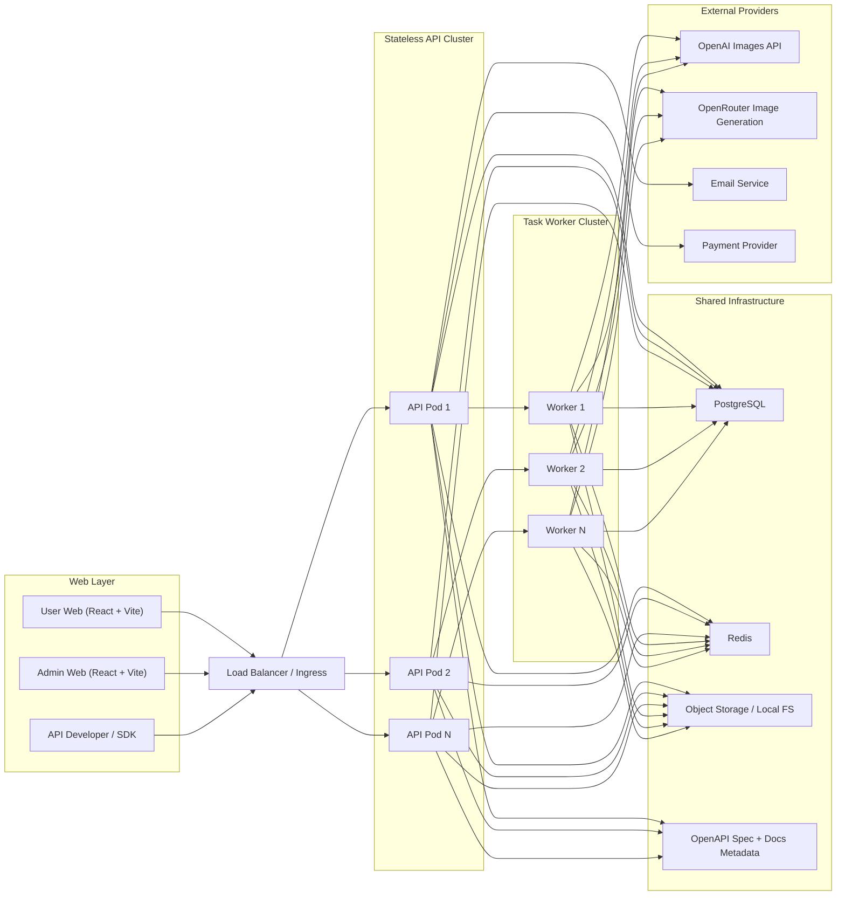
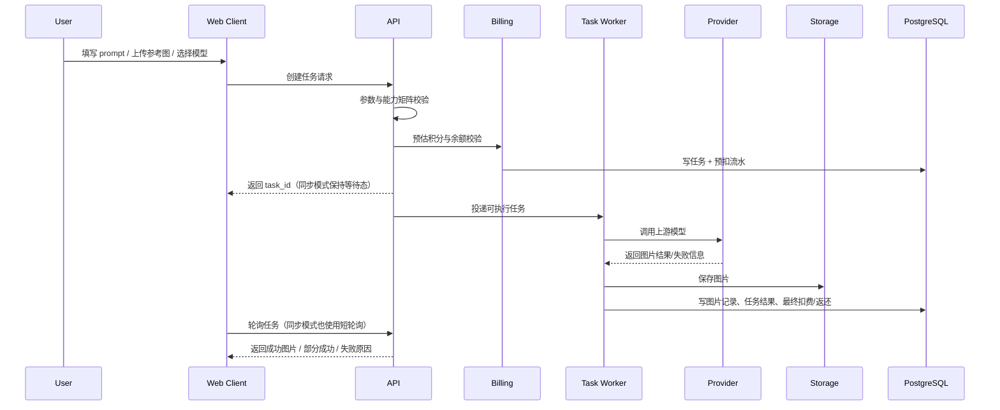
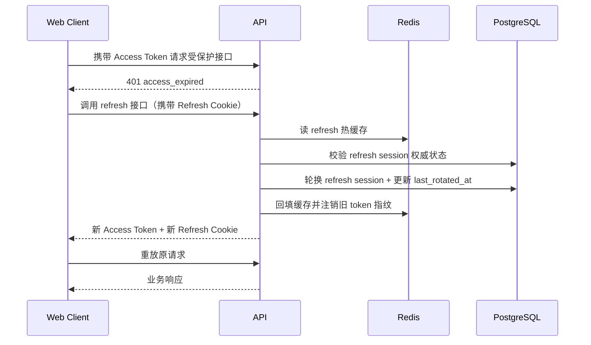
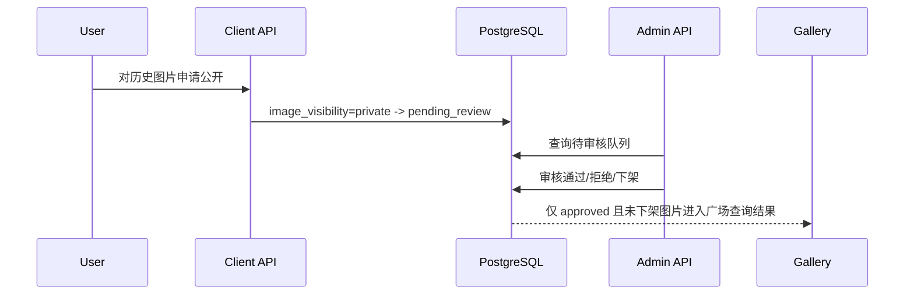

# Pic Gallery 技术方案

> 文档版本：v1.1
>  
> 创建日期：2026-05-19
>  
> 关联 PRD：`/Users/fatballfish/Documents/Projects/GoProjects/Personal/pic-gallery/docs/prd/pic-gallery-prd.md`
>  
> 关联评审：`/Users/fatballfish/Documents/Projects/GoProjects/Personal/pic-gallery/docs/reviews/pic-gallery-prd-review.md`
>  
> 参考仓库：`/Users/fatballfish/Documents/Projects/GoProjects/Public/sub2api`、`/Users/fatballfish/Documents/Projects/GoProjects/Public/new-api`、`/Users/fatballfish/Documents/Projects/VueProjects/gpt_image_playground`

## 一、需求描述

### 1.1 需求背景与预期效果

- 背景：Pic Gallery 是一个位于底层模型 API 与终端图片生成应用之间的平台，目标是在多供应商图像能力之上，补齐用户体系、积分计费、API Key、图床、模型路由、管理后台与后续公开广场闭环。
- 本期范围：以 P0 为主，覆盖邮箱登录注册、双 Token 会话、文生图、图生图、参考图生成、历史图库、积分计费、模型路由、API Key、OpenAI 兼容接口、开发文档页面、系统配置中心和管理后台；P1 后置公开审核与图片广场。
- 预期效果：
  - 终端用户可以完成从登录、兑换/充值、生成、下载到历史追溯的完整闭环。
  - API 开发者可以通过 AK/SK 调用平台原生接口和 OpenAI 兼容图片接口，而不用直接兼容多个底层模型。
  - 运营可以在后台动态配置汇率、价格、任务倍率、用户分组倍率、模型分组、最大生成数量、公开审核开关等核心参数。
  - 开发者可以在文档页面查看全部 OpenAPI 分类、参数说明、错误码和 curl/Python/TypeScript 示例。
  - 交付形态只包含用户 Web 和管理后台 Web，两者统一采用 React + Vite；不做独立 Client。
  - 平台能够沉淀任务、图片、计费、成本、会话和审计数据，为后续支付自动化、广场运营和更多模型扩展打基础。
- 为什么现在做：
  - PRD 已将图生图、参考图生成和会话安全纳入 P0，如果仍沿用“只有文生图 + 纯同步转发”的思路，会在 MVP 早期就撞上能力缺口。
  - 配置项较多，若不在首版建立配置中心，将导致每次价格、路由、上限变更都依赖研发发版。
  - 公开广场虽为 P1，但其数据模型和审核状态会反向影响图片、对象存储、审计和后台设计，技术方案阶段必须提前预埋。
- 🤖 AI 判断：由于仓库当前是从零开始、暂无既有业务负担，首版应优先采用“单体服务 + 统一任务编排 + 明确模块边界”的方案，而不是过早拆微服务。

### 1.2 涉及团队与人员

| 角色 | 负责人 | 职责范围 |
|---|---|---|
| 服务端 | 👤 待人工确认 | 用户、认证、积分、任务、模型路由、对象存储、后台 API |
| 用户 Web 前端 | 👤 待人工确认 | 登录注册、图片生成工作台、历史图库、账户中心、开发文档页、P1 图片广场 |
| 管理后台 Web | 👤 待人工确认 | 用户管理、用户分组倍率、模型接入、配置中心、积分策略、审核、监控大盘 |
| QA | 👤 待人工确认 | 功能、异常、兼容性、灰度验证 |
| SRE/运维 | 👤 待人工确认 | Docker 部署、监控告警、备份、日志采集 |
| 产品/运营 | 👤 待人工确认 | PRD 验收、配置项确认、公开审核规范 |

### 1.3 目标拆解

| 子目标 | 范围说明 | 交付标准 | 优先级 |
|---|---|---|---|
| G1 用户与会话闭环 | 邮箱验证码登录注册、双 Token、静默续期、回跳 | 满足 PRD A1/A2/A19 | P0 |
| G2 图片生成闭环 | 文生图、图生图、参考图、同步/异步任务、历史图库 | 满足 PRD A7/A8/A9/A10/A11/A12 | P0 |
| G3 计费与开发者闭环 | 积分余额、5 位小数账务、兑换码、API Key、平台原生 API、OpenAI 兼容接口、开发文档页 | 满足 PRD A4/A5/A6/A17/A23/A25 | P0 |
| G4 运营配置闭环 | 模型接入、抽象模型分组、价格策略、用户分组倍率、系统配置中心、错误策略 | 满足 PRD A13/A14/A15/A16/A18/A26 | P0 |
| G5 部署与稳定性闭环 | Docker 化、集群部署、监控告警、灰度与回滚、审计 | 满足 PRD A20/Q 系列 | P0 |
| G6 公开分享闭环 | 公开申请、人工审核、图片广场 | 满足 PRD B1/B2/B3 | P1 |

## 二、技术方案详情

### 2.1 整体架构

#### 2.1.1 总体设计

- 后端采用单体 Go 服务，内部按领域拆分模块：`auth`、`user`、`billing`、`imagegen`、`modelhub`、`admin`、`audit`。
- 用户 Web 与管理后台 Web 统一采用 `React + Vite`：
  - 用户 Web：图片生成、历史图库、余额、API Key、开发文档页、P1 图片广场。
  - 管理后台 Web：用户管理、用户分组倍率、模型接入、价格策略、配置中心、调用记录、审核和监控大盘。
- 数据层采用 PostgreSQL + Redis + 对象存储三件套：
  - PostgreSQL：权威业务数据，含用户、任务、图片、会话、积分、配置、审计、审核。
  - Redis：验证码、限流、刷新会话热缓存、幂等键、任务短期状态、配置热点缓存。
  - 对象存储：生成图、参考图、头像等二进制文件；首版支持本地文件系统与 S3 兼容对象存储两种驱动。
- 图片生成采用“统一任务编排模型”：
  - 无论 Web 还是 Open API，请求先落任务表，再由任务执行器调度底层模型。
  - Web 默认同步等待，但底层实现仍是“提交任务 -> 执行 -> 回填结果”，便于统一计费、历史、重试、监控与异步查询。
  - Open API 同时支持同步和异步模式。
- 管理后台与 C 端前台共用后端，但鉴权体系和路由分域独立。
- 对外 API 分为三层：
  - 平台原生 Open API：`/api/open/image/v1/*`
  - OpenAI 兼容层：`/v1/images/generations`、`/v1/images/edits`、`/v1/models`
  - 开发文档页：展示 OpenAPI 分类、字段、错误码和示例代码，底层以 OpenAPI 规范为单一数据源
- 集群部署是首版就要支持的场景：
  - API 实例必须无状态，可水平扩展。
  - 任务执行器支持多实例竞争领取任务。
  - 会话、幂等、限流、配置缓存和任务热状态依赖共享 Redis。
  - 账务、任务、审核和审计以 PostgreSQL 为单一权威源。
- P1 的公开审核链路在本期数据结构中预埋，但默认关闭公开入口和广场入口。

#### 2.1.2 架构图



#### 2.1.3 关键交互说明

1. 用户登录成功后，服务端签发短期 Access Token，并通过安全通道下发 Refresh Token；会话权威状态保存在 PostgreSQL，热路径缓存到 Redis。
2. 图片生成请求先经过参数校验、输出图片数量/参考图片数量解析、`auto` 质量档位解析、余额校验、能力匹配和预估扣费，再落为 `image_tasks` 任务记录。
3. API 层无状态，可以横向扩容；任务执行器通过共享存储竞争领取任务，确保集群模式下不会重复扣费或重复消费。
4. OpenAI 兼容层只负责协议适配，不单独存业务状态；所有兼容请求最终都归一成平台统一任务模型。
5. 生成结果落对象存储后，再更新 `task_images` 与积分流水，最后返回同步结果或供异步接口轮询查询。
6. 管理后台更新配置后写入 PostgreSQL，并通过 Redis 发布缓存失效事件，新任务在 1 分钟内读取新配置。

### 2.2 技术选型与方案对比

#### 2.2.1 业界调研结论

- OpenAI 官方 Images API 已同时覆盖文生图、编辑和多图输入场景，并强调输入图片、mask、质量与流式预览能力的参数差异，这说明本项目必须从一开始就把图生图/参考图纳入统一任务模型，而不是把它们视作文生图的“特殊参数”。参考：[OpenAI Image generation guide](https://platform.openai.com/docs/guides/image-generation)
- OpenAI 官方 Images API 和 Images API Reference 定义了 `POST /v1/images/generations` 与 `POST /v1/images/edits` 两类核心接口，这为本项目的 OpenAI 兼容层提供了主目标协议。参考：[OpenAI Images API Reference](https://platform.openai.com/docs/api-reference/images)
- OpenRouter 官方图像生成文档说明，其图片生成/编辑能力通过多模态 `chat/completions` 形式表达，并使用 `modalities: ["image", "text"]` 与图像输入内容进行组合；这意味着平台内部必须具备“OpenAI 图片协议 <-> OpenRouter 多模态协议”的双向转换层。参考：[OpenRouter Image Generation](https://openrouter.ai/docs/guides/overview/multimodal/image-generation)
- Google Vertex AI/Imagen 官方文档也提供了基于参考图与编辑遮罩的图片编辑能力，进一步说明“同一个平台上，不同供应商对图生图能力支持维度不一致”是常态，必须设计能力矩阵与参数映射层。参考：[Vertex AI image generation and editing](https://cloud.google.com/vertex-ai/generative-ai/docs/image/generate-images)
- OAuth 2.0 Security BCP（RFC 9700）推荐对公有客户端采用刷新令牌轮换与重放检测，这与本项目的 Web 双 Token 会话非常契合。参考：[RFC 9700](https://www.rfc-editor.org/rfc/rfc9700)
- AWS 官方建议在对象存储上传下载场景中使用预签名 URL、短 TTL、限制对象键前缀与服务端权限边界，这适合作为本项目对象存储能力的演进方向。参考：[Amazon S3 presigned URL upload](https://docs.aws.amazon.com/AmazonS3/latest/userguide/PresignedUrlUploadObject.html)
- OpenAI 官方 Moderation API 提供文本和图像审核入口，说明本项目后续可以把“自动机审 + 人工复审”作为 P1/P2 演进，而不是从一开始只依赖人工审核。参考：[OpenAI Moderation API](https://platform.openai.com/docs/api-reference/moderations)
- OpenAI 与 OpenRouter 都提供官方错误与调试说明，说明这类兼容网关必须在“自动重试 / 安全包装 / 业务直出 / 平台自定义错误”之间做分层，而不是简单透传上游 HTTP 状态码。参考：[OpenAI Error Codes](https://platform.openai.com/docs/guides/error-codes) / [OpenRouter Errors and Debugging](https://openrouter.ai/docs/api-reference/errors-and-debugging)

#### 2.2.2 方案对比一：图片生成执行架构

| 方案 | 描述 | 优点 | 缺点 | 结论 |
|---|---|---|---|---|
| A. 纯同步转发 | 请求到达后直接调用上游，成功即返回 | 实现最简单，前端调试成本低 | 无法统一任务状态、难以做历史、重试、部分成功、异步查询、审核链路 | 不选 |
| B. 全异步队列优先 | 所有请求先入消息队列，由独立 worker 完成 | 扩展性好，适合大规模任务 | 首版复杂度高，需要额外队列、死信、消费者运维 | 暂不首选 |
| C. 混合式统一任务编排 | 所有请求都先建任务，执行器可同步等待或异步返回 | 兼顾首版复杂度与后续扩展；天然支持计费、历史、审核、重试、监控 | 需要额外设计状态机与执行器 | 选型 |

- 🤖 AI 判断：选择方案 C。首版执行器以内嵌 worker goroutine + DB 轮询/抢占为主，不引入独立 MQ；当日任务量超过 30 万或执行节点超过 3 个时，再演进到 Redis Stream / Kafka。

#### 2.2.3 方案对比二：Web 会话模型

| 方案 | 描述 | 优点 | 缺点 | 结论 |
|---|---|---|---|---|
| A. Access/Refresh 都是纯 JWT，无服务端状态 | 实现快，服务端无会话表 | 无法精细失效、难做刷新重放检测、改密后踢会话复杂 | 不选 |
| B. 纯服务端 Session | 浏览器只持 session id，服务端集中存储 | 易于吊销和轮换 | 对 Open API/后台等多端统一性较差，跨端 token 语义弱 | 不选 |
| C. 短期 JWT Access + 轮换 Refresh Session | Access 为 JWT；Refresh 为随机串，仅存哈希与族系，刷新即轮换 | 同时满足鉴权性能、静默续期、安全吊销、重放检测 | 实现复杂度中等 | 选型 |

- 选型细节：
  - Access Token：JWT，10 分钟有效期，承载 `sub`、`role`、`session_id`、`token_version`。
  - Refresh Token：256-bit 随机串，只在服务端保存哈希；每次刷新都会轮换 refresh token 与 session row。
  - 前端存储：Access Token 保存在内存；Refresh Token 通过 `HttpOnly + Secure + SameSite=Lax` Cookie 下发。这样仍满足 PRD 的双 Token 模型，但不把 refresh 原文暴露给 JS。
  - 重放检测：如果旧 refresh token 被再次使用，则标记整个 session family 失效，要求重新登录。
  - 页面刷新恢复：前端 App 启动时若发现本地无 Access Token 但浏览器仍带有 Refresh Cookie，则先执行一次 bootstrap refresh，再拉取用户资料和权限。
  - 单飞刷新：同一浏览器标签页内，多个并发 401 请求共享一个 refresh promise；刷新成功后重放原请求，失败后统一登出。
  - 回跳策略：当 Access/Refresh 都失效时，前端把当前受保护页面写入 `sessionStorage.return_to`，登录成功后优先回跳该地址。

#### 2.2.4 方案对比三：图片文件上传与存储

| 方案 | 描述 | 优点 | 缺点 | 结论 |
|---|---|---|---|---|
| A. 所有文件都经后端中转 | 前端上传参考图到后端，由后端再写存储 | 实现简单，便于做鉴权/病毒扫描/限额 | 带宽和实例压力大 | 首版可用 |
| B. 前端直传对象存储 | 后端签发预签名 URL，前端直传 | 扩展性好，降低后端带宽 | 需要对象存储依赖和回调确认 | 作为演进 |
| C. 存储抽象 + 双模式 | 保留后端中转默认实现；开启对象存储后支持预签名直传 | 首版可交付，后续可扩展 | 设计复杂度略高 | 选型 |

- 🤖 AI 判断：首版采用方案 C。
  - 生成结果图由后端写入存储，确保结果一定先入库再对外可见。
  - 用户参考图上传默认走后端中转，便于首版控制大小、格式和内容安全。
  - 当配置启用 `storage.direct_upload_enabled=true` 且使用 S3 驱动时，允许前端通过预签名 URL 直传参考图。

#### 2.2.5 技术栈选择

| 层 | 选型 | 理由 |
|---|---|---|
| 后端 | Go + Gin | 与参考仓库 `sub2api` 一致，适合高并发 I/O 与容器化部署 |
| ORM/Schema | Ent + PostgreSQL | 参考现有 Ent schema、`created_at/updated_at/deleted_at` 规范，适合演进式 schema 管理 |
| 缓存/限流 | Redis | 验证码、会话热缓存、限流、幂等键、配置缓存均适合 |
| 用户 Web 前端 | React + Vite + React Router + TanStack Query | 用户已确认仅做 Web；适合 SPA 工作台、文档页和任务轮询 |
| 管理后台 Web | React + Vite + React Router + TanStack Query | 与用户 Web 复用工程能力，便于共享鉴权/请求/表格组件 |
| 前端本地状态 | Zustand（轻量本地 UI 状态）+ sessionStorage（回跳态） | 用于会话单飞、主题偏好、局部草稿和回跳信息 |
| 对象存储 | Local FS / S3-compatible | 同时兼顾个人部署与 SaaS 演进 |
| 任务执行 | 单服务内嵌 Dispatcher/Worker | 降低首版复杂度，保留后续拆分余地 |
| API 文档 | OpenAPI 3.1 规范 + React 文档页渲染（Redoc/Scalar 风格组件） | 以 OpenAPI 为单一数据源，降低文档和实现漂移 |

### 2.3 业务详细流程

#### 2.3.1 正常流程：Web 端图片生成



#### 2.3.2 正常流程：Token 静默续期



前端会话实现约束：

1. 应用启动时，如果内存中没有 Access Token，但存在 Refresh Cookie，则先执行 bootstrap refresh，再请求用户资料，避免用户刷新页面后被误判为未登录。
2. 同一浏览器标签页内只允许一个 refresh 请求在飞行中；其他 401 请求等待同一 promise 结果，避免刷新风暴。
3. 若 refresh 失败且确认双 Token 都失效，前端把当前目标地址（含查询参数）写入 `sessionStorage.return_to`，跳转登录页。
4. 登录成功后优先消费 `sessionStorage.return_to` 并清空该键；若为空则跳转默认首页/工作台。

#### 2.3.3 正常流程：公开申请与审核（P1）



#### 2.3.4 异常路径清单

| 场景 | 处理策略 | 是否重试 | 是否扣费 |
|---|---|---|---|
| 参数无可用模型支持 | 在提交前通过能力矩阵禁用；服务端再次兜底校验 | 否 | 否 |
| 上游超时/429/5xx | 命中可降级错误时按链路切换下一模型，最多 3 跳 | 是，受上限限制 | 全失败不扣费 |
| 上游返回部分成功 | 保存成功图片，记录失败原因 | 否 | 按成功张数扣费 |
| 对象存储写入失败 | 标记对应图片失败；如果全部失败则整任务失败并返还预扣 | 可重试 1 次 | 未保存成功的不扣费 |
| 会话刷新并发风暴 | 前端单飞刷新；同浏览器多请求共用同一次 refresh promise | 否 | 不涉及 |
| 配置变更发生在运行中 | 已创建任务固化计费快照与路由快照；新任务读新配置 | 否 | 按提交时快照 |
| 数据库事务提交失败 | 整体回滚，任务保持 `queued` 或 `failed`，由补偿器扫描 | 是，后台补偿 | 不多扣 |
| Worker 进程崩溃 | 未领取成功的任务继续可见；已领取超时未心跳的任务回收 | 是 | 不多扣 |
| Refresh Token 重放 | 失效整个 session family，要求重新登录 | 否 | 不涉及 |
| 公开审核操作中断 | 审核写操作事务化；若失败保持原状态 | 否 | 不涉及 |

#### 2.3.5 前端页面与组件设计

##### 用户 Web 页面

| 页面 | 主要功能 | 核心组件 |
|---|---|---|
| `/` 首页 | 产品介绍、价格说明、登录入口、能力亮点 | Hero、价格卡、模型能力卡、FAQ |
| `/auth/login` 登录注册页 | 发码登录、注册、忘记密码、回跳 | 邮箱表单、验证码输入、登录态提示 |
| `/workspace/generate` 生成工作台 | Prompt、参考图上传、质量/比例/数量、价格预估、任务等待与结果展示 | PromptEditor、ReferenceUploader、QualitySelector、PricePreview、TaskStatusPanel、ImageResultGrid |
| `/history` 历史图库 | 任务列表、筛选、详情、下载、删除、公开申请 | HistoryFilterBar、TaskCard、ImagePreviewDrawer |
| `/account/billing` 余额页 | 可用积分、冻结积分、用户分组倍率、流水 | BalanceSummary、UserGroupBadge、LedgerTable |
| `/account/api-keys` API Key 管理 | 创建、重置、禁用、删除、复制 | APIKeyTable、CreateKeyModal |
| `/developers/docs` 开发文档页 | 接口分类、参数说明、错误码、示例代码 | APISidebar、EndpointDocView、CodeTabs、SearchBox |
| `/gallery`（P1） | 公开图片瀑布流 | WaterfallGrid、GalleryFilterBar |

##### 管理后台 Web 页面

| 页面 | 主要功能 | 核心组件 |
|---|---|---|
| `/admin/login` | 管理员登录 | LoginForm |
| `/admin/dashboard` | 稳定性/运营大盘 | MetricCards、TrendCharts |
| `/admin/users` | 用户管理与分组倍率 | UserTable、UserGroupEditor、PointAdjustModal |
| `/admin/model-routing` | Provider、模型分组、优先级、AB、降级 | ProviderTable、RouteMatrix、FallbackEditor |
| `/admin/pricing` | 价格表、任务倍率、参考图附加倍率 | PricingMatrix、MultiplierForm |
| `/admin/config` | 分类 Tab 配置中心 | ConfigTabs、JSONEditor/TypedForms |
| `/admin/tasks` | 调用记录、错误码、成本分析 | TaskQueryForm、TaskTable、ErrorBreakdownChart |
| `/admin/audits` | 审计日志 | AuditTable |
| `/admin/reviews`（P1） | 公开图片审核 | ReviewQueue、ReviewActionPanel |

##### 前端状态与数据流

1. 鉴权状态由 `AuthProvider` 统一管理，Access Token 仅驻留内存；bootstrap refresh 与 singleflight refresh 封装在 `authClient`。
2. 业务数据获取统一通过 TanStack Query；任务轮询、余额刷新、配置读取均使用 query key 隔离缓存。
3. 文档页面从 OpenAPI JSON/ YAML 构建展示数据，附加少量手工维护的“快速开始”和“兼容说明”文案。
4. 用户草稿（Prompt、比例、数量、最近使用模型）保存在 localStorage；回跳信息保存在 sessionStorage。

### 2.4 接口设计

#### 2.4.1 路由分类总览

| 类别 | 路由前缀 | 用途 |
|---|---|---|
| Open API | `/api/open/image/v1/` | 给 API 开发者的 AK/SK 平台原生接口、支付 webhook、未来公开广场读接口 |
| OpenAI 兼容入口 | `/v1/*` | 对外兼容 OpenAI SDK/生态；内部仍归属 Open API image service |
| Agent/Client API | `/api/agent/{service}/v1/` | Web 客户端调用，使用用户 Access Token / Refresh Cookie |
| Inner API | `/api/inner/{service}/v1/` | 服务内回调、对象存储确认、未来异步 provider callback |
| Ops API | `/api/ops/{service}/v1/` | 管理后台、运营与超级管理员能力 |
| Debug API | `/api/debug/{service}/v1/` | 本地调试、上游模拟、灰度诊断，仅非生产启用 |

说明：

1. 组织标准建议 Open API 使用 `/api/open/{service}/...` 前缀；本方案保留这一规范作为平台原生接口。
2. 由于 OpenAI SDK 和大量第三方工具强依赖 `/v1/images/*` 路径，兼容层必须额外暴露 `/v1/*`；这是一个明确的兼容性例外，但内部审计、限流、计费、任务模型和路由模型仍全部归属 `image service`。

#### 2.4.2 Agent/Client API

##### 认证与用户

| 方法 | 路径 | 说明 | 鉴权 | 限流 | 幂等性 |
|---|---|---|---|---|---|
| `POST` | `/api/agent/auth/v1/email/send-code` | 发送登录/注册验证码 | 无 | 同邮箱 60s/次、同 IP 10 次/小时 | 幂等 key=`email+scene+minute` |
| `POST` | `/api/agent/auth/v1/login/email-code` | 邮箱验证码登录/注册 | 无 | 5 次/15 分钟 | 请求幂等窗口 30s |
| `POST` | `/api/agent/auth/v1/session/refresh` | 静默续期 | Refresh Cookie | 每 session 12 次/小时 | 旧 refresh 只可成功一次 |
| `POST` | `/api/agent/auth/v1/logout` | 当前会话退出 | Access Token | 30 次/小时 | 幂等 |
| `GET` | `/api/agent/user/v1/profile` | 获取个人资料与偏好 | Access Token | 120 RPM | 幂等读 |
| `PUT` | `/api/agent/user/v1/profile` | 更新昵称/签名/头像 | Access Token | 30 RPM | 幂等 key 可选 |
| `PUT` | `/api/agent/user/v1/preferences` | 更新主题和默认生成偏好 | Access Token | 30 RPM | 幂等覆盖写 |

##### 余额、兑换码、历史

| 方法 | 路径 | 说明 | 鉴权 | 限流 | 幂等性 |
|---|---|---|---|---|---|
| `GET` | `/api/agent/billing/v1/balance` | 获取可用积分、套餐、冻结积分 | Access Token | 60 RPM | 幂等读 |
| `GET` | `/api/agent/billing/v1/ledger` | 获取积分流水 | Access Token | 60 RPM | 幂等读 |
| `GET` | `/api/agent/billing/v1/estimate` | 价格预估，返回解析后的质量档位和预计积分 | Access Token | 60 RPM | 幂等读 |
| `POST` | `/api/agent/billing/v1/redeem-codes/redeem` | 兑换码核销 | Access Token | 用户 10 次/小时 | `Idempotency-Key` 必填 |
| `GET` | `/api/agent/image/v1/history/tasks` | 任务列表 | Access Token | 60 RPM | 幂等读 |
| `GET` | `/api/agent/image/v1/history/tasks/{task_id}` | 任务详情 | Access Token | 120 RPM | 幂等读 |
| `DELETE` | `/api/agent/image/v1/history/tasks/{task_id}` | 删除历史任务展示 | Access Token | 20 RPM | 幂等删 |
| `POST` | `/api/agent/gallery/v1/images/{image_id}/publish` | 申请公开 | Access Token | 10 RPM | 幂等状态迁移 |

##### 图片生成

| 方法 | 路径 | 说明 | 鉴权 | 限流 | 幂等性 |
|---|---|---|---|---|---|
| `GET` | `/api/agent/image/v1/capabilities` | 返回用户可见的模型分组、数量上限、任务类型开关、质量/比例范围 | Access Token | 120 RPM | 幂等读 |
| `POST` | `/api/agent/image/v1/reference-assets` | 上传参考图，返回可复用 `reference_asset_id` | Access Token | 20 RPM | 文件 hash 去重 |
| `GET` | `/api/agent/image/v1/reference-assets/{asset_id}` | 查询参考图上传状态与元信息 | Access Token | 60 RPM | 幂等读 |
| `DELETE` | `/api/agent/image/v1/reference-assets/{asset_id}` | 删除未使用或用户主动删除的参考图 | Access Token | 20 RPM | 幂等删 |
| `POST` | `/api/agent/image/v1/tasks` | 创建图片生成任务 | Access Token | 取用户/套餐/平台最严格限流 | `Idempotency-Key` 推荐 |
| `GET` | `/api/agent/image/v1/tasks/{task_id}` | 查询任务状态 | Access Token | 120 RPM | 幂等读 |
| `GET` | `/api/agent/image/v1/images/{image_id}/download` | 获取下载签名地址或流式下载 | Access Token | 60 RPM | 幂等读 |

`POST /api/agent/image/v1/tasks` 请求示例：

```json
{
  "task_type": "image_edit",
  "prompt": "把主体改成夏日海边风格，保留人物姿态",
  "negative_prompt": "low quality, blur",
  "abstract_model": "plus",
  "quality": "auto",
  "aspect_ratio": "1:1",
  "requested_output_image_count": 2,
  "reference_asset_ids": [
    "refasset_01"
  ],
  "reference_strength": 60,
  "seed": 12345,
  "response_mode": "sync",
  "save_policy": "private"
}
```

响应示例：

```json
{
  "task_id": "task_01JXYZ...",
  "status": "queued",
  "response_mode": "sync",
  "resolved_quality_bucket": "2k",
  "requested_output_image_count": 2,
  "reference_image_count": 1,
  "estimated_points": "22.00000",
  "billing_snapshot": {
    "abstract_model": "plus",
    "quality": "2k",
    "task_multiplier": "1.25000",
    "reference_image_extra_multiplier": "0.10000",
    "user_group_multiplier": "1.00000",
    "requested_output_image_count": 2
  },
  "poll_after_ms": 2000
}
```

#### 2.4.3 Open API（AK/SK）

| 方法 | 路径 | 说明 | 鉴权 | 限流 | 幂等性 |
|---|---|---|---|---|---|
| `POST` | `/api/open/image/v1/reference-assets/uploads` | 创建参考图上传会话，返回预签名 URL 或中转上传地址 | `X-Access-Key` + `X-Signature` | 20 RPM | `Idempotency-Key` 推荐 |
| `POST` | `/api/open/image/v1/reference-assets` | 中转上传参考图（multipart） | AK/SK | 20 RPM | 文件 hash 去重 |
| `GET` | `/api/open/image/v1/reference-assets/{asset_id}` | 查询参考图资产状态 | AK/SK | 60 RPM | 幂等读 |
| `POST` | `/api/open/image/v1/tasks` | 创建文生图/图生图/参考图任务 | `X-Access-Key` + `X-Signature` | 取 key/user/platform 最严格值 | `Idempotency-Key` 推荐 |
| `GET` | `/api/open/image/v1/tasks/{task_id}` | 查询任务状态和结果 | AK/SK | 120 RPM | 幂等读 |
| `GET` | `/api/open/image/v1/balance` | 查询余额摘要 | AK/SK | 60 RPM | 幂等读 |
| `GET` | `/api/open/image/v1/capabilities` | 查询当前 key 可用分组和参数范围 | AK/SK | 60 RPM | 幂等读 |
| `GET` | `/api/open/image/v1/estimate` | 查询某次请求的计费预估 | AK/SK | 60 RPM | 幂等读 |
| `GET` | `/api/open/image/v1/gallery/images` | P1 广场公开列表 | 游客或登录用户 | CDN/匿名限流 | 幂等读 |
| `POST` | `/api/open/image/v1/payments/webhooks/{provider}` | 支付回调入口 | provider 签名 | provider 限流 | 以交易号幂等 |

- 签名建议：`HMAC-SHA256(secret, method + path + timestamp + body_sha256)`。
- 时间漂移要求：默认允许 `±300s`。
- 错误码语义与 Agent API 保持一致，避免双通道行为差异。

#### 2.4.4 OpenAI 兼容接口

| 方法 | 路径 | 说明 | 鉴权 | 限流 | 幂等性 |
|---|---|---|---|---|---|
| `POST` | `/v1/images/generations` | 兼容 OpenAI `gpt-image-2` 风格的生成接口 | `Authorization: Bearer sk-*` | 取 key/user/platform 最严格值 | `Idempotency-Key` 推荐 |
| `POST` | `/v1/images/edits` | 兼容 OpenAI `gpt-image-2` 风格的编辑接口 | `Authorization: Bearer sk-*` | 取 key/user/platform 最严格值 | `Idempotency-Key` 推荐 |
| `GET` | `/v1/models` | 返回兼容模型列表 | `Authorization: Bearer sk-*` | 60 RPM | 幂等读 |

`POST /v1/images/generations` 支持字段（首版）：

| 字段 | 类型 | 说明 | 兼容策略 |
|---|---|---|---|
| `model` | string | 兼容模型名，如 `gpt-image-2` | 映射到抽象模型组/具体 provider model |
| `prompt` | string | 提示词 | 直接映射 |
| `size` | string | 如 `1024x1024`、`1536x1024`、`auto` | 映射到 `resolved_quality_bucket + resolved_width/height` |
| `n` | integer | 输出图片数量 | 缺省值 1，映射到 `requested_output_image_count` |
| `quality` | string | `low/medium/high/auto` 或兼容值 | 映射到 1K/2K/4K 桶，无法识别时按 `auto` 处理 |
| `response_format` | string | `b64_json` / `url` | 平台统一支持，内部结果做二次归一 |
| `user` | string | 调用方透传标识 | 写入审计与日志 |

`POST /v1/images/edits` 支持字段（首版）：

| 字段 | 类型 | 说明 | 兼容策略 |
|---|---|---|---|
| `model` | string | 兼容模型名 | 同上 |
| `image` | multipart file or files | 输入图片，首版支持 1-4 张 | 先转存为 `reference_assets` |
| `mask` | multipart file，可空 | 编辑遮罩 | 若 provider 不支持则拒绝而不是静默丢弃 |
| `prompt` | string | 编辑指令 | 直接映射 |
| `size` | string | 输出尺寸或 `auto` | 同生成接口 |
| `n` | integer | 输出图片数量 | 缺省值 1 |
| `quality` | string | 质量 | 同生成接口 |
| `response_format` | string | `b64_json` / `url` | 同生成接口 |

兼容响应示例（生成/编辑统一）：

```json
{
  "created": 1770000000,
  "data": [
    {
      "b64_json": "<base64>",
      "revised_prompt": "optional"
    }
  ]
}
```

若请求 `response_format=url`，则返回：

```json
{
  "created": 1770000000,
  "data": [
    {
      "url": "https://cdn.example.com/task/task_01/image_1.png"
    }
  ]
}
```

OpenAI 兼容层内部转换策略：

1. **OpenAI Provider**：优先直连 `/v1/images/generations` 或 `/v1/images/edits`。
2. **OpenRouter Provider**：按官方文档转换成 `/chat/completions`：
   - `messages[0].content = prompt`（纯文生图）
   - `messages[0].content = [{type:"text"...},{type:"image_url"...}]`（图生图/编辑）
   - `modalities = ["image", "text"]`
   - `size`、`n`、`quality` 放入 OpenRouter 兼容字段
3. **响应归一**：
   - OpenAI 返回 `data[].b64_json/url` 时直接透传或二次包装
   - OpenRouter 返回 `choices[].message.images[].image_url.url` 时，若是 data URL 则解出 `b64_json`；若是远端 URL 则转成 `url`

参考实现来源：

- 官方文档：[OpenAI Images API Reference](https://platform.openai.com/docs/api-reference/images)
- 官方文档：[OpenRouter Image Generation](https://openrouter.ai/docs/guides/overview/multimodal/image-generation)
- 本地参考脚本：`/Users/fatballfish/Documents/Projects/GoProjects/Personal/pic-gallery/docs/notes/gen_pic.py`
- 参考路由：`/Users/fatballfish/Documents/Projects/GoProjects/Public/new-api/router/relay-router.go`

#### 2.4.5 Ops API（管理后台）

| 方法 | 路径 | 说明 | 鉴权 | 限流 | 幂等性 |
|---|---|---|---|---|---|
| `POST` | `/api/ops/admin/v1/auth/login` | 管理员登录 | Admin auth | 10 次/15 分钟 | 幂等窗口 30s |
| `GET` | `/api/ops/admin/v1/users` | 用户分页查询 | Admin Token | 120 RPM | 幂等读 |
| `POST` | `/api/ops/admin/v1/users/{user_id}/status` | 禁用/启用用户 | Admin Token | 20 RPM | 幂等状态写 |
| `POST` | `/api/ops/admin/v1/users/{user_id}/points-adjustments` | 人工调积分 | Admin Token | 10 RPM | `Idempotency-Key` 必填 |
| `POST` | `/api/ops/admin/v1/users/{user_id}/group` | 更新用户分组倍率 | Admin Token | 20 RPM | 幂等覆盖写 |
| `GET` | `/api/ops/admin/v1/model-providers` | 供应商列表 | Admin Token | 120 RPM | 幂等读 |
| `POST` | `/api/ops/admin/v1/model-providers` | 创建供应商 | Admin Token | 20 RPM | 幂等创建 |
| `PUT` | `/api/ops/admin/v1/model-routes/{route_id}` | 更新分组、优先级、AB、降级 | Admin Token | 20 RPM | 乐观锁版本号 |
| `PUT` | `/api/ops/admin/v1/error-policies/{provider}` | 更新上游错误包装策略 | Admin Token | 20 RPM | 乐观锁版本号 |
| `GET` | `/api/ops/admin/v1/config-tabs` | 获取分类配置页数据 | Admin Token | 60 RPM | 幂等读 |
| `PUT` | `/api/ops/admin/v1/config-tabs/{tab_key}` | 更新分类配置 | Admin Token | 20 RPM | 乐观锁版本号 |
| `GET` | `/api/ops/admin/v1/image-reviews` | 待审核图片列表 | Admin Token | 60 RPM | 幂等读 |
| `POST` | `/api/ops/admin/v1/image-reviews/{image_id}:approve` | 审核通过 | Admin Token | 20 RPM | 幂等状态写 |
| `POST` | `/api/ops/admin/v1/image-reviews/{image_id}:reject` | 审核拒绝 | Admin Token | 20 RPM | 幂等状态写 |
| `POST` | `/api/ops/admin/v1/image-reviews/{image_id}:unpublish` | 已公开图片下架 | Admin Token | 20 RPM | 幂等状态写 |
| `GET` | `/api/ops/admin/v1/tasks` | 调用记录查询 | Admin Token | 60 RPM | 幂等读 |
| `GET` | `/api/ops/admin/v1/metrics/dashboard` | 稳定性/运营大盘 | Admin Token | 30 RPM | 幂等读 |

#### 2.4.6 Inner / Debug API

| 方法 | 路径 | 用途 | 说明 |
|---|---|---|---|
| `POST` | `/api/inner/storage/v1/uploads/complete` | 直传完成确认 | 前端直传参考图后的服务端确认 |
| `POST` | `/api/inner/provider/v1/tasks/{task_id}/callback` | 未来上游回调预留 | 首版多数 provider 走同步响应，不默认启用 |
| `POST` | `/api/inner/cluster/v1/tasks/heartbeat` | worker 心跳续租 | 集群模式下更新任务 lease |
| `POST` | `/api/debug/image/v1/tasks/{task_id}:retry` | 调试重试 | 仅本地和灰度环境开放 |
| `POST` | `/api/debug/provider/v1/mock-result` | 注入模拟上游结果 | 便于 E2E 与联调 |

参考图上传接口说明：

- Agent API 默认支持 `multipart/form-data` 中转上传，返回：

```json
{
  "reference_asset_id": "refasset_01JXYZ...",
  "status": "ready",
  "mime_type": "image/png",
  "file_size_bytes": 1048576,
  "preview_url": "/api/agent/image/v1/reference-assets/refasset_01JXYZ.../preview",
  "expires_at": "2026-05-20T12:00:00+08:00"
}
```

- Open API 支持两种模式：
  1. 小文件走中转上传 `multipart/form-data`
  2. 大文件先创建上传会话，拿预签名 URL 直传，再调用 `/api/inner/storage/v1/uploads/complete` 或等价确认接口
- `reference_asset_id` 只能被所属用户或所属 API Key 引用，且默认 24 小时未被任务引用则自动清理。

#### 2.4.7 超时、重试与幂等约定

| 接口类型 | 超时 | 重试策略 | 幂等策略 |
|---|---|---|---|
| 登录/资料/配置类 | 3-5s | 前端不自动重试 | 表单提交靠请求唯一键 |
| 图片任务创建 | 8s | 前端网络错误最多提示重试一次 | `Idempotency-Key` + 请求摘要哈希 |
| 上游模型调用 | 30-90s，按模型配置 | 仅 worker 内部重试或降级，不由前端重试 | task_id 天然幂等 |
| 对象存储写入 | 10s | 单文件重试 1 次 | object_key 唯一 |
| 兑换码/积分调整/支付回调 | 5-10s | 服务端按事务与幂等键补偿 | 幂等表 + 唯一业务键 |

### 2.5 算法设计

#### 2.5.1 模型筛选与降级伪代码

```text
input: task
cfg := load routing snapshot(task.config_version)
resolved_quality_bucket := resolve_quality(task.explicit_quality, task.explicit_size, task.abstract_model)
candidates := filter providers by:
  provider.enabled == true
  provider.group == task.abstract_model
  task.task_type in provider.supported_task_types
  resolved_quality_bucket in provider.supported_qualities
  task.aspect_ratio in provider.supported_ratios or provider.can_map_ratio
  task.requested_output_image_count <= provider.max_image_count
  task.reference_image_count <= provider.max_reference_image_count
  if task.reference_image_count > 0 => provider.supports_image_input == true
  if task.mask_present => provider.supports_mask == true

if candidates is empty:
  reject task with CAPABILITY_MISMATCH

ordered := sort by health desc, priority asc
weighted := apply AB ratio on same priority bucket

for candidate in fallback_chain(weighted, max_hops=3):
  provider_request := build_provider_request(candidate.platform, task)
  result := invoke provider(candidate, provider_request)
  if result.success:
    return result
  policy := classify_upstream_error(candidate.platform, result.error)
  if policy == retryable:
    continue
  if policy in {wrapped_user_error, passthrough_safe_error}:
    break

return final failure
```

#### 2.5.2 计费结算伪代码

```text
resolved_quality_bucket =
  resolve_quality(task.explicit_quality, task.explicit_size, task.abstract_model)

base_unit_points =
  unit_points(task.abstract_model, resolved_quality_bucket, config_snapshot)

task_multiplier =
  task_type_multiplier(task.task_type, config_snapshot)

reference_image_extra_multiplier =
  if task.reference_image_count == 0 then 0
  else first_reference_extra(config_snapshot)
       + max(task.reference_image_count - 1, 0) * next_reference_extra(config_snapshot)

user_group_multiplier =
  resolve_user_group_multiplier(task.user_id, config_snapshot)

estimate_points =
  round_5(
    base_unit_points
    * task.requested_output_image_count
    * task_multiplier
    * (1 + reference_image_extra_multiplier)
    * user_group_multiplier
  )

create ledger(type=reserve, amount=estimate_points)

on task finish:
  actual_points =
    round_5(
      base_unit_points
      * task.success_output_image_count
      * task_multiplier
      * (1 + reference_image_extra_multiplier)
      * user_group_multiplier
    )

  if task.success_output_image_count == 0:
    revert reserve
  else if actual_points == estimate_points:
    finalize reserve
  else:
    finalize actual_points and refund difference
```

#### 2.5.3 OpenAI 兼容协议到 Provider 协议的转换伪代码

```text
input: inbound_http_request

if route == /v1/images/generations:
  normalized_task.task_type = text_to_image
  normalized_task.prompt = body.prompt
  normalized_task.requested_output_image_count = body.n or 1
  normalized_task.explicit_size = body.size
  normalized_task.explicit_quality = map_openai_quality(body.quality)

if route == /v1/images/edits:
  normalized_task.task_type = image_edit
  normalized_task.reference_assets = persist_uploaded_images(multipart.images)
  normalized_task.mask_asset = persist_uploaded_mask_if_present(multipart.mask)
  normalized_task.requested_output_image_count = body.n or 1
  normalized_task.explicit_size = body.size
  normalized_task.explicit_quality = map_openai_quality(body.quality)

if provider.platform == openai:
  upstream_request = build_openai_images_request(normalized_task)

if provider.platform == openrouter:
  upstream_request = {
    model: provider.model_code,
    messages: [{
      role: "user",
      content: build_text_or_multimodal_content(normalized_task)
    }],
    modalities: ["image", "text"],
    size: normalized_task.explicit_size or render_size(normalized_task),
    n: normalized_task.requested_output_image_count,
    quality: map_to_openrouter_quality(normalized_task)
  }

upstream_response = call(provider, upstream_request)
normalized_response = normalize_provider_image_response(upstream_response)
return normalized_response
```

### 2.6 数据结构设计

#### 2.6.1 数据模型总览

- 设计风格参考 `sub2api` 的 Ent schema 与 mixin：
  - 时间字段统一为 `created_at`、`updated_at`，类型 `timestamptz`
  - 需要软删的实体使用 `deleted_at`
  - 金额使用整数最小货币单位；积分使用定点小数，避免浮点误差
- 🤖 AI 判断：由于 PRD 已要求积分支持到小数点后 5 位，积分字段统一使用 `numeric(20,5)`；人民币价格继续使用 `amount_cents bigint`，汇率使用 `cny_per_point_micros bigint` 存储。

#### 2.6.2 核心表结构

##### `users`

| 字段 | 类型 | 说明 | 索引 |
|---|---|---|---|
| `id` | bigint PK | 用户 ID | PK |
| `email` | varchar(255) | 登录邮箱 | `uk_users_email` |
| `password_hash` | varchar(255) null | 密码登录预留 | - |
| `nickname` | varchar(64) | 昵称 | `idx_users_nickname` |
| `bio` | varchar(255) | 签名 | - |
| `avatar_object_key` | varchar(255) null | 头像对象键 | - |
| `status` | varchar(32) | `pending/active/disabled` | `idx_users_status` |
| `user_group_id` | bigint | 当前生效用户分组 | `idx_users_user_group_id` |
| `token_version` | int | 会话吊销版本 | - |
| `default_locale` | varchar(16) | `zh-CN/en-US` | - |
| `theme` | varchar(16) | `light/dark/system` | - |
| `created_at` | timestamptz | 创建时间 | `idx_users_created_at` |
| `updated_at` | timestamptz | 更新时间 | - |
| `deleted_at` | timestamptz null | 软删 | `idx_users_deleted_at` |

##### `user_groups`

| 字段 | 类型 | 说明 | 索引 |
|---|---|---|---|
| `id` | bigint PK | 分组 ID | PK |
| `group_code` | varchar(32) | 分组编码 | `uk_user_groups_group_code` |
| `group_name` | varchar(64) | 展示名称 | - |
| `multiplier` | numeric(20,5) | 用户分组倍率 | - |
| `status` | varchar(16) | `active/disabled` | `idx_user_groups_status` |
| `description` | varchar(255) null | 说明 | - |
| `created_at` | timestamptz | 创建时间 | - |
| `updated_at` | timestamptz | 更新时间 | - |

##### `admin_users`

| 字段 | 类型 | 说明 | 索引 |
|---|---|---|---|
| `id` | bigint PK | 管理员 ID | PK |
| `email` | varchar(255) | 后台账号 | `uk_admin_users_email` |
| `password_hash` | varchar(255) | 强密码哈希 | - |
| `role` | varchar(32) | `super_admin/ops_admin` | `idx_admin_users_role` |
| `status` | varchar(32) | `active/disabled` | `idx_admin_users_status` |
| `created_at` | timestamptz | 创建时间 | - |
| `updated_at` | timestamptz | 更新时间 | - |

##### `refresh_sessions`

| 字段 | 类型 | 说明 | 索引 |
|---|---|---|---|
| `id` | uuid PK | session ID | PK |
| `user_id` | bigint | 用户 ID | `idx_refresh_sessions_user_id` |
| `session_family_id` | uuid | 同一登录链路族系 | `idx_refresh_sessions_family_id` |
| `refresh_token_hash` | varchar(128) | refresh token 哈希 | `uk_refresh_sessions_token_hash` |
| `status` | varchar(32) | `active/rotated/revoked/expired/replay_blocked` | `idx_refresh_sessions_status` |
| `user_agent` | varchar(255) | 终端信息 | - |
| `ip_addr` | inet | 登录/刷新 IP | - |
| `expires_at` | timestamptz | 2 小时失效时间 | `idx_refresh_sessions_expires_at` |
| `last_rotated_at` | timestamptz | 最近轮换时间 | - |
| `replaced_by_session_id` | uuid null | 下一代 session | - |
| `created_at` | timestamptz | 创建时间 | - |
| `updated_at` | timestamptz | 更新时间 | - |

##### `api_keys`

| 字段 | 类型 | 说明 | 索引 |
|---|---|---|---|
| `id` | bigint PK | 主键 | PK |
| `user_id` | bigint | 所属用户 | `idx_api_keys_user_id` |
| `access_key` | varchar(64) | 对外 AK | `uk_api_keys_access_key` |
| `secret_hash` | varchar(128) | SK 哈希 | - |
| `name` | varchar(64) | 密钥名称 | - |
| `status` | varchar(32) | `active/disabled/expired/deleted` | `idx_api_keys_status` |
| `group_code` | varchar(32) | 分组 | `idx_api_keys_group_code` |
| `total_quota_points` | numeric(20,5) null | 总额度 | - |
| `daily_quota_points` | numeric(20,5) null | 日额度 | - |
| `rpm_limit` | int null | RPM | - |
| `expires_at` | timestamptz null | 过期时间 | `idx_api_keys_expires_at` |
| `last_used_at` | timestamptz null | 最近使用时间 | `idx_api_keys_last_used_at` |
| `created_at` | timestamptz | 创建时间 | - |
| `updated_at` | timestamptz | 更新时间 | - |
| `deleted_at` | timestamptz null | 软删 | `idx_api_keys_deleted_at` |

##### `reference_assets`

| 字段 | 类型 | 说明 | 索引 |
|---|---|---|---|
| `id` | uuid PK | 参考图资产 ID | PK |
| `user_id` | bigint | 所属用户 | `idx_reference_assets_user_id` |
| `api_key_id` | bigint null | 来源 API Key | `idx_reference_assets_api_key_id` |
| `upload_source` | varchar(16) | `web/openapi` | `idx_reference_assets_upload_source` |
| `status` | varchar(32) | `uploading/ready/expired/deleted` | `idx_reference_assets_status` |
| `storage_driver` | varchar(16) | `local/s3` | - |
| `object_key` | varchar(255) | 文件对象键 | `uk_reference_assets_object_key` |
| `mime_type` | varchar(64) | 类型 | - |
| `file_size_bytes` | bigint | 大小 | - |
| `width` | int null | 宽 | - |
| `height` | int null | 高 | - |
| `sha256` | varchar(64) | 文件指纹 | `idx_reference_assets_sha256` |
| `bound_task_id` | uuid null | 首次被哪个任务消费 | `idx_reference_assets_bound_task_id` |
| `expires_at` | timestamptz | 未使用过期时间 | `idx_reference_assets_expires_at` |
| `created_at` | timestamptz | 创建时间 | - |
| `updated_at` | timestamptz | 更新时间 | - |
| `deleted_at` | timestamptz null | 软删 | `idx_reference_assets_deleted_at` |

##### `image_tasks`

| 字段 | 类型 | 说明 | 索引 |
|---|---|---|---|
| `id` | uuid PK | 任务 ID | PK |
| `user_id` | bigint | 用户 ID | `idx_image_tasks_user_id` |
| `api_key_id` | bigint null | 来源 API Key | `idx_image_tasks_api_key_id` |
| `source_channel` | varchar(16) | `web/openapi/admin` | `idx_image_tasks_source_channel` |
| `task_type` | varchar(32) | `text_to_image/image_edit/reference_generate` | `idx_image_tasks_task_type` |
| `status` | varchar(32) | `pending_validation/rejected/queued/running/succeeded/partial_failed/failed/deleted` | `idx_image_tasks_status` |
| `prompt` | text | 正向提示词 | - |
| `negative_prompt` | text null | 负向提示词 | - |
| `abstract_model` | varchar(32) | `basic/plus/pro/...` | `idx_image_tasks_abstract_model` |
| `requested_quality` | varchar(16) | `auto/1k/2k/4k` | - |
| `resolved_quality_bucket` | varchar(16) | `1k/2k/4k` | `idx_image_tasks_resolved_quality_bucket` |
| `requested_size` | varchar(32) null | 原始尺寸，如 `1024x1024` / `auto` | - |
| `resolved_width` | int null | 解析后宽 | - |
| `resolved_height` | int null | 解析后高 | - |
| `aspect_ratio` | varchar(16) | 比例 | - |
| `requested_output_image_count` | int | 请求输出张数 | - |
| `success_output_image_count` | int | 成功输出张数 | - |
| `reference_image_count` | int | 参考图张数 | - |
| `mask_present` | bool | 是否带遮罩 | - |
| `reference_strength` | int null | 参考强度 | - |
| `seed` | bigint null | 随机种子 | - |
| `response_mode` | varchar(16) | `sync/async` | - |
| `save_policy` | varchar(16) | `private/metadata_only` | - |
| `estimated_points` | numeric(20,5) | 预估积分 | - |
| `actual_points` | numeric(20,5) | 实际积分 | - |
| `pricing_snapshot` | jsonb | 计费快照 | - |
| `routing_snapshot` | jsonb | 路由快照 | - |
| `error_policy_snapshot` | jsonb | 错误分类与处理快照 | - |
| `provider_trace` | jsonb | 候选与降级记录 | - |
| `lease_owner` | varchar(64) null | 集群模式下当前 worker owner | `idx_image_tasks_lease_owner` |
| `lease_expires_at` | timestamptz null | 任务租约过期时间 | `idx_image_tasks_lease_expires_at` |
| `error_code` | varchar(64) null | 错误码 | `idx_image_tasks_error_code` |
| `error_message` | text null | 展示用错误摘要 | - |
| `started_at` | timestamptz null | 开始执行时间 | `idx_image_tasks_started_at` |
| `finished_at` | timestamptz null | 完成时间 | `idx_image_tasks_finished_at` |
| `created_at` | timestamptz | 创建时间 | `idx_image_tasks_created_at` |
| `updated_at` | timestamptz | 更新时间 | - |
| `deleted_at` | timestamptz null | 用户删除视角 | `idx_image_tasks_deleted_at` |

##### `task_images`

| 字段 | 类型 | 说明 | 索引 |
|---|---|---|---|
| `id` | uuid PK | 图片 ID | PK |
| `task_id` | uuid | 所属任务 | `idx_task_images_task_id` |
| `user_id` | bigint | 所属用户 | `idx_task_images_user_id` |
| `image_role` | varchar(16) | `output/reference/mask/avatar` | `idx_task_images_image_role` |
| `storage_driver` | varchar(16) | `local/s3` | - |
| `object_key` | varchar(255) | 对象键 | `uk_task_images_object_key` |
| `mime_type` | varchar(64) | 文件类型 | - |
| `file_size_bytes` | bigint | 文件大小 | - |
| `width` | int | 宽 | - |
| `height` | int | 高 | - |
| `sha256` | varchar(64) | 去重与审计 | `idx_task_images_sha256` |
| `visibility_status` | varchar(32) | `private/pending_review/approved/rejected/unpublished` | `idx_task_images_visibility_status` |
| `review_reason` | varchar(255) null | 拒绝或下架原因 | - |
| `published_at` | timestamptz null | 审核通过时间 | `idx_task_images_published_at` |
| `deleted_at` | timestamptz null | 软删 | `idx_task_images_deleted_at` |
| `created_at` | timestamptz | 创建时间 | - |
| `updated_at` | timestamptz | 更新时间 | - |

##### `point_ledgers`

| 字段 | 类型 | 说明 | 索引 |
|---|---|---|---|
| `id` | bigint PK | 主键 | PK |
| `user_id` | bigint | 用户 | `idx_point_ledgers_user_id` |
| `task_id` | uuid null | 关联任务 | `idx_point_ledgers_task_id` |
| `order_id` | bigint null | 关联订单 | `idx_point_ledgers_order_id` |
| `redeem_code_id` | bigint null | 关联兑换码 | `idx_point_ledgers_redeem_code_id` |
| `ledger_type` | varchar(32) | `reserve/consume/refund/recharge/redeem/admin_adjust/expire` | `idx_point_ledgers_type` |
| `change_points` | numeric(20,5) | 变动值，可正可负 | - |
| `balance_after` | numeric(20,5) | 变更后余额 | - |
| `frozen_after` | numeric(20,5) | 变更后冻结额 | - |
| `reason` | varchar(255) | 原因 | - |
| `operator_admin_id` | bigint null | 管理员操作人 | - |
| `idempotency_key` | varchar(128) null | 幂等键 | `uk_point_ledgers_idempotency_key` |
| `created_at` | timestamptz | 创建时间 | `idx_point_ledgers_created_at` |

##### `redeem_codes`

| 字段 | 类型 | 说明 | 索引 |
|---|---|---|---|
| `id` | bigint PK | 主键 | PK |
| `batch_id` | bigint | 批次 | `idx_redeem_codes_batch_id` |
| `code` | varchar(64) | 兑换码 | `uk_redeem_codes_code` |
| `status` | varchar(32) | `inactive/available/redeemed/expired/disabled` | `idx_redeem_codes_status` |
| `reward_type` | varchar(16) | `points/subscription` | - |
| `reward_value` | numeric(20,5) | 点数或套餐 ID（套餐时配合类型字段解释） | - |
| `valid_from` | timestamptz | 生效时间 | - |
| `valid_until` | timestamptz | 过期时间 | `idx_redeem_codes_valid_until` |
| `max_redemptions` | int | 最大核销次数 | - |
| `redeemed_count` | int | 已核销次数 | - |
| `last_redeemed_by` | bigint null | 最近核销用户 | - |
| `created_at` | timestamptz | 创建时间 | - |
| `updated_at` | timestamptz | 更新时间 | - |

##### `model_providers` / `model_routes`

| 表 | 关键字段 | 说明 |
|---|---|---|
| `model_providers` | `provider_code`,`provider_type(openai/openrouter)`,`auth_config_encrypted`,`health_status`,`enabled` | 供应商级配置 |
| `provider_models` | `provider_id`,`model_code`,`compat_mode(openai_images/openrouter_chat_image)`,`supports_image_input`,`supports_mask`,`supported_qualities`,`supported_ratios`,`max_image_count`,`max_reference_image_count`,`timeout_ms` | 模型能力矩阵 |
| `model_routes` | `group_code`,`task_type`,`provider_model_id`,`priority`,`weight_percent`,`fallback_order`,`enabled` | 抽象模型组到模型的路由关系 |
| `provider_error_policies` | `provider_type`,`http_status`,`provider_error_code`,`action`,`platform_error_code`,`retry_budget` | 上游错误码拦截与包装策略 |

##### `system_configs`

| 字段 | 类型 | 说明 |
|---|---|---|
| `config_category` | varchar(32) | 分类 Tab，例如 `auth_security` |
| `config_key` | varchar(64) | 配置键 |
| `config_value` | jsonb | 配置值 |
| `scope` | varchar(16) | `global/group/env` |
| `version` | bigint | 乐观锁版本 |
| `updated_by` | bigint | 管理员 |
| `updated_at` | timestamptz | 更新时间 |

##### `audit_logs`

| 字段 | 类型 | 说明 | 索引 |
|---|---|---|---|
| `id` | bigint PK | 主键 | PK |
| `actor_type` | varchar(16) | `user/admin/system/api_key` | `idx_audit_logs_actor_type` |
| `actor_id` | varchar(64) | 操作主体 ID | `idx_audit_logs_actor_id` |
| `action` | varchar(64) | 动作 | `idx_audit_logs_action` |
| `target_type` | varchar(32) | 目标实体 | `idx_audit_logs_target_type` |
| `target_id` | varchar(64) | 目标 ID | `idx_audit_logs_target_id` |
| `result` | varchar(16) | `success/failure/rejected` | `idx_audit_logs_result` |
| `metadata` | jsonb | 前后值摘要、错误、上下文 | - |
| `ip_addr` | inet | 来源 IP | - |
| `user_agent` | varchar(255) | UA | - |
| `created_at` | timestamptz | 时间 | `idx_audit_logs_created_at` |

#### 2.6.3 状态机

##### 任务状态机

```text
pending_validation
  -> rejected
  -> queued
queued
  -> running
  -> failed
running
  -> succeeded
  -> partial_failed
  -> failed
succeeded/partial_failed/failed
  -> deleted (用户视角软删)
```

##### 公开状态机

```text
private
  -> pending_review
pending_review
  -> approved
  -> rejected
approved
  -> unpublished
rejected
  -> pending_review (用户再次申请，首版可选)
```

##### Refresh Session 状态机

```text
active
  -> rotated
  -> revoked
  -> expired
rotated
  -> replay_blocked (检测到旧 token 重放)
```

#### 2.6.4 缓存设计

| Key | 示例 | TTL | 用途 | 更新策略 |
|---|---|---|---|---|
| `auth:email_code:{scene}:{email}` | `auth:email_code:login:a@b.com` | 10m | 验证码 | 写入覆盖，校验成功即删 |
| `auth:email_cooldown:{email}` | - | 60s | 发码冷却 | 到期自然失效 |
| `auth:refresh:{session_id}` | - | `expires_at - now` | refresh session 热缓存 | 刷新时回填，登出时删除 |
| `rate:user:{user_id}:{minute}` | - | 2m | 用户维度限流 | INCR + TTL |
| `rate:api_key:{key_id}:{minute}` | - | 2m | key 维度限流 | INCR + TTL |
| `task:status:{task_id}` | - | 30m | 短期任务状态加速查询 | worker 更新，完成后保留 30m |
| `task:lease:{task_id}` | - | 30s | 集群 worker 任务租约 | 心跳续租，超时释放 |
| `upload:refasset:{asset_id}` | - | 24h | 参考图上传状态缓存 | 完成确认后回填 |
| `cfg:tab:{category}` | - | 60s | 配置中心热点缓存 | 更新时主动失效 |
| `docs:openapi:etag` | - | 5m | 开发文档与 OpenAPI 规格缓存 | spec 更新时主动失效 |
| `idem:{scope}:{key}` | - | 24h | 幂等请求结果摘要 | 首次写入，重复返回缓存结果 |

#### 2.6.5 配置项设计

| 分类 Tab | 关键配置项 | 默认值 | 说明 |
|---|---|---|---|
| `auth_security` | `access_token_ttl_min` | 10 | Access Token 时效 |
| `auth_security` | `refresh_token_ttl_min` | 120 | Refresh Token 时效 |
| `auth_security` | `email_code_ttl_min` | 10 | 验证码有效期 |
| `auth_security` | `email_code_cooldown_sec` | 60 | 发码冷却 |
| `auth_security` | `email_code_error_limit` | 5 | 验证码错误上限 |
| `generation_limits` | `max_image_count` | 5 | 前端实际可选上限 |
| `generation_limits` | `reference_image_max_mb` | 10 | 参考图大小限制 |
| `generation_limits` | `reference_image_max_count` | 4 | 参考图最大张数 |
| `generation_limits` | `prompt_max_chars` | 4000 | Prompt 上限 |
| `generation_limits` | `negative_prompt_max_chars` | 1000 | Negative Prompt 上限 |
| `billing_pricing` | `cny_per_point_micros` | 312500 | 1 积分 = 0.3125 元 |
| `billing_pricing` | `points_decimal_scale` | 5 | 积分精度 |
| `billing_pricing` | `basic_quality_points` | `{1k:2,2k:4,4k:8}` | 默认 Basic 价格 |
| `billing_pricing` | `plus_quality_points` | `{1k:5,2k:8,4k:16}` | 默认 Plus 价格 |
| `billing_pricing` | `pro_quality_points` | `{1k:x,2k:y,4k:z}` | 首版后台配置 |
| `billing_pricing` | `task_type_multiplier` | `{text_to_image:1.00000,image_edit:1.25000,reference_generate:1.15000}` | 任务倍率 |
| `billing_pricing` | `reference_image_extra_first` | `0.10000` | 首张参考图附加倍率 |
| `billing_pricing` | `reference_image_extra_next` | `0.05000` | 第 2 张及之后每张参考图附加倍率 |
| `billing_pricing` | `user_group_multipliers` | `{default:1.00000,...}` | 用户分组倍率 |
| `billing_pricing` | `auto_quality_default_by_group` | `{basic:1k,plus:2k,pro:4k}` | auto 档位默认值 |
| `model_routing` | `fallback_max_hops` | 3 | 降级跳数 |
| `model_routing` | `config_apply_sla_sec` | 60 | 新配置生效 SLA |
| `model_routing` | `openai_compat_model_map` | `{gpt-image-2:...}` | OpenAI 兼容模型映射 |
| `model_routing` | `error_policy_version` | `1` | 上游错误策略版本 |
| `public_gallery` | `publish_request_enabled` | false | 用户申请公开开关 |
| `public_gallery` | `gallery_enabled` | false | 广场入口开关 |
| `storage` | `direct_upload_enabled` | false | 直传开关 |
| `cluster_runtime` | `task_lease_ttl_sec` | 30 | 任务租约 TTL |
| `cluster_runtime` | `worker_heartbeat_interval_sec` | 10 | worker 心跳间隔 |
| `ops` | `audit_retention_days` | 180 | 审计保留期 |
| `docs` | `docs_enabled` | true | 开发文档页开关 |
| `docs` | `openapi_spec_source` | `api/openapi/*.yaml` | 文档数据源 |

### 2.7 错误码设计

#### 2.7.1 平台标准错误码

| 错误码 | 含义 | 触发条件 | 客户端处理 |
|---|---|---|---|
| `AUTH_ACCESS_EXPIRED` | Access Token 失效 | Access 过期 | 触发静默续期 |
| `AUTH_REFRESH_EXPIRED` | Refresh Token 失效 | Refresh 过期/撤销 | 跳登录并回跳 |
| `AUTH_REFRESH_REPLAY_BLOCKED` | Refresh 重放 | 旧 refresh 再次使用 | 强制重新登录 |
| `USER_DISABLED` | 用户已禁用 | 用户状态禁用 | 展示联系客服/管理员提示 |
| `API_KEY_DISABLED` | API Key 不可用 | 禁用/过期/删除 | 开发者更新密钥 |
| `BILLING_INSUFFICIENT_POINTS` | 积分不足 | 余额不足 | 引导充值/兑换 |
| `IMAGE_CAPABILITY_MISMATCH` | 参数无兼容模型 | 能力矩阵筛选为空 | 调整参数 |
| `IMAGE_REFERENCE_REQUIRED` | 缺少参考图 | 图生图/参考图未上传 | 阻止提交 |
| `IMAGE_REFERENCE_COUNT_EXCEEDED` | 参考图数量超限 | 上传或提交超过上限 | 调整参考图数量 |
| `IMAGE_AUTO_RESOLUTION_UNSUPPORTED` | auto 解析后无合法尺寸 | 桶映射失败或超出上限 | 调整尺寸/模型组 |
| `IMAGE_GENERATION_TIMEOUT` | 上游超时 | 所有候选超时 | 提示稍后重试 |
| `IMAGE_STORAGE_FAILED` | 图片保存失败 | 对象存储失败 | 任务失败/部分失败 |
| `UPSTREAM_RATE_LIMITED` | 上游限流 | 上游 429/配额保护 | 提示稍后重试 |
| `UPSTREAM_CONTENT_BLOCKED` | 上游内容安全拦截 | provider 审核拒绝 | 展示平台文案 |
| `UPSTREAM_BAD_REQUEST` | 上游参数不兼容 | provider 400/422 且非安全问题 | 提示调整参数 |
| `CONFIG_VERSION_CONFLICT` | 配置版本冲突 | 后台乐观锁失败 | 提示刷新后重试 |
| `REDEEM_CODE_CONFLICT` | 兑换码并发冲突 | 已核销/超上限 | 展示最终状态 |

#### 2.7.2 上游错误拦截与包装策略

| 来源 | 典型信号 | 平台动作 | 返回给用户/开发者 |
|---|---|---|---|
| OpenAI / OpenRouter `429`、`rate_limit_error`、临时额度保护 | 限流、瞬时配额冲突 | 自动重试（在剩余重试预算内），必要时降级 provider | `UPSTREAM_RATE_LIMITED` |
| OpenAI / OpenRouter `500/502/503/504` | 上游临时故障 | 自动重试；若同组有路由则降级 | `IMAGE_GENERATION_TIMEOUT` 或 `UPSTREAM_UNAVAILABLE` |
| OpenAI `invalid_request_error` / OpenRouter `400` 参数错误 | 请求结构非法、字段不支持、图像格式不匹配 | 不重试，包装为平台标准参数错误 | `UPSTREAM_BAD_REQUEST` |
| OpenAI / OpenRouter 内容安全或审核拒绝 | 违规提示词、违规图片 | 不重试，不透出原始敏感细节 | `UPSTREAM_CONTENT_BLOCKED` |
| OpenAI / OpenRouter `401/403` 上游账号配置问题 | provider key 失效、权限不足 | 不返回给普通用户原始错误；标记 provider unhealthy 并告警 | 普通用户收到 `UPSTREAM_UNAVAILABLE` |
| 平台自身校验错误 | 余额不足、参考图缺失、数量超限 | 不访问上游 | 平台原生错误码直出 |

规则说明：

1. **允许直出的只有平台自有错误码**；上游原始 `message` 默认不直接透给普通用户。
2. API 开发者模式下可在响应头或调试字段中获得 `provider_request_id`、`provider_status`、`provider_error_family`，但不包含上游敏感密钥或完整错误体。
3. 自动重试仅发生在“安全幂等 + 未扣费完成 + 重试预算未耗尽”的前提下。

### 2.8 灰度设计

#### 2.8.1 灰度维度

- 按用户白名单
- 按模型分组开放范围
- 按功能开关（图生图、参考图、API Key、公开申请）
- 按环境（local/dev/staging/prod）

#### 2.8.2 灰度阶段

| 阶段 | 范围 | 观察指标 | 进入下一阶段条件 | 回滚方案 |
|---|---|---|---|---|
| Phase 0 开发联调 | 本地/测试环境 | 登录、任务、积分、配置链路可跑通 | 核心 E2E 通过 | 直接回滚代码或配置 |
| Phase 1 Alpha | 5-20 白名单用户 | 成功率、扣费一致性、续期成功率 | 7 天内无 P0 故障，成功率 >= 90% | 关闭 `imagegen.enabled` 或只开单模型 |
| Phase 2 Beta | 100-500 用户 | 成功率、P95 耗时、Redis/DB 压力 | 成功率 >= 95%，积分错误 0 | 关闭图生图/参考图或回落到同步单模型 |
| Phase 3 公测 | 全量注册，限并发 | 支付/兑换/路由稳定性 | 2 周内无严重越权与扣费错误 | 关闭支付、关闭异步模式、锁定配置 |
| Phase 4 P1 分享灰度 | 小流量开启公开入口 | 审核积压、违规率、广场首屏 | SLA 可控，违规外露 0 | 关闭 `publish_request_enabled` 和 `gallery_enabled` |

#### 2.8.3 灰度成功标准

- 登录静默续期成功率 >= 99.5%
- 图片任务最终有明确终态率 >= 99.9%
- 积分流水与任务实际结果一致率 = 100%
- 管理后台配置生效延迟 P95 <= 60s
- 无跨用户资源越权访问事故

### 2.9 安全合规

- 传输安全：全链路 HTTPS；AK/SK 签名接口额外校验时间戳与 body hash。
- 存储安全：
  - 密码、Secret、Refresh Token 仅存哈希/密文。
  - 底层模型供应商密钥使用服务端 KMS 或本地密钥二次加密存储。
  - 对象存储默认私有读，下载通过签名 URL 或后端代理。
- 数据隔离：
  - 所有 C 端查询均带 `user_id` 归属过滤。
  - 管理后台与 C 端账号、会话、密码策略完全隔离。
- 敏感数据流向：
  - Prompt、参考图、生成图只在服务端、对象存储与授权客户端间流动。
  - 审计日志不记录完整 Secret、Refresh Token、底层密钥明文。
- SSRF 风险：
  - 不允许用户提交任意 URL 作为参考图源，首版只支持上传后的内部对象键。
- 会话安全：
  - Refresh Token 轮换 + replay detection。
  - 修改密码、禁用用户、管理员强制下线时，提升 `token_version` 并撤销活跃 refresh sessions。
- 内容合规：
  - P0 预留审核开关与 provider moderation adapter。
  - P1 公开内容进入人工审核前不可在广场或匿名 URL 暴露。

## 三、稳定性设计

### 3.1 性能指标评估

#### 3.1.1 客户端指标

| 指标 | 目标 |
|---|---|
| 首屏加载 | P75 <= 2.5s |
| 参数修改后价格刷新 | <= 300ms |
| 静默续期 | <= 1s |
| 任务查询 | P95 <= 500ms（不含生成时间） |

#### 3.1.2 服务端指标

| 场景 | 预估 |
|---|---|
| 1000 用户规模 | 日任务 6k，峰值 QPS 20-30 |
| 1 万用户规模 | 日任务 60k，峰值 QPS 150-200 |
| 10 万用户规模 | 日任务 300k-600k，峰值 QPS 800-1200 |
| 登录/余额/历史类接口延迟 | P95 <= 200ms |
| 创建任务接口延迟 | P95 <= 500ms（不含上游生成） |
| Worker 单实例并发 | 默认 20-50 个上游请求，配置可调 |
| 集群任务领取延迟 | P95 <= 1s |

#### 3.1.3 数据存储

| 类别 | 180 天估算（1 万用户） | 说明 |
|---|---|---|
| `image_tasks` | 约 1,080 万行 | 按日 6 万任务估算 |
| `task_images` | 约 1,500 万 - 3,000 万行 | 按 1-3 张输出图估算 |
| `point_ledgers` | 约 1,500 万行 | 任务、充值、返还、兑换等 |
| `audit_logs` | 约 300 万 - 800 万行 | 后台与用户关键操作 |
| 对象存储 | 5-20 TB | 按平均 1-3MB/图估算，需生命周期清理 |

#### 3.1.4 接口请求

| 接口 | 平均请求大小 | 平均响应大小 | 超时阈值 |
|---|---|---|---|
| 登录/续期 | 1-2KB | 1-2KB | 5s |
| 创建任务 | 2-20KB（不含文件） | 1-3KB | 8s |
| 任务查询 | 0.5KB | 2-20KB | 5s |
| 参考图上传 | 1-10MB | 1KB | 30s |
| 配置更新 | 1-10KB | 1KB | 5s |

### 3.2 资源与成本预估

#### 3.2.1 SaaS 估算

| 规模 | 应用实例 | PostgreSQL | Redis | 对象存储 | 备注 |
|---|---|---|---|---|---|
| 1000 用户 | API 2C4G x 2，Worker 2C4G x 1 | 2C4G | 1C2G | 100-300GB | 可单可用区，支持最小集群 |
| 1 万用户 | API 4C8G x 3，Worker 4C8G x 2 | 4C8G | 2C4G | 5-20TB | 需只读监控与备份 |
| 10 万用户 | API 8C16G x 6-10，Worker 8C16G x 4-6 | 8C32G | 4C8G | 50TB+ | 建议 API / Worker / Docs 静态资源分层 |

- 成本陷阱：
  - 对象存储是主要成本项，尤其是多图输出与历史长期保留。
  - 若所有参考图都走后端中转，应用层带宽成本会上升。
  - 若持续使用高成本 Pro 模型做降级兜底，毛利会被吞噬。

#### 3.2.2 私有化估算

- 最小私有化交付建议：
  - 应用服务 1 台 4C8G（单机）
  - PostgreSQL 1 台 4C8G
  - Redis 1 台 2C4G
  - 本地 NAS 或 S3 兼容存储 500GB 起
- 集群私有化建议：
  - API 2 台 4C8G 起
  - Worker 2 台 4C8G 起
  - 共享 PostgreSQL / Redis / 对象存储
- 🤖 AI 判断：首版虽然不承诺完整私有化产品化，但方案必须避免写死公有云依赖；对象存储、邮件、支付都要走 Provider Adapter。

### 3.3 兼容性设计

| 场景 | 设计结论 |
|---|---|
| 1. 新老版本服务端并存 | 任务创建和查询接口只增不删字段；任务状态枚举新值需前端容忍未知状态；配置采用版本化快照，新老服务可共读 |
| 2. 数据库 schema 变更兼容 | 采用 expand-migrate-contract：先加列/表与默认值，再发版读写，最后再清理旧字段；不做破坏式改列 |
| 3. 新服务端兼容老 Web 前端 | 老前端若不传图生图字段，仍按文生图处理；新增响应字段不影响旧前端 |
| 4. 新 Web 前端兼容老服务端 | 前端启动读取 `/capabilities`；若服务端不支持某能力，则隐藏相关 UI，不依赖硬编码 |
| 5. 新版 Web 前端兼容老版本地存储 | Access Token 放内存，偏好配置放本地；本地偏好结构加 `schema_version`，未知字段忽略 |
| 6. 新策略/配置向前兼容 | 配置中心的 `config_value` 使用 JSON，客户端按 key 白名单消费；未知配置不应导致页面崩溃 |
| 7. 定制化需求兼容 | 抽象模型组、汇率、支付、对象存储、公开广场均走配置或 adapter，避免把 SaaS 特有逻辑写死到核心域模型 |

### 3.4 监控与容灾设计

#### 3.4.1 故障降级

| 故障场景 | 降级策略 | 用户感知 | 恢复方式 |
|---|---|---|---|
| 单个 provider 故障 | 使用同组 fallback provider | 任务稍慢或部分失败 | 健康探测恢复后自动回归 |
| 全部 provider 故障 | 暂停新任务创建，返回明确错误 | 无法生成，但不扣费 | 管理后台关闭/恢复模型组 |
| Redis 不可用 | 降级到 DB 权威读；关闭部分非核心缓存与限流精度 | 性能下降 | Redis 恢复后自动回填 |
| 对象存储不可写 | 暂停任务执行器领取新任务 | 无法生成结果 | 恢复存储后重启 worker |
| 单个 worker 实例崩溃 | 任务租约超时后由其他 worker 接管 | 用户可能感知到任务稍慢 | lease TTL 到期自动恢复 |
| 单个 API 实例崩溃 | 由负载均衡切走流量 | 少量请求重试 | 实例恢复或自动替换 |
| 配置中心异常 | 使用最近一次本地缓存快照 | 新配置延迟生效 | 管理后台重试更新 |
| 审核模块异常 | 关闭公开申请入口 | P1 功能暂不可用 | 恢复后重新开启开关 |

#### 3.4.2 监控指标与阈值

| 指标 | 阈值 | 告警级别 |
|---|---|---|
| 登录失败率 | 5 分钟内 > 10% | P2 |
| Refresh 失败率 | 5 分钟内 > 3% | P1 |
| 任务成功率 | 15 分钟内 < 90% | P1 |
| 任务卡死率 | `running` 超过 15 分钟且占比 > 1% | P1 |
| 任务租约回收率 | 15 分钟内 > 0.5% | P2 |
| 预扣未结算任务数 | > 100 或持续增长 15 分钟 | P1 |
| 对象存储写失败率 | 10 分钟内 > 2% | P1 |
| OpenAI 兼容接口 4xx/5xx | 15 分钟内 > 5% | P2 |
| OpenRouter 归一化失败率 | 15 分钟内 > 1% | P1 |
| 广场审核积压 | 待审核数 > 500 或积压 > 24h | P2 |
| DB 慢查询 | P95 > 300ms | P2 |
| Redis 命中率 | < 70% 且 API P95 上升 | P3 |

#### 3.4.3 日志与埋点

- 结构化日志：
  - `request_id`
  - `task_id`
  - `reference_asset_id`
  - `user_id` / `api_key_id`
  - `provider_model_id`
  - `status_before/after`
  - `points_estimated/actual`
  - `error_code`
- 关键埋点：
  - 登录页发码、登录成功率
  - 生成页参数选择分布
  - 任务创建 -> 首图完成耗时
  - OpenAI 兼容接口命中率、OpenRouter 路由命中率
  - `auto` 分辨率解析分布、用户分组倍率命中分布
  - 开发文档页浏览量、接口文档搜索关键词
  - 公开申请转化率与审核通过率
- 审计日志与业务日志分流，避免高频任务日志淹没审计事件。

### 3.5 风险评估

| 风险 | 概率 | 影响 | 应对策略 | Owner |
|---|---|---|---|---|
| 不同 provider 的图生图能力差异过大，导致前端参数经常失配 | 高 | 高 | 首版强制能力矩阵 + `/capabilities` 驱动前端；只开放已验证参数组合 | 服务端 + 产品 |
| 预扣/返还逻辑出现幂等漏洞，造成错扣积分 | 中 | 高 | 账务流水幂等键、任务终态唯一结算、补偿巡检任务 | 服务端 |
| Web 刷新风暴造成大量 refresh 请求并发 | 中 | 中 | 前端单飞刷新、服务端 refresh rotation、缓存 session 热读 | 前端 + 服务端 |
| 对象存储容量与带宽成本增长过快 | 高 | 中 | 生命周期清理、`metadata_only` 保存策略、压缩缩略图、冷热分层 | 服务端 + 运维 |
| P1 审核策略不清导致违规图片外露 | 中 | 高 | 默认关闭公开功能，先人工审核，后续再引入自动机审 | 产品 + 运营 |

## 四、架构变更

- 新增后端服务能力：认证、积分、任务编排、模型路由、配置中心、审核、审计。
- 新增部署拓扑：`lb + api cluster + worker cluster + postgres + redis + object storage + user web + admin web + docs assets`。
- 新增基础设施依赖：Redis、对象存储、邮件服务、支付渠道适配器。
- 新增运行配置：认证安全、积分策略、用户分组倍率、OpenAI 兼容映射、错误策略、公开开关、存储驱动、集群租约参数等。
- 私有化部署包变更：需支持本地对象存储/目录模式与外部 SMTP 配置。

## 五、测试

### 5.1 业务逻辑影响范围

| 模块 | 影响点 | 是否需要回归 |
|---|---|---|
| `auth` | 发码、登录、续期、登出、改密、禁用 | 是 |
| `billing` | 余额、预扣、扣费、返还、5 位小数账务、用户分组倍率、兑换、人工调账 | 是 |
| `imagegen` | 任务创建、OpenAI 兼容 generate/edit、执行、查询、历史、下载、删除 | 是 |
| `modelhub` | 能力矩阵、AB、优先级、降级、OpenAI/OpenRouter 协议转换、错误策略 | 是 |
| `admin` | 用户、用户分组倍率、配置、模型、审核、大盘、错误策略 | 是 |
| `web/client` | 工作台、开发文档页、余额页、API Key 页、回跳 | 是 |
| `web/admin` | 用户组页、价格页、错误策略页 | 是 |
| `gallery` | 公开申请、审核、广场查询 | P1 时回归 |

### 5.2 测试策略

#### 5.2.1 单元测试

- 价格计算、倍率计算、预扣/返还结算
- `auto` 质量解析、输出/参考图片数量解析、能力矩阵筛选与 ratio 映射
- refresh token rotation 与 replay detection
- OpenAI 图片协议到 OpenRouter 多模态协议转换
- 上游错误分类到平台错误码映射
- API Key 签名校验
- 配置合并与默认值回退

#### 5.2.2 集成测试

- PostgreSQL + Redis 真实依赖下的会话刷新、并发核销、幂等调账
- Worker 与 provider mock 联调，覆盖全成功、部分成功、全失败、超时降级
- 多 worker 抢占同一任务时的租约与幂等结算联调
- OpenAI provider / OpenRouter provider 协议转换与归一响应联调
- 对象存储驱动联调：local 与 S3-compatible 各一套

#### 5.2.3 E2E 测试

- Web 登录 -> 静默续期 -> 继续提交任务
- 页面刷新 -> bootstrap refresh -> 恢复到原受保护页面
- 文生图、图生图、参考图各 1 条 happy path
- OpenAI 兼容 `/v1/images/generations` -> OpenAI 路由 happy path
- OpenAI 兼容 `/v1/images/edits` -> OpenRouter 路由 happy path
- 参考图上传 -> 资产 ready -> 创建任务消费 -> 过期清理
- 开发文档页 -> 接口分类 -> 示例代码展示
- 余额不足、参考图非法、无可用模型、用户禁用
- 上游 429 / 5xx / 参数错误 / 内容拦截的错误归一化链路
- 管理后台改价格/改数量上限 -> 前端即时感知
- 管理后台修改用户分组倍率 -> 新任务即时感知
- P1：公开申请 -> 审核 -> 广场可见

#### 5.2.4 性能基准

- 任务创建接口 200 QPS 压测
- 任务查询接口 500 QPS 压测
- 续期接口 100 QPS 并发刷新
- OpenAI 兼容接口 100 QPS 兼容压测
- 多 worker 竞争领取任务压测
- 1000 条历史分页查询性能

#### 5.2.5 PRD 验收映射

| PRD 验收项 | 技术验证点 |
|---|---|
| A1/A2 | 登录、刷新、回跳 E2E + 集成测试 |
| A4/A5/A8 | 余额、兑换、账务一致性测试 |
| A6 | API Key 生命周期测试 |
| A7/A9/A10/A11/A12 | 图片生成工作台与任务状态测试 |
| A13/A14/A15/A16/A17/A18 | 后台配置、模型、审计与调用记录测试 |
| A19 | 资源归属越权测试 |
| A20 | Docker Compose 启动与冒烟验证 |
| A21/A22 | `auto` 分辨率与图片数量解析测试 |
| A23/A24 | OpenAI 兼容接口与 OpenAI/OpenRouter 路由测试 |
| A25 | 开发文档页面展示测试 |
| A26 | 上游错误归一化与包装策略测试 |
| B1/B2/B3 | P1 审核与广场 E2E |

## 六、工作分工与排期

- 👤 待人工确认：建议按“认证计费主链路 / 图片任务与对象存储 / 后台配置中心 / 前端工作台 / QA 自动化”拆分 owner。
- 👤 待人工确认：建议里程碑最少包含方案评审通过、数据模型冻结、接口联调完成、内测灰度、P1 分享灰度五个节点。

## 七、待人工确认项清单

1. Pro 分组首版默认积分是否在上线前固化为一组平台默认值，还是完全交给后台初始化脚本。
2. 支付自动化是否进入公测必需范围；若不进入，是否只保留订单壳与人工开通能力。
3. 是否在 P0 即引入自动内容审核（如 OpenAI Moderation 或第三方审核），还是保留手动审核开关即可。
4. 私有化场景是否要求首版支持 MinIO 等 S3 兼容组件作为默认对象存储。
5. 图片删除后的物理清理 SLA（即时清理、延迟清理、保留多少天）需结合运营与合规确认。
6. 开发文档页首版使用纯 OpenAPI 渲染，还是允许在 OpenAPI 之外追加定制教程页。

## 八、自检清单

### 完整性

- [x] 所有必填章节已填写
- [x] 接口定义包含请求/响应格式和关键字段说明
- [x] 数据模型包含表结构和状态流转
- [x] 异常路径清单已逐项填写

### 可评估性

- [x] 性能数据已量化
- [x] 成本已做 SaaS/私有化估算
- [x] 兼容性 7 个场景已逐项回答
- [x] 技术选型有多方案对比和选型理由

### 可执行性

- [x] 灰度方案含回滚策略和成功标准
- [x] 监控指标和阈值已定义
- [x] 测试覆盖正常、异常、兼容与性能路径

### 安全性

- [x] 数据加密方案已说明
- [x] 敏感数据处理和临时文件清理已说明
- [x] 合规风险已评估
